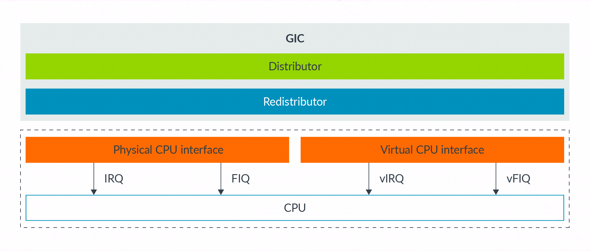

这里有两种机制产生虚拟中断:

在 core 内部, 在 HCR_EL2 进行控制;
使用 GICv2 或后续版本的中断控制器;

首先我们看机制 1. 在 HCR_EL2 中有三个位来控制虚拟中断的产生:

VI = 设置此位注册一个 vIRQ;
VF= 设置此位注册一个 vFIQ;
VSE= 设置此位注册一个 vSError;

设置这些位中的一个等于中断控制器发起一个中断信号给 vCPU. 产生的虚拟中断受 PSTATE 屏影响, 像正常的中断一样.

这个机制使用很简单, 但缺点是它仅提供一种方法来产生. 然后 hypervisor 被要求模拟在虚拟机中中断控制器的操作. 总结来説, 在软件中陷入和模拟操作可能涉及过度, 这最好避免过度操作如中断.

第二个选择是使用 GIC 来产生虚拟中断. 从 ARM GICv2,GIC 可以通过提供物理 CPU 接口和虚拟 CPU 接口发起物理和虚拟中断, 如下图所示:

这两个接口相同, 除了一个发起物理中断, 另一个发起虚拟中断. hypervisor 可以映射虚拟 CPU 接口到一个虚拟机中, 允许虚拟机中的软件来直接与 GIC 通信. 这个方法的优点为 hypervisor 仅需要建立虚拟接口, 并且不需要模拟. 这个方法减少异常被陷入到 EL2 的次数, 并且因此减少虚拟中断的过度.

NOTE: 虽然 ARM GICv2 可能被用来 Armv8-A 设计, GICv3 和 GICv4 通常被使用.
