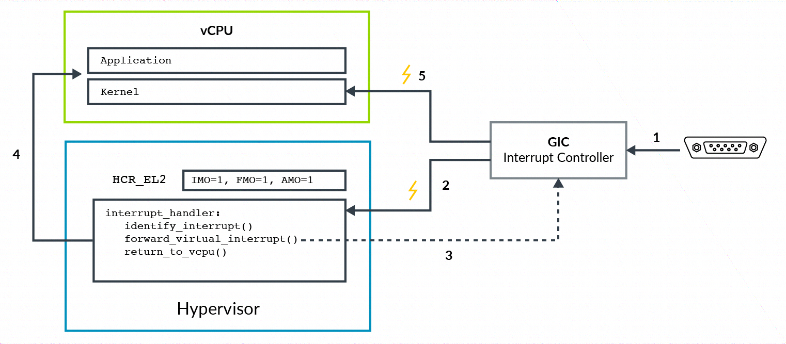

到目前为止, 我们看到了虚拟中断是如何使能和产生的. 让我们看一个发起虚拟中断到 vCPU 的例子. 在这个例子中, 我们将考虑一个物理外设被赋予给虚拟机, 如下图所示:

这个图呈现如下步骤:

1) 物理外设发起中断信号到 GIC;

2) GIC 产生一个物理中断异常, 或 IRQ 或 FIQ, 通过 HCR_EL2.IMO/FMO 来路由中断到 EL2.hypervisor 区分外设并决定它是否被赋予到虚拟机. 它判断中断被发送给哪个 vCPU.

3) hypervisor 配置 GIC 来发起物理中断作为虚拟中断给 vCPU.GIC 将发起 vIRQ 或 vFIQ 信号, 但在 EL2 时处理器将忽略这个信号;

4) hypervisor 将控制返回给 vCPU;

5) 现在处理器在 EL0 或 EL1, 来自 GIC 的虚拟中断可以被处理. 虚拟中断受 PSTATE 异常屏所限.

例子展现了一个物理中断以虚拟中断被发送. 例子符合 stage2 转换中描述的外设模型. 对于虚拟中断, hypervisor 可以创建一个虚拟中断, 而不需要将其与物理中断关联.
