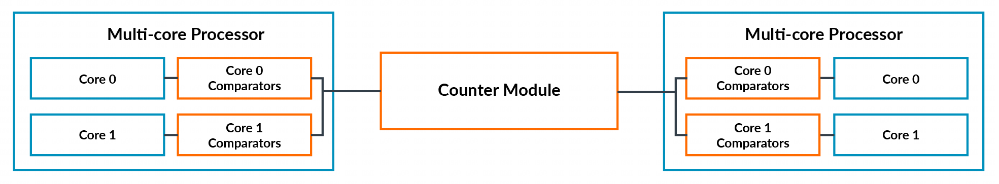
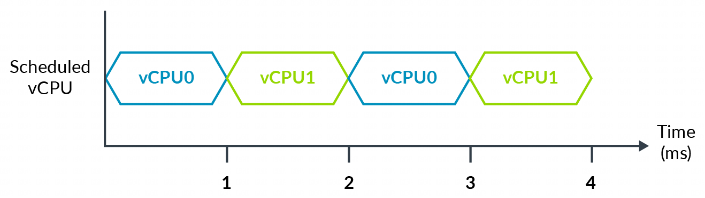
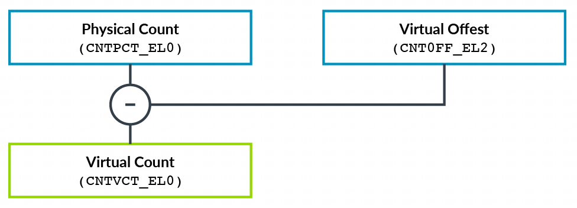
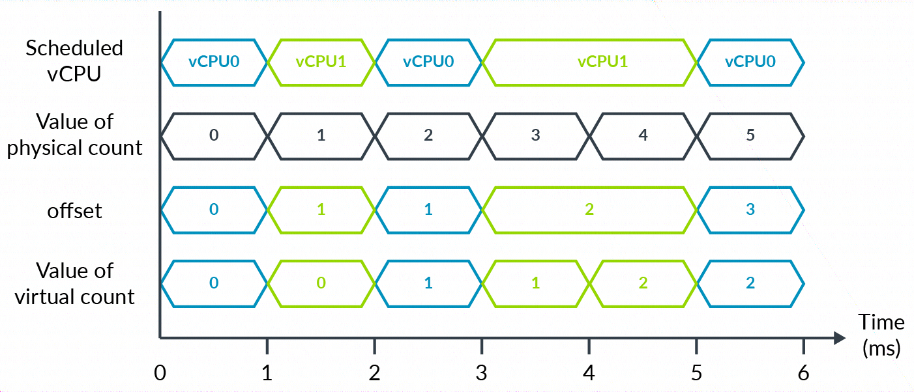

Arm 架构包含了通用定时器 (Generic Timer), 这是每个处理器中都可用的一组标准化定时器. 通用定时器由一组比较器(comparators) 组成, 这些比较器会与一个共同的系统计数 (system count) 进行比较. 当比较器的值等于或小于系统计数时, 它会生成一个中断. 在下图中, 我们可以看到系统中的通用定时器(橙色部分), 以及其组成部分, 包括比较器和计数器模块.

上图描述了一个 hypervisor 管理两个虚拟 CPU(vCPU) 的系统:

注意: 在示例中, 我们忽略运行虚拟机管理程序以在 vCPU 之间进行上下文切换的开销.

经过 4 毫秒的物理时间(即墙钟时间), 每个 vCPU 都运行了 2 毫秒. 如果 vCPU0 在 T=0 时设置了其比较器, 以在 3 毫秒后生成一个中断, 你会期望该中断已经触发了吗?

或者, 你是希望在 2 毫秒的虚拟时间后触发中断, 这里的虚拟时间是 vCPU 经历的时间, 还是在 2 毫秒的墙钟时间后触发中断?

Arm 架构提供了同时实现这两种功能的能力, 具体取决于虚拟化用于何种用途. 让我们看看它是如何做到这一点的.

运行在 vCPU 上的软件可以访问两个定时器:

EL1 物理定时器

EL1 虚拟定时器

EL1 物理定时器与系统计数器模块生成的计数进行比较. 使用这个定时器可以得到墙钟时间.

EL1 虚拟定时器与一个虚拟计数进行比较. 虚拟计数是物理计数减去一个偏移量. 虚拟机管理程序在一个寄存器中为当前调度的 vCPU 指定这个偏移量. 这使得它可以隐藏 vCPU 未被调度运行时的时间流逝:

为了描述这个概念, 我们可以扩展上面的例子, 如下图:

在 6 毫秒的时间段内, 每个 vCPU 都运行 3 毫秒. 虚拟机管理程序可以使用偏移量寄存器来呈现一个仅显示 vCPU 运行时间的虚拟计数. 或者, 虚拟机管理程序可以将偏移量保持为 0, 这意味着虚拟时间与物理时间相同.

注意: 示例显示系统计数的频率为 1 毫秒. 在实际应用中, 这个频率值非常不可能出现. 我们建议将系统计数设置为使用 1MHz 到 50MHz 之间的频率.