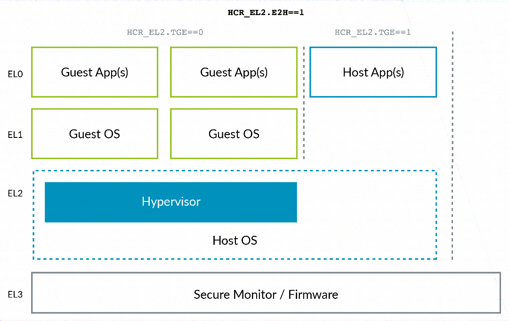

虚拟化主机扩展 (VHE) 由 **HCR_EL2** 寄存器中的两个 bit 来控制. 这两位可以概括如下:

- **E2H**: 控制虚拟化主机扩展 (VHE) **是否启用**.

- **TGE**: 当虚拟化主机扩展 (VHE) 启用时, 控制处于 **EL0** 级别的是客户机 (**Guest**) 模式还是主机 (**Host**) 模式.

下表总结了典型的设置情况:

<table border="1">
<tr>
  <th colspan="3">HCR_EL2</th>
</tr>
<tr>
  <th>运行的异常级别</th>
  <th>E2H 值</th>
  <th>TGE 值</th>
</tr>
<tr>
  <td>Guest kernel (EL1)</td>
  <td>1</td>
  <td>0</td>
</tr>
<tr>
  <td>Guest application(EL0)</td>
  <td>1</td>
  <td>0</td>
</tr>
<tr>
  <td>Host Kernel(EL2)</td>
  <td>1</td>
  <td>1(注)</td>
</tr>
<tr>
  <td>Host application(EL0)</td>
  <td>1</td>
  <td>1</td>
</tr>
</table>

注: 当发生异常, 虚拟机 (VM) 退出并进入 hypervisor 时, **TGE 位将被初始化为 0**. 软件必须在**运行 host 内核的主要部分之前**设置该位.

你可以在下图中看到这些典型的设置情况:

