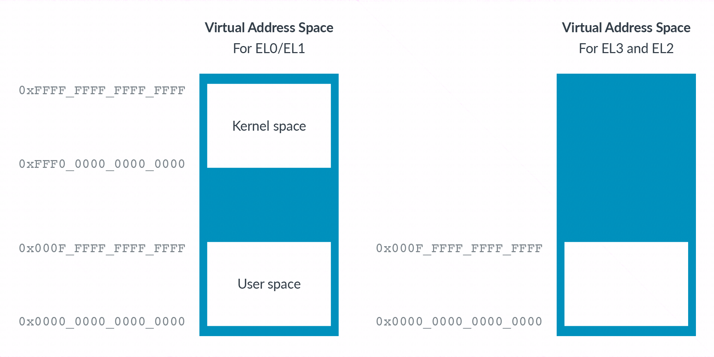
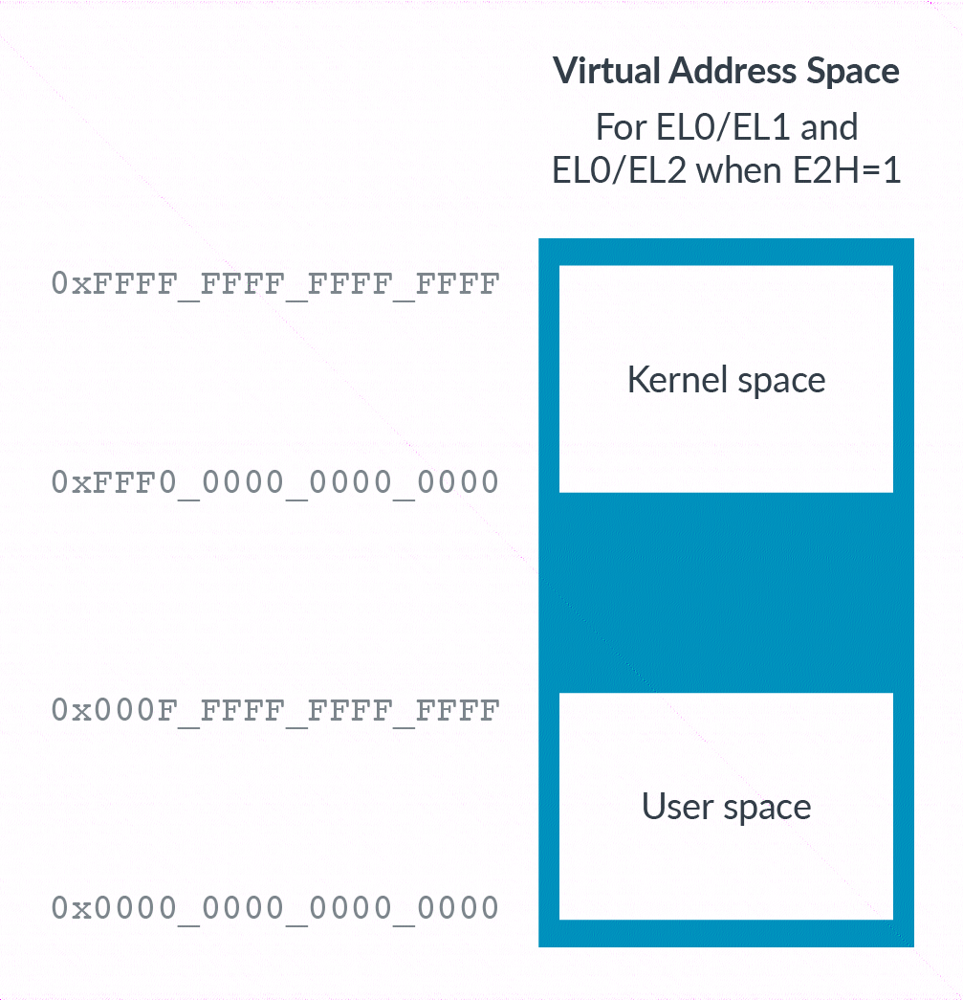

下图展示了在引入虚拟化主机扩展 (VHE) 之前, EL0/EL1 的**虚拟地址空间**是什么样的:

正如在内存管理部分所讨论的, **EL0/EL1** 有**两个区域**. 按照惯例, **上部区域**被称为**内核空间**, 下部区域被称为**用户空间**. 然而, EL2 在地址范围的底部只有一个区域. 这种差异是因为, 传统上,  hypervisor 并**不承载应用程序**. 这意味着 hypervisor **不需要**在**内核空间**和**用户空间**之间进行**划分**.

注意: 将内核空间分配到上部区域, 将用户空间分配到下部区域, 这仅仅是**一种惯例**. 它并非是由 Arm 架构强制规定的.

**EL0/1** 的**虚拟地址空间**还支持**地址空间标识符**(ASID), 但 **EL2 不支持**. 这是因为 **hypervisor** 通常**不会承载应用程序**.

为了让主机操作系统能够在 **EL2** 中高效执行, 我们需要添加**第二个区域**并支持**地址空间标识符**(ASID). 设置 `HCR_EL2.E2H` 可以解决这些问题, 正如你在下图中可以看到的:

当处于 **EL0** 级别时, `HCR_EL2.TGE` 控制**使用哪个虚拟地址空间**: 要么是 EL1 的空间, 要么是 EL2 的空间. 使用**哪个空间**取决于**应用程序**是在**主机操作系统** (`TGE==1`) 下运行, 还是在**客户机操作系统** (`TGE==0`) 下运行.

> 所以当从切换到 EL2 的时候, `HCR_EL2.TGE` 都会被设置为 0. 如果运行 host kernel/application, 那么 `HCR_EL2.TGE` 会被设置为 1.
