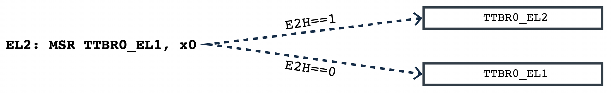

在上一节中了解到, 启用**虚拟化主机扩展** (VHE) 会改变 **EL2 虚拟地址空间的布局**. 然而, 在内存管理单元 (**MMU**) 的配置方面仍存在一个问题. 这是因为**内核**会尝试访问诸如 `TTBR0_EL1` 这样的 **EL1 寄存器**, 而**不是**像 `TTBR0_EL2` 这样的 **EL2 寄存器**.

为了能在 **EL2** 级别运行**相同的二进制文件**, 我们需要将**对 EL1 寄存器的访问重定向到与之对应的 EL2 寄存器**. 设置 **E2H** 就可以实现这一点, 这样一来, 对 EL1 系统寄存器的访问就会被重定向到与之对应的 EL2 寄存器. 这种重定向如下图所示:

然而, 这种重定向给我们带来了一个新问题. **hypervisor** 仍然需要访问**真正的 EL1 寄存器**, 以便它能够实现**任务切换**. 为了解决这个问题, 引入了一组新的**寄存器别名**, 这些别名带有 `_EL12` 或 `_EL02` 后缀. 当在 **EL2** 级别且 `E2H == 1` 时**使用这些别名**, 就可以访问 EL1 寄存器以进行上下文切换. 你可以在下图中看到这一点:

