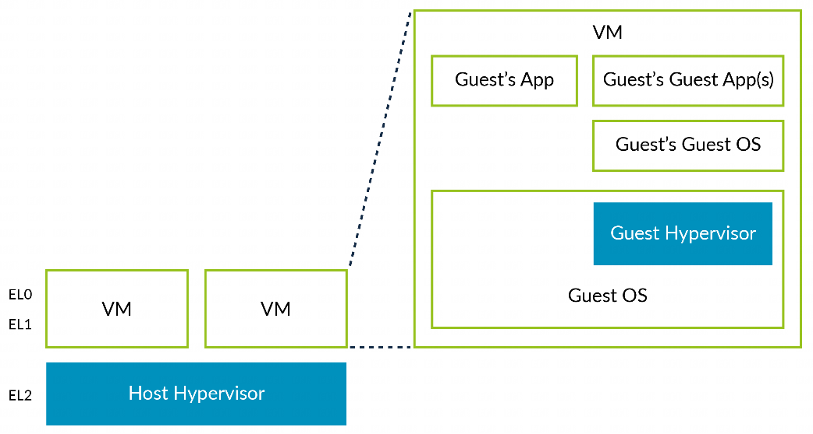

从理论上讲, hypervisor 可以在一台虚拟机 (VM) 内运行. 这一概念被称为嵌套虚拟化:

我们将第一个 hypervisor 称为 host hypervisor, 而将VM 内的 hypervisor 称为Guest Hypervisor.

在 Armv8.3-A 版本发布之前, 通过让 **guest hypervisor** 运行在 **EL0** 级别, 是可以在虚拟机中运行 guest hypervisor 的. 然而, 这需要大量的**软件模拟**, 不仅实现起来非常复杂, 而且性能也很差.

随着 Armv8.3-A 中添加的新特性, 现在可以让 **guest hypervisor** 运行在 **EL1** 级别.

随着 Armv8.4-A 中添加的特性, 这一过程变得更加高效, 尽管它仍然需要 host hypervisor 具备额外的智能处理能力.
