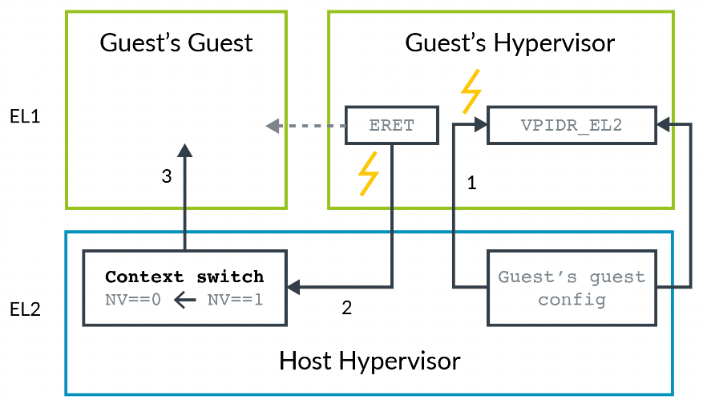
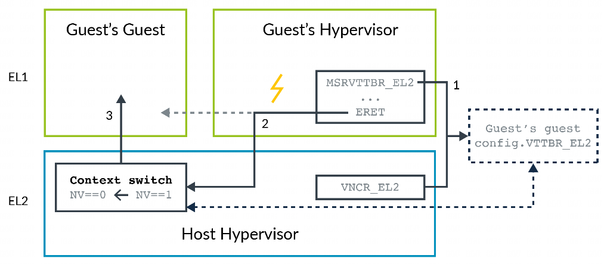

我们**不希望让 guest hypervisor 直接访问虚拟化控制功能**. 这是因为给予直接访问权限可能会使**虚拟机突破其沙箱限制**, 或者让虚拟机获取到有关**主机平台的信息**. 这种潜在问题与之前在陷阱和模拟示例中所展示的问题类似.

**guest hypervisor** 运行在 **EL1** 级别. **HCR_EL2** 寄存器中的**新控制位**允许 **host hypervisor** 捕获 guest hypervisor 尝试访问虚拟化控制功能的操作:

- **HCR_EL2.NV**: 启用对嵌套虚拟化的硬件支持.

- **HCR_EL2.NV1**: 启用一组额外的陷阱机制.

- **HCR_EL2.NV2**: 启用对内存的重定向功能.

- **VNCR_EL2**: 当 NV2 == 1 时, 指向内存中的一个结构体.

Armv8.3-A 版本添加了 **NV** 和 **NV1** 控制位. **从 EL1** 级别访问 **EL2 寄存器**通常是未定义的操作, 此类访问会引发一个**指向 EL1 的异常**. 而 NV 和 NV1 位会使从 EL1 级别对 EL2 寄存器的访问**被捕获**并**导向 EL2 级别**. 这使得 guest hypervisor 能够在 EL1 级别运行, 同时由运行在 **EL2** 级别的 **host hypervisor** 模拟其部分操作. NV 位还会捕获从 **EL1** 级别的 **ERET** 操作.

下图展示了 guest hypervisor 设置并进入 VM 的过程:

1. guest hypervisor 对 EL2 寄存器的访问会被捕获并导向 EL2 级别. host hypervisor 会记录 guest hypervisor 正在设置的配置信息.

2. guest hypervisor 尝试进入其客户机虚拟机 (即客户机的客户虚拟机), 此时异常返回(**ERET**) 操作会被捕获并导向 EL2 级别.

3. host hypervisor 获取客户机的客户机虚拟机的配置信息, 并将该配置加载到相应的寄存器中. 然后, host hypervisor **清除 NV 位**并进入客户机的客户机虚拟机.

这种方法存在的问题是, **guest hypervisor** 对 **EL2** 寄存器的每一次单独访问都必须被捕获. 在两个虚拟 CPU(vCPU)或虚拟机 (VM) 之间进行任务切换时, 会访问许多寄存器, 从而导致大量的捕获操作. 每次捕获操作都存在异常进入和返回的开销.

更好的解决方案是捕获 EL2 寄存器的配置信息, 并且仅在异常返回 (ERET) 时才将控制权捕获到 host hypervisor . 借助 Armv8.4 - A 版本, 这个解决方案是可行的. 当设置了 NV2 位时, 从 EL1 级别对 EL2 寄存器的访问会被重定向到内存中的一个结构体. guest hypervisor 可以根据需要多次读写这些寄存器, 而不会产生一次捕获操作. 异常返回 (ERET) 操作仍然会被捕获到 EL2 级别, 此时 host hypervisor 可以从内存中重新获取配置信息.

下图展示了这一概念:

1. 处于 EL1 级别的 guest hypervisor 对 EL2 寄存器的访问会被重定向到内存中的一个结构体. 该结构体的位置由 host hypervisor 通过 VNCR_EL2 寄存器指定.

2. guest hypervisor 尝试进入其客户机虚拟机, 也就是客户机的客户机虚拟机, 此时异常返回 (ERET) 操作会被捕获并导向 EL2 级别.

3. host hypervisor 获取客户机的客户机虚拟机的配置信息, 并将其加载到相应的寄存器中. 然后, host hypervisor 清除 NV 位, 进入客户机的客户机虚拟机.

这种方法的优势在于捕获操作更少, 因此进入 host hypervisor 的次数也更少.
