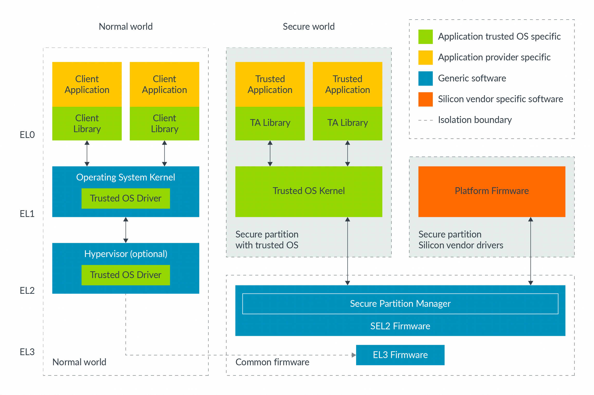

虚拟化技术在 `Armv7-A` 架构中被引入. 当时, **Hyp 模式** (在 AArch32 中相当于 EL2) 仅在**非安全状态**下可用. Armv8.4 - A 架构推出时, 增加了对**安全状态**下 **EL2** 的支持, 这是一项可选功能.

当处理器支持**安全 EL2** 时, 需要在 **EL3** 级别通过设置 `SCR_EL3.EEL2` 位来**启用该功能**. 设置此位可允许进入 EL2 级别, 并能在**安全状态下使用虚拟化特性**.

在安全虚拟化技术出现**之前**, **EL3** 通常用于**同时运行 安全状态切换软件 和 平台固件**. 这是因为我们希望尽量**减少 EL3 中的软件数量**, 从而使 EL3 更易于实现**安全防护**. **安全虚拟化技术**使我们能够将**平台固件**迁移到 **EL1**. 虚拟化技术为平台固件和可信内核提供了**独立的安全分区**. 下图展示了这一点:

