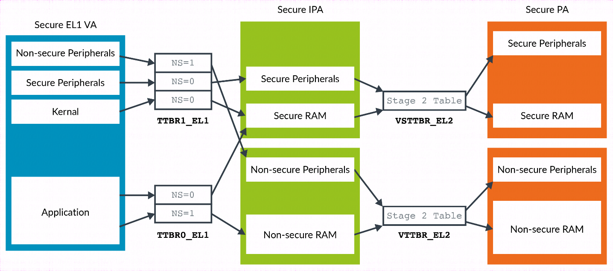

ARM 架构定义了**两个物理地址空间**: **安全空间**和**非安全空间**.

在**非安全状态**下, 虚拟机 (VM) 的**一级地址转换的输出**始终是**非安全**的(Non-secure). 因此, 二级地址转换只需处理单一的**中间物理地址空间** (IPA, Intermediate Physical Address).

在**安全状态**下, 虚拟机的**一级地址转换**可以输出**安全地址**和**非安全地址**. 转换表描述符中的 **NS**(非安全)位控制着输出的是**安全地址空间**还是**非安全地址空间**.

如下图所示, 这意味着 **stage 2** 有两个中间物理地址 (IPA) 空间, 即安全空间和非安全空间:

与一级转换表不同, **二级转换表条目**中**没有 NS**(非安全)位. 对于特定的**中间物理地址空间** (IPA), 所有的地址转换要么产生安全物理地址, 要么产生非安全物理地址. 这种转换由一个**寄存器位**控制. 通常情况下, **非安全的中间物理地址**会转换为**非安全的物理地址**, 而**安全的中间物理地址**会转换为**安全的物理地址**.
