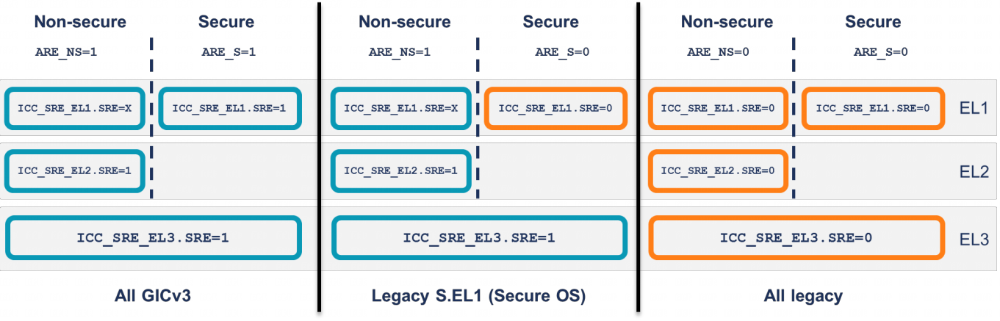

GICv3 对编程模型进行了一些更改. 为了支持为 **GICv2** 系统编写的遗留软件, GICv3 支持 legacy 操作.

所使用的编程模型由 `GICD_CTRL` 中的 Affinity Routing Enable (亲和路由启用, ARE) 位控制:

 - 当 `ARE == 0` 时, **亲和性路由被禁用**(legacy操作).

 - 当 `ARE == 1` 时, **亲和性路由被启用**.

注: 为便于阅读, 在本文档中, `GICD_CTLR.ARE_S` 和 `GICD_CTLR.ARE_NS` 在适当情况下统称为 **ARE**.

在具有**两种安全状态**的系统中, 可以分别为**每种安全状态**控制亲和路由. **仅允许特定的组合**, 如下图所示.

支持的 ARE 组合:

> SRE, System Register Enable, 系统寄存器启用

本文档重点关注新的 GICv3 编程模型, 即**两种安全状态**下 **ARE** 均为 **1**. 对于 ARE == 0 的遗留操作, 本文档不做描述.

注: 对遗留操作的支持是**可选的**. 当实现对遗留操作的支持时, reset 后会选择 legacy 操作.
