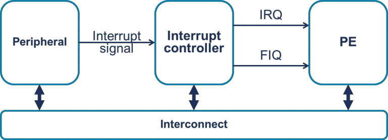
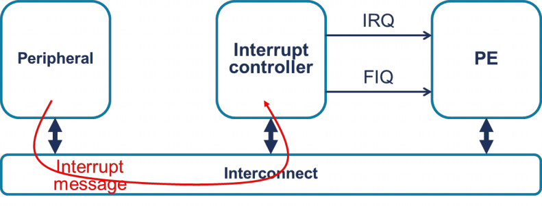

# 1. 中断类型

GICv3 定义了以下类型的中断:

## 1.1. SPI(共享外设中断)

> Shared Peripheral Interrupt

这是一种**全局外设中断**, 可以路由到**指定的 PE**, 或**一组 PE** 中的**一个**.

## 1.2. PPI(私有外设中断)

> Private Peripheral Interrupt

这是一种**针对单个特定 PE** 的外设中断. 例如, PE 的**通用定时器**产生的中断就是 PPI.

## 1.3. SGI(软件生成中断)

> Software Generated Interrupt

SGI 通常用于**处理器间通信**, 通过向 GIC 中的 **SGI 寄存器写入**来生成.

## 1.4. LPI(特定位置的外设中断)

> Locality-specific Peripheral Interrupt

LPI 是 **GICv3** 中的**新特性**, 在许多方面与其他类型的中断不同. 特别是, **LPI** 始终是**基于消息的中断**, 其**配置**存储在**内存中的表**中, 而**非寄存器**中. 第 6 章将对此进行更详细的描述.

注: **仅**当 `GICD_CTLR.ARE_NS == 1` 时**才支持 LPI**.

# 2. 中断标识符

**每个中断源**由一个 ID 号标识, 称为 **INTID**. 可用的 INTIDs **被分组**, **每个组**分配给**特定类型**的中断.

| INTID | 中断类型 | 注释 |
|--|--|--|
| 0 - 15 | SGIs(处理器间通信) | 每个 PE 有**独立的存储区** |
| 16 - 31 | PPIs(针对单个特定 PE) | 每个 PE 有独立的存储区 |
| 32 - 1019 | SPIs(全局外设中断) | - |
| 1020 - 1023 | 特殊中断号 | 用于表示特殊情况, 见 5.3 节(Spurious interrupts, 虚假中断) |
| 1024 - 8191 | 保留 | - |
| 8192 及以上 | LPIs(基于消息) | 上限由具体实现定义 |

# 3. 中断如何发送到中断控制器

传统上, 中断通过**专用硬件信号**从**外设**发送到**中断控制器**.

**GICv3** 支持**这种模式**, 并且还支持**基于消息的中断**. 基于消息的中断是可以通过**写入中断控制器中的寄存器**来**设置**和**清除**的中断.

使用**消息**将中断从**外设**转发到**中断控制器**, 就不用**每个中断源**都需要**一个专用信号**(外设到中断控制器的信号). 对于大型系统的硬件设计者来说, 这是一个优势, 因为在大型系统中, 可能有数百甚至**数千个信号**需要在片上系统中路由并汇聚到中断控制器.

在 GICv3 中, **SPIs** 可以是**基于消息的中断**, 但 **LPIs 始终是基于消息的中断**. 不同类型的中断使用不同的寄存器, 如下表所示.

基于消息的中断的寄存器

| 中断类型 | 寄存器 |
|--|--|
| SPI | GICD_SETSPI_NSR assert 一个中断 GICD_CLRSPI_NSR deassert 一个中断 |
| LPI | GITS_TRANSLATER |

## 3.1. 基于消息的中断对软件的影响

中断是通过消息还是专用信号发送, 对中断处理代码处理中断的方式**影响很小**.

可能需要**对外设**进行**一些配置**. 例如, 可能需要**指定中断控制器的地址**. 这超出了本文档的范围, 在此不做描述.
