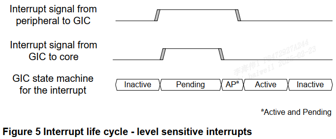

中断控制器为每个 **SPI**, **PPI** 和 **SGI** 中断源维护一个状态机. 这个状态机由四个状态组成:

- Inactive(**非活动状态**): 中断源当前**未被触发**.

- Pending(**挂起状态**): 中断源已被触发, 但中断尚未被 PE 确认.

- Active(**活动状态**): 中断源已被触发, 并且中断已被 PE 确认.

- Active and Pending(**活动且挂起状态**): 该中断的一个实例已被确认, 该中断的另一个实例现在处于挂起状态. (同一个中断的两个实例??)

注: LPIs 没有 **活动状态** 或 **活动且挂起状态**. 更多信息见 6.2 节.

下图展示了状态机的结构和可能的状态转换.

PPIs, SGIs 和 SPIs 中断状态机

**中断的生命周期**取决于它被配置为 **电平敏感**(`level-sensitive`) 还是 **边沿触发**(`edge-triggered`). 下面提供了示例序列.

# 1. 电平敏感

> Level sensitive

电平敏感的中断的中断生命周期如下:

- **从非活动到挂起**(`Inactive to Pending`): 当中断源被触发(assert)时, 中断从**非活动状态**(inactive)转换到**挂起状态**(pending).

    此时, 如果中断已启用且具有足够的优先级, **GIC** 会向 **PE** 发出中断信号.

- **从挂起到活动且挂起**(Pending to Active & Pending): 当 **PE** 通过**读取 CPU 接口**中的一个 **IAR**(`Interrupt Acknowledge Registers`, **中断确认寄存器**)来**确认(acknowledges)中断**时, 中断从**挂起状态**转换到**活动且挂起状态**(active and pending). 这个**读取操作**通常是在**中断异常发生后**执行的**中断处理程序**的**一部分**. 不过, 软件也可以**轮询 IAR**.

    此时, GIC 会撤销(**deasserts**)向 PE 发出的中断信号.

- **从活动且挂起到活动**(Active and Pending to Active): 当**外设**撤销(de-asserts)中断信号时, 中断从**活动且挂起状态**(active and pending)转换到**活动状态**(active). 这通常是由于在 PE 上执行的中断处理软件**向外设的状态寄存器写入数据**而发生的.

- **从活动到非活动**(Active to Inactive): 当 PE 向 **CPU 接口**中的**一个 EOIRs**(`End of Interrupt Registers`, **中断结束寄存器**)**写入数据**时, 中断从**活动状态**(active)转换到**非活动状态**(inactive). 这表明 **PE 已完成对中断的处理**.

# 2. 边沿触发

> Edge-triggered

- **从非活动到挂起**(Inactive to Pending): 当中断源被触发(assert)时, 中断从非活动状态(Inactive)转换到挂起状态(Pending).

    此时, 如果中断已启用且具有足够的优先级, GIC 会向 PE 发出中断信号.

- **从挂起到活动**(Pending to Active): 当 PE 通过读取 CPU 接口中的一个 **IAR**(`Interrupt Acknowledge Registers`, **中断确认寄存器**) 来确认中断时, 中断从挂起状态(pending)转换到活动状态(active). 这个读取操作通常是在中断异常发生后执行的**中断处理程序的一部分**. 不过, 软件也可以轮询 IAR.

    此时, **GIC** 会撤销(de-asserts)向 **PE** 发出的中断信号.

- **从活动到活动且挂起**(Active to Active and Pending): (当中断处理程序没有处理完??), **如果**外设重新触发(re-asserts)中断信号, 中断从活动状态转换到活动且挂起状态.

    见上图, **外设**还会再 assert 一次中断给 **GIC**, 相当于触发了**第二次中断**. (如果外设不 re-assert, 中断就会处于 inactive 状态??)

- **从活动且挂起到挂起**(Active and Pending to Pending): 当 **PE** 向 **CPU 接口**中的**一个 EOIRs** 写入数据时, 中断从活动且挂起状态(Active and Pending)转换到挂起状态(Pending). 这表明 PE 已完成对**第一个中断实例**的处理.

    此时, **GIC** 会重新(re-asserts)向 **PE** 发出中断信号. (后续进入 pending 状态, 进而处理第二个中断的流程). (为什么需要 PE 写 EOI??)
