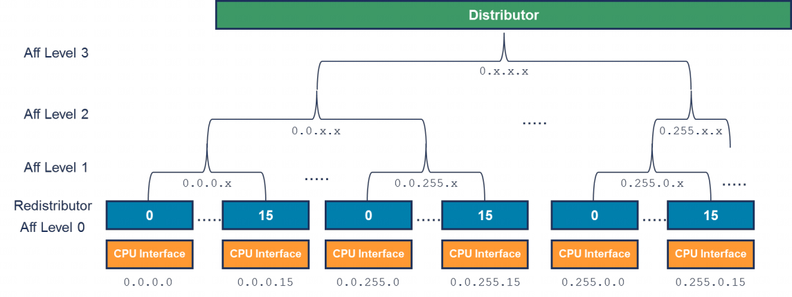

**GICv3** 使用**亲和性路由**来**识别连接的 PE**, 并**将中断路由到特定的 PE 或一组 PE**. PE 的亲和性由**四个 8 位字段**表示:

`<affinity level 3>.<affinity level 2>.<affinity level 1>.<affinity level 0>`, (<亲和级别 3>.<亲和级别 2>.<亲和级别 1>.<亲和级别 0>)

下图展示了一个**亲和性层次结构**的示例.

在**亲和级别 0**(affinity level 0) 有一个**再分发器**(Redistributor). **每个再分发器**连接到**一个 CPU 接口**. **再分发器**控制 **SGIs**, **PPIs** 和 **LPIs**, 详见第 4 章.

亲和方案与 ARMv8-A 中使用的方案相匹配, **PE** 的亲和性在 `MPIDR_EL1` 中报告. 系统设计者必须确保 **PE** 的 `MPIDR_EL1` 指示的**亲和值**与连接到该 PE 的**再分发器**的 `GICR_TYPER` 指示的**亲和值**相同. 不同亲和级别的具体含义由**特定的处理器和 SoC 定义**. 以下是一些示例:

- `<group of groups>. <group of processors>.<processor>.<core>`, "<组的组>.<处理器组>.<处理器>.<核心>"

- `<group of processors>.<processor>.<core>.<thread>`, "<处理器组>.<处理器>.<核心>.<线程>"

在某个实现中, 不太可能存在**所有可能的节点**. 例如, **移动设备**的 SoC 可能具有类似这样的布局:

- `0.0.0.[0:3]`: Cortex - A53 处理器的核心 0 到 3

- `0.0.1.[0:1]`: Cortex - A57 处理器的核心 0 到 1

在 ARMv8-A 中, AArch64 状态支持**四个级别的亲和性**. AArch32 状态和 ARMv7 只能支持**三个级别**的亲和性. 这意味着使用 AArch32 状态的设计在**亲和级别 3**(`0.x.y.z`)上仅限于**单个节点**. `GICD_TYPER.A3V` 指示中断控制器是否可以支持**多个级别 3 节点**.

注: 虽然每个级别 1 节点在级别 0 上最多可以承载 **256** 个**再分发器**, 但在实际应用中, 可能是 **16** 个或更少. 这是因为如第 7 章所述, SGI 的目标 PE 是以编码方式(encoded).
