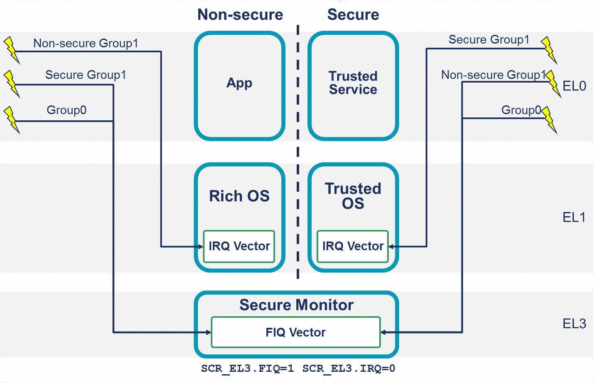

GICv3 架构支持 **ARM TrustZone** 技术. **每个 INTID** 必须分配给**一个组**和**安全设置**.

GICv3 支持三种组合, 如下表所示.

| 中断类型 | 示例用途 |
|--|--|
| 安全组 0(Secure Group 0) | 用于 <b>EL3</b>(安全固件)的中断 |
| 安全组 1(Secure Group 1) | 用于 <b>Secure EL1</b>(可信操作系统, Trusted OS)的中断 |
| 非安全组 1(Non-secure Group 1) | 用于<b>非安全状态</b> (操作系统 和/或 hypervisor) 的中断 |

**Group 0 中断**始终作为 **FIQs** 发出信号. **Group 1 中断**根据 PE 的**当前安全状态**和**异常级别**, 作为 **IRQs** 或 **FIQs** 发出信号.

下表展示了在 **EL3** 使用 **AArch64** 时, **安全设置**和**异常类型**之间的**映射关系**.

<table border="1" width="100%">
    <tr  width="100%">
        <th rowspan="2">PE的EL和安全状态</th>
        <th rowspan="2">组0</th>
        <th colspan="2">组1</th>
    </tr>
    <tr>
        <td>安全</td>
        <td>非安全</td>
    </tr>
    <tr>
        <td>安全EL0/1</td>
        <td>FIQ</td>
        <td>IRQ</td>
        <td>FIQ</td>
    </tr>
    <tr>
        <td>非安全EL0/1/2</td>
        <td>FIQ</td>
        <td>FIQ</td>
        <td>IRQ</td>
    </tr>
    <tr>
        <td>EL3</td>
        <td>FIQ</td>
        <td>FIQ</td>
        <td>FIQ</td>
    </tr>
</table>

这些规则旨在补充 ARMv8-A **安全状态**和**异常级别路由控制**.

下图展示了一个简化的**软件堆栈**, 以及在 **EL0** 执行时发出**不同类型中断**时会发生什么.

在这个例子中, **IRQs** 被路由到 **EL1**(`SCR_EL3.IRQ == 0`), **FIQs** 被路由到 **EL3**(`SCR_EL3.FIQ == 1`). 根据前面表中描述的规则, 在 **EL1** 或 **EL0** 执行时, 当前**安全状态**的 **Group 1 中断**被视为 **IRQ**.

另一个安全状态的中断会触发 **FIQ**, 异常被发送到 **EL3**. 这使得在 EL3 执行的软件能够执行必要的上下文切换. 在 5.3 节可以找到更详细的示例.

# 1. 对软件的影响

软件在配置**中断控制器**时控制 **INTIDs 到中断组的分配**. 只有在**安全状态**下执行的软件才能将 **INTIDs 分配到中断组**.

通常, 只有在**安全状态**下执行的软件必须能够访问**安全中断** (**Group 0** 和 **Secure Group 1**) 的设置和状态.

可以启用从 (**非安全状态**) 到 (**安全中断设置和状态**) 的访问. 这是通过 `GICD_NSACRn` 和 `GICR_NSACR` 寄存器为**每个 INTID 单独控制**的.

注: **reset** 时 INTID 所属的中断组是由 **实现定义**(IMPLEMENTATION DEFINED)的.

注: **LPIs** 始终被视为 **Non-secure Group 1 中断**.

# 2. 对单个安全状态的支持

在 ARMv8-A 和 GICv3 中, 对**两个安全状态**的支持是**可选**的. 一个实现可以选择仅实现一个安全状态或两个安全状态.

在支持两个安全状态的 GICv3 实现中, 可以**禁用一个安全状态**. 这由 `GICD_CTLR.DS` 控制.

- `GICD_CTLR.DS == 0`: 支持**两个安全状态**(安全和非安全).

- `GICD_CTLR.DS == 1`: 仅支持**单个安全状态**. 在仅实现单个安全状态的实现中, 此位为 `RAO/WI`.

当仅支持单个安全状态时, 有**两个中断组**. 它们是 **Group 0** 和 **Group 1**.

本文档描述了实现两个安全状态的情况.

注: 如果软件将 `GICD_CTLR.DS` 设置为 1, **只能**通过 **reset** 将其清除.
