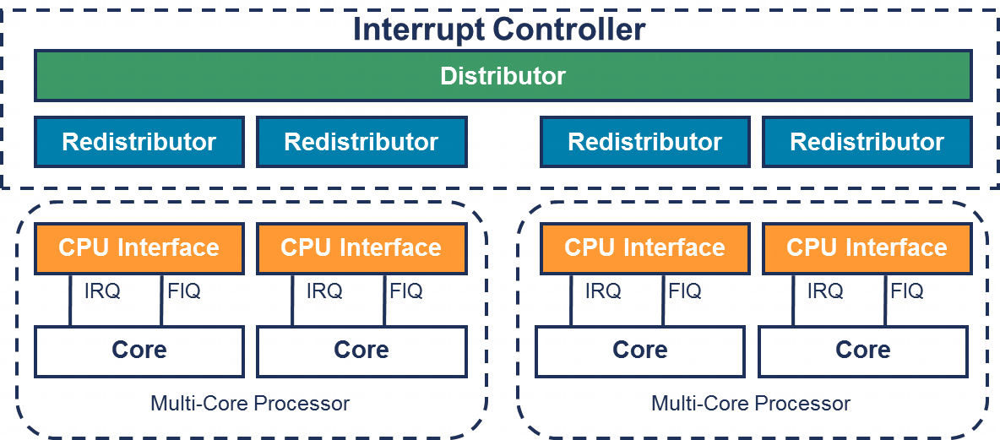

GICv3 中断控制器的**寄存器接口**分为三组:

- **分发器接口**

- **再分发器接口**

- **CPU 接口**

# 分发器(GICD_*)

**分发器寄存器**是**内存映射**的, 包含影响**连接到中断控制器的所有 PE 的全局设置**.

分发器提供以下编程接口:

- **SPI** 的**中断优先级**和**分发**

- 启用和禁用 SPI

- 设置每个 SPI 的优先级级别

- 每个 SPI 的路由信息

- 将每个 SPI 设置为 **电平敏感** 或 **边沿触发**

- 生成基于消息的 SPI

- 控制 SPI 的活动和挂起状态

- 确定每个安全状态中使用的**编程模型**(**亲和路由**或**传统模式**)

# 再分发器(GICR_*)

对于**每个连接的 PE**, 都有一个**再分发器**.

再分发器提供以下编程接口:

- 启用和禁用 SGIs 和 PPIs

- 设置 SGIs 和 PPIs 的优先级级别

- 将每个 PPI 设置为电平敏感或边沿触发

- 将每个 SGI 和 PPI 分配到一个中断组

- 控制 SGIs 和 PPIs 的状态

- 支持相关中断属性和 LPI 挂起状态的内存数据结构的基地址控制

- 为连接的 PE 提供电源管理支持

# CPU 接口(ICC_*_ELn)

**每个再分发器**都连接到**一个 CPU 接口**. CPU 接口提供以下编程接口:

- 启用中断处理的通用控制和配置

- 确认中断

- 执行中断的优先级降低和停用

- 为 PE 设置中断优先级掩码

- 为 PE 定义抢占策略

- 确定 PE 的最高优先级挂起中断

在 GICv3 中, **CPU 接口寄存器**作为系统寄存器 (`ICC_*_ELn`) 进行访问. 软件在使用这些寄存器之前必须**启用系统寄存器接口**. 这由 `ICC_SRE_ELn` 寄存器中的 `SRE` 位控制, 其中 "**n**" 指定**异常级别**(EL1 - EL3).

注: 在 GICv1 和 GICv2 中, **CPU 接口寄存器**是**内存映射**的(`GICC_*`).

注: 软件可以通过读取 PE 的 `ID_AA64PFR0_EL1` 来检查对 GIC 系统寄存器的支持, 详细信息请参见 < ARM 架构参考手册, ARMv8, 适用于 ARMv8-A 架构配置文件>.
