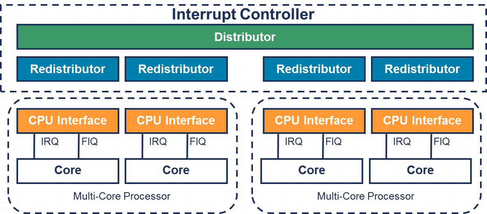

GICv3 中断控制器的**寄存器接口**分为三组:

- **分发器接口**

- **再分发器接口**

- **CPU 接口**

**分发器(GICD_*)**: 分发器寄存器是内存映射的, 包含影响连接到中断控制器的所有 PE 的全局设置. 分发器提供以下编程接口:
 - SPI 的中断优先级和分发
 - 启用和禁用 SPI
 - 设置每个 SPI 的优先级级别
 - 每个 SPI 的路由信息
 - 将每个 SPI 设置为电平敏感或边沿触发
 - 生成基于消息的 SPI
 - 控制 SPI 的活动和挂起状态
 - 确定每个安全状态中使用的程序员模型(亲和路由或传统模式)

**再分发器(GICR_*)**: 对于每个连接的 PE, 都有一个再分发器. 再分发器提供以下编程接口:
 - 启用和禁用 SGIs 和 PPIs
 - 设置 SGIs 和 PPIs 的优先级级别
 - 将每个 PPI 设置为电平敏感或边沿触发
 - 将每个 SGI 和 PPI 分配到一个中断组
 - 控制 SGIs 和 PPIs 的状态
 - 支持相关中断属性和 LPI 挂起状态的内存数据结构的基地址控制
 - 为连接的 PE 提供电源管理支持

**CPU 接口(ICC_*_ELn)**: 每个再分发器都连接到一个 CPU 接口. CPU 接口提供以下编程接口:
 - 启用中断处理的通用控制和配置
 - 确认中断
 - 执行中断的优先级降低和停用
 - 为 PE 设置中断优先级掩码
 - 为 PE 定义抢占策略
 - 确定 PE 的最高优先级挂起中断

在 GICv3 中, CPU 接口寄存器作为系统寄存器 (ICC_*_ELn) 进行访问. 软件在使用这些寄存器之前必须启用系统寄存器接口. 这由 ICC_SRE_ELn 寄存器中的 SRE 位控制, 其中 "n" 指定异常级别(EL1 - EL3).

注: 在 GICv1 和 GICv2 中, CPU 接口寄存器是内存映射的(GICC_*). 注: 软件可以通过读取 PE 的 ID_AA64PFR0_EL1 来检查对 GIC 系统寄存器的支持, 详细信息请参见 < ARM 架构参考手册, ARMv8, 适用于 ARMv8 - A 架构配置文件>.