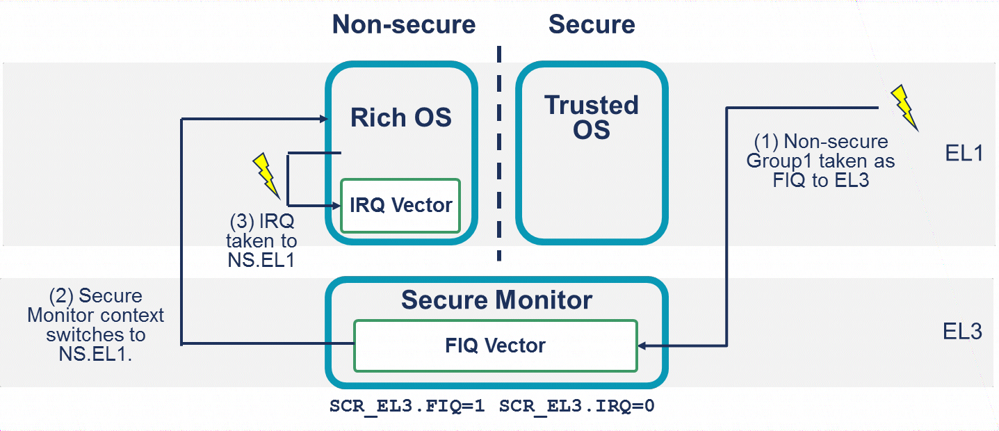
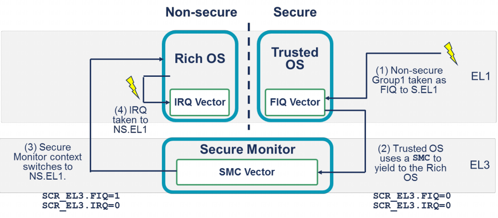

> Spurious Interrupts

3.1.2 节介绍了 **INTID 范围** `1020 ~ 1023` 是保留用于 **特殊目的** 的. 读取 IAR 时可能会 **返回这些 INTID**, 它们表示 **异常处理** 中的 **特殊情况**.

|ID | 含义 | 示例场景 |
|--|--|--|
|1020 | 仅在读取 `ICC_IAR0_EL1` 时返回.  表示最高优先级的挂起中断是安全组 1 中断.  仅在将 FIQ 转到 EL3 时可见 | 当 PE 在非安全状态下执行时, 可信操作系统的中断被触发. 该中断作为 FIQ 被发送到 EL3, 以便安全监控程序可以进行上下文切换到可信操作系统 |
|1021 | 仅在读取 `ICC_IAR0_EL1` 时返回. 表示最高优先级的挂起中断是非安全组 1 中断. 仅在 PE 执行到 EL3 的 FIQ 时出现 | 当 PE 在安全状态下执行时, 富操作系统的中断被触发. 该中断将作为 FIQ 被发送到 EL3, 以便安全监控程序可以进行上下文切换到富操作系统 |
|1022 | 仅用于传统操作 | 本文档不涉及传统操作 |
|1023 | 虚假中断. 表示没有处于挂起状态的已启用 INTID, 或者所有挂起的 INTID 优先级都不足以被处理 | 在轮询 IAR 时, 该值表示没有可确认的中断 |

# 示例

在以下示例中, 一个移动系统有一个调制解调器中断, 用于通知来电. 这个中断旨在由非安全状态下的富操作系统处理.

使用保留的 INTID 1021 的示例:

1) 当 PE 在安全 EL1 执行可信操作系统时, 调制解调器中断变为挂起状态. 由于调制解调器中断被配置为非安全组 1 中断, 它将作为 FIQ 发出信号. 由于 `SCR_EL3.FIQ == 1`, 异常被发送到 EL3.

2) 在 EL3 执行的安全监控程序软件读取 IAR, 返回值为 1021. 这个值表明该中断预期在非安全状态下处理. 然后, 安全监控程序执行必要的上下文切换操作.

3) 现在 PE 处于非安全状态, 中断作为 IRQ 被发送到非安全 EL1, 由富操作系统处理.

在上图所示的示例中, 非安全组 1 中断导致立即从安全操作系统退出, 但这并非总是必要或期望的. 下图展示了另一种模型, 其中中断最初被发送到安全 EL1.

可选的路由模型(Alternative routing model):

1) 当 PE 在安全 EL1 执行可信操作系统时, 调制解调器中断变为挂起状态. 由于调制解调器中断被配置为非安全组 1 中断, 它将作为 FIQ 发出信号. 由于 `SCR_EL3.FIQ == 0`, 异常被发送到安全 EL1.

2) 可信操作系统执行清理其内部状态的操作. 当准备就绪后, 可信操作系统使用 SMC 指令切换到非安全状态.

3) SMC 异常被发送到 EL3. 在 EL3 执行的安全监控程序软件执行必要的上下文切换操作.

4) 现在 PE 处于非安全状态, 中断作为 IRQ 被发送到非安全 EL1, 由富操作系统处理.
