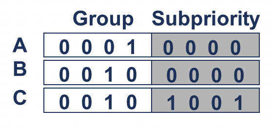

> Running priority & preemption

**优先级掩码寄存器** (PMR) 设置了中断被转发到特定 PE 所需的**最低优先级**.

GICv3 架构引入了**运行优先级**(`Running priority`)的概念. 当 PE **确认**(acknowledges)一个中断时, 其**运行优先级**变为**该中断的优先级**. 当 **PE** 向**其中一个 EOI 寄存器**写入时, 运行优先级恢复到**之前的值**.

随着时间的推移的 **运行优先级**(Running priority)的值:

当前的运行优先级可通过 CPU 接口的 **运行优先寄存器**(Running Priority register, `ICC_RPR_EL1`)得到.

运行优先级在考虑**抢占**时非常重要. 当**一个高优先级中断**发送到一个已经**在处理低优先级中断**的 PE 时, 就会发生**抢占**. 抢占给软件带来了一些额外的复杂性, 但它可以**防止低优先级中断阻塞高优先级中断**的处理.

没有抢占:

有抢占:

上图展示了**一级抢占**的情况. 然而, 实际上可能存在**多级抢占**. 在某些情况下, 可能不需要或**不希望发生抢占**. GICv3 架构允许通过**二进制点寄存器** (`Binary Point registers`, `ICC_BPRn_EL1`) **控制抢占**所需的优先级差异.

**二进制点寄存器**将优先级分为两个字段: **组优先级**(group priority)和**子优先级**(subpriority).

**8 bit 优先级值**分为了 **组优先级** 和 **子优先级**:

在进行**抢占判断**时, **仅考虑组优先级位**, **子优先级被忽略**.

例如, 假设有以下三个中断:

- INTID A 的优先级为 0x10

- INTID B 的优先级为 0x20

- INTID C 的优先级为 0x21

在这种情况下:

- A 可以抢占 B 或 C.

- B 不能抢占 C, 因为 B 和 C 的优先级相似.

为了实现这一点, 可以将组优先级和子优先级的**分割点**设置为 `N = 4`:

通过这样的分割, 在**抢占判断**中, B 和 C 被视为具有相同的优先级. 然而, A 仍然具有更高的优先级, 因此它可以抢占 B 或 C.

注: 抢占要求**中断处理程序支持嵌套**, 其详细内容超出了本文档的范围, 在此不做描述.
