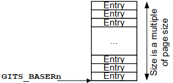

# 1. ITS 的操作

外设通过向 ITS 中的 GITS_TRANSLATER 写入来生成 LPI. 写入操作会向 ITS 提供以下信息:

 - **EventID**

    这是写入 GITS_TRANSLATER 的值, 用于标识外设发送的中断. EventID 可能与 INTID 相同, 也可能由 ITS 转换为 INTID.

 - **DeviceID**

    用于标识外设, 其生成方式由实现定义. 例如, 可以使用 AXI 用户信号.

ITS 将外设写入 `GITS_TRANSLATER` 的 EventID 转换为 INTID. 由于 EventID 到 INTID 的转换因外设而异, 所以需要 DeviceID.

LPI 的 INTIDs 被分组为集合. 集合中的所有 INTIDs 都被路由到同一个再分发器. 软件将 LPI INTIDs 分配到集合中, 以便有效地将中断从一个 PE 转移到另一个 PE.

ITS 使用三种类型的表来处理 LPI 的转换和路由:

 - **设备表**(Device Tables): 将 DeviceIDs 映射到中断转换表.

 - **中断转换表**(Interrupt Translation Tables): 包含 DeviceID 特定的 EventID 到 INTID 的映射, 还包含 INTID 所属的集合.

 - **集合表**(Collection Tables): 将集合映射到再分发器.

图 17. 将 LPI 转发给一个 Redistributor 的 ITS:

<div align='center'>

</div>

当外设向 GITS_TRANSLATER 写入时, ITS 会执行以下操作:

1) 使用 DeviceID 从设备表中选择适当的条目, 该条目标识要使用的中断转换表.

2) 使用 EventID 从所选的中断转换表中选择适当的条目, 该条目提供 INTID 和集合 ID.

3) 使用集合 ID 在集合表中选择所需的条目, 该条目返回路由信息.

4) 将中断转发到目标再分发器.

注: ITS 可以选择性地支持多个硬件集合. 硬件集合是指 ITS 在内部保存配置, 而不是将其存储在内存中. `GITS_TYPER.HCC` 报告支持的硬件集合数量.

# 2. 命令队列

ITS 通过内存中的命令队列进行控制. 命令队列是一个循环缓冲区, 由三个寄存器定义:

- **GITS_CBASER**: 该寄存器指定命令队列的基地址和大小. 命令队列必须 64KB 对齐, 大小必须是 4KB 的倍数. 命令队列中的每个条目为 32 字节. GITS_CBASER 还指定了 ITS 访问命令队列时使用的缓存性和共享性设置.

- **GITS_CREADR**: 该寄存器指向 ITS 将处理的下一个命令.

- **GITS_CWRITER**: 该寄存器指向队列中应写入下一个新命令的条目.

图 18 展示了命令队列的简化表示.

图 18. ITS 循环命令队列:

<div align='center'>

</div>

`<ARM 通用中断控制器架构规范 GIC 架构版本 3.0 和 4.0 >` 提供了 ITS 支持的所有命令的详细信息以及它们的编码方式.

# 3. ITS 的初始配置

为了在系统启动时配置 ITS, 软件必须执行以下操作:

1) 为设备表和集合表分配内存(Allocate memory for the Device and Collection tables)

    `GITS_BASER[0..7]`寄存器指定 ITS 设备表和集合表的基地址和大小. 软件使用这些寄存器来确定 ITS 支持的表的数量和类型, 然后必须分配所需的内存, 并设置 GITS_BASERn 寄存器指向分配的内存.

2) 为命令队列分配内存(Allocate memory for the command queue)

    软件必须为命令队列分配内存, 并设置 `GITS_CBASER` 和 `GITS_CWRITER` 指向分配内存的起始位置.

3) 启用 ITS(Enable the ITS)

    当表和命令队列都已分配后, 可以启用 ITS. 通过将 `GITS_CTLR.Enable` 位设置为 1 来实现.

    一旦设置了 `GITS_CTLR.Enable`, `GITS_BASERn` 和 `GITS_CBASER` 寄存器将变为只读.

# 4. 集合表和设备表的大小和布局

设备表和集合表的位置与大小是通过 `GITS_BASERn` 寄存器进行配置的. 在启用 ITS 之前, 软件必须为这些表分配足够的内存, 并配置 GITS_BASERn 寄存器.

软件可以分配 **平面(单级)表** 或 **两级表**, 这由 `GITS_BASERn.Indirect` 指定.

注: 对两级表的支持是可选的. 如果 ITS 仅支持平面表, `GITS_BASERn.Indirect` 为读零写忽略(RAZ/WI).

## 4.1. 平面表

> Flat level tables

使用平面表时, 会为 ITS 分配一个连续的内存块来记录映射. 在启用 ITS 之前, 软件需要用 0 填充该内存. 此后, ITS 在处理命令队列中的命令时会填充该表.

图 19. 一个扁平的设备或集合表(A flat Device or Collection table):

<div align='center'>

</div>

表的大小会根据 DeviceID 或集合 ID 的宽度进行调整, 计算公式如下:

<div align='center'>

</div>

$$
以字节为单位的大小 = 2^{ID 宽度} * 条目大小
$$

其中, 条目大小由 `GITS_BASERn.Entry_Size` 报告.

在配置 GITS_BASERn 寄存器时, 表的大小以页数指定. 页大小由 GITS_BASERn.Page_Size 控制, 可以是 4KB,16KB 或 64KB. 因此, 上述公式的结果必须向上舍入到下一个整页大小.

例如, 如果一个系统实现了 8 位的 DeviceID, 每个表条目的字节数为 8, 使用 4K 页大小, 则:

<div align='center'>

</div>

$$
2^{8} * 8 = 2048 字节 => 向上对齐到下一个整页为 4K
$$

## 4.2. 两级表

使用两级表时, 软件会分配一个一级表和多个二级表.

<div align='center'>

</div>

一级表由软件填充, 每个条目要么指向一个二级表, 要么标记为无效. 二级表在分配给 ITS 之前必须用 0 填充, 并且在 ITS 处理命令队列中的命令时会被填充.

当 ITS 启用 (`GITS_CTLR.Enabled == 1`) 时, 软件可能会分配额外的二级表, 并更新相应的一级表条目以指向这些额外的表. 但在 ITS 启用期间, 软件不能删除分配或更改现有分配.

每个二级表的大小为一页. 与平面表一样, 页大小由 `GITS_BASERn.Page_Size` 配置. 因此, 它包含 (页大小 / 条目大小) 个条目.

每个一级表条目代表 (页大小 / 条目大小) 个 ID, 并且可以指向一个二级表或标记为无效. 任何使用对应无效条目的 ID 的 ITS 命令都将被丢弃.

一级表所需的大小可以通过以下公式计算:

<div align='center'>

</div>

$$
以字节为单位的大小 = (2^{ID 宽度} / (页大小 / 条目大小)) * 8
$$

与单级表一样, 一级表的大小也以页数指定. 因此, 公式的结果必须向上舍入到下一个整页大小.

# 5. 向命令队列添加新命令

要向命令队列添加新命令, 软件必须执行以下操作:

1) **将新命令写入队列**

    GITS_CWRITER 指向命令队列中不包含有效命令的下一个条目. 软件必须将命令写入该条目, 并确保其全局可见性.

2) **更新 GITS_CWRITER**

    软件必须将 GITS_CWRITER 更新为不包含新命令的下一个条目. 更新 GITS_CWRITER 会通知 ITS 添加了一个新命令.

    软件可以同时向队列添加多个命令, 前提是命令队列中有足够的空闲空间, 并且相应地更新 GITS_CWRITER.

3) **等待 ITS 读取命令**

    软件可以通过轮询 GITS_CREADR 来检查命令是否已被 ITS 读取. 当 `GITS_CWRITER.Offset == GITS_CREADR.Offset` 时, 表示所有命令都已被 ITS 读取.

    或者, 可以添加一个 INT 命令来生成一个中断, 以信号通知一组命令已被 ITS 读取.

    ITS 按顺序读取命令队列中的命令. 然而, 这些命令对再分发器的影响可能会以无序的方式显现. 可以使用 SYNC 命令来确保先前发出的命令的影响可见.

注: 当 GITS_CWRITER 指向 GITS_CREADR 之前的位置时, 命令队列已满.

软件在尝试添加新命令之前, 必须检查队列中是否有足够的空间.

# 6. 将中断映射到再分发器

## 6.1. 将 DeviceID 映射到转换表

每个可以向 ITS 发送中断的外设都有自己的 DeviceID. 每个 DeviceID 都需要自己的中断转换表 (ITT) 来保存其 EventID 到 INTID 的映射. 软件必须为 ITT 分配内存, 然后使用 MAPD 命令将 DeviceID 映射到 ITT.

```
MAPD <DeviceID>, <ITT_Address>, <Size>
```

## 6.2. 将 INTIDs 映射到集合以及将集合映射到再分发器

当外设的 DeviceID 已映射到 ITT 后, 它可以发送的不同 EventIDs 必须映射到 INTIDs, 并且这些 INTIDs 必须映射到集合. 每个集合都映射到一个目标再分发器.

可以使用 MAPTI 和 MAPI 命令将 INTIDs 映射到集合. 当 EventID 和 INTID 相同时, 使用 MAPI 命令.

```
MAPI <DeviceID>, <EventID>, <Collection ID>
```

当 EventID 和 INTID 不同时, 使用 MAPTI 命令.

```
MAPTI <DeviceID>, <EventID>, <INTID>, <Collection ID>
```

使用 MAPC 命令将集合映射到再分发器:

```
MAPC <Collection ID>, <Target Redistributor>
```

目标再分发器的标识取决于 GITS_TYPER.PTA:

 - `GITS_TYPER.PTA == 0`: 再分发器由 ID 指定, 可以从 `GICR_TYPER.Processor_Number` 读取.

 - `GITS_TYPER.PTA == 1`: 再分发器由物理地址指定.

## 6.3. 示例

一个定时器的 DeviceID 为 5, 使用 2 位的 EventID. 我们希望将 EventID 0 映射到 INTID 8725. 为该定时器分配的 ITT 位于地址 0x84500000.

我们决定使用集合编号 3, 并将中断发送到物理地址为 0x78400000 的再分发器.

为此的命令序列如下:

```
MAPD 5, 0x84500000, 2    ; 将 DeviceID 5 映射到一个 ITT
MAPTI 5, 0, 8725, 3    ; 将 EventID 0 映射到 INTID 8725 和集合 3
MAPC 3, 0x78400000    ; 将集合 3 映射到地址为 0x78400000 的再分发器
SYNC 0x78400000
```

注: 该示例假设之前没有设置任何映射, 并且 `GITS_TYPER.PTA == 1`.

# 7. 在再分发器之间迁移中断

将中断从一个再分发器移动到另一个再分发器有多种方法.

## 7.1. 重新映射集合

软件可以通过重新映射整个集合, 将所有中断从一个再分发器移动到另一个再分发器. 这通常在连接到再分发器的 PE 即将断电, 并且中断必须移动到另一个再分发器时进行. 可以使用以下命令序列完成:

```
MAPC <Collection ID>, <RDADDR2>    ; 重新映射集合到新的再分发器
SYNC <RDADDR2>    ; 确保映射可见
MOVALL <RDADDR1>, <RDADDR2>    ; 将挂起状态移动到新的再分发器
SYNC <RDADDR1>    ; 确保移动可见
```
在这个命令序列中, RDADDR1 是先前的目标再分发器, RDADDR2 是新的目标再分发器.

如果有多个集合指向 RDADDR1, 则需要多个 MAPC 命令, 每个集合一个. 此序列假设所有集合都被重新映射到同一个新目标再分发器.

## 7.2. 将中断映射到不同的集合

可以使用以下命令序列将单个中断重新映射到不同的集合:

```
MOVI <DeviceID>, <EventID>, <ID of new Collection>
SYNC <RDADDR1>
```
在这个命令序列中, RDADDR1 是中断重新映射之前所属集合的目标再分发器.

# 8. 删除中断映射

要重新映射或删除中断的映射, 软件必须执行以下操作:

1) **禁用当前映射的物理 INTID**: 这在 LPI 配置表中完成, 见 6.2.2 节.

2) **发出 DISCARD 命令**: 这将删除中断的映射, 并清除映射的 INTID 的挂起状态.

3) **发出 SYNC 命令, 并等待命令完成**: 命令完成后, 不会再有中断发送到先前映射的再分发器.

# 9. 重新映射或删除设备的映射

要更改或删除设备的映射, 软件必须执行以下操作:

1) 对该外设当前映射的每个 EventID, 按照 6.1.8 节中的步骤操作.

2) **发出 MAPD 命令重新映射设备**: 或者, 发出一个将有效位清零为 0 的 MAPD 命令来删除映射.

3) **发出 SYNC 命令并等待命令完成**.
