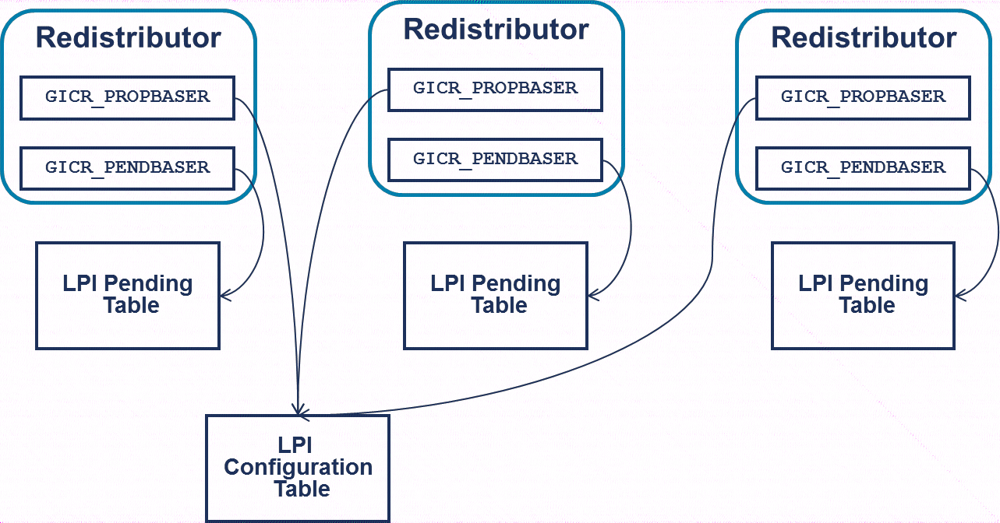
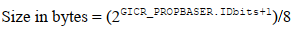

再分发器使用内存中的表来保存所有物理 LPI 的控制, 优先级和挂起信息.

LPI 的配置信息存储在内存中的一个表中, 即 LPI 配置表, 由 GICR_PROPBASER 指向. LPI 配置是全局的, 也就是说, 所有再分发器必须看到相同的配置. 通常, 一个系统有一个由所有再分发器共享的 LPI 配置表.

同样, LPI 的状态信息也存储在内存中的表中, 即 LPI 挂起表, 由 GICR_PENDBASER 指向. 每个再分发器都有自己的 LPI 挂起表, 这些表在再分发器之间不共享.

图21. LPI 配置表和 LPI 待处理表(LPI Configuration and LPI Pending tables):

<div align='center'>

</div>

# 再分发器的初始配置

初始化系统中再分发器的步骤如下:

1) 为 LPI 配置表分配内存, 并使用每个 LPI 的适当配置初始化该表.

2) 设置每个再分发器中的 `GICR_PROPBASER`, 使其指向 LPI 配置表.

3) 为每个再分发器的 LPI 挂起表分配内存, 并初始化每个表的内容. 在系统启动时, 这通常意味着将内存清零, 即所有 LPI INTIDs 都处于非活动状态.

4) 设置每个再分发器中的 `GICR_PENDBASER`, 使其指向与该再分发器相关联的特定 LPI 挂起表.

5) 在每个再分发器中, 将 `GICR_CTLR.EnableLPIs` 设置为 1 以启用 LPI. 当 `GICR_CTLR.EnableLPIs` 设置为 1 后, `GICR_PENDBASER` 和 `GICR_PROPBASER` 寄存器将变为只读.

## LPI 配置表

> LPI Configuration table

LPI 配置表为每个 LPI INTID 分配一个字节. 图 22 展示了这些条目的格式.

图 22. LPI 配置表中条目的格式:

<div align='center'>

</div>

虽然 SPI,PPI 和 SGI 的优先级值为 8 位, 但在 LPI 配置表中仅用 6 位来记录 LPI 的优先级, LPI 优先级的低两位始终被视为 0b00.

LPI 配置表中没有记录安全配置的字段, LPI 始终被视为非安全组 1 中断.

LPI 配置表的大小以及必须分配的内存量取决于 LPI 的数量. GIC 支持的最大 INTIDs(SPI,PPI,SGI 和 LPI)数量由 GICD_TYPER.IDbits 指示. LPI 配置表处理大于 8191 的 INTIDs, 因此, 为了支持所有可能的 LPI,LPI 配置表的大小计算如下:

<div align='center'>

</div>

```
以字节为单位的大小 = 2^(GICD_TYPER.IDbits + 1) - 8192
```

然而, 也可以支持较小范围的 INTIDs.GICR_PROPBASER 中也包含一个 IDbits 字段, 它指示 LPI 配置表支持的 INTIDs 数量. 这个数量必须等于或小于 GICD_TYPER 中的值. 软件必须为这个数量的条目分配足够的内存. 在这种情况下, LPI 配置表所需的大小变为:

<div align='center'>

</div>

```
以字节为单位的大小 = (2 ^ (GICR_PROPBASER.IDbits + 1)) - 8192
```

中断控制器必须能够读取为 LPI 配置表分配的内存, 但它从不写入该内存.

## LPI 挂起表

> LPI Pending tables

LPI 的状态信息存储在内存中. LPI 有两种状态: 非活动和挂起.

图 23. LPIs 的状态机:

<div align='center'>

</div>

中断在被确认后从挂起状态转变为非活动状态.

由于只有两种状态, LPI 挂起表中每个 LPI 仅占 1 位. 因此, 为了支持实现中的所有可能的 INTIDs, 这些表的大小必须为:

<div align='center'>

</div>

```
以字节为单位的大小 = (2 ^ (GICD_TYPER.ID bits + 1)) / 8
```

与 LPI 配置表不同, LPI 挂起表的大小不会因 LPI 从 INTID 8192 开始而进行调整. 表的前 1KB(对应于 INTIDs 0 到 8291 的条目)存储由实现定义的状态.

如本节所述, 可以使用比硬件支持范围更小的 INTIDs.GICR_PROPBASER.IDBits 控制 INTID 范围的大小, 因此它会影响 LPI 配置表和 LPI 挂起表的大小. 为了支持配置的 INTID 范围, LPI 挂起表所需的大小为:

<div align='center'>

</div>

```
以字节为单位的大小 = (2 ^ (GICR_PROPBASER.IDbits + 1)) / 8
```

中断控制器必须能够读取和写入为 LPI 挂起表分配的内存. 通常, 再分发器会在内部缓存最高优先级的挂起中断, 并在缓存的挂起中断过多或进入低功耗状态时, 将状态信息写入 LPI 挂起表.

# 重新配置 LPI

LPI 的配置信息存储在内存中的表中, 而不是寄存器中. 再分发器可以缓存 LPI 配置信息. 这意味着要重新配置 LPI, 软件必须:

1) 更新 LPI 配置表中的条目.

2) 确保更新的全局可见性.

3) 使再分发器中配置的缓存无效.

再分发器缓存的无效操作是通过发出 ITS INV 或 INVALL 命令来执行的. INV 命令使特定中断的条目无效, 因此通常在重新配置少量 LPI 时使用. INVALL 命令使指定集合中所有中断的条目无效. 有关 ITS 命令的更多信息, 见 6.1.5 节.

如果未实现 ITS, 软件必须改为向任何一个再分发器中的 `GICR_INVLPIR` 或 `GICR_INVALLR` 写入.
