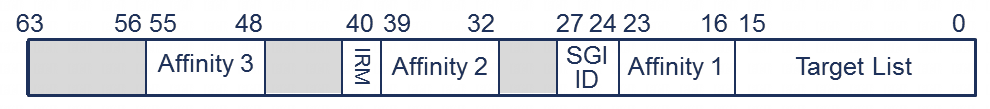

SGI 是通过向 CPU 接口中的一个 SGI 寄存器写入来生成的.

表 10. 启用系统寄存器访问时所使用的 SGI 寄存器:

| 系统寄存器接口 | 描述 |
|--|--|
|ICC_SGI0R_EL1 | 生成安全组 0 中断 |
|ICC_SGI1R_EL1 | 为 PE 的当前安全状态生成组 1 中断 |
|ICC_ASGI1R_EL1 | 为 PE 的另一个安全状态生成组 1 中断 |

SGI 寄存器的基本格式如图 24 所示.

图 24. 当 SRE = 1 时, SGI 寄存器的格式如下:

# 控制 SGI ID

SGI ID 字段控制生成的 INTID. 如 3.1.2 节所述, INTIDs 0 - 15 用于 SGI.

# 控制目标

SGI 寄存器中的 IRM(中断路由模式)字段控制 SGI 发送到哪个或哪些 PE.

有两个选项:

- **IRM = 0**: 中断发送到 `<aff3>.<aff2>.<aff1>.<Target List>`, 其中 `<Target List >` 针对 `<aff1>` 下的每个亲和 0 节点编码为 1 位. 这意味着中断最多可以发送到 16 个 PE, 其中可能包括发起的 PE.

- **IRM = 1**: 中断发送到所有连接的 PE, 但不包括发起的 PE(自身).

如 3.3 节所述, 层次化亲和字段的确切含义取决于具体设计. 通常, 亲和级别 1 标识一个多核处理器, 亲和级别 0 标识该处理器内的一个 PE.

# 控制安全状态和分组

SGI 的安全状态和分组由以下因素控制:

- 发起 PE 上软件写入的 SGI 寄存器(`ICC_SGI0R_EL1`, `ICC_SGI1R_EL1` 或 `ICC_ASGI1R_EL1`).

- 目标 PE 或多个目标 PE 的 `GICR_IGROUPR0` 和 `GICR_IGRPMODR0` 寄存器.

在安全状态下执行的软件可以发送安全和非安全 SGI. 在非安全状态下执行的软件是否可以生成安全 SGI, 由 GICR_NSACR 控制. 该寄存器只能由在安全状态下执行的软件访问. 表 11 展示了发起 PE 的安全状态, 目标 PE 的中断处理配置以及 SGI 寄存器如何影响中断是否被转发.

<caption><b>表 11. 当 GICD_CTLR.DS == 0 时, SGI 安全/组 控制</b></caption>
<table border="1">
<tr>
  <th>发送 PE 的安全状态</th>
  <th>写的 SGI 寄存器</th>
  <th>接收 PE 的配置</th>
  <th>是否转发</th>
</tr>
<tr>
  <td rowspan="9">Secure EL3/EL1</td>
  <td rowspan="3">ICC_SGI0R_EL1</td>
  <td>Secure Group 0</td>
  <td>是</td>
</tr>
<tr>
  <td>Secure Group 1</td>
  <td>否</td>
</tr>
<tr>
  <td>Non-secure Group 1</td>
  <td>否</td>
</tr>
<tr>
  <td rowspan="3">ICC_SGI1R_EL1</td>
  <td>Secure Group 0</td>
  <td>否(*)</td>
</tr>
<tr>
  <td>Secure Group 1</td>
  <td>是</td>
</tr>
<tr>
  <td>Non-secure Group 1</td>
  <td>否</td>
</tr>
<tr>
  <td rowspan="3">ICC_ASGI1R_EL1</td>
  <td>Secure Group 0</td>
  <td>否</td>
</tr>
<tr>
  <td>Secure Group 1</td>
  <td>否</td>
</tr>
<tr>
  <td>Non-secure Group 1</td>
  <td>是</td>
</tr>
<tr>
  <td rowspan="9">Non-secure EL2/EL1</td>
  <td rowspan="3">ICC_SGI0R_EL1</td>
  <td>Secure Group 0</td>
  <td>通过 GICR_NSACR 配置 (*)</td>
</tr>
<tr>
  <td>Secure Group 1</td>
  <td>否</td>
</tr>
<tr>
  <td>Non-secure Group 1</td>
  <td>否</td>
</tr>
<tr>
  <td rowspan="3">ICC_SGI1R_EL1</td>
  <td>Secure Group 0</td>
  <td>通过 GICR_NSACR 配置 (*)</td>
</tr>
<tr>
  <td>Secure Group 1</td>
  <td>通过 GICR_NSACR 配置</td>
</tr>
<tr>
  <td>Non-secure Group 1</td>
  <td>是</td>
</tr>
<tr>
  <td rowspan="3">ICC_ASGI1R_EL1</td>
  <td>Secure Group 0</td>
  <td>通过 GICR_NSACR 配置 (*)</td>
</tr>
<tr>
  <td>Secure Group 1</td>
  <td>通过 GICR_NSACR 配置</td>
</tr>
<tr>
  <td>Non-secure Group 1</td>
  <td>否</td>
</tr>
</table>

注: 表 11 假设 `GICD_CTLR.DS == 0`. 当 `GICD_CTLR.DS == 1` 时, 标记有 `(*)` 的 SGI 也会被转发.
