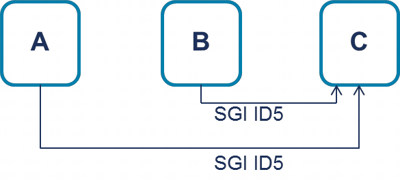

在 GICv2 中, SGI 的中断号 (INTID) 由发起的处理元件 (PE) 和目标 PE 分别进行存储. 这意味着, 一个特定的 PE 最多可以有 8 个相同的 SGI INTID 处于挂起状态, 系统中的每个 PE 都有可能向其发送中断并产生挂起.

而在 GICv3 中, SGI 仅由目标 PE 进行存储. 这表明, 一个特定的 PE 只能有一个 SGI INTID 实例处于挂起状态.

下面通过一个示例可以更好地说明这种差异. 假设 PE A 和 PE B 同时向 PE C 发送 SGI INTID 5.

图 25. 同一 ID 多个发送方示例:

C 将看到多少个中断?

* 在 GICv2 中, C 会看到两个中断.

    它会接收到来自 A 和 B 的中断, 这两个中断的接收顺序取决于具体设计和精确的时间安排. 通过 GICC_IAR 返回的 INTID 前缀可以区分这两个中断, 该前缀表示发起中断的 PE 的 ID.

* 在 GICv3 中, C 只会看到一个中断.

    因为发起的 PE 不会存储 SGI, 所以相同的中断不会在两个 PE 上同时处于挂起状态. 因此, C 只会看到一个 ID 为 5 的中断(无前缀).

该示例假设两个中断是同时或几乎同时发送的. 如果 C 能够在第二个中断到达之前确认第一个 SGI, 那么在 GICv3 中 C 也会看到两个中断.

注: 在传统操作模式下, 即当 GICD_CTLR.ARE = 0 时, SGI 的行为与 GICv2 相同.
