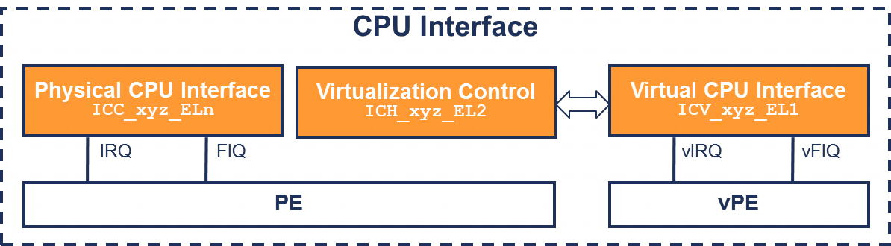

**CPU 接口寄存器**分为三组:

- 物理 CPU 接口寄存器(Physical CPU interface registers).

- 虚拟化控制寄存器(Virtualization control registers).

- 虚拟 CPU 接口寄存器(Virtual CPU interface registers).

图 27. CPU 接口寄存器的虚拟化:

# 物理 CPU 接口

> `ICC_*_ELn`

在 EL2 执行的管理程序软件使用常规的 `ICC_*_ELn` 寄存器来处理物理中断.

# 虚拟化控制寄存器

> `ICH_*_EL2`

管理程序可以访问额外的寄存器, 用于控制架构提供的虚拟化特性, 包括:

- 启用 / 禁用虚拟 CPU 接口.

- 访问虚拟寄存器状态以实现上下文切换.

- 配置维护中断.

- 控制虚拟中断.

这些寄存器控制从其访问的物理 PE 的虚拟化特性, 无法访问其他 PE 的状态. 也就是说, PE X 上的软件无法访问 PE Y 的状态.

# 虚拟 CPU 接口寄存器

> `ICV_*_ELn`

在虚拟化环境中执行的软件使用 `ICV_*_EL1` 寄存器来处理中断. 这些寄存器的格式和功能与 `ICC_*_EL1` 寄存器相同.

ICV 和 ICC 寄存器具有相同的指令编码. 在 EL2, EL3 和安全 EL1, 始终访问 ICC 寄存器. 在非安全 EL1, 根据 HCR_EL2 中的路由位决定访问 ICC 还是 ICV 寄存器.

ICV 寄存器分为三组:

- **组 0**: 用于处理组 0 中断的寄存器, 例如 ICC_IAR0_EL1/ICV_IAR0_EL1. 当 HCR_EL2.FMO == 1 时, 在非安全 EL1 访问 ICV 寄存器, 而非 ICC 寄存器.

- **组 1**: 用于处理组 1 中断的寄存器, 例如 ICC_IAR1_EL1/ICV_IAR1_EL1. 当 HCR_EL2.IMO == 1 时, 在非安全 EL1 访问 ICV 寄存器, 而非 ICC 寄存器.

- **通用**: 用于处理组 0 和组 1 中断的寄存器, 例如 ICC_DIR_EL1/ICV_DIR_EL1 和 ICC_PMR_EL1/ICV_PMR_EL1. 当 HCR_EL2.IMO == 1 或 HCR_EL2.FMO == 1 时, 在非安全 EL1 访问 ICV 寄存器, 而非 ICC 寄存器.

图 28 展示了根据 HCR_EL2 路由控制, 相同指令如何访问 ICC 或 ICV 寄存器的示例.

图 28. ICC/ICV 寄存器选择的示例:

