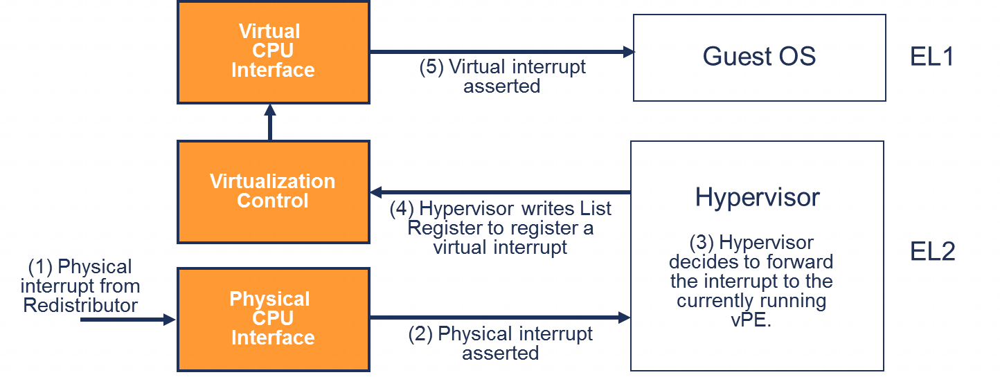

在 EL2 执行的 hypervisor 可以使用列表寄存器 `ICH_LRn_EL2` 生成虚拟中断.

每个寄存器代表一个虚拟中断, 并记录以下信息:

- **vINTID(虚拟 INTID)**: 这是在虚拟环境中报告的 INTID.

- **状态**: 虚拟中断的状态(挂起, 活动, 活动且挂起或非活动). 随着虚拟环境中的软件与 GIC 进行交互, 状态机将自动更新. 例如, 管理程序可能创建一个新的虚拟中断, 最初将其状态设置为挂起. 当 vPE 上的软件读取 ICV_IARn_EL1 时, 状态将更新为活动.

- **组**: 虚拟环境始终表现得好像 `GICD_CTLR.DS == 1`. 因此, 虚拟中断可以是组 0 或组 1. 组 0 中断作为 vFIQs 发送, 组 1 中断作为 vIRQs 发送.

- **pINTID(物理 INTID)**: 虚拟中断可以选择性地标记一个物理中断的 INTID. 当 vINTID 的状态机更新时, pINTID 的状态机也会更新.

# 物理中断转发到虚拟处理单元 (vPE) 的示例

图 29 展示了一个物理中断被转发到虚拟处理单元 (vPE) 的示例流程.

注: vPE 是 virtual Processing Element 的缩写, 一般可译为虚拟处理单元.

1) 一个物理非安全组 1 中断从重新分配器转发到物理 CPU 接口.

2) 物理 CPU 接口检查该物理中断是否可以转发给处理单元(PE). 此过程在 5.1 节中有描述. 在本例中, 检查通过, 并且触发了一个物理异常.

3) 该中断被提升到异常级别 2(EL2). hypervisor 读取中断确认寄存器(IAR), 该寄存器返回物理中断标识符(pINTID). 此时 pINTID 处于活动状态. hypervisor 确定该中断要转发给当前正在运行的虚拟处理单元(vPE). hypervisor 将 pINTID 写入ICC_EOIR1_EL1. 当 `ICC_CTLR_EL1.EOImode` 位等于 1 时, 这只会降低优先级, 而不会停用物理中断.

4) hypervisor 写入列表寄存器中的一个, 以便将一个虚拟中断注册为待处理状态. 列表寄存器条目指定了要发送的虚拟中断标识符 (vINTID) 和原始的 pINTID. 然后, hypervisor 执行异常返回操作, 将执行权交还给 vPE.

5) 虚拟 CPU 接口检查该虚拟中断是否可以转发给 vPE. 这些检查与物理中断的检查相同, 只是它们使用的是虚拟中断控制器 (ICV) 寄存器. 在本例中, 检查通过, 并且触发了一个虚拟异常.

6) 该虚拟异常被提升至非安全异常级别 1(Non - secure EL1). 当软件读取中断确认寄存器 (IAR) 时, 将返回虚拟中断标识符(vINTID), 此时该虚拟中断处于活动状态.

7) 客户操作系统 (Guest OS) 处理该中断. 处理完中断后, 它会写入中断结束寄存器 (EOIR) 以降低优先级并停用中断. 由于列表寄存器记录了物理中断标识符(pINTID), 这将同时停用 vINTID 和 pINTID.
