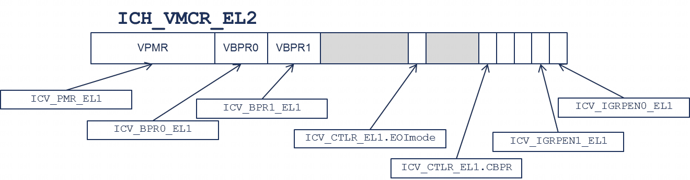

在 vPEs 之间进行上下文切换时, 管理程序软件会保存一个 vPE 的状态, 并加载另一个 vPE 的上下文. 虚拟 CPU 接口的状态是 vPE 上下文的一部分. 虚拟 CPU 接口状态包括:

- ICV 寄存器的状态.

- 活动的虚拟优先级.

- 任何挂起, 活动或活动且挂起的虚拟中断.

ICV 寄存器的状态可以从 EL2 使用 ICH 寄存器访问. 例如, 图 30 展示了 ICH_VMCR_EL2 中的字段如何映射到 ICV 寄存器状态.

图 30. 从 EL2 访问 ICV 状态:

在切换 vPE 时, 必须保存和恢复活动的虚拟优先级. 当前 vPE 的活动优先级可以通过 ICV_APnR_EL2 寄存器访问.

如 8.3 节所述, 虚拟中断通过列表寄存器进行管理. 这些寄存器的状态特定于当前 vPE, 因此在上下文切换时必须保存和恢复这些寄存器的状态.
