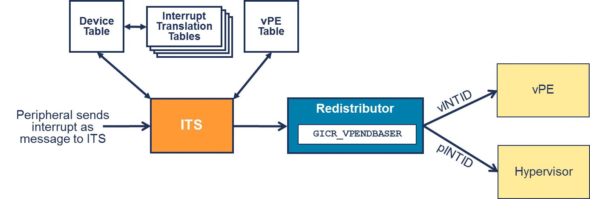

GICv4 为 ITS 添加了一些新命令和一种额外的表类型, 使软件能够:

- 将 EventID - DeviceID 组合映射到特定 vPE 的 vINTID.

  - 可以选择指定一个门铃中断. 如果在生成中断时 vPE 未被调度, 则会生成此 pINTID.

- 将 vPE 映射到物理再分发器.

图 31 展示了 ITS 转发虚拟中断时遵循的过程.

图 31. 使用 ITS 直接注入虚拟中断:

当外设向 `GITS_TRANSLATER` 写入时:

1) ITS 使用 DeviceID 从设备表中选择相应的条目. 该条目标识要使用的中断转换表.

2) ITS 使用 EventID 从中断转换表中选择相应的条目. 这将返回以下内容之一:

   - 如 6.1.1 节所述的 pINTID 和集合 ID.

   - vINTID 和 vPE ID, 以及可选的作为门铃中断的 pINTID.

3) ITS 使用 vPE ID 在 vPE 表中选择所需的条目, vPE 表返回目标再分发器和 vPE 的 VPT 地址.

4) ITS 将 vINTID, 门铃中断和 VPT 地址转发到目标再分发器.

5) 再分发器将来自 ITS 的 VPT 地址与当前的 GICR_VPENDBASER 进行比较:

    - 如果 VPT 地址与当前的 GICR_VPENDBASER 匹配, 则 vPE 已调度, vINTID 将被转发到虚拟 CPU 接口.

    - 如果 VPT 地址与当前的 GICR_VPENDBASER 不匹配, 则 vPE 未调度. vINTID 将在 VPT 中设置为挂起. 如果提供了门铃中断, 则 pINTID 将被转发到物理 CPU 接口.
