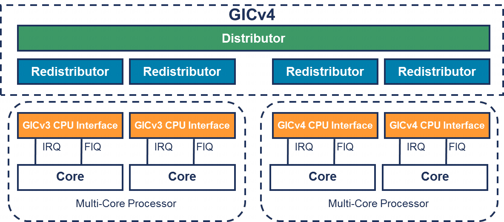

单个 GIC 可能连接支持 GICv3 和 GICv4 的 CPU 接口. 下图展示了这样一个系统的示例.

只有实现了 GICv4 的 CPU 接口才能接收直接注入的虚拟 LPI. 在 GICv3 CPU 接口上调度 vPE(即设置 `GICR_VPENDBASER.Valid == 1`)会产生不可预测的结果. 软件可以通过读取 `ICH_VTR_EL2.nV4` 来判断是否支持直接注入的虚拟中断.
