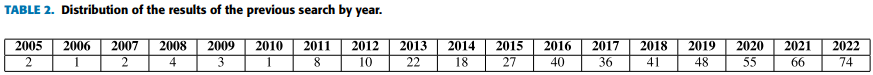
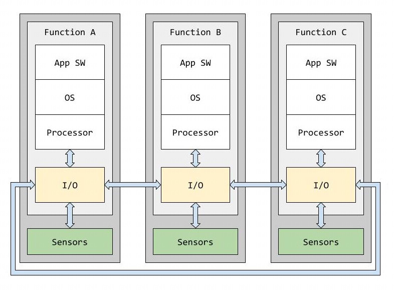

A Comprehensive Survey on the Use of Hypervisors in Safety-Critical Systems

Received 9 March 2023, accepted 29 March 2023, date of publication 5 April 2023, date of current version 14 April 2023.

# 摘要

虚拟化已经成为高效利用多核嵌入式平台资源的主要工具之一. 近年来, 即使是航天, 航空和汽车等行业, 这些传统上由于担心该技术可能对其系统的安全性产生影响而对采用此类技术持谨慎态度的领域, 也不得不将其引入日常工作, 因为它们的应用正变得越来越复杂和苛刻. 本文对使用或考虑使用 Hypervisor 作为构建虚拟化安全关键嵌入式系统基础的研究工作进行了全面的综述. 在识别出为这类系统开发或适配的 Hypervisor 之后, 本文对它们进行了详尽的定性比较. 据我们所知, 这是首次将所有这些信息汇总在一篇文章中. 因此, 本文的主要贡献在于收集并分类了每种 Hypervisor 的信息, 并将它们相互比较, 以便本文可以作为该领域未来研究人员的起点, 他们可以快速了解哪种 Hypervisor 最适合他们的研究需求.

# 介绍

虚拟化是现在和近未来高效利用现代多核平台的最有力工具之一. 然而, 尽管人们普遍认为**电子系统的未来**是**多核技术**, 但具有**关键安全要求的领域** (例如航天, 航空或汽车领域) 传统上一直对采用这种技术持谨慎态度. 例如, 尽管**多核系统**早在 **2005** 年就开始出现, 但直到 **2008** 年, 美国航空航天学会 (`American Institute of Aeronautics and Astronautics`, AIAA) 才首次在两篇文章中直接提及这一主题: 一篇是关于**多级独立安全** (`Multiple Levels of Independent Security`, **MILS**)[1], 另一篇涉及喷气式战斗机任务计算机的未来[2]. 多核技术在关键领域渗透缓慢的最可能原因与**核心之间对相同资源的争夺**以及这种争夺如何**影响最坏情况执行时间**(`Worst-Case Execution Time`, **WCET**)[3] 有关. **多年前**, Kinnan [4]和 Wilhelm 等人的研究 [5] 已经指出了**共享资源的一些问题**, 它们如何导致执行时间的可变性, 以及这种**不可预测性**(un-predictability)如何影响这些系统的实施和认证. **十年后**, 如 Annighoefer 等人的研究 [6] 所反映的那样, 在航空电子平台等领域, 获得**确定性行为仍然是一个主要挑战**. 在许多情况下, 可以通过**智能规划架构**来**提高可预测性**(predictability), 从而缓解这些问题, 正如 Cullman 等人的研究 [7] 和 Kliem 与 Voigt 的研究 [8] 所指出的那样.

然而, **必须解决多核处理器带来的问题**, 因为它们在当今和未来的关键实时系统中变得不可避免. 在他们的文章 [9] 中, Bieber 等人回顾了航空电子架构未来的挑战, 并解释了自 2000 年代中期以来, 多核架构是如何取代单核架构的, 以至于单核处理器变得越来越少见且昂贵. 除了经济原因外, 单核处理器在计算能力上也存在上限. 特别是, 随着处理单元的性能越来越强大, 其功耗和散热问题变得更加突出. 这意味着航空电子和其他关键需求领域的未来不可避免地要通过多核处理器来实现. 因此, 需要软件工具来帮助利用它们的处理能力, 同时保持高水平的安全性和可靠性. 在这些工具中, 虚拟化作为一种最强大的工具脱颖而出, 甚至在汽车或航空电子等技术保守的领域也变得越来越受欢迎.

据我们所知, 目前并没有很多针对安全关键嵌入式系统的虚拟化解决方案的比较性研究. Gu 和 Zhao 对实时嵌入式系统的虚拟化技术 (包括但不限于安全关键系统) 进行了比较, 并讨论了其中一些技术问题 [10]. 然而, 该综述主要集中在 Xen 和 KVM 的相关工作上, 而且由于文章发表于 **2012 年**, 因此已经过时. Taccari 等人对实时嵌入式系统的虚拟化技术进行了综述, 但重点是那些在 ARM 架构上运行的技术 [11], 并且从技术角度来看, 该研究也已经过时(**2014 年**).

最近, Cinque 等人根据实现虚拟化的内部结构, 将**混合关键性系统**中使用的 Hypervisor 分为四类: `separation kernel hypervisors`(**分离内核 Hypervisor**), `general-purpose hypervisors`(**通用 Hypervisor**), `hardware-extensions hypervisors`(**硬件扩展 Hypervisor**)和`lightweight hypervisors`(**轻量级 Hypervisor**)[12]. 对于每一类, 他们提到了几个例子, 列出了一些特性, 并讨论了这些特性是否使它们更适合在工业中使用. 然而, 他们的工作与我们的工作在几个方面存在明显差异. 最重要的是, Cinque 等人的工作并非也不打算做到穷尽, 因此它没有涵盖工业或研究工作中使用的所有解决方案, 而只是提到了一些能够代表每个类别的例子. 此外, 这些解决方案之间的比较使用了与我们不同的参数, 并且特别关注认证, 测试或可靠性支持等维度, 以检查每种解决方案在工业中使用的成熟度. 我们的综述更为全面, 涵盖了工业和研究中通常使用的所有 Hypervisor, 并使用不一定以工业为中心的标准进行比较, 以便该综述可以作为未来研究的起点, 即使它没有涉及认证或测试问题.

本文提供了一个全面的研究, 研究了使用 Hypervisor 或考虑使用 Hypervisor 作为构建虚拟化安全关键嵌入式系统基础的研究工作. 第三部分介绍了**实时系统**中虚拟化的基本原理和 Hypervisor 的基础知识. 第二部分阐述了选择本文综述文章的标准. 第四部分展示了在**安全关键嵌入式系统**中虚拟化的研究, 重点是航空航天和汽车行业. 第五部分和第六部分对一些相关安全关键实时 Hypervisor 进行了比较. 最后, 第八部分描述了这项工作的主要结论.

# 选择标准

实时系统研究界对这一研究主题的兴趣是毋庸置疑的. 然而, 由于我们希望将对 Hypervisor 的综述限制在**安全关键系统**上, 我们在科学和工程研究文章最流行和相关的数据库 IEEE Xplore 和 Science Direct 中搜索了包含 "Hypervisor" 一词以及与开发安全关键嵌入式系统的行业相关的不同词汇的术语. 表 1 显示了搜索结果.

请注意, 并非所有搜索结果中的文章和书籍都与本次综述相关, 因为有些文章仅在与该技术不直接相关的上下文中提及 Hypervisor 的概念. 然而, 按时间顺序对搜索结果进行排序, 可以清楚地看到 Hypervisor 在安全关键嵌入式系统中的重要性和深度的上升趋势. 在删除重复结果后, 表 2 按年份展示了文章和书籍的分布情况, 图 1 以图形方式展示了这些分布.

图1: 每年搜索出的发表的论文数量

这些结果通过在 Google Scholar 中的搜索得到了补充, 以将这两个大型数据库中发现的文章与小型数据库中发现的最相关文章结合起来. 从所有这些结果中, 只选择了期刊文章和会议记录, 而舍弃了书籍, 因为书籍通常会收集有价值的技术信息, 但通常不会呈现之前文章中未呈现过的新信息. 最后, 在剩下的文章中, 进行了审查, 只选择符合以下标准之一的文章:

- 文章涉及在安全关键嵌入式系统的背景下使用现有的 Hypervisor (开源或专有许可).

- 文章介绍了为安全关键嵌入式系统背景下的使用而对一个开源 Hypervisor 所做的修改.

- 文章介绍了为安全关键嵌入式系统的使用而开发的一个新的 Hypervisor .

本文综述中要审查的文章的选择标准在图 2 中以图形方式反映.

图 2: 文章的选择标准

# 基础知识

## 虚拟化简史

尽管虚拟化是近年来蓬勃发展的主题, 但其根源可以追溯到 20 世纪 60 年代. Christopher Strachey 被认为是该领域的先驱之一, 他是第一个在 1959 年 6 月于巴黎联合国教科文组织举行的国际信息处理会议上发表涉及**分时概念**文章的人 [14]. 分时技术基于多用户同时共享一台计算机. 随着时间的推移, 这种技术引发了行业内的革命性变化, 包括虚拟化概念的出现.

第一个实验性的分时系统是由麻省理工学院的一个团队在 1961 年完成的, 该团队由 Fernando J. Corbató 教授领导 [15]. 1963 年, 同一个团队为 IBM 7094 主机开发了一个操作版本, 称为 CTSS(兼容分时系统). 这个系统成为了著名的 MIT 项目 MAC(数学与计算, 后来更名为多用户计算机)的基础 [16]. 该项目的主要目标之一是创建一个大型, 多用户访问的计算机系统, 以满足大量用户的个性化需求. 在此背景下, MIT 联系了几家计算机供应商, 包括 GE 和 IBM. 当时, IBM 认为分时计算机的需求不足以进行投资. 而 GE 承诺开发分时计算机, 因此 MIT 选择了 GE 作为供应商. 1964 年 5 月, GE 计算机在达特茅斯学院的一次分时系统演示中被使用 [17]. 这可能成为 IBM 的一个警钟, 尤其是当贝尔实验室宣布它需要一个类似的系统时.

作为回应, IBM 设计了 CP/CMS, 这是第一个分时操作系统, 同时也引入了第一个完整的虚拟化平台 [18]. 第一个版本, CP-40 操作系统, 提供了一个环境, 支持多达 14 个同时运行的虚拟机 [19]. 尽管这个操作系统从未商业发行, 但它成为了 CP-67 和 CP-370 版本的前身, 这些版本是 VM/370 操作系统的基础, 而 VM/370 操作系统与 IBM 最著名的主机之一 System/370 一起使用. 虚拟化和分时技术使得公司可以拥有一个单一的主机, 并为每个员工提供一个终端, 而不是为每个员工提供一台计算机 [20].

进一步的发展是 VM86 模式, 这是一种硬件虚拟化技术, 允许 386 芯片模拟多个 8086 处理器, 从而允许在处理器运行保护模式操作系统时, 执行无法直接在保护模式下运行的实模式应用程序 [21].

1974 年, Gerald J. Popek 和 Robert P. Goldberg 确立了一个系统必须具备的虚拟化特性 [22]. 他们的文章描述了我们今天仍在使用的虚拟机和虚拟机监视器的属性和功能. 根据定义, 虚拟机 (VM) 可以虚拟化任何硬件资源, 包括处理器, 内存和网络连接. 虚拟机监视器 (VMM) 是为虚拟机提供执行环境的软件层. 在他们的文章中, 他们还描述了**虚拟机监视器**必须满足的**三个属性**:

- **等价性**(Equivalence): 虚拟机监视器 (VMM) 为虚拟机提供的环境必须与 VMM 运行的本地硬件完全相同. 因此, 在 VMM 上运行的程序必须表现得与直接在物理机器上运行时完全一样.

- **资源控制**(Resource control): 虚拟机监视器 (VMM) 必须对系统资源拥有完全控制权.

- **效率**(Efficiency): 如果可能的话, 虚拟机与物理等价物之间不应有任何区别.

这些属性至今仍然有效, 尽管 "**虚拟机监视器**"(`VMM`) 这一术语已不再那么常见, 正逐渐被 "**Hypervisor**" 这一术语所取代.

随着时间的推移, 尤其是在 20 世纪 80 年代和 90 年代, 随着摩尔定律的持续应验 [23], 计算机变得越来越强大, 便宜和小巧. 个人电脑开始取代主机和终端 [24], 这在一段时间内减缓了虚拟化的趋势. 然而, 近年来, 由于多种原因, **虚拟化技术又迎来了新的繁荣**, 其中一些原因是:

- **资源优化**(`Resource optimization`)

  如今计算机的强大性能意味着, 在许多情况下, 它们大部分时间都处于闲置状态, 因为所需的使用量并未耗尽其所有资源. 虚拟化允许多个应用程序 (每个应用程序甚至可以有不同的操作系统或执行环境) 在同一硬件上隔离运行且彼此之间没有交互. 这使得在多种类型的应用中能够优化硬件资源 [25].

- **隔离作为一种安全措施**(`Isolation as a security measure`)

   Hypervisor 的一个巨大优势是**虚拟机之间的隔离**, 使得理想情况下, 一个虚拟机或容器中的恶意活动不会影响到其他部分 [26]. 此外, 虚拟化提供了一种实现应用程序冗余的方法, 无需额外购置硬件. 如果一个应用程序失败, 另一个应用程序 (在不同的虚拟机上运行) 可以接管.

- **减少物理空间**(`Physical space reduction`)

  虚拟化使得能够使用更少的硬件资源, 从而节省物理空间.

- **降低功耗**(`Less power consumption`)

  与上一点类似, 这是资源优化的直接结果. 能够使用更少的硬件资源实现相同的功能, 可能会导致更低的功耗, 最终实现更小的碳足迹 [27].

- **便捷的迁移和 legacy 保护**(`Easy migration and legacy protection`)

   Hypervisor 通过定义将主机硬件与操作系统和应用程序解耦, 从而使得虚拟机能够从一个主机无缝迁移到另一个主机. 这在高效的工作负载平衡或设计即插即用系统时是一个巨大优势 [28].

## Hypervisor

如上所述, 虚拟机监视器 (VMM) 起源于 20 世纪 70 年代, 其诞生是为了满足非常特定的需求. 如今, VMM 让我们能够充分利用新型处理器的强大能力. 随着时间的推移, "**虚拟机监视器**" 这一**术语**逐渐被 "**Hypervisor**" 所取代.

Ankita Desai 等人 [29] 将 Hypervisor 定义为一个**轻量级的软件层**, 它为一个或多个操作系统提供硬件的抽象, 使它们能够在同一台主机硬件上运行. 如图 3 所示, Hypervisor 是一个创建和管理虚拟机或分区的软件层, 它为这些虚拟机或分区提供硬件的抽象. 是否需要一个操作系统来使用 Hypervisor 虚拟化的硬件, 这仍然是一个有争议的问题. 正如我们稍后将看到的, 有些 Hypervisor 可以直接将虚拟化的硬件提供给用户, 允许他们像管理真实硬件一样管理它. 在这种 Hypervisor 上开发应用程序, 相当于开发通常所说的 "裸机应用程序", 只不过它运行的硬件是虚拟的, 而不是真实的.

图 3. Hypervisor 的图形描述

根据**运行环境**,  Hypervisor 可以分为两种类型(见图 4 和图 5):

图 4. Type 1 Hypervisor:

图 5. Type 2 Hypervisor:

- **1 型 Hypervisor (裸机 Hypervisor)**:  Hypervisor 直接运行在主机硬件上. 在这种情况下,  Hypervisor 负责调度和分配系统资源给每个虚拟机, 而其下方没有运行操作系统.

- **2 型 Hypervisor**:  Hypervisor 作为应用程序运行在主机操作系统之上. 主机操作系统不一定需要知道 Hypervisor 的存在, 它将 Hypervisor 视为普通进程.

根据提供的**虚拟化类型**,  Hypervisor 也可以大致分为两种:

- **全虚拟化 Hypervisor**: 允许运行未经修改的客户机操作系统.  Hypervisor 完全模拟它运行的物理平台, 因此在其上运行的操作系统甚至不知道它们运行在虚拟化平台上. 这种方法的最大优点是它提供的灵活性, 允许运行任何客户机操作系统. 然而, 它往往带来相当大的开销, 与直接在物理硬件上运行相比, 延迟可能高达 30% [30].

- **半虚拟化 Hypervisor**: 不能运行未经修改的操作系统, 客户机操作系统必须知道自己已被虚拟化, 并提供特殊的接口 (通常称为超调用) 以直接利用 Hypervisor 提供的服务 [31]. 换句话说,  Hypervisor 不需要翻译每个虚拟机的指令, 而是直接从虚拟机接收指令. 当然, 这种选择的灵活性要小得多, 因为每个客户机操作系统都必须被修改以与运行它的 Hypervisor 兼容, 但它在硬件访问时间上提供了更高的性能, 这一点已被 Dordevic 等人在比较这两种虚拟化技术的文章中理论化并得到证实 [32].

一些 Hypervisor, 如 VMware 和 ESXi, 能够同时提供这两种特性. 它们支持半虚拟化, 但也能运行未经修改的客户机. 在这种情况下, 半虚拟化被视为一种性能优化技术, 通过减少客户机执行环境与硬件之间抽象层的数量, 显著提高客户机操作系统的性能 [33].

一些现代处理器提供了硬件工具以实现 (理想情况下) 全虚拟化, 减少传统全虚拟化的开销. 这些处理器配备了支持虚拟机环境的机制. 例如, 英特尔为英特尔处理器提供了硬件辅助虚拟化机制. 英特尔 VT-x 为处理器虚拟化提供了虚拟化机制 [34], 输入 / 输出内存管理单元 (IOMMU) 通过允许系统软件控制 I/O 设备可以访问的物理内存区域, 为 I/O 设备提供内存保护 [35], 而单根 I/O 虚拟化 (SR-IOV) 允许 I/O 设备被多个虚拟机共享 [36]. 这种特定情况有不同的名称: Xen 称之为硬件虚拟机(HVM)[37], 但通常被称为硬件辅助虚拟化或加速虚拟化.

有时, 这种虚拟化仍然存在过大的开销, 因此会结合一些半虚拟化的驱动程序, 这就是为什么它也被称为混合虚拟化 [38].

大多数现代实时系统的 Hypervisor 提供了指定核心 / 任务亲和性的可能性, 使用亲和性掩码在每个任务的基础上指定任务可以在哪些处理器上被调度. 然而, 核心亲和性限制了任务迁移, 这可能会在提供对称多线程 (SMT) 的架构中产生一些问题, 因为在这些架构中, 任务被分配到下一个空闲核心. 尽管 SMT 似乎更高效, 但它可能导致缓存失效次数增加, 从而导致任务的最坏情况执行时间 (WCET) 增加. 因此, 将硬实时任务映射到特定核心并指定其亲和性仍然是一个常见的做法. 这一特性对于提供符合 ARINC 653 分区模型的安全关键航空电子实时操作系统 (RTOS) 是必需的. 然而, 软实时任务通常被允许从一个核心迁移到另一个核心 [39].

# 安全关键嵌入式系统中的虚拟化

> VIRTUALIZATION IN SAFETY-CRITICAL EMBEDDED SYSTEMS

本节通过展示**航空**(`aviation`), **航天**(`aerospace`)和**汽车**(`automotive`)等主要使用**安全关键嵌入式**(safety-critical embedded)系统的领域当前的现状, 来呈现虚拟化在这些系统中的最新发展情况.

## 航空业中的虚拟化

图 6. 联邦式架构例图:

传统上, 飞行系统采用**联邦式架构**(`federated architecture`), **每个功能**由一个**具有专用计算资源**的**黑盒子**组成 [40](见图 6). 每个黑盒子内部可以包含完全不同的配置 (硬件或软件), 并且它们彼此**物理隔离**. 当然, 这种架构在故障隔离和容错方面表现出色, 但它也带来了一系列严重问题: **资源重复**, **缺乏灵活性**(增加一个功能需要增加一个新的盒子) 以及**高昂的成本**, 不仅仅是经济成本, 还包括**功耗**和**重量**. 正是在这种背景下, **综合模块化航空电子** (`Integrated Modular Avionics`, **IMA**) 的概念在 20 世纪 90 年代初诞生了 [41]. 在 IMA 架构中, **不同的航空电子功能**在**同一平台**上共存, **彼此之间互不干扰**. 为此, 不同的功能共享一系列硬件资源(CPU, 通信, I/O 设备……), 并通过架构本身固有的**强大分区机制**进行隔离. 如今, 在航空业中, 使用 IMA 的优势已不再有争议, 几乎每一款投入使用的飞机型号都采用了这种理念 [42].

这种范式转变的关键推动因素之一是 1996 年发布的 **ARINC 653 软件标准**. ARINC 653 是针对**安全关键实时系统**的**时间**和**空间分区**的软件规范. 描述 ARINC 653 的第一个草案于 1996 年发布 [43], 此后又发布了两个补充版本, 最近一次是在 **2007** 年. 最初, 它定义了 **IMA 架构操作系统**应遵循的**总体结构**, 但 ARINC 653 也可以应用于 Hypervisor , 因为它的某些特性与 Hypervisor 更加契合. ARINC 的目标是规范一个软件执行环境的特性, 在这个环境中, 多个应用程序可以在称为**分区**(partitions)的**虚拟容器**(`virtual container`)中运行, 彼此隔离. 理想情况下, 这些容器应该**完全隔离**, 以便一个分区的执行或失败不会影响任何其他分区. 实现这种隔离的方式是通过**空间和时间上分离硬件资源**. 在这方面, ARINC 653 与 Hypervisor 概念的相似性非常显著, 这反映在图 3 和图 7 的等价性上.

图 7. ARINC 653标准的图形描述:

除了定义要提供的服务外, ARINC 653 最重要的特性之一是它标准化了 **Hypervisor/操作系统** 与**应用层**之间的接口. 这个接口被称为 **APEX**(`Application/Executive`), 它符合 IMA 理念, 提供了可移植性, 可重用性, 模块化以及软件模块的易于集成等优势.

ARINC 653 提供的服务可以分为**几个模块**:

- **分区管理**: 该模块提供**修改分区运行模式**的手段, 并负责**分区的调度**.

- **进程管理**: 每个分区可以有**多个周期性或非周期性进程**. 该模块提供修改**进程运行模式**的手段, 并包括**进程调度**.

- **时间管理**: 该模块确保满足**硬实时要求**, 并提供**与时间相关的服务**, 例如读取时间或进程的等待/超时服务. 所有分区必须有一个**单一的时间源**, 无论它们的执行情况如何.

- **分区间通信**: 不同分区之间的通信通过**端口**(**ports**)和**通道**(**channels**)进行. 从概念上讲, **端口**可以被视为分区边界的门户, 而通道则连接两个或多个端口. 标准还定义了两种操作模式: 采样模式 (面向固定大小的同步消息) 和排队模式(面向可变大小的异步消息).

- **分区内通信**: 该模块负责提供分区内进程之间的通信, 通过缓冲区和黑板实现. 事件和信号量也被用来提供进程间的同步.

- **健康监控**: 该模块负责定义, 检测和响应进程, 分区或系统级别的不同错误.

在他们的文章中, VanderLeest 等人 [44] 对 ARINC 653 标准似乎**禁止中断**这一有趣的现象进行了反思, 因为**中断可能会破坏系统的确定性**, 允许一个分区从其他分区窃取时间. 事实上, 大多数 ARINC 653 的实现都假设在遵循 IMA 理念时不允许中断, 但他们认为中断不一定涉及非确定性, 并设计了通过**递减时间预算**提供**可预测性的中断**, 从而使系统在主要时间框架的尺度上可预测. 他们还开发了一个原型, 以展示使用 Xen Hypervisor 时这些中断如何工作, 尽管将在第五部分更深入地回顾用于安全关键用例的 Hypervisor.

Hypervisor 的概念与 IMA 理念和 ARINC 653 标准非常契合. **虚拟化**按定义提供**时间和空间分区**. ARINC 653 描述的其余功能 (例如健康监控或 APEX 接口) 必须在 Hypervisor 本身或软件架构的其他级别 (通常, 应用接口, 如 APEX, POSIX 或 OSEK 在操作系统级别覆盖) 中实现. 在 2015 年的一篇文章 [45] 中, VanderLeest 等人得出结论, **Hypervisor** 将是航空业坚定适应多核系统的工具, 而多核系统是提高处理器性能的唯一途径. 此外, ARINC 653 也是**标准化航天工业**的最有力候选人之一, 因为促使定义该标准的民用航空世界的要求也适用于航天工业. 采用 **ARINC 653** 将在**成本降低**, **模块化认证**和**减少集成工作量**方面带来好处.

**DO-297 标准**(IMA 开发指导和认证考虑)是认证机构 (如 FAA 和 EASA) 用于批准航空 IMA 系统的文件. 该文件推荐使用 ARINC 653 标准来定义系统接口并规范系统行为.

## 航天业中的虚拟化

航天业与航空业密切相关, 因此许多文章探讨了将航空标准和实践应用于航天业的可能性. 例如, Windsor 和 Hjortnaes 分析了将基于 IMA 航空概念和 ARINC 653 标准的 TSP 技术纳入航天器航空电子架构的优势. 他们还考虑了这些技术可能产生最大影响的领域, 并提供了不同用例的例子.

航天系统的运行在某些方面甚至比军用和商用飞机更为敏感. 太空任务的成功取决于能够在长时间内获得确定性行为, 并且在许多情况下, 地面操作团队的实时支持非常有限. 此外, 航天系统运行的环境可能比其他关键实时系统更为恶劣, 因为真空, 辐射或极端温度等因素. 所有这些因素使得设计, 开发和测试航天设备的过程耗时且成本高昂.

近年来, 航天业也出现了向 COTS(商业现货)组件发展的趋势, 以利用其强大的资源, 同时降低开发成本, 功耗和航天器的物理空间. 这导致了 "新太空" 市场的出现, 该市场基于开发成本显著低于传统太空任务的小型太空平台. 这种成本的降低和对商业组件的开放性使得 "新太空" 吸引了私人公司, 这在传统上由公共组织推动的航天业中并不常见. 私人公司的进入显著增加了行业内的参与者数量, 从而提高了其竞争力, 并催生了新的低成本, 高性能应用, 如太空碎片清除, 地球观测任务或基于卫星的全球通信网络.

在将航天系统的所有或大部分功能集成到单一高性能硬件平台上时, 存在一个问题: 有些安全关键功能的失败会对任务目标产生灾难性影响, 而其他功能则不那么关键, 因此可以接受要求较低且成本较低的验证和验证过程. 在这种背景下, 虚拟化是一种关键技术, 因为它通过其固有特性保证了不同软件模块的时间和空间隔离, 以避免它们之间的干扰, 并且一个模块的失败不会影响其他模块. 当使用虚拟化在同一平台上部署不同关键性级别的功能时, 得到的系统通常被称为混合关键性系统 [50].

## 汽车业中的虚拟化

自 20 世纪 70 年代首次出现电子点火系统以来, 汽车中的电子元件数量不断增加. 如今, 汽车的复杂性主要由**电气**(`electrical`)和**电子**(`electronic`)系统构成 [51]. 目前估计, **汽车成本的 35%** 对应于**电子设备**, 这一比例在 2000 年为 20%, 2010 年为 30%, 预计到 2030 年将增长到 50% [52]. 如今, 大多数汽车依赖于强大的**电气 electrical** 和**电子 electronic** (E/E) 架构, (发动机, 制动, 转向以及其他舒适和安全特性)都依赖于此. 嵌入式软件在汽车设计和开发中的重要性日益增加, 并且随着公司在自动驾驶等技术领域的持续发展, 其重要性将继续增加. 这意味着现代汽车中的电子控制单元 (ECU) 数量不断增加: 目前一辆汽车有超过 150 个用于不同目的的 ECU [53].

面对这一挑战, 近年来提出了不同的解决方案. 其中, 虚拟化是研究最多的方法之一, 因为它可以将多个 ECU 合并到同一硬件平台上, 同时保持它们之间的**时间和空间隔离**. 这种隔离至关重要, 因为**关键系统** (如**驾驶辅助系统**, 通常由经过安全认证的**实时操作系统管理**) 与信息和娱乐系统 (其安全约束要宽松得多) 在同一辆汽车中共存. 通过虚拟化, 以前分布在许多 ECU 中的功能可以被收集到更少数量的域控制单元 (DCU) 中, 每个系统都遵循自己的安全要求.

尽管汽车业与航天和航空业之间的联系不如航天和航空业之间的直接, 但它们之间存在许多相似之处: Gaska 和 Chen 之间存在一个有趣的类比, 即汽车系统的架构与 IMA 航空电子架构之间的相似性. 他们讨论了多核处理和 Hypervisor 技术是如何成为这类系统未来的推动因素, 并提出了多核平台 (如 Intel Xeon FPGA SoC, Nvidia Tesla SoC 或 Xilinx Ultrascale+) 和 Hypervisor  (如 VxWorks, Lynx 或 Green Hills) 的各种候选方案. 然而, 文章没有展示任何类型的测试或深入分析, 以使我们能够选择其中的任何一种替代方案.

Cruz 等人在最近的一篇论文中提出了一个基于 x86 的**虚拟 PLC**(vPLC)架构, 该架构将**逻辑和控制能力与 I/O 组件分离**, 同时在实时 Hypervisor 内虚拟化 PLC 逻辑. 在 vPLC 中, 专用的 **PLC I/O 总线**被确定性和高速的网络基础设施所取代, 使用 SDN 以在 I/O fabric 上灵活创建虚拟通道. 这一贡献可能对汽车制造业产生重大影响, 因为它允许为 Hypervisor 实现(**高速**, **确定性**)的 I/O 通信, 并通过软件监督分区行为, 从而推动物联网设备及其控制的虚拟化.

# 安全关键实时系统的 Hypervisor

在解释了理解 Hypervisor 概念的基础以及虚拟化不仅在多个安全关键行业中占有一席之地, 而且在未来可能发挥关键作用的原因之后, 以下部分回顾了应用了某种虚拟化的科学作品, 或者使用 Hypervisor 来研究其对太空, 航空或汽车系统的影响.

对于本次综述, 根据其许可政策, Hypervisor 被分为**专有**(`proprietary`)和**开源**(`open-source`)两类. 第五部分 A 将介绍一些在工业中具有重要性和存在感的 Hypervisor , 但由于其专有许可和高昂价格, 在学术作品中很少被研究. 接下来的部分将专门介绍三种主要的开源 Hypervisor: **Xen**, **KVM** 和 **XtratuM**, 因为它们的重要性以及在科学文献或通过私人公司传播中存在更多证据. 其他不太流行的开源 Hypervisor 在第五部分 E 中一起介绍.

## 专有 Hypervisor

请注意, 尽管 Hypervisor 本身提供了 TSP 特性, 但它并非实现这些特性的唯一选择. 如果能够完全隔离软件模块, 使每个模块都能运行不同关键性分区, 那么实时操作系统 (RTOS) 也可以提供 TSP 特性. 例如, 有许多面向安全关键实时工业应用的专有 RTOS 提供 TSP 特性, 并且已经根据 DO-178C 或 ISO 26262 等标准获得了认证, 因此当开发的软件实际上要在实际用例中使用时, 遵守这些标准的重要性就显而易见了. 例如, WindRiver VxWorks,Green Hills Integrity,LynxOs,SYSGO PikeOS,JetOS 或 DDCI Deos 等. 在某些情况下, 鉴于这些类型应用的复杂性不断增加以及当前硬件平台处理能力的提升, 它们最终包含了虚拟化能力, 或者导致开发它们的公司推出了新的虚拟化产品. 这些产品包括:

- WindRiver Helix
- Green Hills Integrity Multivisor
- LynxSecure Separation Kernel Hypervisor
- SYSGO PikeOS
- DDCI Deos
- RTS Hypervisor

这些 Hypervisor 具有专有许可, 面向航空或汽车等关键实时系统, 因此价格相当昂贵. 这使得它们的使用几乎完全局限于商业目的, 因此关于它们的出版物很少. 因此, 以下表格中比较每种选项的信息, 主要是从开发者自己提供的来源中编译而来的. 此外, 必须考虑到这些 Hypervisor 都是由大型公司开发的, 并且是直接竞争对手, 这就是为什么它们在诸如分区间通信, 实时支持或安全和安全服务等功能上提供类似功能. 因此, 基于它们不同的标准, 对上述 Hypervisor 进行了比较:

- **Hypervisor 类型**: 如第三部分 B 所述,  Hypervisor 可以直接在硬件上运行(1 型或裸机), 也可以在操作系统主机上运行(2 型).

- **支持的硬件架构**: 尽管这不是一个详尽的分析(可以研究与每个不同处理器或 SoC 的兼容性), 但列出了每个 Hypervisor 支持的处理器架构.

- **虚拟化类型**: 如第 III-B 节所述,  Hypervisor 使用不同的虚拟化技术, 这些技术大致可以分为两类: 半虚拟化和全虚拟化.

- **支持的客户机操作系统**: 可以在每种 Hypervisor 上作为客户机运行的不同操作系统. 请注意, 在提供全虚拟化的 Hypervisor 的情况下, 可以运行未经修改的任何操作系统, 尽管如果可能的话, 运行半虚拟化的操作系统通常效率更高.

- **开发者的国籍**: 这是一个需要考虑的重要方面, 因为可能会出现原始设备制造商在使用来自另一个国家的公司产品时面临限制性法规的情况, 特别是当两国之间存在竞争时(如美国, 俄罗斯和许多欧洲国家之间有时会发生的情况).

比较结果如表 3 所示.

表3. 专有 Hypervisor 比较

## Xen

Xen 是一种 1 型 Hypervisor , 最初由剑桥大学计算机实验室开发, 目前由 Linux 基金会开发, 并得到英特尔的支持.

Xen 是免费的, 并且是少数以开源形式提供的 1 型 Hypervisor 之一. 此外, Xen 是大多数文献和研究基于的 Hypervisor, 因此本节专门简要描述其特性, 并分析与 Xen 相关的主要研究成果, 特别是那些与实时安全关键系统相关的研究.

与其他 Hypervisor 一样, Xen 允许在一台机器上并行运行多个操作系统实例 (或不同的操作系统). 一个正在运行的虚拟机实例被称为一个域(domain) 或客户机 (guest). 然而, 尽管 Hypervisor 是在退出引导加载程序后首先运行的程序, 并且直接在硬件上运行, 但它需要一个特殊的第一个域(称为域 0 或 dom0), 该域具有特定的权限, 并负责控制 Hypervisor 和启动其他客户机域. 这些其他域被称为 domU(因为它们是无特权域, 也就是说它们不能控制 Hypervisor 或管理其他域). Dom0 可以直接访问硬件, 因此 Hypervisor 不包含设备驱动程序. 相反, 设备被连接到 dom0, 并使用标准的 **Linux 驱动程序**. 然后, dom0 可以将这些资源与其余域共享. 尽管 Xen 不像 2 型 Hypervisor (在这种 Hypervisor 中, 宿主操作系统的崩溃会自动导致客户机操作系统的崩溃) 那样容易受到单点故障的影响, 但大多数物理资源驻留在 dom0 上的事实意味着, 如果 dom0 出现故障, 系统的其余部分将失去通信能力, 无论是对**外部的通信**还是**域之间的通信**. 即使它们的功能有所下降, dom0 出现故障后 domU 仍可能保持运行, 但如果 domU 中出现任何额外的故障, 将是不可恢复的, 因为 dom0 将无法重新启动它. 您可以通过重新启动 dom0 将系统恢复到其初始配置, 但显然这样做会中断关键任务应用程序的系统可用性. 有一些方法可以通过**增强 domU 的自主性**来缓解这个问题. 例如, 可以通过 **Xen 的直通虚拟化**功能, 为 domU 提供直接硬件访问.

Xen 最初于 2003 年为 x86 处理器开发, 并且对于该架构, 它提供了半虚拟化和全虚拟化. 将 Xen 移植到 ARM 架构涉及其架构的重大变化, 因此其针对 ARM 架构的代码比 x86 架构的代码要小得多. 然而, 主要限制是 Xen for ARM 仅支持半虚拟化 [58].

在对 Xen 进行了简要介绍之后, 以下是使用该 Hypervisor 的最重要的工作, 特别是那些将其应用于安全关键嵌入式系统的工作.

VanderLeest 和 White [45] 以 `Zynq UltraScale+ MPSoC` 上的 Xen 为例进行了研究. 尽管 `Zynq UltraScale+` 包含一个四核 A-53 处理器, 但他们提出了一种简化方案, 以解决共享资源的问题, 即不同的分区不会同时(simultaneously)运行在不同的核心上. 这可以防止在访问 **L2 缓存**或**内存总线带宽**时的**干扰**. 然而, 这种简化不允许高效利用 Zynq UltraScale+ 的强大处理能力. 如果**多个分区**需要访问**同一 I/O 资源**, 文章提出了两种方法: 通过软件 (尽管这可能会成为瓶颈, 限制带宽或延迟) 或通过硬件, 在 MPSoC 的 FPGA 中实现仲裁器. 必须注意的是, 仲裁逻辑的认证必须在与所服务的客户机中最高关键性级别相当的级别上进行(如果在软件中实现, 则符合 DO-178C 标准; 如果在硬件中实现, 则符合 DO-254 标准). 文章还讨论了使用 LynxSecure 分离内核 Hypervisor 和 Mentor Graphics 多核框架的可能性, 尽管这些选项都没有进行深入分析.

在他们的文章 [59] 中, Daniel Sabogal 和 Alan D. George 解释了名为虚拟化空间应用 (ViSA) 的框架的开发. ViSA 利用 Xen Hypervisor 的能力, 在 Zynq UltraScale+ 上提供一个安全的环境(基于软件的容错), 并提高飞行系统的可靠性和可用性. 该框架设法在这些方面改进了系统, 但在 Zynq UltraScale+ 的 APU 受到辐射时出现了问题. 此外, 还需要开展工作来解决 Xen 基础系统的一个主要问题, 即**对 dom0 的依赖**. 目前, 尚未发表任何继续这项工作的文章.

2010 年, **DornerWorks** 推出了一个 ARINC 653 标准的原型实现, 以此扩展 Xen  Hypervisor. 在 2013 年的一篇文章中, VanderLeest 和其他 DornerWorks 研究人员更深入地解释了在 Xen 上进行的 ARINC 653 扩展, 并将由此产生的 Hypervisor 命名为 **ARLX**(`ARINC 653 Real-time Linux on Xen`). 几年后, ARLX 被更名为 **Virtuosity**, VanderLeest 宣布他们正在将 Hypervisor 调整为符合 FACE 标准 [60]. 如今, Virtuosity 仍然是一个开源 Hypervisor, DornerWorks 通过提供维护和支持从中受益. Virtuosity 呈现了所有基于 Xen 的 Hypervisor 的局限性, 特别是在**认证方面**: 控制分区 (dom0) 将 Linux 作为客户机操作系统运行. 尽管 Linux 的使用非常广泛, 但由于其一些主要组件缺乏文档, 以及认证如此庞大的操作系统的巨大工作量, 根据最严格的航空或汽车标准认证 Linux 非常困难.

Kistijantoro 和 Gilbran 扩展了 **ARLX 分区调度程序**, 采用**主备方案**, 以便在**分区故障**的情况下, **调度程序**可以使用**备用分区**保证某些服务 [61]. 尽管他们证明了这种方法提高了系统的整体可靠性, 但它仍然存在几个显著问题: 它导致**最大延迟过高**, 调度程序无法自主检测分区故障(它依赖于分区能够报告故障), 并且没有考虑分区中每个进程的截止时间.

Bijlsma 等人 [62] 提出了一种用于**自动驾驶汽车的安全机制**, 其中使用 Xen 将同一 SoC 中的软件模块隔离. 在他们的实验中, 使用 Xen 的 **NULL 调度程序**, 他们测量了 Hypervisor 关闭故障虚拟机所需的时间, 并发现它比暂停虚拟机所需的**时间长得多**, 因此他们选择了**暂停选项**. 尽管如此, 尽管在 2000 次实验中平均时间为 55 us(这个时间足以避免碰撞并防止故障传播), 但他们得到了高达 1.5 毫秒的异常值. 这种大范围的变化表明, Hypervisor 需要**更确定性的调度**, 才能在如此关键的功能中使用.

Karthik 等人使用 Xen 提供了一个**集成驾驶舱解决方案**, 其中四个不同的汽车系统在同一个异构 SoC 上运行 [54]. 然而, 需要注意的是, Xen(在 ARM Cortex-A15 处理器上)仅用于运行其中三个系统, 这些系统使用 Linux 和 Android 并且不是安全关键的. 一个微控制器 (ARM Cortex-M4) 和一个 RTOS 专门用于运行另一个安全关键的系统, 没有任何虚拟化.

Xen on ARM 还被用于在同一平台上集成 **Linux** 与**一个实时操作系统**, 如 ERIKA OS, 该系统获得了汽车应用的 OSEK-VDX 认证 [63]. 然而, 这个选项在认证方面仍然存在许多限制: 部署架构非常具体(一个双核平台, 每个操作系统在不同的核心上运行), 并且 ERIKA OS 只能作为客户机 domU 运行, 因此它完全依赖于运行通用 Linux 的特权域 dom0. 与前面的例子一样, 还有认证 Xen  Hypervisor 本身的挑战, 它目前的形式似乎无法满足 DO-178C 标准的 DAL A/B/C 或汽车级标准(如 ASIL).

最近, Schulz 和 Annighöfer 进行了一项实证研究, 以测试 Xen 在安全关键实时系统中运行的适用性 [64]. 在他们的实验中, 他们得到了一些有希望的结果, 但在某些场景中, 他们观察到**延迟**和**执行时间**方面的**不可预测行为**. 尽管需要进一步研究, 但他们得出结论, Xen 在其当前状态下, 对于这样的系统来说并**不现实可行**.

## KVM

KVM 是一个开源 Hypervisor , 最初于 2007 年为 x86 架构发布, 并自 2012 年起移植到 ARM 架构. KVM 被集成到 Linux 内核中 (自 x86 的 2.7.20 版本和 ARM 的 3.9 版本起), 因此它利用了内核的大部分功能, 例如内存管理和 CPU 调度. 实际上, 正如 Dall 和 Nieh 所解释的 [65], 尽管在 x86 架构中 KVM 完全驻留在内核中, 但在 ARM 架构中, 它被分为两部分: 一部分(称为 Highvisor) 驻留在内核空间, 对应 Hypervisor 的大部分功能; 另一部分 (Lowvisor) 驻留在 Hyp 模式中, 负责强制隔离以及在虚拟机和主机之间执行上下文切换. 这是因为尝试将 KVM 完全实现在主机内核中将涉及一系列对内核的修改, 这些修改在性能和可移植性方面将是负面的. 这种方法的一个主要优势是, 将 KVM 从一个 ARM 平台移植到另一个平台比像 Xen 这样的裸机 Hypervisor 更容易. 由于 ARM 平台并不非常标准化, 且通常支持高于 3.9 版本的 Linux, 与 Xen 相比, 这一优势至关重要 [58].

KVM 不提供硬件设备的虚拟化, 而是依赖于在用户空间运行的外部工具, 例如 QEMU.KVM 和 QEMU 一起允许运行未经修改的客户机操作系统 [66]. 然而, 为了避免全虚拟化带来的开销, 还可以使用 Virtio 运行半虚拟化的操作系统 [67].

有许多论文分析了 x86 架构上 Xen 和 KVM 的性能开销 [68],[69],[70], 但只有少数论文在 ARM 架构上使用嵌入式系统进行此类分析. 其中, 或许最完整的是 Raho 等人 [71] 的研究, 他们进行了比较, 还包含了容器技术(特别是 Docker). 他们得出的结论是, 任何解决方案的开销性能都非常小, 具体取决于运行的测试, 存在细微差异. 他们还分析了 KVM 比 Xen 更容易移植, 以及 Docker 虽然快速且易于部署, 但作为 Hypervisor 的替代方案安全性较低, 因为 Hypervisor 使用硬件扩展来提供更大的隔离性(虚拟机不共享内核空间, 而容器则共享). 然而, 在最近的一篇论文中, Müller 等人测量了面向自动驾驶汽车的 Nvidia Drive AGX SoC 上的 KVM 开销, 并得出结论, 在这种特定情况下, KVM 产生的开销过高, 使其在实际用例中无法使用 [72].

## XtratuM

XtratuM [73] 是一个 1 型 Hypervisor , 最初由巴伦西亚理工大学的研究人员开发, 目前由西班牙公司 fentISS 维护. XtratuM 针对**实时安全关键系统**, 特别是在航天领域 [74], **基于 ARINC 653** 标准设计. 目前, 它支持 Linux, RTEMS 和 LithOS(由同一开发团队开发的操作系统)作为半虚拟化的客户机操作系统, 并允许使用 XRE(Hypervisor 自身提供的一种最小执行环境)运行裸机分区. 与 Xen 不同, 它不使用控制分区(dom0):  Hypervisor 管理分区及其通信, 中断请求和硬件 I/O 访问. XtratuM 的最新版本支持 **SPARCv8**, **ARMv7** 和 **RISC-V** 架构 [75].

XtratuM 可以在 GNU 通用公共许可证下下载, 尽管 fentISS 也提供了一个名为 XtratuM Next Generation(XNG)的商业版本. 这个版本目前由开发人员最广泛地维护, 尽管它提供了与 GPL 版本类似的功能, 但其内部结构有显著不同.

欧洲航天局 (ESA) 和法国国家航天研究中心 (CNES) 是 XtratuM 的两个主要推动者, 资助项目和研究, 继续其开发, 并评估在航天任务中使用它的可能性 [76]. 然而, XtratuM 的 ARINC 653 定向特性使其也成为航空应用的良好候选, 尽管到目前为止, 认证它以符合相应的安全标准 (如 DO-178C) 的昂贵过程尚未开始. 也有努力将 XtratuM 用于汽车系统, 例如在 [77] 中为高级驾驶辅助系统设计关键性感知调度的工作.

尽管 XtratuM 在私营工业中被广泛使用, 由于竞争原因, 公司有时对传播有关它的知识不感兴趣, 但仍有少数学术论文提到或在安全关键嵌入式系统中使用 XtratuM. 以下是这些论文的描述:

Larrucea 等人定义了一系列安全关键 Hypervisor 应具备的特性, 以符合国际电工委员会制定的 IEC 61508 标准, 该标准涵盖电气, 电子和可编程电子设备的功能安全 [78]. 在同一篇文章中, 他们将定义的特性映射到 XtratuM 的功能, 证明了它如何成功地覆盖了这些特性.

Muttillo 等人在使用 LEON3 和 LEON4 处理器的不同硬件平台上进行了一系列测试, 证明了 XtratuM 的性能与经过高度验证的 Hypervisor  (如 PikeOS) 相媲美, 在某些方面 (如时序和内存访问) 有所改进, 尽管它在引入的开销方面略显不可预测 [79].

韩国航空航天研究所的研究人员努力将支持对称多处理 (SMP) 的 RTEMS 版本移植到 XtratuM 上 [80],[81]. 目前, fentISS 已发布 XtratuM 版本, 允许在 Hypervisor 上以 SMP 方式运行裸机分区, 既适用于基于 LEON4 的板卡, 也适用于基于 Zynq-7000 SoC 的板卡. 此外, 它正在开发一个 BSP, 将允许在 Zynq-7000 上运行 Linux SMP 客户机操作系统.

Campagna 等人 [82] 展示了一个在 LEON3 处理器上运行 XtratuM  Hypervisor 的架构原型. 正如他们在文章中描述的那样, 他们在 XtratuM 上运行了三个分区: 其中两个运行数值计算应用程序, 另一个检查分区检查其他两个产生的输出. 该论文的目的是研究他们的解决方案对注入错误的可解性. 他们假设的故障模型是单事件翻转(SEU), 它模拟了由于内存位翻转导致的电离辐射对处理器的影响. 他们表明, 使用 Hypervisor 是任务隔离和调度以及错误检测的有效方法.  Hypervisor 的使用开销接近可能的最小开销, 并且能够检测到 96.2% 的 SEU 故障.

在对分离内核的 robustness 研究中, XtratuM 被用作 LEON3 的一个用例, 并发现了 9 个显著的漏洞, 这些漏洞在 Hypervisor 开发的验证活动中未被检测到 [83]. 这不仅证明了所使用的错误注入方法的有效性, 而且由于 Hypervisor 开发团队的一部分人参与了实验, 这对进一步加强 XtratuM 有很大帮助.

XtratuM 也是 XANDAR 项目的基础之一, 该项目旨在为开发安全关键嵌入式系统提供一个工具链 [84]. 这个由来自工业界和学术界的大型合作伙伴群体开发的工具链已经在航空电子和汽车用例中进行了测试.

Onaindia 等人提出了一种面向实时系统的架构, 该架构能够监控并降低系统功耗 [85]. 这种架构的最低层组件是一个 Hypervisor . 由于其特性以及对 Xilinx Zynq-7000 SoC 的支持, XtratuM 被用作 (并扩展为)  Hypervisor 原型, 并在航空电子和铁路系统的两个用例中进行了测试. XtratuM 还被用作在航空电子中使用的代表性计算机系统的基础, 用于构建在 Hypervisor 级别实现的反馈控制机制 [86].

## 其他 Hypervisor

以下列出了使用或开发除 Xen, KVM 或 XtratuM 之外的 Hypervisor 的一些研究论文, 并简要描述如下:

Missimer 等人的 **Quest-V** [87] 使用硬件虚拟化进行安全和安全的资源分区, 提供可以运行自己的操作系统 (称为 Quest) 或 Linux 的分区(称为沙箱). 然而, 这项工作目前已被停止, 并且不支持具有硬件虚拟化的 ARM 多核平台.

### Rodosvisor

Rodosvisor 是由 Tavares 等人开发的一种 1 型 Hypervisor . 它支持半虚拟化和全虚拟化, 并受到 ARINC 653 标准的启发, 但并未完全符合该标准, 因为它实现了标准定义的服务, 但并未严格遵循相应的 API. 在文章的实验中, 部署了两个裸机 (无操作系统) 分区, 以及一个运行 RODOS(一种嵌入式系统的 RTOS)的分区. 然而, 除了 2016 年的一篇文章 [88] 提到将 Hypervisor 集成到 POK 操作系统中之外, 没有其他已知的文章描述了该工作的延续, 或者将 Hypervisor 移植到其他硬件平台, 或者支持新的客户机操作系统.

### RTZVisor

Pinto 等人在 2016 年提出了一种名为 RTZVisor(实时 TrustZone 辅助 Hypervisor )的 Hypervisor , 面向航天应用, 利用 ARM TrustZone 在 Xilinx Zynq 平台上提供虚拟化 [89]. 几个月后, 他们推出了两个扩展版本的 Hypervisor , 分别是 µRTZVisor [90] 和 SecSSy [91], 旨在提高其前身的安全性和安全性. 这些 Hypervisor 有一些有趣的特性, 例如能够运行几乎未经修改的不同客户机操作系统, 但它们也有其他重要限制: 它们禁用了客户机操作系统的缓存和 MMU, 仅限于提供 ARM TrustZone 技术的 ARM 处理器, 并且尽管在多核平台 (Zynq ZC702) 上进行了测试, 但它们不支持多核处理, 因此仅使用一个处理器核心.

### 其他基于 ARM TrustZone 的 Hypervisor

尽管 RTZVisor 可能是同类中最先进的 Hypervisor , 但它既不是唯一的, 也不是第一个基于 ARM TrustZone 技术的 Hypervisor . Winter 在 2008 年提出了一种方法, 利用 TrustZone 提供了一个虚拟化框架, 并实现了一个原型, 其中他在安全的 Linux 环境中部署了一个非安全的客户机 [92].Cereia 和 Cibrario 进行了类似的实践, 实现了一个虚拟化层, 允许部署 RTOS 和客户机操作系统, 同时指出了当时 ARM TrustZone 对他们施加的一些限制: 它仅允许执行两个操作系统, 并且虽然客户机操作系统不能访问或干扰 RTOS, 但反过来则不行, 因此它不支持两个安全的 RTOS [93]. 这些限制也存在于后来提出的基于 ARM TrustZone 的 Hypervisor 中, 例如 Kim 等人的安全汽车软件平台 [94] 或 Cicero 等人提出的开源 Xvisor [95].

### VOSYSmonitor

VOSYSmonitor 是由 Virtual Open Systems 提供的一种 Hypervisor , 也允许安全分区 (运行 RTOS) 和没有实时保证的分区 (GPOS) 并行执行, 但其独特之处在于它允许非关键分区 (GPOS) 使用另一个 Hypervisor (例如 Xen 或 KVM), 因此可以说它也支持多客户机操作系统 [96].VOSYSmonitor 优先考虑 RTOS, 允许在 RTOS 没有活动任务时运行 GPOS.

### ETAS Lightweight Hypervisor (LWHVR)

Dasari 等人对 ETAS Lightweight Hypervisor(LWHVR)进行了一系列实验, 这是一种在汽车行业中具有商业可行性的解决方案, 他们通过实现基于预约的调度 (RBS) 对其进行了扩展 [97].ETAS LWHVR 是一种面向多核微控制器的 Hypervisor , 具有低开销和内存占用. 其中一个核心作为领导者, 运行所有直接访问硬件的软件. 不同的虚拟机可以在其他应用核心上运行. 这种架构使得该 Hypervisor 在单核系统中不可行, 并且在核心数量较少的处理器 (如双核处理器) 中可能效率低下.

### Jailhouse

Jailhouse 是一种基于 Linux 的简洁型 Hypervisor .  Hypervisor 作为 Linux 内核模块实现, 类似于 Xen 或 KVM. 正如 Ramsauer 等人 [98] 所解释的, 它不执行任何调度, 仅提供静态分区, 直接将硬件资源分配给每个分区. 这使得遗留应用程序可以在没有活动 Hypervisor 开销的情况下运行, 并简化了认证工作. 因此, Jailhouse 被选为 SELENE 计算平台的基础, 该平台旨在开发从飞行应用到自主机器人的不同安全关键应用 [99]. 然而, 由于该 Hypervisor 基于 Linux, 这在安全性和认证方面带来了其他复杂性, 例如它需要其他软件元素 (如 UEFI 固件代码或引导加载程序), 这些元素必须纳入认证过程. 此外, 它在关键方面(如虚拟机之间的通信) 仍存在限制, 因为它不提供端到端的时序保证. 在计划于 2022 年 12 月结束的 SELENE 开发过程中, 可能会面临其中一些问题. Boomerang [100] 是另一个利用 Hypervisor 特性开发的系统, 用于运行一个关键分区和一个非关键客户机操作系统.

### Bao

Bao [101] 也是一种基于静态分区概念的提议, 其中 Hypervisor 在将 CPU 核心, 内存或 I/O 设备分配给每个客户机操作系统后, 就不再负责资源管理. 这种简单方法的一个限制是, 客户机操作系统的数量受到物理 CPU 数量的限制, 除非在静态分区 Hypervisor 之上运行其他虚拟化技术.

### OKL4

OKL4 是由 Open Kernel Labs 开发的一种流行的 1 型 Hypervisor (该公司于 2012 年被 General Dynamic Mission Systems 收购,  Hypervisor 不再开源), 旨在部署于嵌入式系统. 它在移动电话行业特别受欢迎(估计已部署于数亿部手机 [102]), 能够半虚拟化多种高端操作系统, 包括 Linux,Windows 和 VxWorks. 此外, 它还可以提供简单的 POSIX 接口, 因此能够作为实现安全或安全关键应用的最小操作系统运行 [103]. 尽管它不支持全虚拟化, 但 OKL4 能够利用某些 ARM 处理器的虚拟化扩展, 以减少半虚拟化操作系统的努力.

### seL4

seL4 也是 L4 家族的微内核, 为 ARM, x86 和 RISC-V 架构处理器提供不同成熟度级别的版本. 其开发始于 2006 年, 旨在为安全, 可靠和安全的系统提供基础. 内核是开源的, 根据 GNU GPL v2 许可证提供, 大多数库和工具则采用 BSD 2 条款. seL4 可以作为具有 TSP 功能的操作系统独立运行, 也可以配置为裸机 Hypervisor , 在其上不仅可以运行原生应用程序, 还可以部署 Linux 虚拟机 [104].

### NOVA

NOVA [105] 是另一种面向嵌入式系统的小型开源 Hypervisor . 根据其开发人员的说法,  Hypervisor 是使用它的系统的其他所有组件的基础, 因此它应该尽可能小且可靠. 然而, 与 OKL4 不同, NOVA 提供全虚拟化, 因此如上所述, 它导致了一个稍微更复杂, 效率稍低但更灵活的 Hypervisor .

### ACRN

ACRN [106] 是一种面向物联网和嵌入式系统的轻量级 Hypervisor . 尽管其架构使其相当灵活, 并允许部署多个非安全关键虚拟机, 但安全关键虚拟机的数量最多限制为两个. 另一个重要限制是它基于英特尔虚拟化技术, 因此其支持的硬件仅限于该制造商的某些处理器. 它支持的客户机操作系统包括 Ubuntu,Android,Windows, 以及在安全方面更有趣的操作系统, 如 VxWorks 和 Zephyr.

### Corbos

Elektrobit 提供了其 Hypervisor 实现, 称为 Corbos, 关于它的公开信息不多. 已知它是一个基于微内核的 Hypervisor , 允许至少部署 Linux 分区以及其他安全关键分区. Lampka 和 Lackorzynski 在文章 [107] 中提到 Corbos, 以举例说明一种使用虚拟化来利用 ECU 的计算能力的汽车架构, 同时不牺牲最关键软件的安全性和安全性.

### QPlus-Hyper

2014 年, Kim 等人介绍了一种面向关键实时系统的 Hypervisor , 名为 QPlus-Hyper [108]. 这种 Hypervisor 允许在同一个平台上执行 RTOS 和 GPOS, 使用某些 ARMv7 核心中的虚拟化扩展. 然而, 没有证据表明自 2015 年以来该 Hypervisor 的开发得到了延续, 当时该 Hypervisor 被用于进行一个概念验证, 研究如何虚拟化多个客户机操作系统共享的 GPU. 除此之外, 它仅在 2019 年的一篇文章 [109] 中被简要提及, 该文章讨论了集群多核平台上的缓存干扰问题. 因此, 由于缺乏关于 Hypervisor 内部结构的公开信息, 决定不在比较中考虑它.

### RTA-HV

Reinhardt 和 Morgan 评估了一种名为 RTA-HV 的 1 型 Hypervisor , 该程序由 ETAS Ltd 开发, 旨在多核系统中高效利用资源. 在他们的研究中, 他们在 Infineon AURIX TC27X 平台上对客户机操作系统进行了半虚拟化 [110]. 正如文章中强调的, 非侵入式 Hypervisor 的一个额外优势是它作为一个抽象层, 促进了软件的重用, 并简化了向其他平台的移植. 然而, 在他们文章中介绍的工作中存在某些限制, 主要是由于所用硬件的虚拟化支持不足. 例如, 他们未能实现分区之间的完全时间隔离, 只能进行分区与 CPU 核心之间的一对一映射. 尽管如此, 他们分析并认为 Hypervisor 是将不同系统整合到同一 ECU 中的一个良好解决方案.

### Manic 等人的研究

Manic 等人 [53] 使用 BlackBerry 的 QNX  Hypervisor 在同一 ECU 上部署了两个虚拟机, 运行不同的操作系统. 实验的目标是, 除了能够在每个虚拟机中独立进行处理外, 还要证明它们可以共享一个图形显示, 而不会影响车辆的性能或安全性. QNX 是一种经过 ISO 26262 ASIL D 认证的 1 型 Hypervisor  (除了符合行业标准 IEC 61508 SIL 3 外). 它支持安全(QNX Neutrino RTOS 和 QNX 安全操作系统) 和非安全 (Linux 或 Android) 客户机操作系统, 并且可以在最新的 ARMv8 和 x86-64 SoC 上部署.

### Lemerre 等人的研究

来自原子能与替代能源委员会的 Lemerre 等人扩展了 RTOS PharOS, 增加了一个半虚拟化层, 使其能够运行 Trampoline(一个符合 OSEK/VDX 的 RTOS)分区, 这些分区作为时间触发任务在 PharOS 内运行 [111]. 以这种方式配置后, PharOS 可以被视为一个 2 型 Hypervisor .

### HTTM

HTTM 是一种相对较新的 2 型 Hypervisor , 它在 MIPS 架构上提供全虚拟化, 因此不需要使用任何特定硬件的扩展 [112]. 它在安全关键系统中的主要弱点是它必须在 Linux 主机上运行, 这限制了其实时性能的交付能力, 并且它目前只允许创建一个客户机虚拟机. 尽管如此, 这项工作仍在发展, 最近有论文评估并尝试提高 HTTM 的效率 [113]. 尽管它理论上是开源的, 但我们未能在任何代码库中找到源代码, 也不知道它是在何种许可下分发的.

### Minos

Minos 是一种开源的 1 型 Hypervisor , 允许在基于 ARMv8-A 架构的 SoC 上部署多个虚拟机. 通过半虚拟化, 它可以托管多个 Linux, Android 和 Zephyr 客户机虚拟机, 并面向物联网和嵌入式设备. 虽然几乎没有研究论文提到 Minos, 但可以通过其 GitHub 代码库 [114] 查看其内部结构和源代码的详细信息.

### 针对 SoC 的 Hypervisor

有一些倡议提出了针对 SoC 的 Hypervisor , 这些 Hypervisor 不能被视为 1 型或 2 型, 因为它们是作为 SoC 的另一个**硬件模块** (在 SoC 的 FPGA 中实现) 而不是软件层实现的. 这些 Hypervisor 的开发者通常被称为 0 型 Hypervisor 开发者. Janssen 等人首次提出了这个术语 [115], 尽管他们没有定义一个完整的 Hypervisor , 而是一个运行在 Microblaze 核心上的原型, 它允许裸机应用程序相互隔离地部署. Jiang 等人开发了 BlueVisor, 它确实实现了这种 "0 型 Hypervisor ", 其中所有组件都在硬件中运行, 并允许在软核处理器上以最高特权级别部署半虚拟化的客户机操作系统(FreeRTOS,uCOS-II 和 XilKernel) [116]. 然而, 由于这些倡议目前还不够成熟, 且它们的性质与本综述中审查的 Hypervisor 不同, 因此我们将这些 0 型 Hypervisor 排除在比较之外.

# 安全关键实时 Hypervisor 比较

> SAFETY-CRITICAL REAL-TIME HYPERVISORS COMPARISON

在分析了应用于安全关键嵌入式系统的主要 Hypervisor , 并根据引用来源 (主要是学术研究论文) 收集的信息, 本节汇总了它们的特性并进行了比较.

根据用户需求及其对嵌入式系统的了解, Hamelin 等人提出了一套实用的标准, 任何潜在用户都可以据此为其应用或系统选择最合适的一种 [117]. 由于在第五部分中几乎已经回顾了所有可用于安全关键实时嵌入式系统的 Hypervisor , 因此根据 Hamelin 等人设定的一些参数对这些 Hypervisor 进行分类, 对于未来的研究来说是有趣且可能有用的:

- **Hypervisor 类型**(1 型或 2 型).
- **支持的硬件架构**(ARM,x86/64……).
- **支持的客户机操作系统**(Linux,RTEMS,FreeRTOS……).
- **通信服务**(分区间通信).
- **API**(POSIX,OSEK,ARINC 653).
- **许可证**.

在回顾了当前研究现状并看到了许多被研究的 Hypervisor 之间的差异之后, 我们可以补充一些标准:
- **虚拟化类型**(全虚拟化或半虚拟化).
- **调度**(ARINC 653, 无调度……).
- **实时分区支持**(以及任何限制).
- **开发者的国籍/起源国家**(除了对于分析各国在这一技术类型上的投资感兴趣外, 它还可能影响其在某些国家的使用).
- **持续维护**(在过去 3 年中有维护的证据).
- **多客户机操作系统**(支持在不同分区上同时运行超过两个操作系统).
- **多核**(在目标硬件上使用超过一个 CPU 核心运行).

请注意, 此比较将考虑第五部分的 V-B,V-C,V-D 和 V-E 部分中最突出的 Hypervisor . 由于价格高昂而面向商业开发的专有 Hypervisor , 对于未来研究来说并不感兴趣, 它们根据其他标准在第五部分的 V-A 部分有自己的比较表.

# 讨论

一方面, 表 4 至表 7 显示, **半虚拟化** 是最受欢迎的虚拟化方法(70% 的被分析 Hypervisor 提供半虚拟化), 因此似乎效率通常比虚拟化解决方案的灵活性更受重视. 同样地, 由于直接访问硬件而更高效的 **1 型 Hypervisor**, 明显比 2 型 Hypervisor 更为常见. 尽管这取决于对 Xen,KVM, Virtuosity 或 Jailhouse 的分类(这些 Hypervisor 难以简单归类为 1 型或 2 型), 但只有 25% 的 Hypervisor 无疑是 2 型: Quest-V, RTA-LWHVR, NOVA, PharOS 和 HTTM.

另一方面, 我们可以看到 **Linux** 显然是被分析的 Hypervisor 中最常支持的客户机操作系统. 如果计算提供全虚拟化的 Hypervisor , 高达 85% 的 Hypervisor 支持嵌入式 Linux 发行版作为客户机操作系统. 这并不令人惊讶, 因为 Linux 提供了一个经过多年验证的健壮开源内核, 拥有庞大的社区, 并提供了大量软件工具和开发环境. 至于实时操作系统, 我们可以发现被分析的 Hypervisor 支持一些非常流行的系统, 例如 FreeRTOS, RTEMS, Zephyr 或 VxWorks. **ARM** 是大多数 Hypervisor 可以部署的硬件架构 (70% 的被分析 Hypervisor 支持某种 ARM 架构), 其次是 x86 架构(50%), RISC-V 架构(25%) 和 PowerPC(明显低于其他架构, 仅为 15%). XtratuM,XVisor, Bao, PharOS 和 seL4 是首批适配 RISC-V 架构的 Hypervisor, 这是一种现代的替代传统处理器的架构, 正在航天, 航空和汽车领域获得关注.

尽管在开源 Hypervisor 的情况下, 来自世界各地的不同开发者的贡献很常见 (这在开发时间长且代码行数多的大型 Hypervisor 中尤为明显, 例如 Xen 和 KVM), 但我们可以看到, 在嵌入式系统虚拟化技术的开发方面, 某些国家明显领先于其他国家: **美国, 德国和法国** 占据了被分析 Hypervisor 的 50%. 这一趋势在专有 Hypervisor (许可证费用较高) 的情况下更为明显: 在表 3 中, 所有被分析的 Hypervisor 要么是美国的, 要么是德国的. 不过, 考虑到这些国家拥有非常强大的嵌入式系统产业, 尤其是安全关键嵌入式系统 (如航空, 航天, 国防或汽车), 这些数据并不令人惊讶. 葡萄牙的倡议数量令人瞩目, 尽管其中只有一个(Bao) 仍在积极支持. 除了葡萄牙之外, 只有 **中国** 是多个 (两个)  Hypervisor 开发倡议的起源国: ACRN 和 Minos.

即使有了所有这些数据, 也很难建议或反对使用这些 Hypervisor 中的某一个, 因为这在很大程度上取决于每项研究的特定需求. 一般来说, 那些没有持续维护的 Hypervisor  (Quest-V, Rodosvisor 和 RTZVisor) 应该避免. 如果需要**低开销的解决方案**, 最好选择提供半虚拟化的 1 型 Hypervisor , 例如 XtratuM, XVisor, OKL4, Minos 或 seL4. 如果硬件平台有**足够的资源**, 特别是在处理核心方面, 选择提供**静态分区**的更简单解决方案以获得更低的开销可能是一个不错的选择, 例如 Bao 或 Jailhouse. 即便如此, 对于 Jailhouse(以及 Xen, KVM 或 Virtuosity), 必须注意它们的使用与至少部署一个 Linux 分区是强制性的, 因此如果要开发的系统有实时性要求, 它们可能就不那么吸引人了. 这些 Hypervisor, 以及 2 型 Hypervisor  (RTA-LWHVR, NOVA, PharOS 或 HTTM) 和提供全虚拟化的 1 型 Hypervisor (Corbos 和 VOSYSmonitor), 在**系统资源不是非常受限**的情况下, 如果需要灵活的解决方案, 可能会很有吸引力.

最后, 在应用于安全关键系统方面, **XtratuM**(已在多个航空航天项目和研究工作中得到应用, 并且正在其中一些项目中进行认证)以及适用于更简单系统的静态分区解决方案 (Bao 和 Jailhouse) 特别值得推荐. 在所有这些情况下, 都有对实时操作系统的支持, 但 XtratuM 由于其 API 更接近 ARINC 653 标准所要求的 APEX, 因此是最推荐的选择.

# 结论

本文提供了一个全面的综述, 研究了使用或考虑使用 Hypervisor 作为构建虚拟化安全关键嵌入式系统基础的研究工作. 在识别出为这类系统开发或适配的 Hypervisor 之后, 本文对它们进行了详尽的定性比较.

从我们的研究中, 我们可以得出一些结论, 例如半虚拟化是当前最流行的虚拟化方法, 1 型 Hypervisor 明显比 2 型 Hypervisor 更为常见. 此外, 我们还发现 Linux 是被分析的 Hypervisor 中最常支持的客户机操作系统, ARM 是大多数 Hypervisor 可以部署的硬件架构(尽管 RISC-V 正在获得关注), 并且如果硬件平台有足够的资源, 特别是在处理核心方面, 选择提供静态分区的更简单解决方案可能是一个不错的选择.

本文的目标是为该领域的未来研究人员提供一个起点, 他们可以快速了解哪种 Hypervisor 最适合他们的研究需求. 目前正在进行实验工作, 以研究在使用 ARM 架构的 FPGA 平台上运行安全关键航空航天应用时, 多个开源 Hypervisor 的性能特征.

# REFERENCES

[1] C. Boettcher, R. DeLong, J. Rushby, and W. Sifre, "The MILS component integration approach to secure information sharing," in Proc. IEEE/AIAA 27th Digit. Avionics Syst. Conf., Oct. 2008, pp. 1.C.2-1–1.C.2-14.

[2] B. Sutterfield, J. A. Hoschette, and P. Anton, "Future integrated modular avionics for jet fighter mission computers," in Proc. IEEE/AIAA 27th Digit. Avionics Syst. Conf., Oct. 2008, pp. 1.A.4-1–1.A.4-11.

[3] R. Wilhelm, J. Engblom, A. Ermedahl, N. Holsti, S. Thesing, D. Whalley, G. Bernat, C. Ferdinand, R. Heckmann, and T. Mitra, "The worst-case execution-time problemoverview of methods and survey of tools," ACM Trans. Embedded Comput. Syst. (TECS), vol. 7, no. 3, pp. 1–53, 2008.

[4] L. M. Kinnan, "Use of multicore processors in avionics systems and its potential impact on implementation and certification," in Proc. IEEE/AIAA 28th Digit. Avionics Syst. Conf., Oct. 2009, pp. 1.E.4-1–1.E.4-6.

[5] R. Wilhelm, C. Ferdinand, C. Cullmann, D. Grund, J. Reineke, and B. Triquet, "Designing predictable multicore architectures for avionics and automotive systems," in Proc. Workshop Reconciling Perform. With Predictability (RePP), Oct. 2009, pp. 2–3.

[6] B. Annighoefer, M. Halle, A. Schweiger, M. Reich, C. Watkins, S. H. VanderLeest, S. Harwarth, and P. Deiber, "Challenges and ways forward for avionics platforms and their development in 2019," in Proc. IEEE/AIAA 38th Digit. Avionics Syst. Conf. (DASC), Sep. 2019, pp. 1–10.

[7] C. Cullmann, C. Ferdinand, G. Gebhard, D. Grund, C. Maiza, J. Reineke, B. Triquet, and R. Wilhelm, "Predictability considerations in the design of multi-core embedded systems," in Proc. Embedded Real Time Softw. Syst., May 2010, pp. 36–42.

[8] D. Kliem and S.-O. Voigt, "A multi-core FPGA-based SoC architecture with domain segregation," in Proc. Int. Conf. Reconfigurable Comput. (FPGAs), Dec. 2012, pp. 1–7.

[9] P. Bieber, F. Boniol, M. Boyer, E. Noulard, and C. Pagetti, "New challenges for future avionic architectures," Aeropsacelab J., vol. 4, p. 1, May 2012.

[10] Z. Gu and Q. Zhao, "A state-of-the-art survey on real-time issues in embedded systems virtualization," J. Softw. Eng. Appl., vol. 5, no. 4, pp. 277–290, 2012.

[11] G. Taccari, L. Taccari, A. Fioravanti, L. Spalazzi, and A. Claudi, "Embedded real-time virtualization: State of the art and research challenges," in Proc. 16th Real-Time Linux Workshop, Oct. 2014, pp. 1–7.

[12] M. Cinque, D. Cotroneo, L. D. Simone, and S. Rosiello, "Virtualizing mixed-criticality systems: A survey on industrial trends and issues," Future Gener. Comput. Syst., vol. 129, pp. 315–330, Apr. 2022. [Online]. Available: https://www.sciencedirect.com/science/article/pii/S0167739X21004787

[13] J. A. N. Lee, "Claims to the term'time-sharing,"' IEEE Ann. Hist. Comput., vol. 14, no. 1, pp. 16–54, Jan. 1992.

[14] C. Strachey, "Time sharing in large fast computers," in Communications of the ACM, vol. 2. New York, NY, USA: Assoc Computing Machinery Broadway, 1959, pp. 12–13.

[15] F. J. Corbató, M. Merwin-Daggett, and R. C. Daley, "An experimental time-sharing system," in Proc. May Spring Joint Comput. Conf. AIEEIRE (Spring), 1962, pp. 335–344, doi: 10.1145/1460833.1460871.

[16] J. A. N. Lee, R. M. Fano, A. L. Scherr, F. J. Corbato, and V. A. Vyssotsky, "Project MAC (time-sharing computing project)," IEEE Ann. Hist. Comput., vol. 14, no. 2, pp. 9–13, Jan. 1992.

[17] J. G. Kemeny and T. E. Kurtz, "Dartmouth time-sharing," Science, vol. 162, no. 3850, pp. 223–228, Oct. 1968.

[18] R. J. Creasy, "The origin of the VM/370 time-sharing system," IBM J. Res. Develop., vol. 25, no. 5, pp. 483–490, Sep. 1981.

[19] L. A. Belady, R. P. Parmelee, and C. A. Scalzi, "The IBM history of memory management technology," IBM J. Res. Develop., vol. 25, no. 5, pp. 491–492, Sep. 1981.

[20] J. Siebert, "Instructional use of a mainframe interactive image analysis system," Photogramm. Eng. Remote Sens., vol. 49, no. 8, pp. 1159–1165, 1983.

[21] T. Shanley, Protected Mode Software Architecture. Oxfordshire, U.K.: Taylor & Francis, 1996.

[22] G. J. Popek and R. P. Goldberg, "Formal requirements for virtualizable third generation architectures," Commun. ACM, vol. 17, no. 7, pp. 412–421, 1974.

[23] R. R. Schaller, "Moore's law: Past, present and future," IEEE Spectr., vol. 34, no. 6, pp. 52–59, Jul. 1997.

[24] D. M. Lee, "Usage pattern and sources of assistance for personal computer users," MiS Quart., vol. 10, pp. 313–325, Dec. 1986.

[25] L. Qu, C. Assi, and K. Shaban, "Delay-aware scheduling and resource optimization with network function virtualization," IEEE Trans. Commun., vol. 64, no. 9, pp. 3746–3758, Sep. 2016.

[26] I. Mavridis and H. Karatza, "Combining containers and virtual machines to enhance isolation and extend functionality on cloud computing," Future Gener. Comput. Syst., vol. 94, pp. 674–696, May 2019.

[27] A. N. Al-Quzweeni, A. Q. Lawey, T. E. H. Elgorashi, and J. M. H. Elmirghani, "Optimized energy aware 5G network function virtualization," IEEE Access, vol. 7, pp. 44939–44958, 2019.

[28] C.-W. Lin, B. Kim, and S. Shiraishi, "Hardware virtualization and task allocation for plug-and-play automotive systems," IEEE Design Test, vol. 38, no. 5, pp. 65–73, Oct. 2021.

[29] A. Desai, R. Oza, P. Sharma, and B. Patel, "Hypervisor: A survey on concepts and taxonomy," Int. J. Innov. Technol. Exploring Eng., vol. 2, no. 3, pp. 222–225, 2013.

[30] A. Carvalho, V. Silva, F. Afonso, P. Cardoso, J. Cabral, M. Ekpanyapong, S. Montenegro, and A. Tavares, "Full virtualization on low-end hardware: A case study," in Proc. IECON 42nd Annu. Conf. IEEE Ind. Electron. Soc., Oct. 2016, pp. 4784–4789.

[31] K. Gilles, S. Groesbrink, D. Baldin, and T. Kerstan, "Proteus hypervisor: Full virtualization and paravirtualization for multi-core embedded systems," in Proc. Int. Embedded Syst. Symp. Cham, Switzerland: Springer, 2013, pp. 293–305.

[32] B. Dordevic, V. Timcenko, S. Savic, and N. Davidovic, "Comparing hypervisor virtualization performance with the example of citrix hypervisor (XenServer) and Microsoft Hyper-V," in Proc. 19th Int. Symp. INFOTEH-JAHORINA (INFOTEH), Mar. 2020, pp. 1–6.

[33] B. Djordjevic, V. Timcenko, N. Kraljevic, and N. Macek, "File system performance comparison in full hardware virtualization with ESXi, KVM, Hyper-V and xen hypervisors," Adv. Electr. Comput. Eng., vol. 21, no. 1, pp. 11–20, 2021.

[34] R. C. Bhushan and D. K. Yadav, "Modelling and formally verifying Intel VT-x: Hardware assistance for processors running virtualization platforms," Int. J. Eng. Adv. Technol., vol. 8, no. 4, pp. 241–247, 2019.

[35] N. Amit, M. Ben-Yehuda, and B.-A. Yassour, "IOMMU: Strategies for mitigating the IOTLB bottleneck," in Proc. Int. Symp. Comput. Archit., 2010, pp. 256-274.

[36] J. Jose, M. Li, X. Lu, K. C. Kandalla, M. D. Arnold, and D. K. Panda, "SR-IOV support for virtualization on InfiniBand clusters: Early experience," in Proc. 13th IEEE/ACM Int. Symp. Cluster, Cloud, Grid Comput., May 2013, pp. 385–392.

[37] A. Chierici and R. Veraldi, "A quantitative comparison between xen and kvm," J. Phys., Conf. Ser., vol. 219, no. 4, Apr. 2010, Art. no. 042005.

[38] J. Nakajima, Q. Lin, S. Yang, M. Zhu, S. Gao, M. Xia, P. Yu, Y. Dong, Z. Qi, K. Chen, and H. Guan, "Optimizing virtual machines using hybrid virtualization," in Proc. ACM Symp. Appl. Comput., Mar. 2011, pp. 573–578.

[39] V. Bonifaci, B. Brandenburg, G. D'Angelo, and A. MarchettiSpaccamela,"Multiprocessor real-time scheduling with hierarchical processor affinities," in Proc. 28th Euromicro Conf. Real-Time Syst. (ECRTS), Jul. 2016, pp. 237–247.

[40] M. A. Sánchez-Puebla and J. Carretero, "A new approach for distributed computing in avionics systems," in Proc. 1st Int. Symp. Inf. Commun. Technol., 2003, pp. 579–584.

[41] P. J. Prisaznuk, "Integrated modular avionics," in Proc. IEEE Nat. Aerosp. Electron. Conf., (NAECON), May 1992, pp. 39–45.

[42] T. Gaska, C. Watkin, and Y. Chen, "Integrated modular avionics-past, present, and future," IEEE Aerosp. Electron. Syst. Mag., vol. 30, no. 9, pp. 12–23, Sep. 2015.

[43] A. E. E. Committee, "ARINC 653: Avionics application software standard interface (draft 15)," Tech. Rep., 1996.

[44] S. H. VanderLeest, "Taming interrupts: Deterministic asynchronicity in an ARINC 653 environment," in Proc. IEEE/AIAA 33rd Digit. Avionics Syst. Conf. (DASC), Oct. 2014, pp. 8A3-1–8A3-11.

[45] S. H. VanderLeest and D. White, "MPSoC hypervisor: The safe & secure future of avionics," in Proc. IEEE/AIAA 34th Digit. Avionics Syst. Conf. (DASC), Sep. 2015, pp. 6B5-1–6B5-14.

[46] J. Windsor and K. Hjortnaes, "Time and space partitioning in spacecraft avionics," in Proc. 3rd IEEE Int. Conf. Space Mission Challenges Inf. Technol., Jul. 2009, pp. 13–20.

[47] J. Andersson, M. Hjorth, F. Johansson, and S. Habinc, "LEON processor devices for space missions: First 20 years of LEON in space," in Proc. 6th Int. Conf. Space Mission Challenges Inf. Technol. (SMC-IT), New York, NY, USA, Sep. 2017, pp. 136–141.

[48] D. Paikowsky, "What is new space? The changing ecosystem of global space activity," New Space, vol. 5, no. 2, pp. 84–88, Jun. 2017.

[49] M., M. Corici, S. Covaci, and M. Guta, "5G and beyond for new space: Vision and research challenges," in Proc. Adv. Commun. Satell. Syst. 37th Int. Commun. Satell. Syst. Conf. (ICSSC), Nov. 2019, pp. 1–16.

[50] A. Hughes and A. Awad, "Quantifying performance determinism in virtualized mixed-criticality systems," in Proc. IEEE 22nd Int. Symp. Real-Time Distrib. Comput. (ISORC), May 2019, pp. 181–184.

[51] H. Guissouma, H. Klare, E. Sax, and E. Burger, "An empirical study on the current and future challenges of automotive software release and configuration management," in Proc. 44th Euromicro Conf. Softw. Eng. Adv. Appl. (SEAA), Aug. 2018, pp. 298–305.

[52] U. Winkelhake and U. Winkelhake, "Vision digitised automotive industry 2030," in The Digital Transformation of the Automotive Industry: Catalysts, Roadmap, Practice, 2022, pp. 85–145.

[53] M. Z. Manic, M. Z. Ponos, M. Z. Bjelica, and D. Samardzija, "Proposal for graphics sharing in a mixed criticality automotive digital cockpit," in Proc. IEEE Int. Conf. Consum. Electron. (ICCE), Jan. 2020, pp. 1–4.

[54] S. Karthik, K. Ramanan, N. Devshatwar, S. Paul, V. Mahaveer, S. Zhao, M. Vishwanathan, and C. Matad, "Hypervisor based approach for integrated cockpit solutions," in Proc. IEEE 8th Int. Conf. Consum. Electron. Berlin (ICCE-Berlin), Sep. 2018, pp. 1–6.

[55] M. R. Kabir, N. Mishra, and S. Ray, "VIVE: Virtualization of vehicular electronics for system-level exploration," in Proc. IEEE Int. Intell. Transp. Syst. Conf. (ITSC), Sep. 2021, pp. 3307–3312.

[56] T. Gaska, Y. Chen, and D. Summerville, "Leveraging driverless car investment in next generation integrated modular avionics (IMA)," in Proc. IEEE/AIAA 35th Digital Avionics Syst. Conf. (DASC), Sep. 2016, pp. 1–9.

[57] T. Cruz, P. Simoes, and E. Monteiro, "Virtualizing programmable logic controllers: Toward a convergent approach," IEEE Embedded Syst. Lett., vol. 8, no. 4, pp. 69–72, Dec. 2016.

[58] J. Knorr, "Exploring Xen/kVM in prototyping an automotive use-case," Ph.D. dissertation, ISEP, Arlington, VA, USA, 2019.

[59] D. Sabogal and A. D. George, "Towards resilient spaceflight systems with virtualization," in Proc. IEEE Aerosp. Conf., Mar. 2018, pp. 1–8.

[60] S. H. VanderLeest, "Designing a future airborne capability environment (FACE) hypervisor for safety and security," in Proc. IEEE/AIAA 36th Digit. Avionics Syst. Conf. (DASC), Sep. 2017, pp. 1–9.

[61] A. I. Kistijantoro and A. Gilbran, "Improving ARINC 653 system reliability by using fault-tolerant partition scheduling," in Proc. 5th Int. Conf.Adv. Inform., Concept Theory Appl. (ICAICTA), Aug. 2018, pp. 182–187.

[62] T. Bijlsma, A. Buriachevskyi, A. Frigerio, Y. Fu, K. Goossens, A. O. Ors, P. J. van der Perk, A. Terechko, and B. Vermeulen, "A distributed safety mechanism using middleware and hypervisors for autonomous vehicles," in Proc. Design, Autom. Test Eur. Conf. Exhib. (DATE), Mar. 2020, pp. 1175–1180.

[63] A. Avanzini, P. Valente, D. Faggioli, and P. Gai, "Integrating Linux and the real-time ERIKA OS through the xen hypervisor," in Proc. 10th IEEE Int. Symp. Ind. Embedded Syst. (SIES), Jun. 2015, pp. 1–7.

[64] B. Schulz and B. Annighofer, "Evaluation of adaptive partitioning and real-time capability for virtualization with xen hypervisor," IEEE Trans. Aerosp. Electron. Syst., vol. 58, no. 1, pp. 206–217, Feb. 2022.

[65] C. Dall and J. Nieh, "KVM/ARM: The design and implementation of the Linux ARM hypervisor," ACM SIGPLAN Notices, vol. 49, no. 4, pp. 333–348, Feb. 2014, doi: 10.1145/2644865.2541946.

[66] J.-S. Ma, H.-Y. Kim, and W. Choi, "KVM-QEMU virtualization with ARM64bit server system," in Cloud Computing, Y. Zhang, L. Peng, and C.-H. Youn, Eds. New York, NY, USA: Springer, 2016, pp. 334–343.

[67] D. Hildenbrand and M. Schulz, "Virtio-mem: Paravirtualized memory hot(un)plug," in Proc. 17th ACM SIGPLAN/SIGOPS Int. Conf. Virtual Execution Environments, Apr. 2021, pp. 1–14.

[68] V. K. Manik and D. Arora, "Performance comparison of commercial VMM: ESXI, XEN, HYPER-V & KVM," in Proc. 3rd Int. Conf. Comput. Sustain. Global Develop. (INDIACom). New York, NY, USA, Mar. 2016, pp. 1771–1775.

[69] G. P. C. Tran, Y.-A. Chen, D.-I. Kang, J. P. Walters, and S. P. Crago, "Hypervisor performance analysis for real-time workloads," in Proc. IEEE High Perform. Extreme Comput. Conf. (HPEC), Sep. 2016, pp. 1–7.

[70] H. Shi, X. Li, and Y. Zhao, "Database performance comparison of xen, KVM and OSv using Cassandra," in Proc. 2nd IEEE Adv. Inf. Manag., Communicates, Electron. Autom. Control Conf. (IMCEC), May 2018, pp. 27–30.

[71] M. Raho, A. Spyridakis, M. Paolino, and D. Raho, "KVM, Xen and docker: A performance analysis for ARM based NFV and cloud computing," in Proc. IEEE 3rd Workshop Adv. Inf., Electron. Electr. Eng. (AIEEE), Nov. 2015, pp. 1–8.

[72] T. M´ 'uller, H. Askaripoor, and A. Knoll,"Performance analysis of KVM hypervisor using a self-driving developer kit," in Proc. IECON 48th Annu. Conf. IEEE Ind. Electron. Soc., Oct. 2022, pp. 1–7.

[73] M. Masmano, I. Ripoll, A. Crespo, and J. Metge, "XtratuM: A hypervisor for safety critical embedded systems," in Proc. 11th Real-Time Linux Workshop, 2009, pp. 263–272.

[74] D. Gastón Ochoa, "A study of Xtratum as a tool for space and time partitioning in safety-critical avionics software," Ph.D. dissertation, ETSI_Sistemas_Infor, Sophia Antipolis, France, 2020.

[75] N.-J. Wessman, F. Malatesta, J. Andersson, P. Gomez, M. Masmano, V. Nicolau, J. L. Rhun, G. Cabo, F. Bas, R. Lorenzo, O. Sala, D. Trilla, and J. Abella, "De-RISC: The first RISC-V space-grade platform for safetycritical systems," in Proc. IEEE Space Comput. Conf. (SCC), Aug. 2021, pp. 17–26.

[76] J. Galizzi, M. Pignol, M. Masmano, M. Munoz, J. Coronel, T. Parrain, and P. Combettes, "Temporal duplex-triplex on COTS processors with XtratuM," in Proc. DASIA Data Syst. Aerosp., vol. 736, 2016, p. 20.

[77] J. Savithry, A. G. Ortega, A. S. Pillai, P. Balbastre, and A. Crespo, "Design of criticality-aware scheduling for advanced driver assistance systems," in Proc. 24th IEEE Int. Conf. Emerg. Technol. Factory Autom. (ETFA), Sep. 2019, pp. 1407–1410.

[78] A. Larrucea, J. Perez, I. Agirre, V. Brocal, and R. Obermaisser, "A modular safety case for an IEC-61508 compliant generic hypervisor," in Proc. Euromicro Conf. Digit. Syst. Design, Aug. 2015, pp. 571–574.

[79] V. Muttillo, L. Tiberi, L. Pomante, and P. Serri, "Benchmarking analysis and characterization of hypervisors for space multicore systems," J. Aerosp. Inf. Syst., vol. 16, no. 11, pp. 500–511, Nov. 2019.

[80] S.-W. Kim, J.-W. Choi, J.-Y. Jeong, and B.-S. Yoo, "Development of RTEMS SMP platform based on XtratuM virtualization environment for satellite flight software," J. Korean Soc. Aeronaut. Space Sci., vol. 48, no. 6, pp. 467–478, Jun. 2020.

[81] S.-W. Kim, B.-S. Yoo, J.-Y. Jeong, and J.-W. Choi, "Overhead analysis of XtratuM for space in SMP envrionment," IEMEK J. Embedded Syst. Appl., vol. 15, no. 4, pp. 177–187, 2020.

[82] S. Campagna, M. Hussain, and M. Violante, "Hypervisor-based virtual hardware for fault tolerance in COTS processors targeting space applications," in Proc. IEEE 25th Int. Symp. Defect Fault Tolerance VLSI Syst., Oct. 2010, pp. 44–51.

[83] S. Grixti, N. Sammut, M. Hernek, E. Carrascosa, M. Masmano, and A. Crespo, "Separation kernel robustness testing: The XtratuM case study," in Proc. IEEE Int. Conf. Cluster Comput. (CLUSTER), Sep. 2016, pp. 524–531.

[84] L. Masing et al., "XANDAR: Exploiting the X-by-construction paradigm in model-based development of safety-critical systems," in Proc. Design, Autom. Test Eur. Conf. Exhib. (DATE), Mar. 2022, pp. 1–5.

[85] T. Poggi, P. Onaindia, M. Azkarate-askatsua, K. Gruttner, M. Fakih, S. Peiro, and P. Balbastre, "A hypervisor architecture for low-power realtime embedded systems," in Proc. 21st Euromicro Conf. Digit. Syst. Design (DSD), Aug. 2018, pp. 252–259.

[86] A. Crespo, P. Balbastre, J. Simo, J. Coronel, D. Gracia-Perez, and P. Bonnot, "Hypervisor-based multicore feedback control of mixedcriticality systems," IEEE Access, vol. 6, pp. 50627–50640, 2018.

[87] E. Missimer, R. West, and Y. Li, "Distributed real-time fault tolerance on a virtualized multi-core system," in Proc. OSPERT, 2014, p. 17.

[88] A. Carvalho, F. Afons, P. Cardoso, J. Cabral, M. Ekpanyapong, S. Montenegro, and A. Tavares, "Functionality farming in POK/rodosvisor," in Proc. Int. J. Comput. Sci. Softw. Eng., vol. 5, pp. 161–174, Aug. 2016.

[89] S. Pinto, A. Tavares, and S. Montenegro, "Space and time partitioning with hardware support for space applications," in Proc. Data Syst. Aerosp. (DASIA), Eur. Space Agency, (Special Publication) ESA SP, 2016, pp. 1–7.

[90] J. Martins, J. Alves, J. Cabral, A. Tavares, and S. Pinto, "µRTZVisor: A secure and safe real-time hypervisor," Electronics, vol. 6, no. 4, p. 93, Oct. 2017.

[91] S. Pinto, J. Martins, J. Lopes, M. Abreu, and A. Tavares, "SecSSy hypervisor: Security-safety synergy for aerospace," in Proc. DAta Syst. Aerosp. (DASIA), Jun. 2017, pp. 1–8.

[92] J. Winter, "Trusted computing building blocks for embedded Linuxbased ARM trustzone platforms," in Proc. 3rd ACM Workshop Scalable Trusted Comput., Oct. 2008, p. 2130, doi: 10.1145/1456455.1456460.

[93] M. Cereia and I. C. Bertolotti, "Virtual machines for distributed realtime systems," Comput. Standards Interface, vol. 31, no. 1, pp. 30–39, Jan. 2009.

[94] S. W. Kim, C. Lee, M. Jeon, H. Y. Kwon, H. W. Lee, and C. Yoo, "Secure device access for automotive software," in Proc. Int. Conf. Connected Vehicles Expo. (ICCVE), Dec. 2013, pp. 177–181.

[95] G. Cicero, A. Biondi, G. Buttazzo, and A. Patel, "Reconciling security with virtualization: A dual-hypervisor design for ARM TrustZone," in Proc. IEEE Int. Conf. Ind. Technol. (ICIT), Feb. 2018, pp. 1628–1633.

[96] P. Lucas, K. Chappuis, B. Boutin, J. Vetter, and D. Raho, "VOSYSmonitor, a TrustZone-based hypervisor for ISO 26262 mixed-critical system," in Proc. 23rd Conf. Open Innov. Assoc. (FRUCT), Nov. 2018, pp. 231–238.

[97] D. Dasari, M. Pressler, A. Hamann, D. Ziegenbein, and P. Austin, "Applying reservation-based scheduling to a µC-based hypervisor: An industrial case study," in Proc. Design, Autom. Test Eur. Conf. Exhib. (DATE), Mar. 2020, pp. 987–990.

[98] R. Ramsauer, J. Kiszka, D. Lohmann, and W. Mauerer, "Look mum, no VM exits! (almost)," 2017, arXiv:1705.06932.

[99] C. Hernandez, J. Flieh, R. Paredes, C.-A. Lefebvre, I. Allende, J. Abella, D. Trillin, M. Matschnig, B. Fischer, K. Schwarz, J. Kiszka, M. Ronnback, J. Klockars, N. McGuire, F. Rammerstorfer, C. Schwarzl, F. Wartet, D. Ludemann, and M. Labayen, "SELENE: Self-monitored dependable platform for high-performance safety-critical systems," in Proc. 23rd Euromicro Conf. Digit. Syst. Design (DSD), Aug. 2020, pp. 370–377.

[100] A. Golchin, S. Sinha, and R. West, "Boomerang: Real-time I/O meets legacy systems," in Proc. IEEE Real-Time Embedded Technol. Appl. Symp. (RTAS), Apr. 2020, pp. 390–402.

[101] J. Martins, A. Tavares, M. Solieri, M. Bertogna, and S. Pinto, "Bao: A lightweight static partitioning hypervisor for modern multi-core embedded systems," in Proc. Workshop Next Gener. Real-Time Embedded Syst. (NG-RES), vol. 77, M. Bertogna and F. Terraneo, Eds. Dagstuhl, Germany: Schloss Dagstuhl–LeibnizZentrum Fuer Informatik, 2020, pp. 3:1–3:14. [Online]. Available: https://drops.dagstuhl.de/opus/volltexte/2020/11779

[102] G. Heiser and B. Leslie, "The OKL4 microvisor: Convergence point of microkernels and hypervisors," in Proc. 1st ACM Asia–Pacific Workshop Workshop Syst., Aug. 2010, p. 1924, doi: 10.1145/1851276.1851282.

[103] R. J. Wolfe, "OKL4 hypervisor software development kit plugin,"
Tech. Rep., 2019.

[104] E. de Matos and M. Ahvenjärvi, "seL4 microkernel for virtualization use-cases: Potential directions towards a standard VMM," 2022, arXiv:2210.04328.

[105] U. Steinberg and B. Kauer, "NOVA: A microhypervisor-based secure virtualization architecture," in Proc. 5th Eur. Conf. Comput. Syst., Apr. 2010, Art. no. 209222, doi: 10.1145/1755913.1755935.

[106] H. Li, X. Xu, J. Ren, and Y. Dong, "ACRN: A big little hypervisor for IoT development," in Proc. 15th ACM SIGPLAN/SIGOPS Int. Conf. Virtual Execution Environ., Apr. 2019, p. 3144, doi: 10.1145/3313808.3313816.

[107] K. Lampka and A. Lackorzynski, "Using hypervisor technology for safe and secure deployment of high-performance multicore platforms in future vehicles," in Proc. 26th IEEE Int. Conf. Electron., Circuits Syst. (ICECS), Nov. 2019, pp. 783–786.

[108] H. Joe, D. Kang, J.-A. Shin, V. Dupre, S.-Y. Kim, T. Kim, and C. Lim, "Remote graphical processing for dual display of RTOS and GPOS on an embedded hypervisor," in Proc. IEEE 20th Conf. Emerg. Technol. Factory Autom. (ETFA), Sep. 2015, pp. 1–4.

[109] Y. Lim and H. Kim, "Cache-aware real-time virtualization for clustered multi-core platforms," IEEE Access, vol. 7, pp. 128628–128640, 2019.

[110] D. Reinhardt and G. Morgan, "An embedded hypervisor for safetyrelevant automotive E/E-systems," in Proc. 9th IEEE Int. Symp. Ind. Embedded Syst. (SIES), Jun. 2014, pp. 189–198.

[111] M. Lemerre, E. Ohayon, D. Chabrol, M. Jan, and M.-B. Jacques, "Method and tools for mixed-criticality real-time applications within PharOS," in Proc. 14th IEEE Int. Symp. Object/Component/Service-Oriented RealTime Distrib. Comput. Workshops, Mar. 2011, pp. 41–48.

[112] Q. U. Ain, U. Anwar, M. A. Mehmood, and A. Waheed, "HTTM–design and implementation of a type-2 hypervisor for MIPS64 based systems," J. Phys., Conf. Ser., vol. 787, Jan. 2017, Art. no. 012006.

[113] Q. Ain and M. A. Mehmood, "Runtime performance evaluation and optimization of type-2 hypervisor for MIPS64 architecture," J. King Saud Univ. Comput. Inf. Sci., vol. 34, no. 2, pp. 295–307, Feb. 2022. [Online]. Available: https://www.sciencedirect.com/science/article/pii/S1319157819308390

[114] M. Project. (2022). Minos Flexible Virtualization Solution for Embedded System. [Online]. Available: https://github.com/minosproject/minos

[115] B. Jansen, F. Korkmaz, H. Derya, M. Hubner, M. L. Ferreira, and
J. C. Ferreira, "Towards a type 0 hypervisor for dynamic reconfigurable systems," in Proc. Int. Conf. ReConFigurable Comput. FPGAs (ReConFig), Dec. 2017, pp. 1–7.

[116] Z. Jiang, N. C. Audsley, and P. Dong, "BlueVisor: A scalable realtime hardware hypervisor for many-core embedded systems," in Proc. IEEE Real-Time Embedded Technol. Appl. Symp. (RTAS), Apr. 2018, pp. 75–84.

[117] M. Polenov, V. Guzik, and V. Lukyanov, "Hypervisors comparison and their performance testing," in Proc. Comput. Sci. Line Conf., vol. 1.Cham, Switzerland: Springer, Jul. 2019, pp. 148–157.