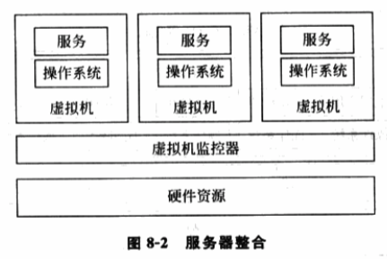
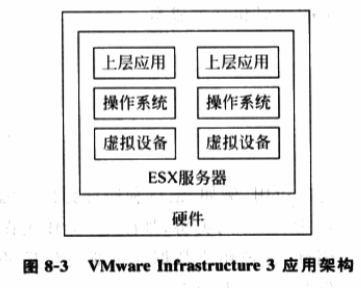
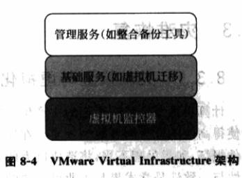
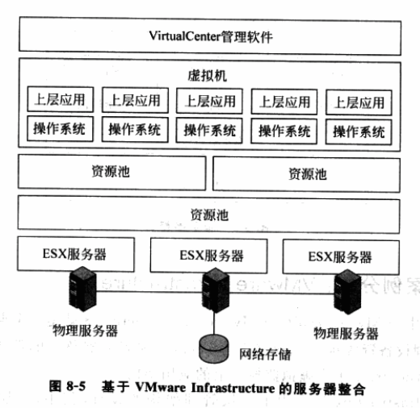

<!-- @import "[TOC]" {cmd="toc" depthFrom=1 depthTo=6 orderedList=false} -->

<!-- code_chunk_output -->

- [服务器整合技术](#服务器整合技术)
- [案例分析: VMware Infrastructure 3](#案例分析-vmware-infrastructure-3)

<!-- /code_chunk_output -->

# 服务器整合技术

服务种类越来越多, 例如传统的网站服务、邮箱服务, 抖索服务、地图服务等.

为避免不同服务之间的相互影响、相互干扰, **传统解决方案**是将**一个服务**装在**一个物理服务器**上. 这样, 为同时能提供多种服务, IT 部门不仅购买更多服务器, 还得准备大的实验室空间放置服务器, 还得安装更多网络接口、电源接口, 还必须配备相应的设备控制实验室环境, 例如气压、气温和湿度. 服务器运行成本高, 安装维护成本也高. 而且一般情况下, 没什么大量服务请求, 多数服务器在大部分时间里其 CPU 计算能力、网络带宽和存储空间处于空闲状态, 硬件利用率底下.

有些解决方案出于节省成本考虑, 采用共享策略共享硬件资源.

有些为增加鲁棒性、安全性和响应速度, 甚至将一个服务装在多个物理服务器上.

服务器整合的概念利用虚拟化技术, 在一台物理服务器或一套硬件资源上虚拟出多个虚拟机, 让不同服务运行在不同的虚拟机上, 不降低系统鲁棒性、安全性和可扩展性的同时, 提高硬件利用率和减少成本开销, 见图 8\-2.

# 案例分析: VMware Infrastructure 3

VMware Infrastructure 3 是一个典型的应用虚拟化技术, 将诸多物理设备资源虚拟化成多个虚拟机, 实现服务器整合的例子. 图 8\-3 所示为 VMware Infrastructure 3 单个虚拟监控上的应用架构.

VMware Infrastructure 3 采用了三层管理架构设计, 其中,

- 底层运行 VMM(ESX Server);
- 中间层提供了针对虚拟机集群的基础服务(例如动态负载均衡、虚拟机迁移等);
- 最上层提供了大量企业级应用的管理工具.

这种管理架构(如图 8\-4)极大降低了管理的复杂度, 提高了虚拟机监控器的工作效率.

VMware Infrastructure 不仅将诸多物理设备资源虚拟化成多个虚拟机, 实现服务器整合(图 8\-5), 还实现了高效的分布资源调度功能. 即, 它可以将网络上分布式服务器的硬件资源组织成资源池, 虚拟机建立在资源池上而不是某个特定的服务器上. 这样, 突破基于单机的虚拟机瓶颈, 最大可能地平衡分布式资源负载, 提高分布式服务器的利用率.

VMware 总结数据表明, 其服务器整合解决方案能:

1) 提高硬件利用率从 10% \~ 15%到 80%不等

2) 增加了系统的可管理性

3) 简化服务器安装过程, 节约时间达 50%\~70%

4) 减少 10 倍或更多的硬件购买需求, 节约一半的购买和维护成本