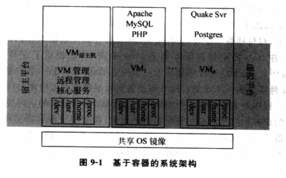
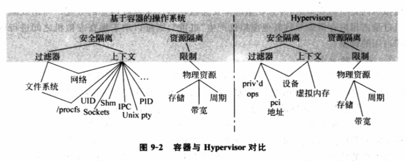

<!-- @import "[TOC]" {cmd="toc" depthFrom=1 depthTo=6 orderedList=false} -->

<!-- code_chunk_output -->

- [概述](#概述)
  - [操作系统的挑战](#操作系统的挑战)
- [容器技术的基本概念和发展背景](#容器技术的基本概念和发展背景)
  - [资源容器](#资源容器)
    - [资源主体与资源消费者: 资源的统计和控制很难](#资源主体与资源消费者-资源的统计和控制很难)
    - [延时处理机制: 进程与资源绑定](#延时处理机制-进程与资源绑定)
    - [资源容器: 资源容器与任务对应](#资源容器-资源容器与任务对应)
    - [基于容器的虚拟化技术: 资源主体和运行主体剥离](#基于容器的虚拟化技术-资源主体和运行主体剥离)
  - [安全容器](#安全容器)
- [基于容器的虚拟化技术](#基于容器的虚拟化技术)
  - [资源独立性](#资源独立性)
    - [CPU 分配](#cpu-分配)
    - [I/O 资源](#io-资源)
    - [硬盘和内存资源](#硬盘和内存资源)
  - [安全独立性](#安全独立性)

<!-- /code_chunk_output -->

# 概述

## 操作系统的挑战

**OS 领域**一直以来面临的一个**主要挑战**来自 **应用间存在的相互独立性** 和 **资源互操作性** 之间的矛盾, 即**每个应用程序**都希望能运行在一个**相对独立的系统环境**下, **不受其他程序的干扰**, 同时又能以方便快捷的方式**与其他程序交换和共享系统资源**.

虚拟化技术因其具有同时运行**多个相对独立操作系统**的能力而被用来克服上面挑战. VMware 和 Xen 等虚拟化主流产品均采用**Hypervisor 模型**. 该模型通过将应用程序运行在多个不同虚拟机内, 实现对上层应用程序的隔离. 但由于 Hypervisor 模型更倾向于**每个虚拟机**都拥有**一套相对独立的系统资源**, 提供**相对完全的独立性支持**, 这种策略造成处于**不同虚拟机内**的**应用程序间**实现**相互操作非常困难**. 例如, **同一台物理机**的**不同虚拟机**, 应用程序之间仍然只能通过**网络进行数据交换**, 而**非共享内存或文件**.

**Hypervisor 模型**这种**强独立性**保障策略在一定程度上**牺牲系统的执行效率**. 对于**高性能计算**、Web 服务、数据库、游戏平台和分布式系统等很多应用领域, 提供**高效的资源互操作性**和保持**程序间的独立性**具有同等重要的意义. 针对这种需求, 学术界提出了一种**基于资源与安全容器**概念的虚拟化技术. 应用**容器模型**的虚拟机化产品 Solaris 10 和 Linux\-Vsever, 能够满足**基本的独立性需求**的同时提供**高效的系统资源共享**支持.

# 容器技术的基本概念和发展背景

**容器技术**主要涉及两个方面: **资源容器**和**安全容器**.

## 资源容器

### 资源主体与资源消费者: 资源的统计和控制很难

当前比较流行的 **高性能服务器程序！！！** 通常是 **一个资源主体** 对应**多个资源消费者**的模式, 如事件触发模式(Event\-Driven), 或者是**多个资源主体**对应**多个资源消费者**的模式, 如 CGI 程序.

这造成准确**估算**出**单个资源消费者**所使用的**资源量**变的很困难, 从而无法很好地进行**资源管理和控制**.

例如, 在**多线程服务器**上, **一个应用实例**对应**一个**可以执行多种独立行为的**进程**, 这个**进程**拥有所有属于它的**资源**. 但在使用**线程**完成**单个任务**时, 其所使用的**资源**往往只是这个**进程所属资源**的一个**子集**. 由于对 **资源的控制粒度！！！** 只能细化到 **进程级别！！！**, 因此**不可能对单个线程**进行独立的**资源控制**. 而对需要**多线程协作**完成的任务进行**资源的统计和控制就更加难以实现**.

其它主要的限制来自于**资源控制范围**、**线程调度策略**和**任务涉及线程差异**等在内的多个方面. 例如, 系统**很少**对**网络资源**的使用进行**控制**, 必然造成对涉及网络使用的进程的资源统计数据的变差, 进而造成资源调度的不准确. 同样的, **线程调度**中的**中断抢占机制**会导致**计算线程运行时间的偏差**, 也会引发类似问题.

### 延时处理机制: 进程与资源绑定

学术界提出了**延时处理机制(Lazy Receiver Processing**), 将 **进程！！！** 视为完成**某个任务的核心**. 将**网络等资源的使用**与**进程联系起来**, 从而提高了**资源统计的精确度**.

但该机制仍然**无法彻底解决线程不是资源控制和统计单元(unit of resource**)的问题.

### 资源容器: 资源容器与任务对应

**资源容器**概念最早在 1999 年提出, 主要为了提高应用程序对系统资源的的控制和管理能力. **基于资源容器的系统**可以将系统中**资源主体(resource principal**)从**运行主体(即进程**)中剥离(process abstraction)出来, 从而达到**对系统资源**进行**更精确和高效控制**的目的.

作为**抽象的操作系统载体**, **资源容器**可以拥有**一个或多个进程**在完成**某个任务**过程中所使用的**所有资源**. 因此, 资源主体**不再静态地绑定到进程**. 进程及其产生的线程与资源主体的关系是**动态的、可调整的**. 甚至来自**多个不同进程的线程**也可以同时属于**一个资源容器**.

**资源容器**与**任务相对应！！！**, 记录下**任务在执行过程中**所消耗的**所有资源**, 包括**CPU、内存和网络**等. 这样就可以根据这些信息实现对资源的合理**调度和控制**. 资源容器通过引入**子资源容器**概念可以将**任务分解并归类**以**容器组**进行管理, 子资源依照一定规则实现资源共享, 提高灵活性.

### 基于容器的虚拟化技术: 资源主体和运行主体剥离

基于**容器的虚拟化技术**通过借鉴**资源容器的核心思想**, 将系统中的**资源主体**从**运行主体(即虚拟机**)中**剥离**, 从而达到在**虚拟化技术上**对**系统资源**进行**精确和高效控制**的目的. **虚拟机监控器**负责对 **系统中所有资源容器！！！** 进行**管理和控制**, 根据用户配置以及系统资源使用的实际情况进行合理分配和回收, 实现**跨虚拟机的进程间资源共享！！！**.

但这样的**资源控制机制**仍然存在安全隐患.

## 安全容器

克服资源共享带来的安全隐患的有效方法, 是采用一套**可靠的访问控制机制**来防止非法的资源共享.

**强制访问控制(Mandatory Access Controller, MAC**)是早期的访问控制机制, 它通过在**所有的系统对象**上添加有管理员制定的**安全策略**来限制正在执行的程序的访问权限, 从而阻止恶意程序破坏的传播.

该方法存在**很多限制**,

- 首先由于采用了**基于安全分级**的**安全机制**, 因此**只能**实现一些**普遍的安全策略**, 无法针对**单个程序**提出**不同的安全策略**;
- 其次, 它对**数据和程序的完整性**, 以及**程序的职能范围**无法进行有效地控制.

在此基础上, 研究者提出一种名为**Flask**的**MAC 架构**, 实现了将**安全策略逻辑**与**安全机制**的**分离**, 从而能够提供更便捷的安全策略设置和调整, 以满足**不同程序对安全策略的要求**.

**SELinux**则是在**MAC 机制**在 Linux 上的实现, 它涵盖了对**进程**、**文件**和**套接字**在内的**多种系统资源**的**访问控制**. 通过引入域、角色和类型等概念实现对安全策略的细化和精确定制.

**虚拟化技术**因其卓越的**进程和系统资源隔离能力**在发展初期就被用来实现对应用程序的访问控制. 将**应用程序**置于**相对独立的运行环境**中, 由**虚拟机监控器**依照制定的策略实现**程序间的访问控制**.

上面的访问控制机制的实现, 往往依赖 OS 本身的基于保障机密性和完整性的信息隔离机制. 但是, 这种信息隔离机制却可能被不法程序通过特殊手段绕过, 使得访问控制机制形同虚设, 而直接对上层应用程序进行篡改和攻击. 造成这种潜在威胁的根源在于**访问控制机制未能从操作系统中剥离出来**.

通过**对资源容器的借鉴**, 学术界提出安全容器概念. 核心思想在于将**访问控制机制**从 OS 中剥离出来**独立于运行环境**, 依据**不同的安全策略**形成**虚拟的安全容器**. 在资源容器的基础上, 对包括**系统进程**、**文件系统**、**网络和进程间通信等**在内的系统资源进行访问控制. 例如, Sun 的 Solaris 系统中, 提供了这样的访问控制支持(Solaris Zones). **每个应用程序**被置于一个**独立的运行环境**中, 各自拥有自己**独立的文件系统(整个文件系统的一个子集**), 网络和设备则根据需要虚拟出来, 进程间通信也被严格控制. 各个程序就像运行在一个安全的容器里面, 具有较强的访问控制能力.

**基于容器的虚拟化技术**借鉴了**安全容器**的思想, 在使用**资源容器**实现**资源共享**的基础上通过**安全容器技术**实现**对共享资源的有效访问控制**. 按**不同的安全对象**, 例如域、应用程序和虚拟机等分配不同的可访问资源形成虚拟的安全容器, 防止其他对象对其资源进行恶意的、未授权的访问.

# 基于容器的虚拟化技术

基于容器的系统需要一个**共享的虚拟操作系统镜像**. 镜像中包括一个**唯一的根文件系统**, 一系列**可执行的系统文件和库文件**, 以及其它建立虚拟机所需要的**资源**. 任意一个虚拟机都可以像单机的 OS 一样进行重启、关机等操作.

如图 9\-1, **基于容器的系统架构**由两个平台组成: **宿主平台**和**虚拟平台**.

**宿主平台**主要由**一个共享的操作系统镜像**和**一个特权级虚拟机**组成. 管理员通过**特权级虚拟机**对客户虚拟机进行**管理**.

**虚拟平台**由**若干客户虚拟机**组成, 在客户虚拟机平台上运行的程序与直接运行在物理机上的程序在行为上没有本质差别.

上面所述的一些**基于容器的系统**特性和**Hypervisor 模型下的虚拟机的系统**特性类似, 而它们的主要区别在于**实现程序独立性的方法**. 图 9\-2 给出了两者在安全独立性和资源独立性上的不同结构.

基于容器的系统在实现**安全独立性**时**直接使用了操作系统的内部对象**(如 PID、UID 等). 如何安全使用这些对象需要遵循以下两个要点: **命名空间的分开**; **控制访问**(如使用过滤器).

在实现"命名空间分开"上, **全局的标识符**保存在**完全不同的空间**内, 并且**各自的空间**都**不存在指针引用其他空间的对象**. 这样一来, **全局的标识符**就变成**各自虚拟机空间独立的标识符**.

对于"**控制访问**"的实现, 主要依靠**对虚拟机访问内核对象**权限进行**动态检查**.

在**Hypervisor 系统**中安全独立性的实现也是通过命名空间和访问控制来实现的, 但更多的是基于包括虚拟内存空间、PCI 总线地址和特权指令在内的硬件层. 基于容器的系统和基于 Hypervisor 模型的系统在资源独立性的实现上大致一致, 都需要将诸如 CPU 周期、I/O 带宽等物力资源进行虚拟产生多份虚拟资源.Hypervisor 系统比较有代表性的 Xen 虚拟机监控器系统和基于容器系统的 Linux\-VServer 系统都是通过苏主虚拟机来管理网络和硬盘 I/O 的, 两个系统的差别仅仅在于如何映射资源.

下面以 Linux\-VServer 为例, 具体介绍资源独立性和安全独立性等问题

## 资源独立性

**资源的独立性**主要由**CPU 分配**、**I/O 分配**和**储存分配**三部分组成. 无论哪种资源的分配, 公平性总是首先被考虑的, 这是资源独立性的核心. 当然, 如何高效利用资源避免浪费也是一个需要考虑的因素. 不同的系统会有不同的实现, 但是其遵循的原则是类似的.

Linux-Vserver 的 CPU 分配、I/O 分配和储存分配根据以下原则实现.

### CPU 分配

Linux\-Vserver 的 CPU 分配是在**优先级的基础**上公平分配 CPU 资源. 具体方法是在标准 Linux 调度器上添加标记过滤器(Token Bucket Filter, TBF), 然后为每个虚拟机设定运行级别来限定其占用的事件, 即标记(Token), 级别高的标记值就相对较高. 当虚拟机占用 CPU 运行该虚拟机上的进程时, 它所拥有的标记值就会持续减少. 当某个虚拟机的标记值降为 0 时, 它的进程就会从可执行队列里面去除, 直到它再次获得足够的标记量以重返可执行队列. 每个虚拟机

### I/O 资源

Linux\-Vserver 同样也用基于标记的方法来分配 I/O 资源. 在网络 I/O 资源的使用上, 每个虚拟机的标记同样需要设定"预定"和共享"剩余 I/O 资源"两个属性. 遵循类似于

### 硬盘和内存资源

## 安全独立性

