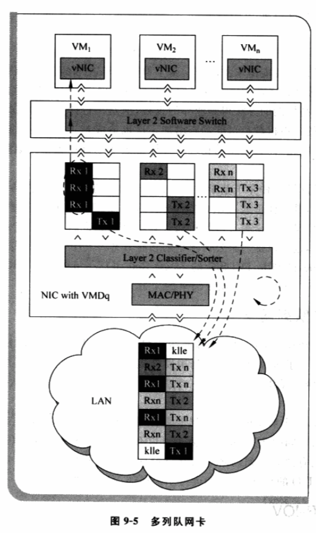
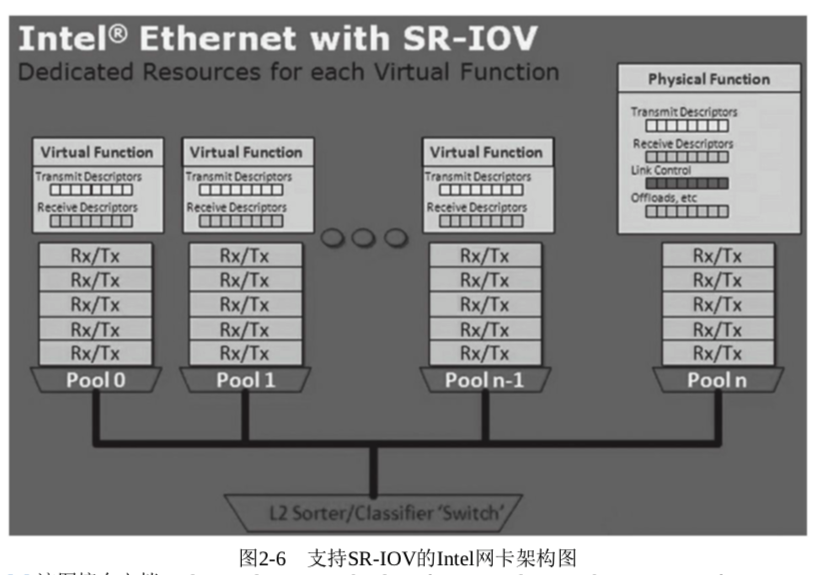
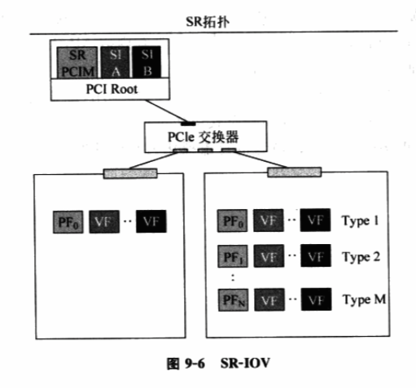

<!-- @import "[TOC]" {cmd="toc" depthFrom=1 depthTo=6 orderedList=false} -->

<!-- code_chunk_output -->

- [0 概述](#0-概述)
- [1 多队列网卡](#1-多队列网卡)
- [2 SR-IOV](#2-sr-iov)
- [3 其它](#3-其它)

<!-- /code_chunk_output -->

# 0 概述

I/O 设备的性能是影响虚拟化方案性能的一个重要因素, 尤其是网络设备和存储设备. 由于数据中心中的存储设备往往也是通过网络共享, 如 SAN 和 iSCSI 等, 因此**I/O 设备**的**性能问题**也就**主要是网络设备**的性能问题, **智能设备也主要指网络智能设备**.

**传统的基于软件的设备共享方案**由**虚拟机监控器**为**上层虚拟机**提供**虚拟的 I/O 设备**, 如**基于设备模型的完全虚拟化仿真设备**和**采用前后端分离设备模型的类虚拟化**. 基于软件的设备模型都是通过虚拟机监控器对客户机 I/O 操作的介入来实现将物理资源在多台客户机间实现共享, 如对仿真设备 I/O 读写的捕捉和仿真, 以及对分离式设备中 I/O 读写的递推等.

由于**存在虚拟机监控器的介入**, **基于软件的设备共享**必定会对系统的**整体性能**产生负面的影响, 例如

- Xen 虚拟化平台上基于仿真的 Intel E1000 网卡的传输带宽性能大概只有真是硬件能力的十几分之一;
- 类虚拟化下的虚拟网络设备的性能通常较仿真设备要好, 但对**万兆网卡也只能最多达 1/3**, 并且这是牺牲大量 CPU 资源情况下取得的.

随着万兆网设备的普及以及数据中心对高速网络的需求, 基于软件的设备共享方法面临难以满足用户对设备性能需求的问题. 基于**IOMMU 技术**的**完全硬件设备共享方案**, 如 Intel VT\-d 技术, 通过直接在**物理硬件层面**进行**设备虚拟**, 并将虚拟产生的 PCI 设备直接赋给客户机从而获得高性能的方法得到业界重视, 但是一台计算机中**可插入的 PCI 设备数目有限**, 而支持的虚拟机数目可能动态增加. 这也造成基于完全硬件的设备共享方案面临系统的**可扩展性问题**, 而且使用的物理硬件设备数量也直接关系到数据中心的建设和运转成本.

**智能设备**就是这样一种介于**基于软件的设备共享**和**基于完全硬件的设备共享**方案之间的**混合型解决方案**, 其具体形式可以有多种多样, 但他们都具有利用**在硬件功能减少虚拟机监控器介入**的同时, 又**不完全摒弃虚拟机监控器辅助**的共同特点.

智能设备可以是**基于公开的工业规范实现**, 也可以是一家**公司独享的私有方案**. 其中, 比较有代表性的实现有使用**多队列(Multi Queue)的网卡**、**PCI SIG**的 Single Root IO Virtualization(**SR\-IOV**)和 SolarFlare 公司的 10G 网卡等.

# 1 多队列网卡

**多队列技术**已经在今天的原生操作系统得到广泛应用, 如**Linux**操作系统在 2.6.24 版本的内核中就引入了该项技术. 它利用**硬件！！！提供的多个网络包发送队列！！！和接受队列！！！特性**, 将**重要进程的网络操作！！！** 直接**绑定到一个或多个网络包处理队列！！！** 上, 从而由硬件保证网络带宽.

如图 9\-5, 一个典型的**多队列网卡**具有**硬件网络包分发功能！！！**, 可以基于**不同的策略**将收到的**包**分发给**不同的队列**, **每个队列！！！**可以有**独立的 DMA 引擎！！！**, 以及**独立的中断资源！！！**. 这意味着拥有**独立队列**的**客户机**在**网络包处理过程中**可以**减少虚拟机监控器的介入**, 从而实现网络 I/O 的高性能, 例如 Intel 的 VMDq 网卡.

# 2 SR-IOV

PCI SIG 制定了由 PCIe 设备硬件支持的 I/O 虚拟化方案(`I/O Virtualization`, IOV). IOV 分为单根 PCI 桥 IOV(`Single Root IOV`, `SR-IOV`)和多根 PCI 桥 IOV(`Multi-Root IOV`, `MR-IOV`). SR\-IOV 的 1.0 标准已经发布.

支持 `SR-IOV` 的设备硬件具有**一个或多个物理功能模块**(Physical Function, PF)如图, **每个功能模块**可以有**一个或多个虚拟功能模块**(Virtual Funciton, VF)与之关联.

在 SR\-IOV 中, **每个 VF！！！** 都具有**独立！！！的运行所需要的资源**, 如**中断寄存器**、**DMA 引擎**和 **I/O 寄存器**等, 并且可以**被绑定到指定的客户机**.

**一个虚拟功能模块**对客户机来说就如同一个传统的**PCIe 设备**, 具有一个 PCI 总线中**唯一的 BDF 识别号**, 这也是虚拟功能模块上 DMA 操作时硬件用来作为向 PCIe 总线发送访问请求时的识别号.

**客户机**可以访问**虚拟功能模块的 PCI 配置空间**, 但是不同于基于完全硬件的 PCI 设备共享, 对**虚拟功能模块的 PCI 配置空间访问**必须存在**虚拟监控器的介入！！！**. 因为

- 虚拟功能模块的 PCI 配置空间中的寄存器一部分可以**直接来自物理功能模块！！！**, 且为**防止虚拟功能模块间**在设置上的**相互干扰**, 这些寄存器一般被**设置为只读**;
- 而**另一部分寄存器**可以完全由**虚拟机监控器辅助仿真实现**.

在 SRIOV 中, 物理功能模块用来控制跟物理设备相关的全局操作, 如链路控制、复位等.

为减少 **DMA 运行时虚拟机监控器的介入**, `SR-IOV` 设备需要进行地址转换, 将**客户机驱动程序！！！** 设置的**客户机物理地址！！！** 转换成**主机物理地址！！！**, 这一点与**基于完全硬件的设备共享**方案相同, 使用 **IOMMU！！！** 完成.

为更好支持 SRIOV 设备的地址转换, PCIe 规范还增加了**由设备本身进行地址转换！！！** 的支持, 这可以提高**虚拟功能模块与虚拟功能模块间**, 或者**虚拟功能模块与其他 PCIe 设备间**访问的效率, 使**设备之间的访问！！！不需要由 IOMMU 完成**.

另外, 这种在**PCIe 设备上的内嵌 TLB 地址转换**, 可以**减少对 IOMMU 上 TLB 的压力**, 从而进一步提高效率.

不同于多队列设备, SRIOV 设备的**DMA 操作**可以由**IOMMU**或**设备内嵌 TLB**实现直接内存访问而**不需要虚拟机监控器的介入**. 因此, SRIOV 设备具有比多队列设备更好地性能. 绑定到 SRIOV 设备上虚拟功能模块的客户机可以获得与绑定到基于完全硬件的共享设备的客户机在运行时接近的性能, 因为它们在运行时都不需要虚拟机监控器的介入. 两种方案间的不同主要表现在初始化及控制方式上, 绑定到虚拟功能模块的客户机不能直接访问 PCI 配置空间, 需要虚拟机监控器和物理功能模块等介入. 一个 SRIOV 的设备, 可以具有成百上千个虚拟功能模块, 因此比起基于完全硬件的方法具有更好地可扩展性.

# 3 其它

