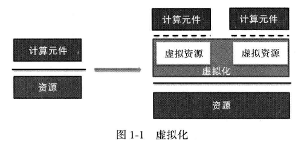
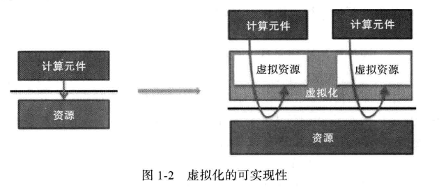
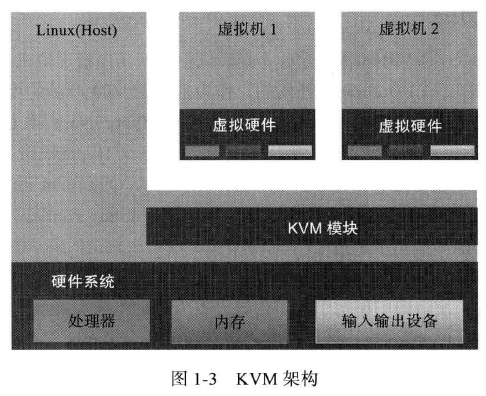
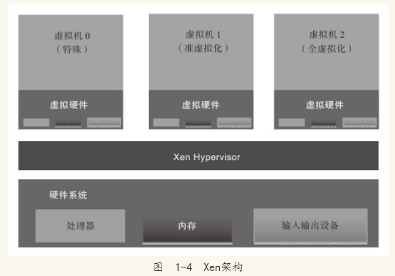

```
第1章　虚拟化与云计算
1.1　云计算概念
1.1.1　发展历史和现状
1.1.2　概念
1.1.3　云计算模式: SaaS,PaaS,IaaS

1.2　云计算技术
1.2.1　Map/Reduce
1.2.2　资源管理平台,CloudStack,VMware,OpenStack
1.2.3　虚拟化

1.3　虚拟化技术
1.3.1　软件虚拟化和硬件虚拟化(软件虚拟化Qemu,硬件VMM)
1.3.2　准虚拟化与全虚拟化(准Xen)
1.4　KVM简介
1.4.1　KVM的历史——内核虚拟机
1.4.2　KVM功能概览, 基本架构, 内存管理, 存储, 设备驱动程序, 性能简介
1.4.3　KVM的前景
1.5　Xen简介
1.5.1　Xen的历史——架构简介, 微内核
1.5.2　Xen功能概览
1.5.3　Xen的前景

1.6　其他虚拟化方案简介
1.6.1　VMware
1.6.2　VirtualBox
1.6.3　Hyper-V
```

1.1 云计算概念

云计算是Google前首席执行官埃里克·施密特(Eric Schmidt)在2006年8月9日的搜索引擎大会首次提出. 

目前, 云计算的主要服务形式有: SaaS(Software as a Service, 软件即服务), PaaS(Platform as a Service, 平台即服务)和IaaS(Infrastructure as a Service, 基础设施即服务). 

1.2 云计算技术

1.2.1 Map/Reduce

Map/Reduce是Google开发的编程模型, 它是一种简化的分布式编程模型和高效的任务调度模型, 用于大规模数据集(大于1TB)的并行计算. Map/Reduce模式的思想是将要执行的问题分解为Map(映射)和Reduce(化简)的方式, 先通过Map程序将数据切割成不相关的区块, 分配(调度)给大量计算机处理, 达到分布式运算的效果, 再通过Reduce程序将结果汇总输出. 

Map/Reduce编程模型适用于很多应用, 例如, 分布式搜索、分布式排序、机器学习、基于统计的机器翻译等. 在Google公司, 互联网网页的搜索索引也是用Map/Reduce技术计算生成的. 

Map/Reduce目前已经有基于各种不同计算机编程语言的库实现, 其中有名的是Apache基金会的用Java开发的开源Hadoop. 

1.2.2 资源管理平台

思杰的CloudStack、开源的Eucalyptus、VMware的vCoud Director和开源的OpenStack. 

1.2.3 虚拟化

云计算的云端系统, 其实质是一个大型的分布式系统. 虚拟化通过在一个物理平台上虚拟出更多的虚拟平台, 而其中的每个虚拟平台则可以作为独立的终端加入云端的分布式系统. 

1.3 虚拟化技术

虚拟化指的是计算元件在虚拟的基础上而不是真实的基础上运行, 是一个为了简化管理、优化资源的解决方案. 

虚拟化技术, 通过引入一个新的虚拟化层, 对下管理真实的物理资源, 对上提供虚拟的系统资源, 从而实现了在扩大硬件容量的同时, 简化软件的重新配置过程. 



在实际应用中, 图中的资源可以表现为各种各样的形式. 例如, 如果把操作系统及其的系统调用作为资源, 那么虚拟化就表现为操作系统虚拟化. Linux容器虚拟化技术就是在同样的一份Linux操作系统之上, 虚拟出多个同样的操作系统. 再比如, 如果把整个X86平台包括处理器、内存和外设作为资源, 那么对应的虚拟化技术就是平台虚拟化, 在同一个X86平台上面, 可以虚拟多个X86平台, 每个虚拟平台都可以运行自己独立完整的操作系统. 这也是本书重点讨论的虚拟化技术. 

在X86平台虚拟化技术中, 新引入的虚拟化层通常称为虚拟机监控器(Virtual Machine Monitor, VMM), 也叫做Hypervisor. 虚拟机监控器运行的环境, 也就是真实的物理平台, 称为宿主机. 而虚拟出来的平台称为客户机, 里面运行的系统对应称为客户机操作系统. 

虚拟化技术有很多实现方式, 比如软件虚拟化和硬件虚拟化, 再比如比如准虚拟化和全虚拟化. 

1.3.1 软件虚拟化和硬件虚拟化

既然虚拟化这么美好, 是不是物理资源都可以被虚拟化?

如下图所示, 实现虚拟化的重要一步就在于, 虚拟化层必须能够截获计算元件对物理资源的直接访问, 并将其重新定向到虚拟资源池中. 根据虚拟化层是通过纯软件的方法, 还是利用物理资源提供的机制来实现这种"截获并重定向", 我们可以把虚拟化划分为软件虚拟化和硬件虚拟化两种. 



1. 虚拟化 ---- 软件方案

用纯软件的方法在现有的物理平台上(往往并不支持硬件虚拟化)实现对物理平台访问的截获和模拟. 

常见软件虚拟机例如QEMU, 是通过纯软件仿真X86平台处理器的取指、解码和执行, 客户机的指令并不在物理平台上直接运行. 所有指令软件模拟, 所以性能往往较差, 但是可以在同一平台上模拟不同架构平台的虚拟机. 

VMWare的软件虚拟化则使用了动态二进制翻译的技术. 虚拟机监控机在可控制的范围内, 允许客户机的指令在物理平台上直接运行. 但是, 客户机指令在运行前会被虚拟机监控机扫描, 其中突破虚拟机监控机限制的指令会被动态替换成可以在物理平台上直接运行的安全指令, 或者替换为对虚拟机监控器的软件调用. 这样好处在于比纯软件模拟性能能有大幅提升, 但也失去了跨平台虚拟化的能力. 

在纯软件虚拟化解决方案中, VMM在软件套件中的位置是传统意义上操作系统所处的位置, 而操作系统的位置是传统意义上应用程序所处的位置, 这种转换必然会增加系统的复杂性. 

2. 虚拟化 ---- 硬件方案

物理平台本身提供了对特殊指令的截获和重定向的硬件支持. 甚至, 新的硬件会提供额外的资源来帮助软件实现对关键硬件资源的虚拟化, 从而提升性能. 

以x86平台的虚拟化为例, 支持虚拟技术的X86 CPU带有特别优化过的指令集来控制模拟过程, 通过这些指令集, VMM会很容易将客户机置于一种受限制的模式下运行, 一旦客户机试图访问物理资源, 硬件会暂停客户机的运行, 将控制权交回给VMM处理. VMM可以将客户机在受限模式下对一些特殊资源的访问完全由硬件重定向到VMM指定的虚拟资源. 整个过程不需要暂停客户机的运行和VMM软件的参与. 

由于虚拟化硬件可提供全新的架构, 支持操作系统直接在其上运行, 无需进行二进制转码, 减少了相关的性能开销, 极大简化了VMM的设计, 进而使得VMM能够按照通用标准进行编写, 性能更加强大. 

硬件虚拟化技术是一套解决方案. 完整的情况需要CPU、主板芯片组、BIOS和软件的支持. 

Intel有自己的Intel Virtualization Technology(IntelVT)虚拟化技术, Intel一直保持在每一代新的处理器架构中优化硬件虚拟化的性能和增加新的虚拟化技术. 

1.3.2 准虚拟化和全虚拟化

1. 准虚拟化(para-virtualization)

软件虚拟化可以在缺乏硬件虚拟化支持的平台上完全通过VMM软件实现对各个虚拟机的监控, 以保证它们之间彼此独立和隔离. 付出的代价就是软件复杂度的增加和性能上的损失. 减轻这种负担的一种方法就是改动客户操作系统, 使它以为自己运行在虚拟环境下, 能够与虚拟机监控机协同工作. 该方法叫准虚拟化, 也叫半虚拟化. 本质上, 准虚拟化弱化了对虚拟机特殊指令的被动截获要求, 将其转换成客户机操作系统的主动通知. 但是, 准虚拟化需要修改客户机的操作系统的源代码来实现主动通知. 

Xen是准虚拟化的一个例子, 它适用于Linux这样的开源操作系统, 而不适合于Windows这样的闭源操作系统. 

2. 全虚拟化(full virtualization)

全虚拟化为客户机提供了完整的虚拟X86平台, 包括处理器、内存和外设, 支持运行任何理论上可在真实物理平台上运行的操作系统. 不需要对客户机操作系统进行任何修改. 基于硬件的全虚拟化产品将是未来虚拟化技术的核心. 

1.4 KVM简介

1.4.1 KVM的历史

KVM全称Kernel Virtual Machine, 即内核虚拟机. KVM的开发人员并不是从底层开始新写一个Hypervisor, 而是选择了基于linux Kernel, 通过加载新的模块而使Linux Kernel变身成为一个Hypervisor. 

2006年10月, 以色列公司Qumranet宣布KVM的诞生, 同年10月被正式接纳进Linux Kernel. 2008年9月4日, Redhat收购Qumranet. 2010年11月, Redhat推出企业版Linux ---- RHEL 6, 里面集成了最新的KVM虚拟机, 而去掉了在RHEL 5.x系列中集成的Xen. 

1.4.2 KVM功能概览

KVM是基于虚拟化扩展(Intel VT或AMD-V)的X86硬件, 是Linux原生的全虚拟化解决方案. 

KVM目前设计为通过可加载的内核模块, 支持广泛的客户机操作系统, 包括Windows.

在KVM架构中, 虚拟机实现为常规的Linux进程, 由标准Linux调度程序进行调度. 事实上, 每个虚拟CPU显示为一个常规的Linux进程. 这使得KVM可以享受Linux内核的所有功能. 

KVM本身不执行任何模拟, 需要用户空间程序通过/dev/kvm接口设置一个客户机虚拟服务器的地址空间, 向它提供模拟的I/O, 并将它的视频显示映射回宿主的显示屏. 这个应用程序(注: 上述的"用户空间程序")就是大名鼎鼎的QEMU.

下图是KVM的基本架构



下面介绍一下KVM的功能特性. 

(1)内存管理

KVM从Linux继承了强大的内存管理功能. 一个虚拟机的内存与任何其他Linux进程的内存一样进行存储, 可以以大页面的形式进行交换以实现更高的性能, 也可以以磁盘文件的形式进行共享. NUMA支持(非一致性内存访问, 针对多处理器的内存设计)允许虚拟机有效地访问大量内存. 
KVM支持最新的基于硬件的内存虚拟化功能, 支持Intel的扩展页表(EPT)和AMD的嵌套页表(NPT, 也叫"快速虚拟化索引-RVI"), 以实现更低的CPU利用率和更高的吞吐量. 

内存页面共享通过一项名为内核同页合并(Kernel Same-page Merging, KSM)的内核功能来支持. KSM扫描每个虚拟机的内存, 如果虚拟机拥有相同的内存页面, KSM将这些页面合并到一个在虚拟机之间共享的页面, 仅存储一个副本. 如果一个客户机尝试更改这个共享页面, 它将得到自己的专用副本. 

(2)存储

KVM能够使用Linux支持的任何存储来存储虚拟机镜像, 包括具有IDE、SCSI和SATA的本地磁盘, 网络附加存储(NAS)(包括NFS和SAMBA/CIFS), 或者支持iSCSI和光纤通道的SAN. 多路径I/O可用于改进存储吞吐量和提供冗余. 由于KVM是Linux内核的一部分, 它可以利用所有领先存储供应商都支持的一种成熟且可靠的存储基础架构, 它的存储堆栈在生产部署方面具有良好的记录. 

KVM还支持全局文件系统(GFS2)等共享文件系统上的虚拟机镜像, 以允许虚拟机镜像在多个宿主之间共享或使用逻辑卷共享. 磁盘镜像支持按需分配, 仅在虚拟机需要时分配存储空间, 而不是提前分配整个存储空间, 提高存储利用率. KVM的原生磁盘格式为QCOW2, 它支持快照, 允许多级快照、压缩和加密. 

(3)设备驱动程序

KVM支持混合虚拟化, 其中准虚拟化的驱动程序安装在客户机操作系统中, 允许虚拟机使用优化的I/O接口而不使用模拟的设备, 从而为网络和块设备提供高性能的I/O. KVM准虚拟化的驱动程序使用IBM和Red Hat联合Linux社区开发的VirtIO标准, 它是一个与虚拟机管理程序独立的、构建设备驱动程序的接口, 允许为多个虚拟机管理程序使用一组相同的设备驱动程序, 能够实现更出色的虚拟机交互性. 

(4)性能和可伸缩性

KVM也继承了Linux的性能和可伸缩性. KVM虚拟化性能在很多方面(如计算能力、网络带宽等)已经可以达到非虚拟化原生环境的95%以上的性能. KVM的扩展性也非常良好, 客户机和宿主机都可以支持非常多的CPU数量和非常大量的内存. 例如, Redhat官方文档[注释]就介绍过, RHEL 6.x系统中的一个KVM客户机可以支持160个虚拟CPU和多达2TB的内存, KVM宿主机支持4096个CPU核心和多达64TB的内存. 

1.5 Xen的简介

1.5.1 Xen的历史

早在20世纪90年代, 伦敦剑桥大学的Ian Pratt和Keir Fraser在一个叫做Xenoserver的研究项目中, 开发了Xen虚拟机. 作为Xenoserver的核心, Xen虚拟机负责管理和分配系统资源, 并提供必要的统计功能. 在那个年代, X86的处理器还不具备对虚拟化技术的硬件支持, 所以Xen从一开始是作为一个准虚拟化的解决方案出现的. 因此, 为了支持多个虚拟机, 内核必须针对Xen做出特殊的修改才可以运行. 2004年, Intel的工程师开始为Xen添加硬件虚拟化的支持, 从而为即将上市的新款处理器做必需的软件准备. 在他们的努力下, 2005年发布的Xen 3.0, 开始正式支持Intel的VT技术和IA64架构, 从而Xen虚拟机可以运行完全没有修改的操作系统. 

1.5.2 Xen功能概览

Xen是一个直接在系统硬件上运行的虚拟机管理程序. Xen在系统硬件与虚拟机之间插入一个虚拟化层, 将系统硬件转换为一个逻辑计算资源池, Xen可将其中的资源动态地分配给任何操作系统或应用程序. 在虚拟机中运行的操作系统能够与虚拟资源交互, 就好像它们是物理资源一样. 

下图显示了一个运行虚拟机的Xen系统

