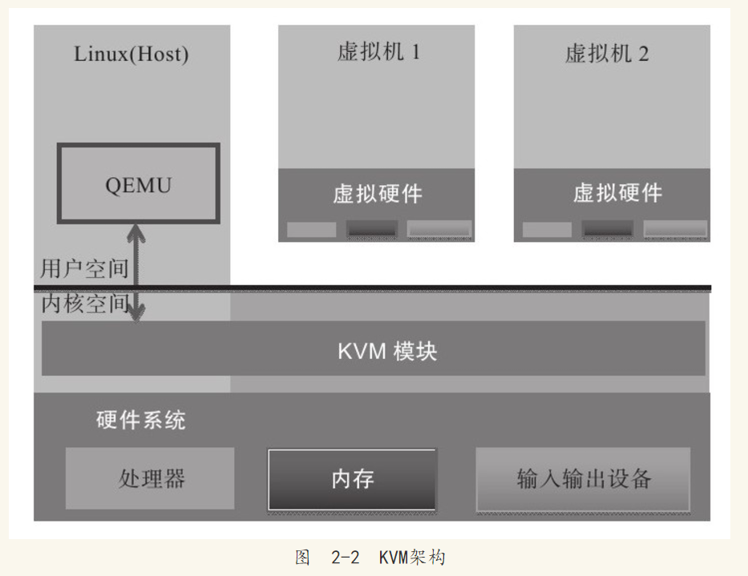
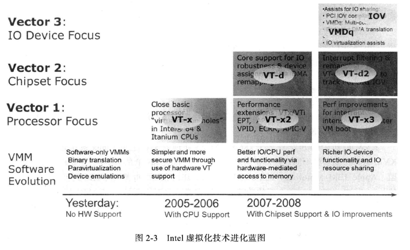

```
第2章　KVM原理简介
2.1　Linux操作系统简介——微内核(Xen)和单内核(KVM)设计
2.2　虚拟化模型,(底层是物理机, 上层是一个虚拟机监控器(VMM, Hypervisor), 非操作系统, 上层为真正的虚拟机OS)
2.3　KVM架构
      类型一: 虚拟机监控器, Xen,VMWare ESX/ESXi  , Hyper-V
      类型二: 虚拟机监控程序, KVM , VMware Workstation,VirtualBox, 为单内核结构
2.4　KVM模块
    CPU虚拟化, 内存虚拟化, 浅
2.5　QEMU设备模型
2.6　Intel虚拟化技术
```

1. Linux简介

操作系统内核设计一直分为两个阵营: 微内核和单内核. 

单内核是两大阵营中一种较为简单的设计, 指的是整个内核从整体上作为一个单独的大过程来实现, 并且同时运行在一个单独的地址空间内. 所有的内核服务都在这样一个大的内核空间运行, 内核之间的通信可以简单地实现为函数调用. 这样的设计具有简单高效的特点. 但是, 如果使用单内核设计, 每次对内核作出修改(比如增加或者删除驱动程序), 都必须重新编译源代码, 生成新的二进制文件, 造成了使用和部署上的麻烦. 

微内核并不是作为一个单独的大过程来实现的, 相反, 内核的功能被划分成为多个独立的过程, 每一个过程叫做一个服务器. 多个服务器程序都运行在自己的地址空间, 只有少量核心的服务器运行在特权模式下, 服务器之间的通信采用了进程间通信机制. 独立的服务器进程提高系统的健壮性, 但是进程间通信由于涉及内核空间和用户空间的上下文切换, 其开销远比函数调用大得多. 

Linux采用了实用主义的设计. 为了满足性能要求, Linux内核被设计成单内核. 但是, Linux内核同时借鉴了微内核的精华: 模块化设计以及动态装载内核模块的能力. 除了诸如进程切换、内存管理等核心的内核功能, 将大部分内核功能作为单独的内核模块设计并实现. 这些内核模块编译好后以单独的二进制文件的形式存在, 内核在运行过程中, 按照需求, 动态地加载并链接进入内核空间运行. 不使用的模块还可以在运行的过程中动态卸载. 例如, KVM就是以内核模块的形式存在, 为Linux内核增加了虚拟化的功能. 

2. 虚拟化模型

从本节开始, 使用"虚拟化"一词时, 如果没有特殊说明, 都是指X86平台的虚拟化. 

下图是基本的虚拟化模型. 


一个X86平台的核心是其中的处理器, 处理器运行程序代码, 访问内存和输入输出设备. 所以, X86平台虚拟化技术的核心部分是处理器的虚拟化. 只要处理器虚拟化技术支持"截获并重定向", 内存和输入输出设备的虚拟化都可以基于处理器虚拟化技术之上实现. 在处理器虚拟化技术的基础上, 为了增强虚拟机的性能, 内存虚拟化和IO虚拟化的新技术也不断被加入到X86平台虚拟化技术中. X86平台虚拟化技术从开始单一的处理器开始, 逐步牵涉芯片组、网卡、存储设备以及GPU的虚拟化. 

3 KVM架构

从虚拟机的基本架构上区分, 虚拟机一般分为两种, 我们称为类型一和类型二. 

"类型一"虚拟机是在系统上电之后首先加载运行虚拟机监控程序, 而传统的操作系统则是运行在其创建的虚拟机中. 类型一的虚拟机监控程序, 从某种意义上说, 可以视为一个特别为虚拟机而优化裁剪的操作系统内核. 因为, 虚拟机监控程序作为运行在底层的软件层, 必须实现诸如系统的初始化、物理资源的管理等操作系统的职能; 它对虚拟机的创建、调度和管理, 与操作系统对进程的创建、调度和管理有共通之处. 这一类型的虚拟机监控程序一般会提供一个具有一定特权的特殊虚拟机, 由这个特殊虚拟机来运行需要提供给用户日常操作和管理使用的操作系统环境. 著名的开源虚拟化软件Xen、商业软件VMware ESX/ESXi和微软的Hyper-V就是"类型一"虚拟机的代表. 

"类型二"虚拟机监控程序, 在系统上电之后仍然运行一般意义上的操作系统(也就是俗称的宿主机操作系统), 虚拟机监控程序作为特殊的应用程序, 可以视作操作系统功能的扩展. 对于"类型二"的虚拟机来说, 其最大的优势在于可以充分利用现有的操作系统. 因为虚拟机监控程序通常不必自己实现物理资源的管理和调度算法, 所以实现起来比较简洁. 但是, 正所谓"成也萧何, 败也萧何", 这一类型的虚拟机监控程序既然依赖操作系统来实现管理和调度, 就同样也会受到宿主操作系统的一些限制. 例如, 通常无法仅仅为了虚拟机的优化, 而对操作系统作出修改. 本书的主角KVM就是属于"类型二"虚拟机, 另外, VMware Workstation、VirtualBox也是属于"类型二"虚拟机. 

下图是KVM的基本架构. 



KVM架构遵循了实用至上的Linux设计哲学, 既然类型二的虚拟机是最简洁和容易实现的虚拟机监控程序, 那么就通过内核模块的形式实现出来就好. 其他的部分则尽可能充分利用Linux内核的既有实现, 最大限度地重用代码. 

图中, 左侧部分是一个标准的Linux操作系统, 可以是RHEL、Fedora、Ubuntu等. KVM内核模块在运行时按需加载进入内核空间运行. KVM本身不执行任何设备模拟, 需要用户空间程序QEMU通过/dev/kvm接口设置一个虚拟客户机的地址空间, 向它提供模拟的I/O设备, 并将它的视频显示映射回宿主机的显示屏. 

4. KVM模块

KVM模块是KVM虚拟机的核心部分. 其主要功能是初始化CPU硬件, 打开虚拟化模式, 然后将虚拟客户机运行在虚拟机模式下, 并对虚拟客户机的运行提供一定的支持. 

为了软件的简洁与性能, KVM仅支持硬件虚拟化. 自然而然, 打开并初始化系统硬件以支持虚拟机的运行, 是KVM模块的职责所在. 以KVM在Intel公司的CPU上运行为例, 在被内核加载的时候, (1)**KVM模块会先初始化内部的数据结构**; 做好准备之后, KVM模块检测系统当前的CPU, 然后打开(2)**CPU控制寄存器CR4中的虚拟化模式开关**, 并通过执行VMXON指令将**宿主操作系统(包括KVM模块本身)置于虚拟化模式中的根模式**; 最后, KVM模块(3)**创建特殊设备文件/dev/kvm并等待来自用户空间的命令**. 接下来虚拟机的创建和运行将是一个用户空间的应用程序(QEMU)和KVM模块相互配合的过程. 

KVM模块与用户空间QEMU的通信接口主要是一系列针对特殊设备文件的IOCTL调用. 

KVM模块加载之初, 只存在/dev/kvm文件, 而针对该文件的最重要的IOCTL调用就是"创建虚拟机". 在这里, "创建虚拟机"可以理解成KVM为了某个特定的虚拟客户机(用户空间程序创建并初始化)创建对应的内核数据结构. 同时, KVM还会返回一个文件句柄来代表所创建的虚拟机. 针对该文件句柄的IOCTL调用可以对虚拟机做相应的管理, 比如创建用户空间虚拟地址和客户机物理地址及真实内存物理地址的映射关系, 再比如创建多个可供运行的虚拟处理器(vCPU). 同样, KVM模块会为每一个创建出来的虚拟处理器生成对应的文件句柄, 对虚拟处理器相应的文件句柄进行相应的IOCTL调用, 就可以对虚拟处理器进行管理. 

针对虚拟处理器的最重要的IOCTL调用就是"执行虚拟处理器". 通过它, 用户空间准备好的虚拟机在KVM模块的支持下, 被置于虚拟化模式中的非根模式下, 开始执行二进制指令. 在非根模式下, 所有敏感的二进制指令都会被处理器捕捉到, 处理器在保存现场之后自动切换到根模式, 由KVM决定如何进一步处理(要么由KVM模块直接处理, 要么返回用户空间交由用户空间程序处理). 

除了处理器的虚拟化, 内存虚拟化也是由KVM模块实现的. 

内存虚拟化往往是一个虚拟机实现中代码量最大、实现最复杂的部分(至少, 在硬件支持二维地址翻译之前是这样的). 众所周知, 处理器中的内存管理单元(MMU)是通过页表的形式将程序运行的虚拟地址转换成为物理内存地址. 在虚拟机模式下, 内存管理单元的页表则必须在一次查询的时候完成两次地址转换. 这是因为, 除了要将客户机程序的虚拟地址转换成为客户机物理地址以外, 还必须将客户机物理地址转换成为真实物理地址. KVM模块开始使用了影子页表的技术来解决这个问题: 在客户机运行时候, 处理器真正使用的页表并不是客户机操作系统维护的页表, 而是KVM模块根据这个页表维护的另外一套影子页表. 

影子页表实现复杂, 而且有时候开销很大. 为了解决这个问题, 新的处理器在硬件上做了增强(Intel的EPT技术). 通过引入第二级页表来描述客户机虚拟地址和真实物理地址的转换, 硬件可以自动进行两级转换生成正确的内存访问地址. KVM模块将其称为二维分页机制. 

处理器对设备的访问主要是通过IO指令和MMIO, 其中IO指令会被处理器直接截获, MMIO会通过配置内存虚拟化来捕捉. 但是, 外设的模拟一般并不由KVM模块负责. 一般来说, 只有对性能要求比较高的虚拟设备才会由KVM内核模块来直接负责, 比如虚拟中断控制器和虚拟时钟, 这样可以大量减少处理器的模式切换的开销. 大部分的输入输出设备还是会交给下一节将要介绍的用户态程序QEMU来负责. 

5. QEMU设备模型

QEMU本身并不是KVM的一部分, 其自身就是一个著名的开源虚拟机软件. 与KVM不同, QEMU虚拟机是一个纯软件的实现, 所以性能低下. 但是, 其优点是在支持QEMU本身编译运行的平台上就可以实现虚拟机的功能, 甚至虚拟机可以与宿主机并不是同一个架构. 作为一个存在已久的虚拟机, QEMU的代码中有整套的虚拟机实现, 包括处理器虚拟化、内存虚拟化, 以及KVM使用到的虚拟设备模拟(比如网卡、显卡、存储控制器和硬盘等). 

KVM在QEMU的基础上进行了修改. 虚拟机运行期间, QEMU会通过KVM模块提供的系统调用进入内核, 由KVM模块负责将虚拟机置于处理器的特殊模式运行. 遇到虚拟机进行输入输出操作, KVM模块会从上次的系统调用出口处返回QEMU, 由QEMU来负责解析和模拟这些设备. 

从QEMU角度来看, 也可以说QEMU使用了KVM模块的虚拟化功能, 为自己的虚拟机提供硬件虚拟化的加速, 从而极大地提高了虚拟机的性能. 除此之外, 虚拟机的配置和创建, 虚拟机运行依赖的虚拟设备, 虚拟机运行时的用户操作环境和交互, 以及一些针对虚拟机的特殊技术(诸如动态迁移), 都是由QEMU自己实现的. 

6. Intel虚拟化技术

Intel虚拟化技术其实是一系列硬件技术的集合, 虚拟机监控机软件通过选择利用各项技术, 从而提高虚拟化软件的性能或者实现各种不同的功能. 

如下图所示, Intel虚拟化技术其实可以大致分为三类: 第一类是处理器相关的, 称为VT-x, 是实现处理器虚拟化的硬件扩展, 这也是硬件虚拟化的基础; 第二类是芯片组相关的, 成为VT-d, 是从芯片组的层面为虚拟化提供必要支持, 通过它, 可以实现诸如直接分配物理设备给客户机的功能; 第三类是输入输出设备相关的, 主要目的是通过定义新的输入输出协议, 使新一代的输入输出设备可以更好地支持虚拟化环境下的工作, 比如Intel网卡自有的VMDq技术和PCI组织定义的单根设备虚拟化协议(SR-IOV). 



