```
第3章　构建KVM环境
3.1　硬件系统的配置, 在BIOS中开启VT和VT-d
3.2　安装宿主机linux系统
3.3　编译和安装KVM——内核空间KVM模块
          下载KVM源代码, 配置KVM(配置命令), 编译KVM, 安装KVM
3.4　编译和安装qemu-kvm——用户空间的KVM模块
          下载qemu-kvm源代码, 配置和编译qemu-kvm(make -j 10), 安装qemu-kvm
3.5　安装客户机
3.6　启动第一个KVM客户机
```

本章将介绍如何通过整套的流程与方法来构建KVM环境, 其中包括: 硬件系统的配置、宿主机(Host)操作系统的安装、KVM的编译与安装、qemu-kvm的编译与安装、客户机(Guest)的安装, 直到最后启动属于你的第一个KVM客户机. 

1. 硬件系统的配置

KVM从诞生伊始就是需要硬件虚拟化扩展的支持. KVM最初始的开发是基于x86和x86-64处理器架构上的Linux系统进行的, 目前, KVM被移植到多种不同处理器架构之上, 包括: Intel和HP的IA64(安腾)架构、AIM联盟(Apple-IBM-Motorola)的PowerPC架构、IBM的S/390架构、ARM架构(2012年开始). 其中, 在X86-64上面的功能支持最完善(主要原因是Intel/AMD的x86-64架构在桌面和服务器市场上的主导地位及其架构的开放性, 以及它的开发者众多), 本书也采用基于Intel x86-64架构的处理器作为基本的硬件环境. 

在x86-64架构的处理器中, KVM必需的硬件虚拟化扩展分别为: Intel的虚拟化技术(Intel VT)和AMD的AMD-V技术. 本节着重讲述英特尔的VT技术相关的硬件设置. 

首先处理器(CPU)要在硬件上支持VT技术, 还要在BIOS中将其功能打开, KVM才能使用到. 目前, 多数流行的服务器和部分桌面处理器的BIOS都默认将VT打开了. 

除了支持必需的处理器虚拟化扩展以外, 如果服务器芯片还支持VT-d, 就建议在BIOS中将其打开, 因为后面一些相对高级的设备的直接分配功能会需要硬件VT-d技术的支持. VT-d(Virtualization Technology for Directed I/O)是对设备I/O的虚拟化硬件支持, 在BIOS中的位置可能为"Advanced -> Processor Configuration"或"Advanced -> System Agent(SA)Configuration", 它一般在BIOS中的标志一般为"Intel(R)VTfor Directed I/O"或"Intel VT-d"等. 

设置好以后, 可以在Linux系统中, 可以通过检查/proc/cpuinfo文件中的CPU特性标志(flags)来查看CPU目前是否支持硬件虚拟化. 在x86和x86-64平台中, Intel系列CPU支持虚拟化的标志为"vmx", AMD系列CPU的标志为"svm", 所以可以用如下命令行查看"vmx"或者"svm"标志. 

```
grep -E '(vmx|svm)' /proc/cpuinfo
```

2. 安装宿主机Linux系统

KVM是基于内核的虚拟化技术, 要运行KVM虚拟化环境, 安装一个Linux操作系统的宿主机(Host)是必需的. 本节选用RHEL来讲解Linux系统的安装步骤和过程, 并且本章后面的编译和运行都是在这个系统上进行的. 

本节内容基于RHEL6.3 Server版的系统来简单介绍, 具体说明安装过程见原书内容. 

3 编译和安装KVM

3.1 下载KVM源代码

KVM作为Linux kernel中的一个module而存在, 是从Linux2.6.20版本开始被完全正式加入到内核的主干开发和正式发布代码中. 所以, 只需要下载2.6.20版本之后Linux kernel代码即可编译和使用KVM. 如果是学习KVM, 推荐使用最新正式发布或者正在开发中的kernel版本. 

下载最新KVM源代码, 主要有如下三种方式: 

- 下载KVM项目开发中的代码仓库kvm.git. 
- 下载Linux内核的代码仓库linux.git. 
- 打包下载Linux内核的源代码(Tarball格式). 

1. 下载kvm.git

KVM项目的代码是托管在Linux内核官方源码网站 http://git.kernel.org 上的, 可以到上面去查看和下载. 该网页上 virt/kvm/kvm.git 即是KVM项目的代码, 它是最新的功能最丰富的KVM源代码库(尽管并非最稳定的). 目前, kvm.git的最主要维护者(maintainer)是来自Redhat公司的Gleb Natapov和PaoloBonzini. 从 http://git.kernel.org/?p=virt/kvm/kvm.git 网页可以看到, kvm.git下载链接有如下3个URL, 可用于下载最新的KVM的开发代码仓库. 

```
git://git.kernel.org/pub/scm/virt/kvm/kvm.git
https://git.kernel.org/pub/scm/virt/kvm/kvm.git
https://kernel.googlesource.com/pub/scm/virt/kvm/kvm.git
```

2. 下载linux.git

Linux内核的官方网站为 http://kernel.org , 其中源代码管理网为 http://git.kernel.org , 可以在此网站上找到最新的 linux.git 代码. 在源码管理网站上, 我们看到有多个 linux.git , 我们选择Linus Torvalds的源码库(也即是Linux内核的主干). 在内核源码的网页 http://git.kernel.org/?p=linux/kernel/git/torvalds/linux.git 中可以看到, 其源码仓库也有如下3个链接可用: 

```
git://git.kernel.org/pub/scm/linux/kernel/git/torvalds/linux.git
https://git.kernel.org/pub/scm/linux/kernel/git/torvalds/linux.git
https://kernel.googlesource.com/pub/scm/linux/kernel/git/torvalds/linux.git
```

3. 下载Linux的Tarball(打包工具的意思)

在Linux官方网站( http://kernel.org/ )上, 也提供Linux内核的Tarball文件下载; 除了在其首页上单击一些Tarball之外, 也可以到如下网址下载Linux内核的各个版本的Tarball. 

```
ftp://ftp.kernel.org/pub/linux/kernel/
http://www.kernel.org/pub/linux/kernel/
```

kernel.org还提供一种rsync的方式下载, 此处不详细叙述, 请参见其官网首页的提示. 

4. 通过kernel.org的镜像站点下载

包括国内外的一些镜像站点

国内有名镜像站点有

清华大学开源镜像站:  http://mirror.tuna.tsinghua.edu.cn/ ,  其中的链接地址 http://mirror.tuna.tsinghua.edu.cn/kernel/linux/kernel/ 与 http://www.kernel.org/pub/linux/kernel/ 就是同步的, 用起来比较方便. 

北京交通大学开源镜像站:  
http://mirror.bjtu.edu.cn/kernel/linux/kernel/

还有如下两个镜像站可以推荐给大家: 

网易开源镜像站, http://mirrors.163.com/

搜狐开源镜像站, http://mirrors.sohu.com/


3.2 配置KVM

上面方式下载的源代码都是可以同样地进行配置和编译, 本章以开发中的最新源代码仓库kvm.git来讲解KVM的配置和编译等. KVM是作为Linux内核中的一个module存在的, 而 kvm.git 是一个包含了最新的KVM模块开发中代码完整的Linux内核源码仓库. 它的配置方式, 与普通的Linux内核配置完全一样, 只是需要注意将KVM相关的配置选择为编译进内核或者编译为模块. 

在kvm.git(Linux kernel)代码目录下, 运行"make help"命令可以得到一些关于如何配置和编译kernel的帮助手册, 命令行如下: 

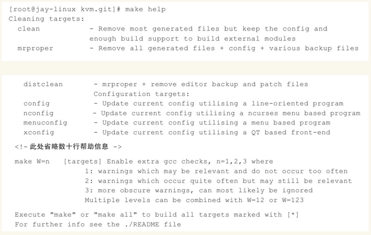

对KVM或Linux内核配置时常用的配置命令的一些解释如下: 

(1)make config

基于文本的最为传统的也是最为枯燥的一种配置方式, 但是它可以适用于任何情况之下. 

(2)make oldconfig

make oldconfig和make config类似, 但是它的作用是在现有的内核设置文件基础上建立一个新的设置文件, 只会向用户提供有关新内核特性的问题, 在新内核升级的过程中, make oldconfig非常有用, 用户将现有的配置文件.config复制到新内核的源码中, 执行make oldconfig, 此时, 用户只需要回答那些针对新增特性的问题. 

(3)make silentoldconfig

和上面make oldconfig一样, 但在屏幕上不再出现已在.config中配置好的选项. 

(4)make menuconfig

基于终端的一种配置方式, 提供了文本模式的图形用户界面, 用户可以通过光标移动来浏览所支持的各种特性. 使用这用配置方式时, 系统中必须安装有ncurses库, 否则会显示"Unable to find the ncurses libraries"的错误提示. 其中"y"、"n"、"m"、"?"键的选择功能与前面make config中介绍的一致. 

(5)make xconfig

基于XWindow的一种配置方式, 提供了漂亮的配置窗口, 不过只有能够在X Server上运行X桌面应用程序时才能够使用, 它依赖于QT, 如果系统中没有安装QT库, 则会出现"Unable to find any QT installation"的错误提示. 

(6)make gconfig

与make xconfig类似, 不同的是make gconfig依赖于GTK库. 

(7)make defconfig

按照内核代码中提供的默认配置文件对内核进行配置(在Intel x86\_64平台上, 默认配置为arch/x86/configs/x86_64_defconfig), 生成.config文件可以用作初始化配置, 然后再使用make menuconfig进行定制化配置. 

(8)make allyesconfig

尽可能多地使用"y"设置内核选项值, 生成的配置中包含了全部的内核特性. 

(9)make allnoconfig

除必须的选项外, 其他选项一律不选(常用于嵌入式Linux系统的编译). 

(10)make allmodconfig

尽可能多地使用"m"设置内核选项值来生成配置文件. 

(11)make localmodconfig

会执行lsmod命令查看当前系统中加载了哪些模块(Modules), 并将原来的.config中不需要的模块去掉, 仅保留前面lsmod命令查出来的这些模块, 从而简化了内核的配置过程. 这样做确实方便了很多, 但是也有个缺点: 该方法仅能使编译出的内核支持当前内核已经加载的模块. 因为该方法使用的是lsmod查询得到的结果, 如果有的模块当前没有加载, 那么就不会编到新的内核中. 

下面以make menuconfig为例介绍一下如何选择KVM相关的配置. 运行make menuconfig后显示的界面如图所示. 

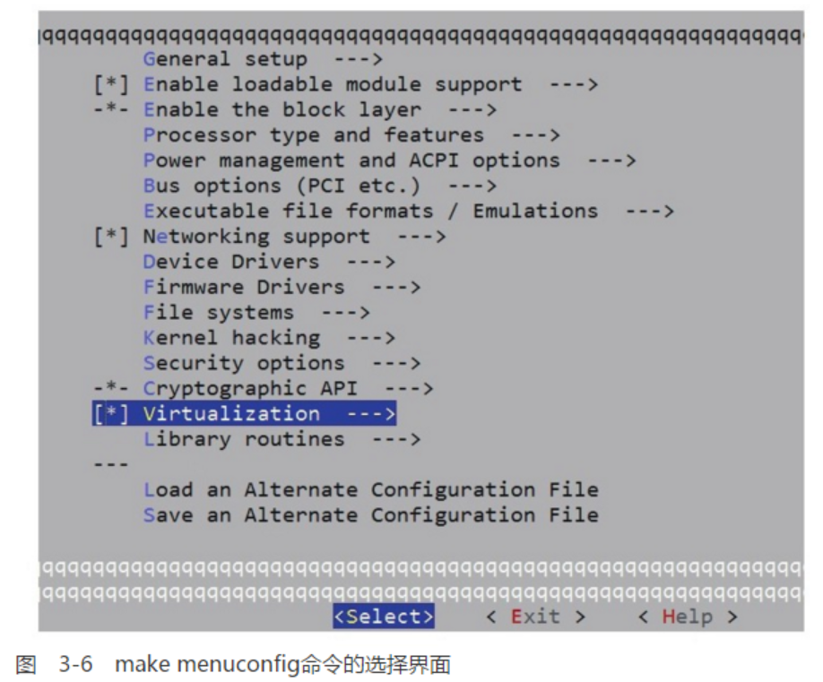

选择了Virtualization之后, 进入其中进行详细配置, 包括选中KVM、选中对处理器的支持(比如: KVM for Intel processors support, KVM for AMD processors support)等, 如图所示. 

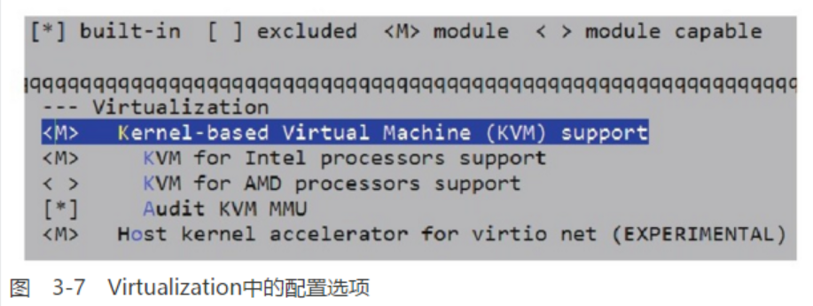

在配置完成之后, 就会在kvm.git的目录下面生成一个.config文件, 最好检查一下KVM相关的配置是否正确. 在本次配置中, 与KVM直接相关的几个配置项的主要情况如下: 

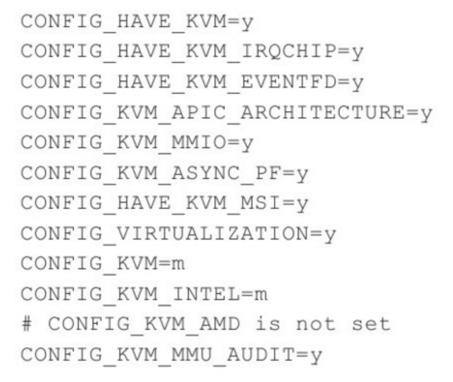

3.3 编译KVM

KVM编译过程就完全是一个普通Linux内核编译过程, 需要经过编译kernel、编译bzImage和编译module等三个步骤. 编译bzImage这一步不是必须的, 在本章示例中, config中使用了initramfs, 所以这里需要这个bzImage用于生成initramfs image. 根据Makefile中的定义可以看出, 直接执行"make"或"make all"命令就可以将这里提及的3个步骤全部包括在内. 

第一步, 编译kernel的命令为"make vmlinux", 如下: 

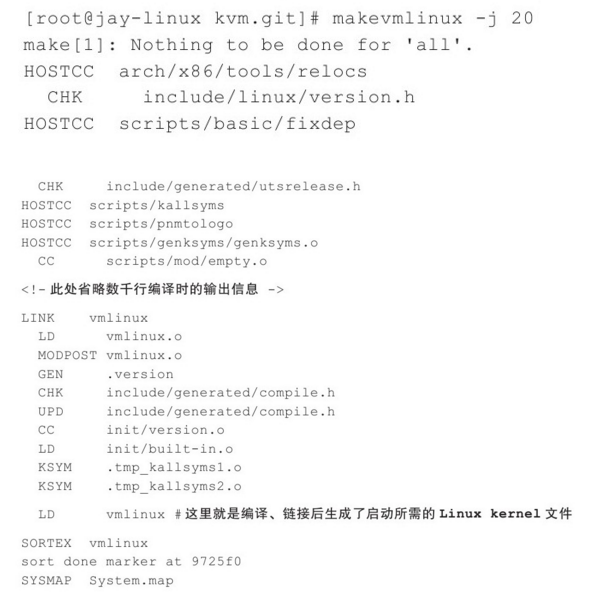

编译命令中"-j"参数并非必须的, 它是让make工具用多进程来编译, 比如上面命令中提到的"-j 20", 会让make工具最多创建20个GCC进程同时来执行编译任务. 在一个比较空闲的系统上面, 有一个推荐值作为-j参数的值, 即大约为2倍于系统上的CPU的core的数量(CPU超线程也算core). 

第二步, 执行编译bzImage的命令"make bzImage", 其输出为: 

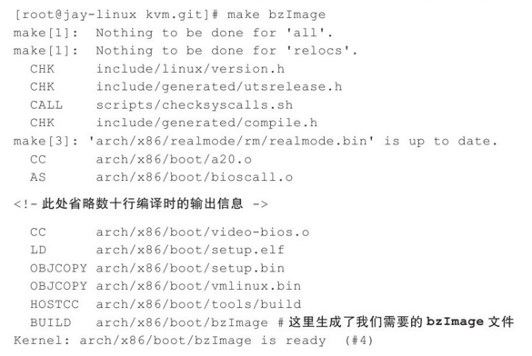

第三步, 编译kernel和bzImage之后编译内核的模块, 命令为"make modules", 输出如下: 

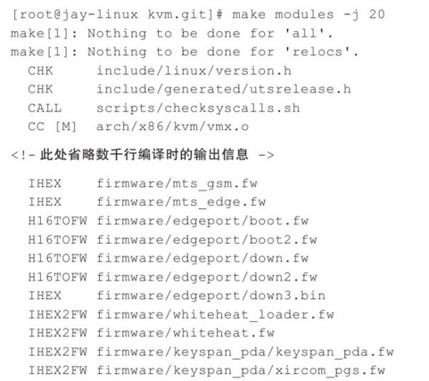

3.4 安装KVM

KVM安装包括两步骤: module安装、kernel与initramfs的安装. 

(1) 安装module

通过"make modules_install"命令可以将编译好的module安装到相应的目录之中, 在默认情况下module被安装到/lib/modules/$kernel_version/kernel目录之中. 

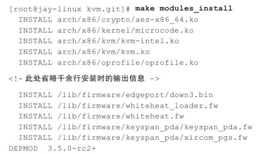

安装好module之后, 可以查看下相应的安装路径, 可以看到kvm模块已经安装. 如下: 

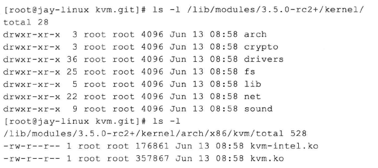

(2) 安装kernel和initramfs

通过"make install"可以安装kernel和initramfs, 命令输出如下: 

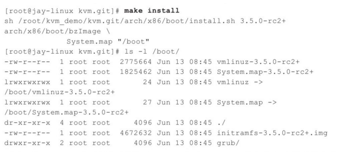

可见, 在/boot目录下生成了内核(vmlinuz)和initramfs等内核启动所需的文件. 

在运行make install之后, grub配置文件(如: /boot/grub/grub.conf)中也自动添加了一个grub选项, 如下所示: 

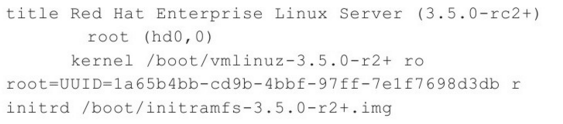

检查了grub之后, 重新启动系统, 选择刚才为了KVM而编译、安装的内核启动. 

系统启动后, 登录进入系统, 在通常情况下, 系统启动时默认已经加载了kvm和kvm_intel这两个模块; 如果没有加载, 请手动用modprobe命令依次加载kvm和kvm_intel模块. 

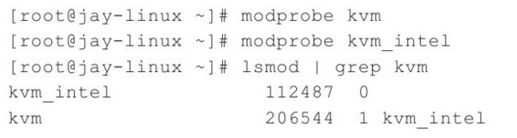

确认KVM相关的模块加载成功后, 检查/dev/kvm这个文件, 它是kvm内核模块提供给用户空间的qemu-kvm程序使用的一个控制接口, 它提供了客户机(Guest)操作系统运行所需要的模拟和实际的硬件设备环境. 

4. 编译和安装qemu-kvm
 
除了在内核空间的kvm模块外, 在用户空间需要QEMU来模拟所需要的CPU和设备模型以及用于启动客户机进程, 这样才有一个完整的kvm运行环境. 而qemu-kvm是为了针对kvm专门做了修改和优化的QEMU分支. qemu-kvm是会合入到qemu的主干分支的, 该书采用qemu-kvm来讲解. 

在编译和安装了kvm并启动到编译的内核之后, 再看qemu-kvm的编译和安装. 

4.1 下载qemu-kvm源代码

目前的QEMU项目针对KVM的代码分支qemu-kvm也是由Redhat公司的Gleb Natapov和Paolo Bonzini作维护者(Maintainer), 代码也是托管在kernel.org上. 

qemu-kvm开发代码仓库的网页连接为: http://git.kernel.org/?p=virt/kvm/qemu-kvm.git.

有三个连接可以下载开发中的qemu-kvm的代码仓库. 

```
git://git.kernel.org/pub/scm/virt/kvm/qemu-kvm.git
https://git.kernel.org/pub/scm/virt/kvm/qemu-kvm.git
https://kernel.googlesource.com/pub/scm/virt/kvm/qemu-kvm.git
```

4.2 配置和编译qemu-kvm

通常可以直接运行代码仓库中的configure文件进行配置. 可以运行"./configure --help"查看帮助信息. 

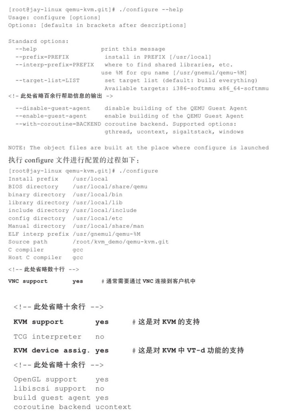

在配置后, 进行编译, 直接执行make, 如下, 也可以./configure --kerneldir=/lib/modules/2.6.38.8/source   //注意该路径是自己想要使用的内核路径: 

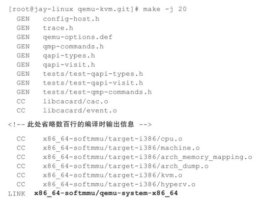

最后会生成qemu-system-x86_64文件, 它就是qemu-kvm的命令行工具(多数Linux发行版中自带的qemu-kvm软件包的命令行是qemu-kvm, 名字不同而已)

4.3 安装qemu-kvm

编译完成后, 运行"make install"命令可以安装, 过程如下: 

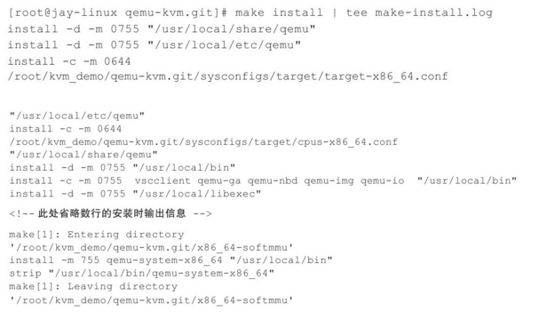

qemu-kvm的安装过程主要任务有: 创建qemu的一些目录, 复制一些配置文件到相应的目录下, 复制一些firmware文件(如: sgabios.bin, kvmvapic.bin)到目录下以便qemu-kvm的命令行启动时可以找到相应的固件提供给客户机使用, 复制keymaps到相应的目录下以便在客户机中支持各种所需的键盘类型, 复制qemu-system-x86_64、qemu-img等可执行程序到相应的目录下. 下面的一些命令检查了qemu-kvm被安装了之后的系统状态. 

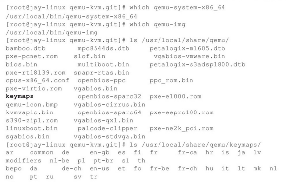


由于qemu-kvm是用户空间的程序, 安装之后不用重启系统, 直接用qemu-system-x86_64、qemu-img这样的命令行工具即可使用qemu-kvm了. 

5 安装客户机

安装客户机(Guest)之前, 创建一个镜像文件或磁盘分区等来存储客户机中的系统和文件. 关于客户机镜像有很多制作和存储方式, 该节采用了本地创建一个镜像文件, 然后让镜像文件作为客户机的硬盘, 将客户机操作系统(以RHEL6.3为例)安装在其中. 

首先, 创建一个镜像文件, 可以使用dd工具, 如下命令创建一个8GB的镜像文件rhel6u3.img(dd if=/dev/zero of=rhel6u3.img bs=1M count=8192): 

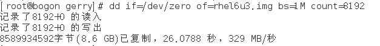

然后, 准备一个RHEL6.3安装所需的ISO文件, 启动客户机, 并在其中用准备好的ISO安装系统, 命令(qemu-system-x86_64 -m 2048 -smp 4 -boot order=cd -hda /root/kvm_demo/rhel6u3.img -cdrom /root/kvm_demo/RHEL6.3-Server-x6_64-DVD1.iso): 

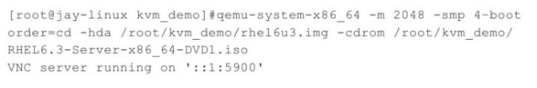

其中, -m 2048 是给客户机分配2048MB内存, -smp 4是给客户机分配4个CPU, -boot order=cd是指定系统的启动顺序为光驱(c:CD-ROM)、硬盘(d:hard Disk), -hda\*\*是分配给客户机的IDE硬盘(即前面的镜像文件), -cdrom\*\*是分配客户机的光驱. 默认情况下, QEMU会启动一个VNC server端口(如上面的::1:5900), 可以用vncviewer工具来连接到QEMU的VNC端口查看客户机. 

通过启动时的提示, 这里可以使用"vncviewer:5900"命令连接到QEMU启动的窗口. 根据命令行制定的启动顺序, 当有CDROM时, 客户机默认会从光驱引导, 启动后即可进入到客户机系统安装界面如图. 

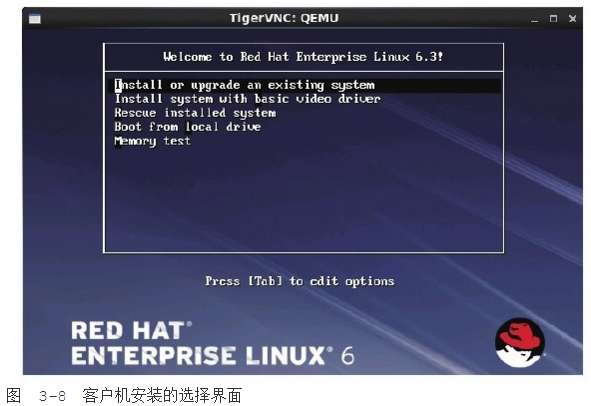

6. 启动第一个KVM客户机
 
在装好系统后, 就可以使用镜像文件来启动并登陆到自己安装的系统之中了. 通过命令行(qemu-system-x86_64 -m 2048 -smp 4 -hda /root/kcm_demo/rhel6u3.img)即可启动第一个KVM的客户机. 

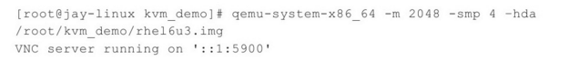

用vncviewer命令(此处命令为vncviewer:5900)查看客户机的启动情况. 

在通过VNC链接到QEMU窗口后, 可以按快捷键"Ctrl+Alt+2"切换到QEMU监视器窗口, 在监视器窗口中可以执行一些命令, 比如执行"info kvm"命令来查看当前QEMU是否使用着KVM. 

7. 参考阅读

(1)KVM官方网站的FAQ(常见问题与答案)列表: 

http://www.linux-kvm.org/page/FAQ.

(2)KVM宿主机或客户机安装RHEL6.x系统, 也可参考如下链接中详细的英文文档: 

http://docs.redhat.com/docs/en-US/Red_Hat_Enterprise_Linux/6/html/Installation_Guide/index.html.