1. 半虚拟化驱动

1.1 virtio概述

QEMU/KVM提供了全虚拟化环境, 可以让客户机不经过任何修改就能运行在KVM环境中. 不过, KVM在I/O虚拟化方面, 传统的方式是使用QEMU纯软件方式模拟I/O设备(如第四章中模拟的网卡、磁盘、显卡等), 效率不高. 在KVM中, 可以在客户机中使用半虚拟化驱动(Paravirtualized Drivers, PV Drivers)提高客户机性能(特别是I/O性能). 目前, KVM中实现半虚拟化驱动的方式是采用virtio这个Linux上的设备驱动标准框架. 

**1. QEMU模拟I/O设备的基本原理和优缺点**

QEMU纯软件方式模拟现实世界中I/O设备基本过程模型如图. 

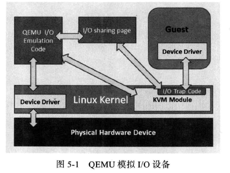

使用QEMU模拟I/O的情况下, 当客户机中的设备驱动程序(device driver)发起I/O操作请求之时, KVM模块中的I/O操作捕获代码会拦截这次I/O请求, 然后经过处理后将本次I/O请求的信息存放到I/O共享页, 并通知用户空间的QEMU程序. QEMU模拟程序获得I/O操作的具体信息之后, 交由硬件模拟代码来模拟出本次的I/O操作, 完成之后, 将结果放回到I/O共享页, 并通知KVM模块中的I/O操作捕获代码. 最后, 由KVM模块中的捕获代码读取I/O共享页中的操作结果, 并把结果返回到客户机中. 当然, 这个操作过程中客户机作为一个QEMU进程在等待I/O时也可能被阻塞. 另外, 当客户机通过DMA(Direct Memory Access)访问大块I/O之时, QEMU模拟程序将不会把操作结果放到I/O共享页中, 而是通过内存映射的方式将结果直接写到客户机的内存中去, 然后通过KVM模块告诉客户机DMA操作已经完成. 

QEMU模拟I/O设备的方式, 优点是可以模拟各种设备, 不需要修改客户操作系统. 它的缺点是, 每次I/O操作的路径比较长, 有较多的VMEntry、VMExit发生, 需要多次上下文切换(context switch), 也需要多次数据复制, 所以它的性能较差. 

**2. virtio的基本原理和优缺点**

virtio最初由澳大利亚的一个天才级程序员Rusty Russell编写, 是一个在hypervisor之上的抽象API接口, 让客户机知道自己运行在虚拟化环境中, 进而根据 virtio 标准与Hypervisor协作, 从而在客户机中达到更好的性能(特别是I/O性能). 目前, 有不少虚拟机都采用了virtio半虚拟化驱动来提高性能, 如KVM和Lguest[1]. 

QEMU/KVM中, Virtio的基本结构框架如图. 

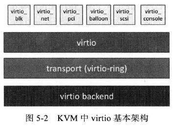

其中前端驱动(frondend, 如virtio-blk、virtio-net等)是在客户机中存在的驱动程序模块, 而后端处理程序(backend)是在QEMU中实现的. 在这前后端驱动之间, 还定义了两层来支持客户机与QEMU之间的通信. 其中, "virtio"这一层是虚拟队列接口, 它在概念上将前端驱动程序附加到后端处理程序. 一个前端驱动程序可以使用0个或多个队列, 具体数量取决于需求. 例如, virtio-net网络驱动程序使用两个虚拟队列(一个用于接收, 另一个用于发送), 而virtio-blk块驱动程序仅使用一个虚拟队列. 虚拟队列实际上被实现为跨越客户机操作系统和hypervisor的衔接点, 但它可以通过任意方式实现, 前提是客户机操作系统和virtio后端程序都遵循一定的标准, 以相互匹配的方式实现它. 而virtio-ring实现了环形缓冲区(ring buffer), 用于保存前端驱动和后端处理程序执行的信息, 并且它可以一次性保存前端驱动的多次I/O请求, 并且交由后端去动去批量处理, 最后实际调用宿主机中设备驱动实现物理上的I/O操作, 这样做就可以根据约定实现批量处理而不是客户机中每次I/O请求都需要处理一次, 从而提高客户机与hypervisor信息交换的效率. 

Virtio半虚拟化驱动的方式, 可以获得很好的I/O性能, 其性能几乎可以达到和native(即: 非虚拟化环境中的原生系统)差不多的I/O性能. 所以, 在使用KVM之时, 如果宿主机内核和客户机都支持virtio的情况下, 一般推荐使用virtio达到更好的性能. 当然, virtio的也是有缺点的, 它必须要客户机安装特定的Virtio驱动使其知道是运行在虚拟化环境中, 且按照Virtio的规定格式进行数据传输, 不过客户机中可能有一些老的Linux系统不支持virtio和主流的Windows系统需要安装特定的驱动才支持Virtio. 不过, 较新的一些Linux发行版(如RHEL 6.3、Fedora 17等)默认都将virtio相关驱动编译为模块, 可直接作为客户机使用virtio, 而且对于主流Windows系统都有对应的virtio驱动程序可供下载使用. 

1.2 安装virtio驱动

由于virtio的后端处理程序是在位于用户空间的QEMU中实现的, 所以, 在宿主机中只需要比较新的内核即可, 不需要特别地编译与virtio相关的驱动. 

客户机需要有特定的virtio驱动的支持, 以便客户机处理I/O操作请求时调用virtio驱动而不是其原生的设备驱动程序. 下面介绍Linux与Windows中virtio相关驱动的安装与使用. 

**1. Linux中的virtio驱动**

一般Linux的自带的内核都将virtio相关的驱动编译为模块, 可以根据需要动态加载相应的模块. 可以查看内核的配置文件来确定是否支持virtio驱动. 内核配置文件中与virtio相关的配置有: 

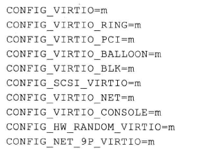

根据这样的配置选项, 在编译安装好内核后, 在内核模块中就能看到virtio.ko、virtio_ring.ko、virtio_net.ko这样的驱动, 如下: 

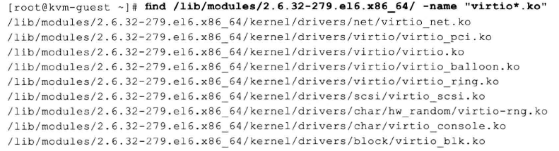

在一个正在使用virtio_net网络前端驱动的KVM客户机中, 已自动加载的virtio相关模块如下: 

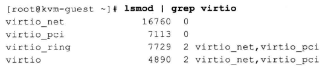

其中virtio、virtio_ring、virtio_pci等驱动程序提供了对virtio API的基本支持, 是使用任何virtio前端驱动都必须使用的, 而且它们加载还有一定的顺序, 应该按照virtio、virtio_ring、virtio_pci的顺序加载, 而virtio_net、virtio_blk这样的驱动可以根据实际需要进行选择性的编译和加载. 

**2. Windows中的virtio驱动**

Windows本身没有默认提供virtio相关的驱动, 需要另外安装特定的驱动程序以便支持virtio. 可通过Linux系统自带的软件包安装, 也可在网上下载Windows virtio驱动自行安装. 

以RHEL为例, 有一个名为virtio-win的RPM软件包. 

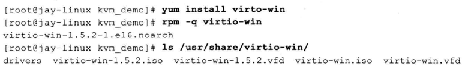

安装完成后, 可以在目录/usr/share/virtio-win/"下找到镜像文件"virtio-win.iso", 该镜像文件中包含各种版本Windows操作系统的各种virtio驱动的安装程序. 可以将virtio-win.iso文件通过网络共享带Windows客户机中使用, 或者通过qemu-kvm命令行中的"-cdrom"参数将virtio-win.iso文件作为客户机的光驱. 下面例子. 

1) 启动客户机, 将virtio-win.iso作为客户机的光驱, 命令行操作如下: 

qemu-system-x86_64 win7.img -smp 2 -m 2048 -cdrom /usr/share/virtio-win/virtio-win.iso -vnc :0 -usbdevice tablet

在客户机中打开CD-ROM(virtio-win.iso)可看到其中的目录, 其中四个子目录分别代表Windows的4个驱动: Balloon是内存气球相关的virtio_balloon驱动, NetKVM是网络相关的virtio_net驱动, vioserial是控制台相关的virtio_serial驱动, viostor是磁盘块设备存储相关的virtio_scsi驱动. 

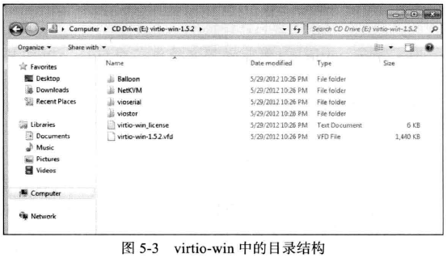

在安装驱动前, 在Windows客户机中在"计算机管理"中选中"设备管理器"查看磁盘和网卡驱动, 如图, 磁盘驱动是QEMU模拟的IDE硬盘, 网卡是QEMU模拟的rtl8139系列网卡. 

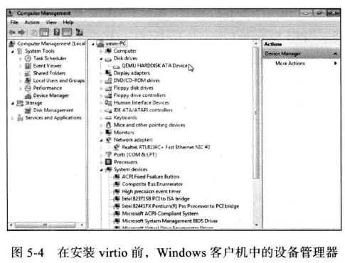

2) 在启动客户机时, 向其分配一些virtio相关的设备, 在Windows中根据设备安装驱动. 

这一步安装virtio_balloon、virtio_net、virtio_servial这三个驱动, 而virtio_scsi是磁盘相关的驱动, 下一步介绍. 

qem-kvm命令的参数如下: 

- "-balloon virtio"提供了virtio_balloon相关设备; 
- "-net nic,model=virtio"提供了virtio_net相关设备; 
- "-device virtio-serial-pci"提供了virtio_serial相关设备. 

启动命令如下: 

qemu-system-x86_64 win7.img -smp 2 -m 2048 -cdrom /usr/share/virtio-win/virtio-win.iso -vnc :0 -usbdevice table -net nic,model=virtio -net tap -balloon virtio -deice virtio-serial-pci

在启动后, 在Windows客户机的"设备管理器"的"其他设备"中会有三个设备没有找到合适的驱动, 如图, 而且网卡不可哦那个, 因为使用virtio模型的网卡, 没有驱动可用. 

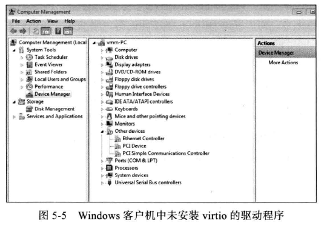

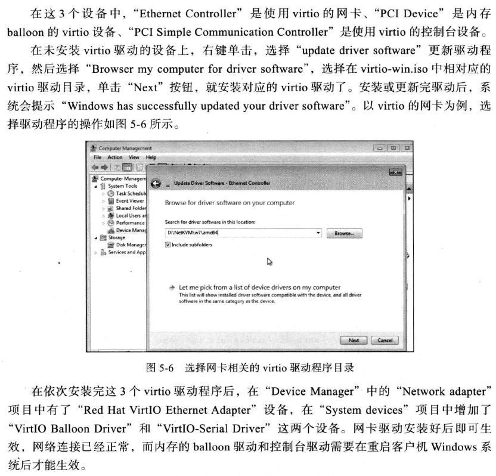

3) 安装磁盘virtio驱动程序, 系统中没有virtio_scsi驱动就不能识别硬盘, 系统就不能启动, 可以通过两种方式安装. 一种方式, 在系统启动前从带有virtio驱动的可启动的光盘或软盘将驱动安装好, 再重启系统从virtio的硬盘进系统. 另外方式, 使用一个非启动硬盘, 将其指定为使用virtio驱动, 在Windows客户机中会发现该非启动硬盘没有合适的驱动, 就像前面安装其他驱动那样安装即可, 然后重启将启动硬盘的镜像文件也设置为virtio方式即可使用virtio驱动启动驱动客户机. 

1.3 使用virtio_balloon

**1. ballooning简介**

通常要改变客户机占用的宿主机内存, 要先关闭客户机, 然后设置重启. 而内存的ballooning(气球)可以动态调整. 

在客户机占用的内存中引入气球(balloon). 气球中的内存是可以供宿主机使用的(但不能被客户机访问使用), 所以, 当宿主机内存紧张, 可以请求客户机回收利用已分配给客户机的部分内存, 客户机就会释放其空闲内存, 此时若客户机空闲内存不足, 可能还会回收部分使用中的内存, 可能会将部分内存换出到客户机的交换分区(swap)中, 从而使内存气球充气膨胀, 进而使宿主机回收气球中的内存用于其他进程(或其他客户机). 反之, 当客户机中内存不足时, 也可以让客户机的内存气球压缩, 释放出内存气球中的部分内存, 让客户机使用更多的内存. 

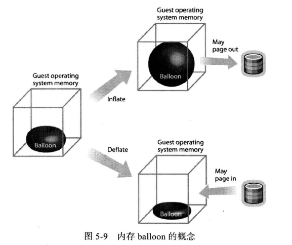

**2. KVM中ballooning的原理及优劣势**

KVM中ballooning的工作过程主要如下几步: 

1) Hypervisor(即KVM)发送请求到客户机操作系统让其归还一定数量的内存给Hypervisor; 

2) 客户机操作系统中的virtio_balloon驱动接收到Hypervisor的请求; 

3) virtio_balloon驱动使客户机的内存气球膨胀, 气球中的内存就不能被客户机访问. virtio_balloon驱动尽可能多提供内存使气球膨胀, 尽量满足Hypervisor的请求中的内存数量(即使不一定全部满足); 

4) 客户机操作系统归还气球中的内存给Hypervisor; 

5) Hypervisor可以将从气球中得到的内存分配到任何地方; 

6) 即使从气球中得到的内存没有处于使用中,Hypervisor也可以将内存返回到客户机中, 过程是: Hypervisor发请求到客户机的virtio_balloon驱动; 请求使客户机操作系统压缩内存气球; 在气球中的内存被释放出来, 重新由客户机访问和使用. 

**3. KVM中ballooning使用示例**

KVM中ballooning是通过宿主机和客户机协同实现. 

在QEMU命令行中可用"-ballooning virtio"参数来分配balloon设备给客户机使其调用virtio_balloon驱动来工作, 而默认不分配(与"-balloon none"效果相同). 

-balloon virtio[,addr=addr] #使用virtio balloon设备, addr可配置客户机中该设备的PCI地址

在QEMU monitor中, 两个命令查看设置. 

(qemu) info balloon   #查看客户机内存占用量(balloon信息)

(qemu) balloon num    #设置客户机内存占用量为numMB

KVM中使用ballooning操作步骤: 

1) QEMU启动客户机时分配balloon设备, 如下. 也可食用"-device"统一参数来分配balloon设备, 如"-device virtio-balloon-pci,id=balloon0,bus=pci.0,addr=0x4". 

qemu-system-x86_64 rhel6u3.img -smp 2 -m 2048 -balloon virtio

2) 在客户机查看balloon设备以及内存使用情况, 命令行如下: 

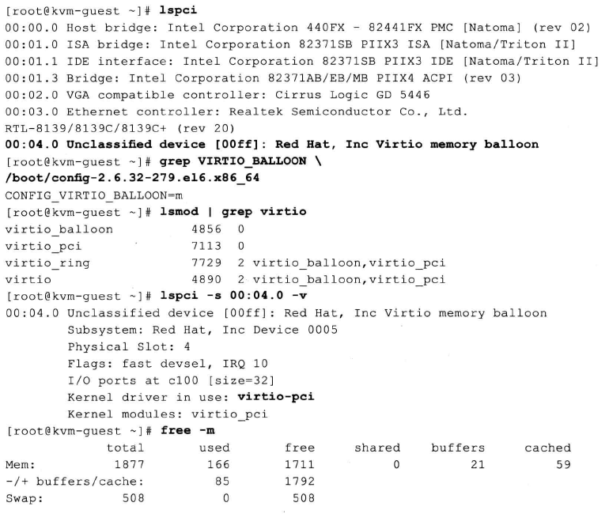

根据上面信息, 客户机已经加载了virtio_balloon模块, 有一个名为"Red Hat, Inc Virtio memory balloon"的PCI设备, 它使用了virtio_pci驱动. WIndows客户机可以在"设备管理器"看到使用virtio balloon设备. 

3) 在QEMU monitor中查看和改变客户机占用的内存, 命令如下: 

```
(qemu) info balloon
balloon: actual=2048
(qemu) balloon 512
(qemu) info balloon
balloon: actual=512
```

如果没有使用balloon设备, 则会得到警告. 

4) 设置了客户机内存为512MB后, 再到客户机检查, 如下: 

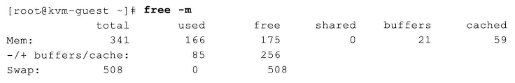

对于Windows客户机, 当balloon使其内存从2G降到512M, 在任务管理器看到的总内存数还是2GB, 但是看到它内存已使用量会增大1536M, 这里占用的1536M内存正式balloon设备占用的, Windows客户机系统的其他程序已经不能使用这1536M内存, 宿主机系统可以再次分配这里的1536M用于其他用途. 

**4. 通过ballooning过载使用内存**

使用ballooning可以根据宿主机中对内存的需求, 通过"balloon"命令调整客户机内存占用量, 从而可以实现内存的过载使用. 

如果客户机中有virtio_balloon驱动, 则使用ballooning来实现内存过载使用是非常方便的. 而"在QEMU monitor中用balloon命令改变内存操作不方便"的问题, 如果使用第6章将会介绍的libvirt工具来使用KVM, 则对ballooning的操作会比较方便, 在其"virsh"管理程序中就有"setmem"这个命令来动态更改客户机的可用内存容量, 该方式的完整命令为"virsh setmem <domain-id or domain-name> <Amount of memory in KB>". 


1.4 使用virtio_net

**1. 配置和使用virtio_net**

在选择KVM中的网络设备时, 一般来说优先选择半虚拟化的网络设备而不是纯软件模拟的设备, 使用virtio_net半虚拟化驱动, 可以提高网络吞吐量(thoughput)和降低网络延迟(latency). 

virtio_net的使用, 需要两部分的支持, 在宿主机中的QEMU工具的支持和客户机中virtio_net驱动的支持. 

使用virtio_net: 

1) 检查QEMU是否支持virtio类型的网卡

[root@jay-linux kvm_demo]# qemu-system-x86_64 -net nic,model=?

qemu: Supported NIC models: ne2k_pci,i82551,i82557b,i82559er,rtl8139,e1000,pcnet,virtio

当前qemu-kvm支持virtio网卡模型

2) 启动客户机时, 指定分配virtio网卡设备. 

[root@jay-linux kvm_demo]# qemu-system-x86_64 rhel6u3.img -smp 2 -m 1024 -net nic,model=virtio,macaddr=00:16:3e:22:22:22 -net tap

VNC server running on ::1:5900'

3) 在客户机中查看virtio网卡的使用情况. 

```
[root@kvm-guest ~]# grep VIRTIO_ /boot/config-2.6.32-279.el6.x86_64
CONFIG_VIRTIO_BLK=m
CONFIG_VIRTIO_NET=m
CONFIG_VIRTIO_CONSOLE=m
CONFIG_VIRTIO_RING=m
CONFIG_VIRTIO_PCI=m
CONFIG_VIRTIO_BALLOON=m

[root@kvm-guest ~]# lspci

00:00.0 Host bridge: Intel Corporation 440FX - 82441FX PMC [Natoma] (rev 02)
00:01.0 ISA bridge: Intel Corporation 82371SB PIIX3 ISA [Natoma/Triton II]
00:01.1 IDE interface: Intel Corporation 82371SB PIIX3 IDE [Natoma/Triton II]
00:01.3 Bridge: Intel Corporation 82371AB/EB/MB PIIX4 ACPI (rev 03)
00:02.0 VGA compatible controller: Cirrus Logic GD 5446
00:03.0 Ethernet controller: Red Hat, Inc Virtio network device

[root@kvm-guest ~]# lspci -vv -s 00:03.0
00:03.0 Ethernet controller: Red Hat, Inc Virtio network device
        Subsystem: Red Hat, Inc Device 0001
        Physical Slot: 3
        Control: I/O+ Mem+ BusMaster- SpecCycle- MemWINV- 
VGASnoop- ParErr- Stepping- SERR- FastB2B- DisINTx+
        Status: Cap+ 66MHz- UDF- FastB2B- ParErr-
DEVSEL=fast >TAbort- <TAbort- <MAbort- >SERR- <PERR- INTx-
        Interrupt: pin A routed to IRQ 11
        Region 0: I/O ports at c000 [size=32]
        Region 1: Memory at febf1000 (32-bit, non-prefetchable) [size=4K]
        Expansion ROM at febe0000 [disabled] [size=64K]
        Capabilities: [40] MSI-X: Enable+ Count=3 Masked-
                Vector table: BAR=1 offset=00000000
                PBA: BAR=1 offset=00000800
        Kernel driver in use: virtio-pci
        Kernel modules: virtio_pci

[root@kvm-guest ~]# lsmod | grep virtio
virtio_net             16760  0
virtio_pci              7113  0
virtio_ring             7729  2 virtio_net,virtio_pci
virtio                  4890  2 virtio_net,virtio_pci

[root@kvm-guest ~]# ethtool -i eth1
driver: virtio_net
version:
firmware-version:
bus-info: virtio0

[root@kvm-guest ~]# ifconfig eth1
eth1      Link encap:Ethernet  HWaddr 00:16:3E:22:22:22
          inet addr:192.168.156.200  Bcast:192.168.255.255  Mask:255.255.0.0
          inet6 addr: fe80::216:3eff:fe22:2222/64 Scope:Link
          UP BROADCAST RUNNING MULTICAST  MTU:1500  Metric:1
          RX packets:500 errors:0 dropped:0 overruns:0 frame:0
          TX packets:103 errors:0 dropped:0 overruns:0 carrier:0
          collisions:0 txqueuelen:1000
          RX bytes:65854 (64.3 KiB)  TX bytes:19057 (18.6 KiB)

[root@kvm-guest ~]# ping 192.168.199.98 -c 1
PING 192.168.199.98 (192.168.199.98) 56(84) bytes of data.
64 bytes from 192.168.199.98: icmp_seq=1 ttl=64 time=0.313 ms

--- 192.168.199.98 ping statistics ---
1 packets transmitted, 1 received, 0% packet loss, time 0ms
rtt min/avg/max/mdev = 0.313/0.313/0.313/0.000 ms
```

网络接口eth1使用了virtio_net驱动. 如果启动Windows客户机使用virtio类型的网卡, 则在Windows客户机的"设备管理器"中看到一个名为"Red Hat VirtIO Ethernet Adapter"的设备即是客户机中的网卡. 

**2. 宿主机中TSO和GSO的设置**

据Redhat的文档介绍, 如果你在使用半虚拟化网络驱动(即virtio_net)时依然得到较低的性能, 可以检查宿主机系统中对GSO和TSO[4]特性的设置. 关闭GSO和TSO可以使半虚拟化网络驱动的性能得到更加优化. 

如下的命令可以检查宿主机中GSO和TSO的设置, 其中eth0是建立bridge供客户机使用的网络接口. 

```
[root@jay-linux ~]# brctl show

bridge name     bridge id               STP enabled     interfaces
br0             8000.001320fb4fa8       yes             eth0
                                                        tap0

[root@jay-linux ~]# ethtool -k eth0
Offload parameters for eth0:
rx-checksumming: on
tx-checksumming: on
scatter-gather: on

tcp-segmentation-offload: on           #这个就是TSO的状态

udp-fragmentation-offload: off
generic-segmentation-offload: on      #这是GSO的状态
generic-receive-offload: on
large-receive-offload: off
```

通过如下命令关闭宿主机的GSO和TSO功能. 

```
[root@jay-linux ~]# ethtool -K eth0 gso off
[root@jay-linux ~]# ethtool -K eth0 tso off
[root@jay-linux ~]# ethtool -k eth0
Offload parameters for eth0:
rx-checksumming: on
tx-checksumming: on
scatter-gather: on
tcp-segmentation-offload: off
udp-fragmentation-offload: off
generic-segmentation-offload: off
generic-receive-offload: on
large-receive-offload: off
```

**3. 用vhost_net后端驱动**

前面提到virtio在宿主机中的后端处理程序(backend)一般是由用户空间的QEMU提供的, 然而如果对于网络IO请求的后端处理能够在在内核空间来完成, 则效率会更高, 会提高网络吞吐量和减少网络延迟. 在比较新的内核中有一个叫做"vhost-net"的驱动模块, 它是作为一个内核级别的后端处理程序, 将virtio-net的后端处理任务放到内核空间中执行, 从而提高效率. 

在第4章介绍"使用网桥模式"的网络配置时, 有几个选项和virtio相关的, 这里也介绍一下. 

-net tap,[,vnet_hdr=on|off][,vhost=on|off][,vhostfd=h][,vhostforce=on|off]

vnet_hdr =on|off, 是否打开TAP设备的"IFF_VNET_HDR"标识. 

vhost=on|off, 是否开启vhost-net这个内核空间的后端处理驱动, 它只对使用MIS-X中断方式的virtio客户机有效. 

vhostforce=on|off, 是否强制使用vhost作为非MSI-X中断方式的Virtio客户机的后端处理程序. 

vhostfs=h, 设置为去连接一个已经打开的vhost网络设备. 

用如下的命令行启动一个客户机, 就在客户机中使用virtio-net作为前端驱动程序, 而后端处理程序则使用vhost-net(当然需要当前宿主机内核支持vhost-net模块). 

[root@jay-linux kvm_demo]# qemu-system-x86_64 rhel6u3.img -smp 2 -m 1024 -net nic,model=virtio,macaddr=00:16:3e:22:22:22 -net tap,vnet_hdr=on,vhost=on

VNC server running on '::1:5900'

而在宿主机中, 可以查看vhost-net的使用情况, 如下. 

```
[root@jay-linux kvm_demo]# grep VHOST /boot/config-3.5.0
CONFIG_VHOST_NET=m

[root@jay-linux kvm_demo]# lsmod | grep vhost
vhost_net              17161  1
tun                    13220  3 vhost_net

[root@jay-linux kvm_demo]# rmmod vhost-net
ERROR: Module vhost_net is in use
```

宿主机中内核将vhost-net编译为module, 此时vhost-net模块处于使用中状态(试图删除它时即报告了一个"在使用中"的错误). 

一般来说, 使用vhost-net作为后端处理驱动可以提高网络的性能. 不过, 对于一些网络负载类型使用vhost-net作为后端, 却可能使其性能不升反降. 特别是从宿主机到其中的客户机之间的UDP流量, 如果客户机处理接受数据的速度比宿主机发送的速度要慢, 这时就容易出现性能下降. 在这种情况下, 使用vhost-net将会是UDP socket的接受缓冲区更快地溢出, 从而导致更多的数据包丢失. 故这种情况下, 不使用vhost-net, 让传输速度稍微慢一点, 反而会提高整体的性能. 

使用qemu-kvm命令行, 加上"vhost=off"(或没有vhost选项)就会不使用vhost-net, 而在使用libvirt时, 需要对客户机的配置的XML文件中的网络配置部分进行如下的配置, 指定后端驱动的名称为"qemu"(而不是"vhost"). 

```
<interface type="network">

...

<model type="virtio"/>

<driver name="qemu"/>

...

</interface>
```

1.5 使用virtio_blk

virtio_blk驱动使用Virtio API为客户机的提供了一个高效访问块设备I/O的方法. 在QEMU/KVM对块设备使用virtio, 需要两方面的配置: 客户机中的前端驱动模块virtio_blk和宿主机中的QEMU提供后端处理程序. 

启动一个使用virtio_blk作为磁盘驱动的客户机, 其qemu-kvm命令行如下. 

[root@jay-linux kvm_demo]# qemu-system-x86_64 -smp 2 -m 1024 -net nic -net tap –drive file=rhel6u3.img,if=virtio

VNC server running on `::1:5900′

在客户机中, 查看virtio_blk生效的情况. 

```
[root@kvm-guest ~]# grep VIRTIO_BLK \ /boot/config-2.6.32-279.el6.x86_64
CONFIG_VIRTIO_BLK=m

[root@kvm-guest ~]# lsmod | grep virtio
virtio_blk              7292  3
virtio_pci              7113  0
virtio_ring             7729  2 virtio_blk,virtio_pci
virtio                  4890  2 virtio_blk,virtio_pci

[root@kvm-guest ~]# lspci | grep -i block
00:04.0 SCSI storage controller: Red Hat, Inc Virtio block device

[root@kvm-guest ~]# lspci -vv -s 00:04.0
00:04.0 SCSI storage controller: Red Hat, Inc Virtio block device
        Subsystem: Red Hat, Inc Device 0002
        Physical Slot: 4
        Control: I/O+ Mem+ BusMaster- SpecCycle- MemWINV- 
VGASnoop- ParErr- Stepping- SERR- FastB2B- DisINTx+
        Status: Cap+ 66MHz- UDF- FastB2B- ParErr-
DEVSEL=fast >TAbort- <TAbort- <MAbort- >SERR- <PERR- INTx-
        Interrupt: pin A routed to IRQ 11
        Region 0: I/O ports at c100 [size=64]
        Region 1: Memory at febf2000 (32-bit, non-prefetchable) [size=4K]
        Capabilities: [40] MSI-X: Enable+ Count=2 Masked-
                Vector table: BAR=1 offset=00000000
                PBA: BAR=1 offset=00000800
        Kernel driver in use: virtio-pci
        Kernel modules: virtio_pci

[root@kvm-guest ~]# fdisk -l
Disk /dev/vda: 8589 MB, 8589934592 bytes
16 heads, 63 sectors/track, 16644 cylinders
Units = cylinders of 1008 * 512 = 516096 bytes
Sector size (logical/physical): 512 bytes / 512 bytes
I/O size (minimum/optimal): 512 bytes / 512 bytes
Disk identifier: 0x000726b0

Device Boot         Start         End      Blocks   Id  System
/dev/vda1   *           3       14826     7471104   83  Linux
/dev/vda2           14826       16645      916480   82  Linux swap / Solaris
```

可知客户机中已经加载virtio_blk等驱动, SCSI磁盘设备是使用virtio_blk驱动(上面查询结果中显示为virtio_pci, 因为它是作为任意virtio的PCI设备的一个基础、必备的驱动). 使用virtio_blk驱动的磁盘显示为"/dev/vda", 这不同于IDE硬盘的"/dev/hda"或者SATA硬盘的"/dev/sda"这样的显示标识. 

而"/dev/vd*"这样的磁盘设备名称可能会导致从前分配在磁盘上的swap分区失效, 因为有些客户机系统中记录文件系统信息的"/etc/fstab"文件中有类似如下的对swap分区的写法. 

/dev/sda2  swap swap defaults 0 0

或  

/dev/hda2  swap swap defaults 0 0

原因就是换为"/dev/vda2"这样的磁盘分区名称未被正确识别, 解决这个问题的方法就很简单了, 只需要修改它为如下的形式并保存"/etc/fstab"文件, 然后重启客户机系统即可. 

/dev/vda2  swap swap defaults 0 0

如果启动的是已安装virtio驱动的Windows客户机, 则在客户机的"设备管理器"中的"存储控制器"中看到的是正在使用"Red Hat VirtIO SCSI Controller"设备作为磁盘. 

1.6 kvm_clock配置

在虚拟机中的中断并非真正的中断, 而是通过宿主机向客户机注入的虚拟中断, 因此中断并不总是能同时且立即传递给一个客户机的所有虚拟机CPU(vCPU). 在需要向客户机注入中断时, 宿主机的物理CPU可能正在执行其他客户机的vCPU或在运行其他一些非QEMU进程, 所以中断需要的时间精确性可能得不到保障. 

客户机中时间不准确, 可能导致一些程序和用户场景在正确性上有麻烦. 比如cookie或session有效期计算等. 

QEMU/KVM通过提供一个半虚拟化的时钟, 即kvm_clock, 为客户机提供精确的System time和Wall time. kvm_clock使用较新的硬件(如Intel SandyBridge平台)提供的支持, 如不变的时钟计数器(Constant Time Stamp Counter). Constant TSC的计数的频率, 即使当前CPU核心改变频率(如使用一些省电策略), 也能保持恒定不变. CPU有一个不变的constan TSC频率是将TSC作为KVM客户机时钟的必要条件. 

物理CPU对constan TSC的支持, 可以查看宿主机中CPU信息的标识, 有"constan_tsc", 如下(来源于运行在SandyBridge硬件平台的系统). 

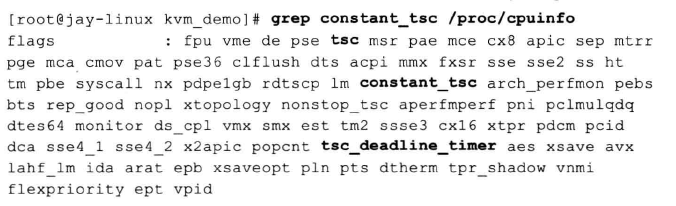

可以查看当前内核配置选项是否将kvm_clock相关的支持编译了: 

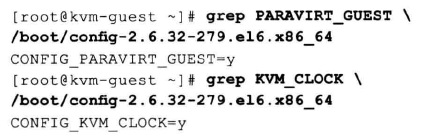

在QEMU命令行启动客户机时, 默认让其使用kvm_clock作为时钟来源. 在客户机查看与时钟相关信息如下, 可知用了kvm_clock和硬件TSC支持. 

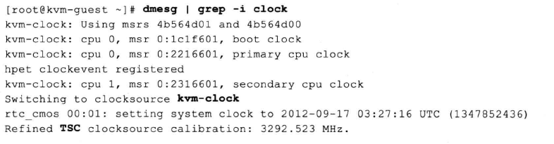

另外, Intel一些较新的硬件还向时钟提供了更高级的硬件支持, 即TSC Deadline Timer, 在前面查看CPU信息时已经有了"tsc_deadline_timer"的标识. TSC deadline模式, 不是使用CPU外部总线的频率去定时减少计数器的值, 而软件设置了一个"deadline"的阀值, 当CPU的时间戳计数器值大于或等于这个"deadline"时候, 本地的高级可编程中断器(Local APIC)就产生一个始终中断请求(IRQ). 正是由于这个特点(CPU的始终计数器运行于CPU的内部频率而不依赖于外部总线频率), TSC Deadline Timer可以提供更精确的时间, 也可更容易避免或处理竞态条件(race condition). 

KVM对TSC Deadline Timer支持开始于Linux3.6, QEMU对TSC Deadline Timer支持开始于qemu-kvm 0.12版本. 在启动客户机时, 在qemu-kvm命令使用参数"-cpu host"才能将该特性传给客户机, 使其可以使用TSC Deadline Timer. 