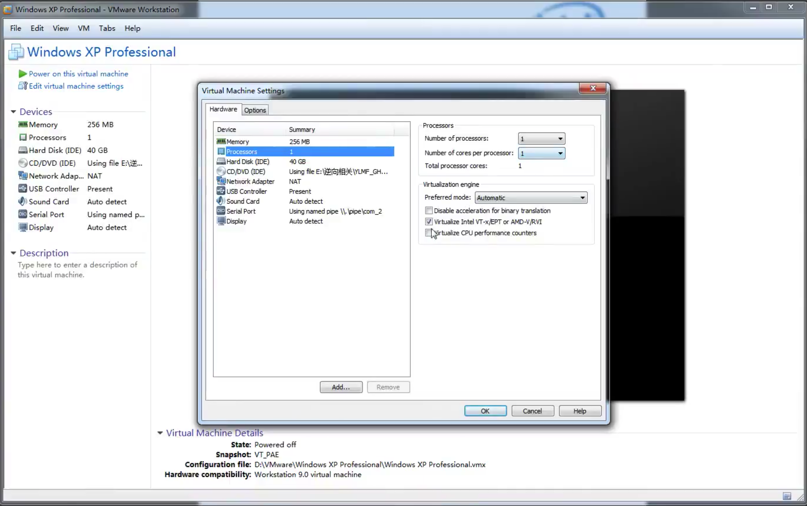

参照 https://bbs.pediy.com/thread-211973.html , 

在上面基础上删减修改而来.

参照 HyperPlatform: https://github.com/tandasat/HyperPlatform (成熟并很全), 后面一些细节可以参考这个项目, 该作者的github项目很多都是和VT相关的, 有问题可以参考.

该部分在 https://github.com/haiwei-li/VT_Learn (入门), 分为两个
- VT
- VT with EPT

该项目运行在32位.

Intel手册从Volume 3的23到33章.

C语言基础, 驱动开发基础/内核

使用VMware虚拟机, Windows XP Professional系统, 没有考虑多核多线程, 所以使用了单核单线程. 勾选VT-x.

VT enabled, 1 CPU, 使用小内存 256MB 即可.