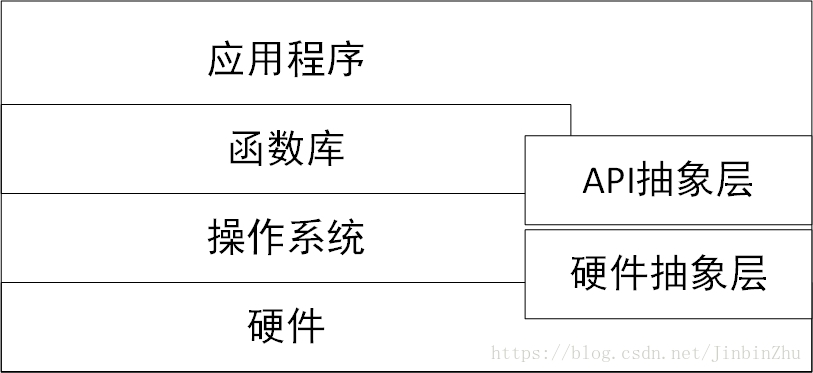
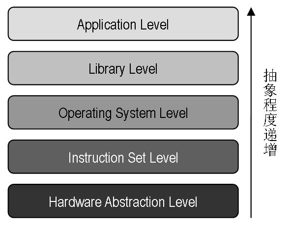

<!-- @import "[TOC]" {cmd="toc" depthFrom=1 depthTo=6 orderedList=false} -->

<!-- code_chunk_output -->

- [1. 计算机系统分层](#1-计算机系统分层)
  - [1.1. 虚拟化以及 5 个虚拟化抽象程度](#11-虚拟化以及-5-个虚拟化抽象程度)
- [2. 按抽象程度分类](#2-按抽象程度分类)
  - [2.1. 指令集架构等级的虚拟化 (Instruction Set Architecture Level)](#21-指令集架构等级的虚拟化-instruction-set-architecture-level)
  - [2.2. 硬件抽象层等级的虚拟化 (Hardware Abstraction Level)](#22-硬件抽象层等级的虚拟化-hardware-abstraction-level)
  - [2.3. 操作系统等级的虚拟化 (Operating System Level)](#23-操作系统等级的虚拟化-operating-system-level)
  - [2.4. 编程语言等级的虚拟化 (Programming Language Level)](#24-编程语言等级的虚拟化-programming-language-level)
  - [2.5. 库等级的虚拟化 (Library Level)](#25-库等级的虚拟化-library-level)

<!-- /code_chunk_output -->

# 1. 计算机系统分层

为了降低系统设计的复杂性, 计算机系统被设计成**自上而下的抽象层次结构**, **每一个层次**都向**上一层次**呈现一个抽象, 并且**每一层**只需知道**下层抽象的接口**, 而**不需要了解其内部运作机制**.

这样, **每一层**只需要考虑**本层的设计**以及**相邻层间的交互**. 例如, **操作系统**所看到的**硬件**是一个**硬件抽象层**, 而**不需要理解硬件的布线**或者**电气特性**等.

图 1-1 计算机系统的各个抽象层:

**硬件抽象层(Hardware Abstraction Layer, HAL**)是计算机中**软件**所能控制的**硬件的抽象接口**, 通常包括**CPU 的各种寄存器**、**内存管理模块**、**I/O 端口**以及**内存映射的 I/O 地址**等.

**API 抽象层**是**一个进程**所能控制的**系统功能**的集合, 包括创建新进程、内存申请、归还、进程间同步与共享、文件系统和网络操作系统等.

## 1.1. 虚拟化以及 5 个虚拟化抽象程度

本质上, **虚拟化！！！** 是由位于**下层的软件模块！！！**, 通过向**上层软件模块**提供一个与它**原先所期待的运行环境完全一致的接口的方法！！！**, 抽象出一个**虚拟的软件或硬件接口！！！**, 使得上层软件可以直接运行在虚拟的环境上.

重要概念, 在虚拟化中, **物理资源**通常有一个定语称为**宿主(Host**), 而**虚拟出来的资源**通常有一个定语称为**客户(Guest**).

虚拟技术按抽象程度分为五个层次

# 2. 按抽象程度分类

## 2.1. 指令集架构等级的虚拟化 (Instruction Set Architecture Level)

软件通过**模拟虚拟机的所有指令**实现, 称为**指令集架构等级的虚拟化**

**不仅仅是处理器！！！**, 模拟的是所有设备, 方式是**截获所有指令并转换**.

指令集架构的虚拟化是通过**软件**来**模拟不同架构**的**处理器**、**存储器**、**总线**、**磁盘控制卡**、**计时器**等多个 I/O 设备, 软件会将虚拟机所发出的**指令**转换为**本机可以操作的指令**在**现有的硬件上运行**.

这种等级的虚拟化对于模拟**相同处理器架构**的平台可以提供**很好的兼容性**, 例如︰x86 架构、Sparc 架构、Alpha 架构.

若**主机处理器**可以**运行**由虚拟机**转换出来的指令**, 或是**使用相同的指令集**来完成任务, 那就表示**除了处理器**以外的**操作系统**、**I/O 设备**皆可**不受特定平台所绑定**, 但由于虚拟机的**每条指令**都必须透过**软件来模拟**, 所以在性能会有较大程度的耗损.

这个分类底下代表性的有**Bochs**以及**QEMU**.

## 2.2. 硬件抽象层等级的虚拟化 (Hardware Abstraction Level)

硬件抽象层上的虚拟化, 通过**虚拟硬件抽象层！！！** 来实现虚拟机, 为客户机操作系统呈现和物理硬件相同或相近的硬件抽象层.

由**虚拟机监视器**来**隐藏不同厂商**的**处理器**、**存储器**、**芯片组**...等特征, 为这些虚拟机提供**抽象与统一的虚拟平台**. 运行此平台的计算机称之为主体机器(Host Machine), 而在此平台中运作的虚拟机称为客体机器(Guest Machine).

由于**客户机操作系统**能看到的是**硬件抽象层**, 因此客户机操作系统的行为和在物理平台上没什么区别.

通常, **宿主机**和**客户机**的**ISA(Instruction Set Architecture, 指令集架构！！！**)是**相同**的, **客户机**的**大部分指令**可以在**宿主机处理器上直接运行(！！！**), **只有部分需要虚拟化的指令(！！！**) 才会由**虚拟化软件进行处理**, 从而**大大降低了虚拟化开销**.

另外, 客户机和宿主机的硬件抽象层的**其他部分**如**中断控制器**、**设备等**, 可以是**完全不同(！！！**)的, 当**客户机对硬件层抽象访问**时, **虚拟化软件**需要对此进行**截获并模拟**. 比较知名的硬件抽象层的产品有 VMware、Xen 等.

当前**大多数 x86 平台**的商业计算机都在使用**这种虚拟化**, 最主要是由于现今处理器厂商提供了**硬件辅助虚拟化技术！！！**, 例如︰第三代的 Intel **VT\-d**、AMD\-Vi 皆提供虚拟机直接存储器访问(Direct Memory Access)以及对各种 PCI 接口的直接访问功能(PCI passthrough).

这个分类底下代表性的有**VMware\_ESXi**、**Hyper\-V**、**Virtualbox**、以及**Citrix**.

## 2.3. 操作系统等级的虚拟化 (Operating System Level)

通过**系统内核**提供**多个相互隔离的用户态实例**.

**操作系统层上的虚拟化**, 通过**系统内核**提供**多个相互隔离的用户态实例(经常被称为容器！！！**), 这些用户态实例对它的用户而言就像是一台真实的计算机, 具有自己**独立的文件系统**、**网络**、**系统设置**和**库函数等**.

因为这是操作系统内核主动提供的虚拟化, 因此操作系统层上的虚拟化比较高效, 其系统开销非常小, 不需要硬件特殊支持. 但灵活性较小, **每个容器**中的**操作系统**通常必须是**同一种操作系统**.

另外, 操作系统层上的虚拟化虽然为用户态实例间提供了**比较强的隔离性**, 但其**粒度比较粗**. 所以被大量应用在虚拟主机服务环境中.

**硬件抽象层等级的虚拟化**中的全虚拟化与操作系统底层间有非常高的隔离能力, 支持不同的操作系统, 安装后不需要重启主机、或修改引导程序(Boot Loader)以达到双系统的目的, 风险低、维护简单. 由于此等级的虚拟机可以访问底层操作系统, 因此用户必须花费大量的时间来安装与设置虚拟机, 接着才能开始评估或测试所需运作的软件, 这些设置包含了操作系统的安装、安全性或兼容性软件的更新、网络、系统调教...等, 如果所需的操作系统与底层操作系统相同, 那么其实它们所作的跟实际上安装一台实体机器没有什么区别.

操作系统内核虚拟化可以最大限度的减少新增虚拟机的所需, 在这个等级的虚拟机共享实体主机上的硬件以及操作系统, 呈现彼此独立且隔离的虚拟机环境.

**应用软件的环境**是由**操作系统**、**库**、**相依性软件**、**特定于系统的数据结构或文件系统**, 例如︰NTFS 或 Ext3, 以及**其他环境设置**所组成. 如果这些都保持不变, 应用软件很难发现与真实环境的区别. 这是所有操作系统等级虚拟化的关键想法.

这个分类底下代表性的有**Docker**、**VPS**以及**KVM**.

## 2.4. 编程语言等级的虚拟化 (Programming Language Level)

将**高级语言**转译成一种名为**字节码**的语言, 通过**虚拟机转译**成**可直接运行的命令**.

**传统计算机**是由**指令集架构所驱动**的一种**机械语言**, **硬件的操作**由**特殊的 I/O 指令**处理, 也可以透过**区块映射(Mapping)来操作存储器**, 此等级的虚拟化会将**高级语言**转译成一种名为**字节码的语言**, 通过**虚拟机转译成为可以直接运行的命令**. 跨操作系统平台、跨语言皆为其优点.

例如 JVM 或微软的 CLR(Common Language Runtime), **程序的代码**由虚拟机的运行时支持系统**首先翻译为硬件的机器语言**, 然后**再执行**. 通常**一个语言类虚拟机**是作为**一个进程**在**物理计算机系统**中运行的, 因此, 它属于**进程级虚拟化！！！**.

这个分类底下代表性的有**Oracle Java**、**Microsoft .NET**、**Parrot**.

## 2.5. 库等级的虚拟化 (Library Level)

通过虚拟化操作系统的**应用级函数的服务接口**, 应用无需修改即可在不同 OS 中运行.

大部分的**应用程序**都是使用由**许多库组成的 API**(Application Programming Interface)来设计, 使用**动态链接的方式**用于隐藏操作系统的细节, 目的是提供程序员**更简单的工作**.

这也产生了一种新的虚拟化方式, 使用**不同的 API** 与**不同操作系统底层的 ABI**(`Application Binary Interface`)来进行模拟的工作.

操作系统通常会通过应用级的库函数提供给应用程序一组服务, 例如文件操作服务、时间操作服务等, 这些库函数可以隐藏操作系统内部的一些细节, 使得应用程序编程更为简单.

不同操作系统库函数有不同的服务接口. **库函数层上的虚拟化**, 通过**虚拟化**操作系统的**应用级函数的服务接口**, 使得**应用程序不需要修改**, 就可以在**不同的操作系统**中无缝运行, 从而提供**系统间的互操作性**.

例如, **WINE 系统**是在 **Linux** 上**模拟了 Windows 的库函数接口(！！！**), 使得一个 **Windows 的应用程序**能够**在 Linux 平台上运行**.

这个分类底下代表性的有 **Wine** 以及 **WSL**(`Windows Subsystem for Linux`).
