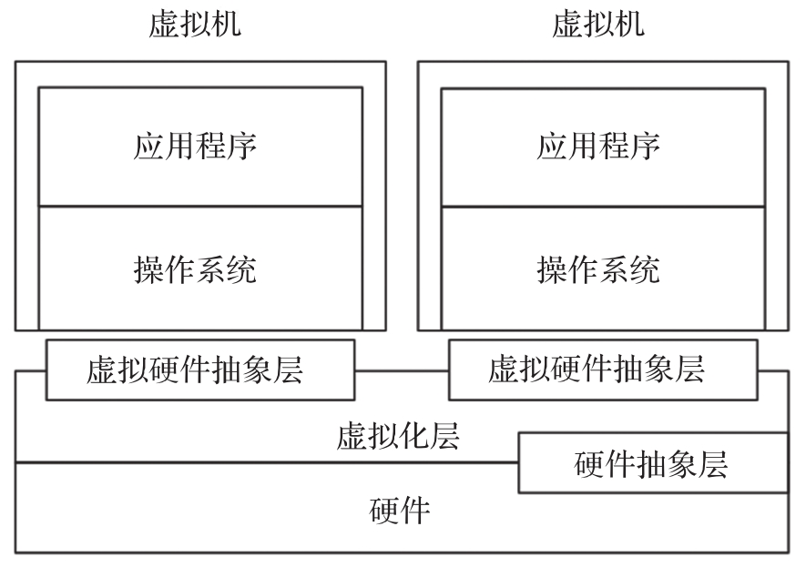

**系统虚拟化**是指将**一台物理计算机系统**虚拟化为**一台或多台虚拟计算机系统**, **每个虚拟的计算机系统(简称虚拟机**)都拥有自己的**虚拟硬件(如 CPU、内存和设备等**), 来提供一个**独立的虚拟机执行环境**. 这个**虚拟化层**被称为**虚拟机监控器**.

系统虚拟化:

本质上来讲, **虚拟机系统**和**物理机系统**可以是**完全不同的 ISA**. 例如, 可以在一个 x86 物理机上运行一个 ARM 的虚拟机. 但是, **不同的 ISA**使得**虚拟机的每一条指令**都需要**在物理机上模拟执行**, 从而造成**较大的性能下降**. 当然相同体系结构的系统虚拟化通常会有比较好的性能, VMM 也会实现比较简单, 虚拟机大部分指令可在处理器上直接运行, 只有那些需要虚拟化的指令才会由 VMM 进行处理.

1974 年, 杰拉尔德·J.波佩克(Gerald J. Popek)和罗伯特·P.戈德堡(Robert P. Goldberg) 定义了**虚拟机**可以看作是**物理机的一种高效隔离的复制**. 该定义蕴含了**三层含义**(**同质**、**高效**和**资源受控**).

1) **同质**, **虚拟机**的**运行环境**和**物理机**的**环境**在**本质上需要是相同**的, 但是在表现上能够有一定的差异. 例如**虚拟机**看到的**处理器个数**和**物理机**上**实际的处理器个数可以不一样**, 但虚拟机中和物理机上看到的**处理器必须是同一种基本类型(！！！**).

2) **高效**, 要求**虚拟机中运行的软件**接近**物理机上直接运行的性能**. 因此, **软件在虚拟机中运行**时, **大多数的指令是直接运行在硬件**上的, 只有**少量指令需要经过 VM 处理或模拟**.

3) **资源受控**, **VMM**对**系统资源**拥有**完全控制能力和管理权限**.

相同 ISA 的系统虚拟化取得了很大的技术和解决方案层面的发展. 本书内容以相同 ISA 的系统虚拟化展开, 以 x86 为例, 介绍系统虚拟化的相关内容.
