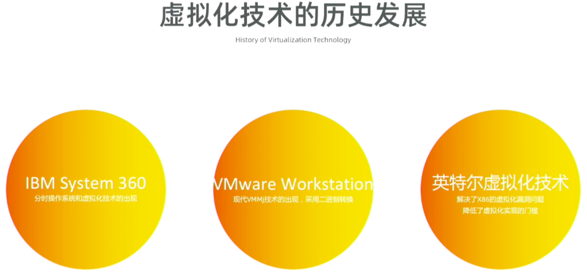

阿里云介绍的图:

IBM S360 -> VMware -> VT-d

# IBM S360

历史上第一个虚拟机是 1965 年左右 IBM 公司开发的 System/360 Model 40 VM.

虚拟化基本上是与操作系统同时出现的, 早在大型机时代就已经存在了, 如20世纪60年代IBM的分时系统. 那个时候的计算机普遍比较昂贵, 系统虚拟化的主要目的是在多用户之间实现物理资源的共享. 随着之后计算机的不断发展、计算机价格的下降以及个人计算机的普及, 用户对虚拟化的需求大大减少, 系统虚拟化技术的发展也逐渐没落了下来.

x86 体系结构的先天设计, 存在对系统虚拟化的支持缺陷或虚拟化漏洞(Virtualization Hole). 在 x86 体系结构上的虚拟化技术, 都需要用软件的方法弥补体系结构设计上的不足. 例如, **代码扫描与修补方法(Scan\-and\-patch**)或**二进制代码翻译(Binary Translation**)技术实现**基于软件的完全虚拟化**(Full Virtualization). 但这样势必带来性能损失和非常大的软件复杂度.

这种情况下, 学术界提出另一种思路来克服体系结构上的缺陷, 叫类虚拟化技术(`Para-Virtualization`). 主要思想就是通过**客户机操作系统**与**虚拟化管理层**的协同设计, 由**虚拟化管理层软件**提供一个**近似于原物理系统**, 但**又不完全相同的(与原系统)的虚拟平台**, 以避免虚拟化漏洞和实现更高的虚拟化效率. **修改操作系统的源码**来**与下层虚拟化管理层软件协同工作**, 从而避免体系结构上的缺陷. Denali 项目和 Xen 项目都支持类虚拟化. 国内把这个技术也叫做半虚拟化或者部分虚拟化, 但不准确.

基于软件的完全虚拟化方法不可避免地导致性能上的下降, 同时伴随一些兼容性上的损失. 而修改操作系统的类虚拟化方法对现有系统的移植和内核升级的维护提出要求, 并且对非开源的操作系统也有局限.

从**根本上解决体系结构的缺陷**, 最好是从体系结构本身入手. Intel 和 AMD 在 2006 年后都逐步推出了带硬件虚拟化支持的处理器, 如**Intel 的 Virtualization Technology(VT**)技术和**AMD 的 Secure Virtual Machine(SVM**)技术. Intel 和 AMD 采用的都是**硬件辅助的完全虚拟化**策略. **操作系统不需要做任何改动就能运行在虚拟机**中. VMM 软件可以利用这些硬件虚拟化技术, 这样软件的实现也极大简化, 并且更为高效和安全.

但这只是解决了**处理器层如何更好地支持虚拟化**的问题. 为使虚拟化解决方案**更加高效(例如 I/O 虚拟化**), 计算机系统各个层次都在逐渐加入对虚拟化的硬件支持. 以**Intel**为例, 除了**处理器中的 VT 技术**外, **芯片组！！！**中开始提供针对**IO 虚拟化**功能的**VT\-d**技术, **网卡**中也开始提供更好地**网络虚拟化**支持的**多队列的 VMDq 技术**等. 同时, **PCI 标准组织**也在指定**PCI 设备级**对虚拟化进行支持的**单根 PCI 桥 IOV(Single Root IOV, SR\-IOV**)和**多根 PCI 桥 IOV(Multi\-Root IOV, MR\-IOV**)标准.

**虚拟化软件**也长足发展. 除了 VMware, Denali 和 Xen, 还有 KVM, VirtualBox, 微软的虚拟化系列(VirtualPC, Hyper\-V), Paralles 的虚拟化系列(如 Virtuozzo, Parallels Desktop for Mac), Citrix 的 XenServer, Sun 的 xVM, Oracle 的 Oracle VM 和 VirtualIron 等.

知名的虚拟化软件

