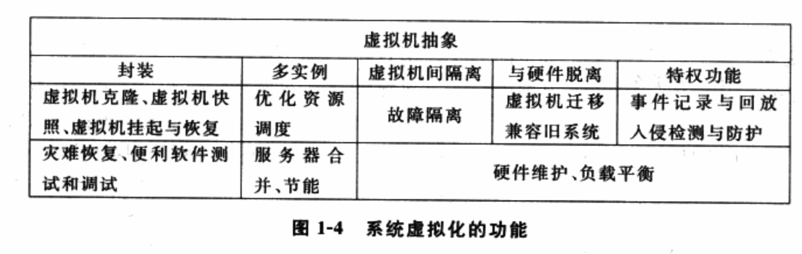

系统虚拟化提供了多个隔离的执行环境, 以**虚拟机为粒度**的抽象提供了优秀的分装性, 使得一台计算机上能够运行多台虚拟机, 虚拟机之间有很强的隔离性, **虚拟机与硬件没有直接的关联**. 另外, **虚拟化层**作为**特权层**能够提供前所未有的功能.

1. 封装性

以**虚拟机为粒度**的封装使得**虚拟机运行环境的保存(！！！**)非常便捷. 虚拟机的优秀封装性使得以下应用模型可以很方便地实现.

(1) 虚拟机快照(snapshot). 将运行中的一个虚拟机的某个时间点的状态抓取下来, 就像抓拍一张照片一样.

(2) 虚拟机克隆(clone). 从一个虚拟机的一个执行环境复制出一个或多个相同的虚拟机.

(3) 虚拟机挂起(Suspend). 暂停一个运行中的虚拟机, 将其运行环境保存在磁盘上. 与之相反, 虚拟机恢复(Resume)是将保存在磁盘上的虚拟机运行环境恢复到内存中以继续运行的操作.

虚拟化起源于服务器虚拟化

2. 多实例

在**一台计算机**上运行**多个虚拟机**使得资源的调度更为优化, **不同的虚拟机**有不同的繁忙和空闲时段, **忙闲交错**使得**单个计算机**的系统**资源利用率大大提高**.

3. 隔离

**每个应用程序**可以在**自己的操作系统环境**中**独立地运行**而**不影响其他的工作负载**. 例如, 一个虚拟机系统崩溃了, 其它虚拟机的应用程序仍然可以正常运行.

4. 硬件无关性

**虚拟化**是资源的逻辑表示, 它不受物理限制的约束. 由于虚拟化层的抽象, 虚拟机与底层硬件没有直接的绑定关系. 因此, 尽管目前计算机体系结构呈现出很大的异构性, 但只要另一台计算机提供**相同的虚拟硬件抽象层！！！**, 一个虚拟机就能够**无缝地迁移**过去. 虚拟机迁移是虚拟化技术中的亮点之一.

有了虚拟机迁移, 硬件维护就不必每次关闭计算机了. 在一台计算机需要硬件维护时, 其中运行的虚拟机能迁移到其它计算机中.

另外, 虚拟硬件抽象层不需要与物理硬件相匹配, 因而还可以虚拟出较旧的硬件来兼容旧系统软件.

5. 特权功能

由于虚拟机层处于客户机及客户机系统的下面, 其具有更高的特权级. 在这个层添加新功能有如下两个优势:

(1) 新功能有高特权级, 不能被客户机操作系统绕过.

(2) 新功能不需要了解客户机内部的语义, 使其实现上更容易.

**事件记录与回放(Log and Replay**)在**虚拟化层**中能**很方便实现**, 因为**虚拟化层截获**并传递**所有系统级事件**.

**入侵检测(Intrusion Detection**)也是在虚拟化层中添加的功能之一. 利用**虚拟化层所在的特权级**, **入侵检测系统**能保证**其检测不会被客户机绕过**, 同时**客户机也不会知道这个服务的存在**.

**病毒检测**等安全防范机制同样也能在虚拟化层实现, 其好处在于**不需要担心检测系统本身的安全**, 客户机中病毒很难攻击到下层, 甚至不会知道自身是运行在客户机中. 另外一个好处在于**检测不会被客户机绕过**.

