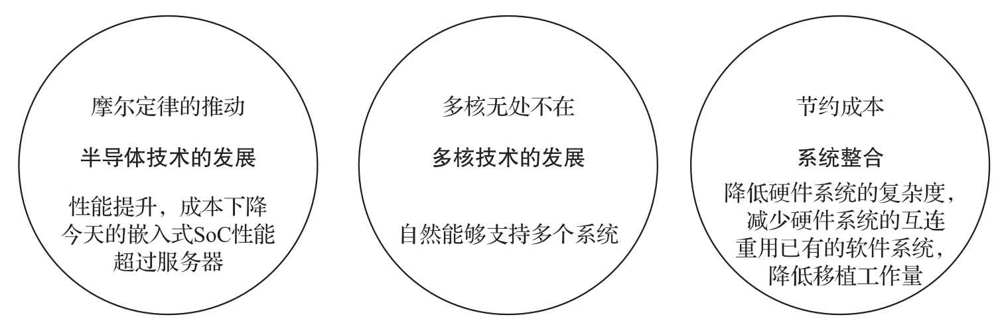

<!-- @import "[TOC]" {cmd="toc" depthFrom=1 depthTo=6 orderedList=false} -->

<!-- code_chunk_output -->

- [1. 背景](#1-背景)
- [2. 与云虚拟化的区别](#2-与云虚拟化的区别)
- [3. 挑战](#3-挑战)

<!-- /code_chunk_output -->

# 1. 背景

如果说 "云" 虚拟化是上一次的技术风口, 那么 "物" 虚拟化将会是下一个不容错过的技术风口. 物联网的核心是嵌入式设备, 那么为什么一个嵌入式系统会需要虚拟化技术呢?

如下图所示, 嵌入式虚拟化技术的兴起主要有三个因素.

第一, 随着半导体技术的发展, 摩尔定律推动硬件的性能提升, 成本下降, 今天的 **嵌入式 SoC 的性能** 甚至会超过服务器.

第二, 无处不在的 CPU 多核技术的发展自然能够 **支持多个系统**.

第三, 出于 **节约成本** 考虑, **系统整合**并 **重用已有的软件系统**, 降低移植工作量, **减少软件和硬件系统的互连**, 降低整体硬件系统的复杂度, 可以把多个不同类型的操作系统和业务整合在一套硬件系统上, 实现 "异构" 负载的整合, 例如, 可以是实时的和非实时的整合, 也可以是安全的和非安全的整合, 从而大大提高系统的灵活性, 可扩展性及可维护性.

这种业务整合依然得益于 20 年前的虚拟化技术思路. 虚拟化技术可以完全隔离不同的操作系统, 保证它们互不影响; 虚拟化技术虚拟的硬件可以继续支持原来旧的操作系统, 保护过去的软件投资并实现平滑的业务演进; 虚拟化技术的多虚拟机操作系统支持可以让硬件充分发挥其算力, 从而在整体上提高系统的投资回报率.

# 2. 与云虚拟化的区别

虽然两种技术同根同源, 但是嵌入式虚拟化技术和传统云虚拟化技术还是有区别的, 如下图所示.

**目标定位不同**.

* 云虚拟化技术关注服务器的热迁移, 弹性资源分配, 灵活管理;

* 而嵌入式虚拟化技术关注 **实时性**, **功能安全** (functional safety), **可确定性**及小尺寸 (foot print) 等.

**可用的资源多寡不同**.

* 云服务器系统的**计算能力和内存等资源**远远多于嵌入式系统;

* 而后者对 **资源的使用** "斤斤计较".

**软件发布模式不同**.

* 云服务器系统软件是**同一个发布的二进制代码**部署在**所有的服务器**上运行;

* 而嵌入式系统软件和设备绑定, 多数是 **定制系统**.

# 3. 挑战

嵌入式技术是一项成熟的技术, 无论是智能家电还是工业智能设备, **嵌入式设备**的**工作寿命**往往长达**十余年**甚至**几十年**, 而使用**虚拟化**技术主要考虑兼顾**不同时期**运行在**不同操作系统**上的负载, 因此**嵌入式虚拟化技术**的主流是**虚拟机技术**.

嵌入式虚拟机发展的主要挑战可以总结为四个方面, 即兼容性、实时性、隔离安全, 以及小尺寸和低功耗.

**兼容性**: 虚拟机往往需要**整合数个不同操作系统**上的负载, 其开发周期可能间隔数年甚至数十年.

* **机器控制**的**应用**往往基于 **Linux** 操作系统, 其应用软件在 2000 年左右就已稳定使用, 工业客户的**升级意愿不高**;
* 而**人机交互** (Human Machine Interaction, HMI) 应用往往基于 **Windows** 操作系统, 其应用软件对**图形**、**机器视觉算法**和**深度学习算法**依赖度较高, 往往跟随 **GPU** 的升级步伐, 每 2～3 年就有一次重大更新. 在整合不同应用时, 兼容性是必须要考虑的问题.

**实时性**: 在解决兼容性问题以后, 实时性会成为另一个重要的难点. 基于 Linux 的机器控制应用往往是通过在 **Linux** 的系统上打**实时补丁**, 或者选用**实时操作系统** (Real Time Operation System, RTOS) 来实现实时性. 嵌入式虚拟机在系统设计架构中引入了一层虚拟机监控器 (Hypervisor), 那么如何能使 RTOS 保持其原来的软实时或者硬实时性能要求, 则是对 Hypervisor 的设计挑战.

**隔离安全**: 在嵌入式设备中, **不同应用**的**安全等级**也会**不一样**, 需要构建混合关键系统. 一个嵌入式虚拟机需要能够充分隔离不同虚拟机之间的负载, 在紧急情况下, 如果有某一虚拟机因为故障退出, 其余虚拟机上的负载不会受到影响. 特别是在有功能安全需求的场景下(比如机床、机器手臂、激光焊接机等)​, 隔离安全将直接影响人身安全.

**小尺寸和低功耗**: 由于不少嵌入式设备受硬件限制, 要求嵌入式虚拟机代码少、启动快、占用内存小. 另外, 如果设备是电池供电(如移动机器人、自主导航的小车等)​, 出于节能的考虑, 嵌入式虚拟机需要考虑支持低功耗设计. 低功耗设计主要包括: 单个虚拟机的快速唤醒和快速休眠(以及相应的数据存储、调用和传输)​、多个虚拟机的负载均衡(高负载时, 虚拟机可动态调用多个 CPU 核)和负载整合(低负载时, 虚拟机可动态关闭某一个或者多个 CPU 核)​, 也要进行通盘设计.

另外, 嵌入式市场以 **Arm** 硬件平台为主, 嵌入式虚拟机市场上大多都是闭源的商用软件, 例如 **QNX**、**VxWorks**、**Helix**、**Green Hill** 和 **Mentor Hypervisor** 等.

目前 ACRN 是唯一支持 Intel x86 平台的开源嵌入式虚拟机的技术. 它还需要满足如下需求:

* 在 x86 平台上支持实时操作系统;

* 小尺寸, 额外开销要小;

* 通过工业 IEC 61508 功能安全认证;

* 完全开源, 友好的许可证.

