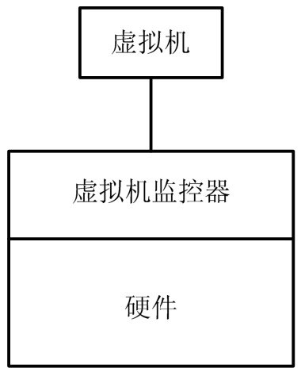

<!-- @import "[TOC]" {cmd="toc" depthFrom=1 depthTo=6 orderedList=false} -->

<!-- code_chunk_output -->

- [1. 虚拟环境的组成](#1-虚拟环境的组成)
- [2. 特权指令和敏感指令](#2-特权指令和敏感指令)
- [3. 虚拟环境的简单实现](#3-虚拟环境的简单实现)
- [4. 虚拟化漏洞](#4-虚拟化漏洞)
- [5. 虚拟化漏洞的解决办法](#5-虚拟化漏洞的解决办法)

<!-- /code_chunk_output -->

# 1. 虚拟环境的组成

一般, **虚拟化环境**由**三个部分**构成: **硬件**、**VMM** 和**虚拟机**.

虚拟环境的组成:

如图. 在**没有虚拟化**时, **操作系统直接运行在硬件**上, 管理着**底层物理硬件**, 构成一个完整的计算机系统, 即"物理机".

**虚拟环境**中, **虚拟机监控器 VMM**抢占了**操作系统的位置**, 变成真实物理硬件的管理者, 同时向上层软件呈现出虚拟的硬件平台, 欺骗上层操作系统. 而操作系统运行在虚拟平台上, 仍管理着它认为是"物理硬件"的虚拟硬件, 这就是图中的"虚拟机".

上面蕴含了三层含义(**同质**、**高效**和**资源受控**).

# 2. 特权指令和敏感指令

先从**指令**开始着手介绍.

多数现代计算机体系结构都有**两个或以上的特权级**, 用来分隔系统软件和应用软件.

系统中一些操作和管理**关键系统资源的指令**会被定为**特权指令**, 这些指令只有在**最高特权级上正确执行(！！！不是说只能在最高级别运行！！！**). 在**非最高特权级**上, **特权指令**会引发一个异常, 处理器会陷入最高特权级, 交给系统软件来处理.

在**不同的运行级**上, 不仅**指令的执行效果**是不同的, 而且**不是！！！所有特权指令都会发生异常(！！！**). 例如一个 x86 平台的用户违反规范, 在**用户态修改 EFLAGS 寄存器**的**中断位**, 这一修改**不会产生任何效果**, 也**不会引起异常陷入**, 而是会**被硬件直接忽略**.

在虚拟化里, 还有一类指令被称为**敏感指令**, 即**操作特权资源的指令**, 包括修改虚拟机的运行模式或下面物理机的状态; 读写敏感的寄存器或内存, 例如时钟或中断寄存器; 访问存储保护系统、内存系统或地址重定位系统以及所有的 I/O 指令.

显然, **所有特权指令！！！**都是**敏感指令！！！**, 然而并**不是所有敏感指令！！！**都是**特权指令！！！**.

# 3. 虚拟环境的简单实现

为 VMM 可以**完全控制系统资源**, **不允许直接执行客户机操作系统的敏感指令(！！！包括了特权指令和敏感指令！！！**). 即, **敏感指令！！！**必须在**VMM 的监控审查下进行！！！**, 或**经由 VMM 来完成**.

如果一个系统上**所有敏感指令**都是**特权指令！！！**, 则能用一个很简单的方法实现一个虚拟环境: 将**VMM 运行在最高特权级**, **客户机 OS**运行在**非最高特权级**上, 当**客户机 OS**因执行**敏感指令(此时, 也是特权指令**)而**陷入到 VMM**时, **VMM 模拟执行引起异常的敏感指令！！！**, 这种方法叫"**陷入再模拟**".

# 4. 虚拟化漏洞

总之, 判断**一个结构是否可以虚拟化**, 其核心在于该结构**对敏感指令的支持**上. 如果在**某些结构**上**所有敏感指令都是特权指令！！！**, 则它是**可虚拟化的结构**; 否则, 如果它无法支持**在所有敏感指令！！！上触发异常**, 则**不是一个可虚拟化的结构**, 我们称存在"**虚拟化漏洞**".

通过**陷入再模拟敏感指令**的方法是有前提条件的: **所有敏感指令必须都是特权指令**. 否则, 要么**系统的控制信息**会**被虚拟机修改或访问**, 要么**VMM**会**泄露需要模拟的操作**, 影响虚拟化的正确性.

# 5. 虚拟化漏洞的解决办法

1) 半虚方式, 这个很大程度也算软件辅助. 修改操作系统的源码来与下层虚拟化管理层软件协同工作

2) **所有指令解释执行**. 最简单最直接的方法是, 如果**所有虚拟化都采用模拟来实现(！！！**), 例如**解释执行**, 就是**取一条指令**, **模拟出这条指令执行的效果**, 再**继续取下一条指令(！！！所有指令, 无论是否敏感指令！！！**), 那么就**不存在所谓陷入不陷入**的问题, 从而避免了虚拟化漏洞. 这种方法不但能适用于模拟与物理机相同体系结构的虚拟机, 而且也能模拟不同体系结构的虚拟机. 这种方法保证了所有指令执行收到 VMM 的监管, 但它对每条指令不区别对待, 最大缺点是**性能太差**, 不符合虚拟机"高效"特点.

既要填补**虚拟化漏洞**, 又要保证**虚拟化性能**, 只能采取一些**辅助手段**.

3) **硬件辅助手段**. 直接**在硬件层面填补虚拟化漏洞！！！**

4) **软件辅助**. 通过**软件**的方法**避免虚拟机中使用无法陷入的敏感指令！！！**.

5) **半虚方式**, 这个很大程度也算软件辅助
