<!-- @import "[TOC]" {cmd="toc" depthFrom=1 depthTo=6 orderedList=false} -->

<!-- code_chunk_output -->

- [1. 虚拟化目标](#1-虚拟化目标)
- [2. 按虚拟化技术分类](#2-按虚拟化技术分类)
  - [2.1. 完全虚拟化](#21-完全虚拟化)
    - [2.1.1. 软件辅助的完全虚拟化](#211-软件辅助的完全虚拟化)
      - [2.1.1.1. 优先级压缩(Ring Compression)](#2111-优先级压缩ring-compression)
      - [2.1.1.2. 二进制代码翻译(Binary Translation)](#2112-二进制代码翻译binary-translation)
      - [2.1.1.3. QEMU](#2113-qemu)
    - [2.1.2. 硬件辅助完全虚拟化](#212-硬件辅助完全虚拟化)
      - [2.1.2.1. 发展以及现状](#2121-发展以及现状)
  - [2.2. 类虚拟化/半虚拟化](#22-类虚拟化半虚拟化)
- [3. 按 VMM 实现结构分类](#3-按-vmm-实现结构分类)
  - [3.1. Hypervisor 模型](#31-hypervisor-模型)
    - [3.1.1. Hypervisor 模型的优点](#311-hypervisor-模型的优点)
      - [3.1.1.1. 高性能](#3111-高性能)
      - [3.1.1.2. 高效的资源管理](#3112-高效的资源管理)
      - [3.1.1.3. 安全性高](#3113-安全性高)
    - [3.1.2. Hypervisor 模型的缺点](#312-hypervisor-模型的缺点)
      - [3.1.2.1. 开发和维护难度大](#3121-开发和维护难度大)
      - [3.1.2.2. 硬件依赖性强](#3122-硬件依赖性强)
      - [3.1.2.3. 缺乏通用性](#3123-缺乏通用性)
  - [3.2. 宿主模型](#32-宿主模型)
    - [3.2.1. 宿主模型的优点](#321-宿主模型的优点)
      - [3.2.1.1. 兼容性好](#3211-兼容性好)
      - [3.2.1.2. 易于部署和使用](#3212-易于部署和使用)
      - [3.2.1.3. 成本低](#3213-成本低)
      - [3.2.1.4. 灵活性高](#3214-灵活性高)
    - [3.2.2. 宿主模型的缺点](#322-宿主模型的缺点)
      - [3.2.2.1. 性能损失](#3221-性能损失)
      - [3.2.2.2. 实时性方面](#3222-实时性方面)
      - [3.2.2.3. 安全性相对较低](#3223-安全性相对较低)
  - [3.3. 混合模型](#33-混合模型)
    - [3.3.1. 混合模型的优点](#331-混合模型的优点)
    - [3.3.2. 混合模型的缺点](#332-混合模型的缺点)

<!-- /code_chunk_output -->

# 1. 虚拟化目标

最理想的虚拟化的两个目标如下:

1) 客户机完全不知道自己运行在虚拟化环境中, 还以为自己运行在原生环境里.

2) 完全不需要 VMM 介入客户机的运行过程.

# 2. 按虚拟化技术分类

根据 **VMM 提供的虚拟平台类**型可将 VMM 分成两类:

第一类. VMM 虚拟的是**现实存在的平台**, 并且在**客户机操作系统**来看, **虚拟的平台**和**现实的平台是一样**的, **客户机操作系统**察觉不到是运行在一个虚拟平台上. 这样的虚拟平台可以运行现有的操作系统, **无须对操作系统进行修改**, 因此称为**完全虚拟化**(`Full Virtualization`).

第二类. VMM 虚拟的是**现实中不存在的平台**, 而是经过 **VMM 重新定义**的, 这种虚拟化平台需要对所运行的**客户机操作系统**进行或多或少的**修改**使之适应虚拟环境, 因此**客户机 OS 知道其运行在虚拟平台**上, 并且会去主动适应. 这种称为**类虚拟化**(`Para Virtualization`).

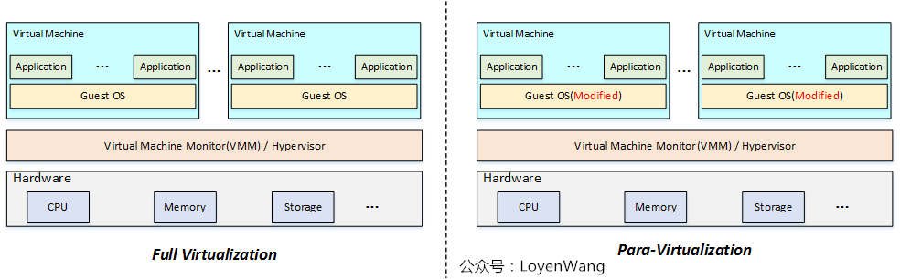

另外, 一个 VMM 既可以提供完全的虚拟化的虚拟平台, 又提供类虚拟化的虚拟平台.

## 2.1. 完全虚拟化

客户 OS 无须修改就可以运行. 所以客户 OS 会像操作正常的处理器、内存、I/O 设备一样来操作虚拟处理器、虚拟内存和虚拟 I/O 设备. 从实现角度看, **客户机的行为**是通过**指令**反映出来的, 因此 VMM 需要能**正确处理所有可能的命令！！！**.

对于完全虚拟化来说, **所有可能的指令**是指所虚拟的处理器其**手册规范**上定义的**所有指令**.

实现上, 以 x86 架构为例, **完全虚拟化**经历了两个阶段: **软件辅助的完全虚拟化**和**硬件辅助的完全虚拟化**

### 2.1.1. 软件辅助的完全虚拟化

软件虚拟化, 顾名思义, 就是通过软件模拟来实现 VMM 层, 通过纯软件的环境来模拟执行客户机里的指令.

架构图:

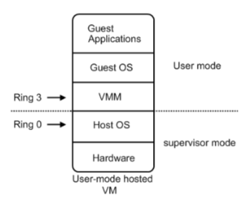

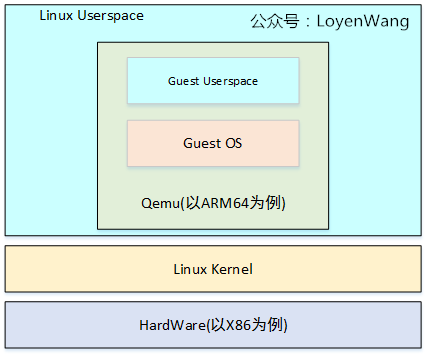

在 Intel 等 CPU 厂商还没有发布**x86 CPU 虚拟化技术之前**, **完全虚拟化**都是通过**软件辅助**的方式来实现的.

软件辅助的全虚拟化主要是用了**优先级压缩**(`Ring Compression`)和**二进制代码翻译**(`Binary Translation`)两种机制相结合.

#### 2.1.1.1. 优先级压缩(Ring Compression)

**优先级压缩**的原理是:

从上述的软件辅助全虚拟化架构图中可以看出, **VMM**、**GuestOS**、**Guest Applications** 都是运行在 **Ring 1-3 用户态(！！！VMM 也处于用户态！！！**)中的应用程序代码. 当在**GuestOS**中执行**系统内核的特权指令**时, 一般都会**触发异常！！！**. 这是因为**用户态代码**不能直接运行在**核心态**中, 而且**系统内核的特权指令**大多都**只能运行在 Ring 0 核心态**中. 在**触发了异常**之后, 这些**异常就会被 VMM 捕获**, 再由**VMM！！！**将这些**特权指令！！！**进行**虚拟化**成为**只针对虚拟 CPU 起作用(！！！**)的**虚拟特权指令！！！**. 其本质就是使用**若干能运行在用户态中的非特权指令(！！！**)来**模拟**出**只针对 GuestOS 有效的虚拟特权指令**, 从而将特权指令的特权解除掉.

由于**VMM**和**客户机**运行在**不同特权级**上, 对应到**x86**上, 通常是**VMM 运行在 Ring 0**, **客户机 OS 内核**运行在**Ring 1**, **客户机 OS 应用程序**运行在**Ring 3**. 当**客户机 OS 内核**执行**相关特权指令**时, 由于在**非特权的 Ring 1**, 因此通常**触发异常**, **VMM 截获**该**特权指令**并进行**虚拟化**.

**Ring Compression**能正确处理**大部分特权指令**, 但是由于**x86 指令体系**在**设计之初**并**没有考虑到虚拟化**, 因此**有些指令**还是**不能通过 Ring Compression 正常处理**, 即在**Ring 1 做特权操作**的时候却**没有触发异常(比如修改 EFLAGES 的 IF 标志**), 从而 VMM 不能截获并做相应处理.

缺点: 但是特权解除的问题在于当初设计**标准 x86 架构 CPU**时, 并没有考虑到要支持虚拟化技术, 所以会存在**一部分特权指令**运行在**Ring 1 用户态**上, 而这些运行在 Ring 1 上的特权指令并**不会触发异常然后再被 VMM 捕获(！！！有些特权指令不会被 VMM 捕获！！！**). 从而导致在**GuestOS**中执行的**特权指令直接对 HostOS**造成了影响(GuestOS 和 HostOS 没能做到**完全隔离**).

#### 2.1.1.2. 二进制代码翻译(Binary Translation)

**二进制代码翻译方法**因此被引入来处理这些**虚拟化不友好的指令**.

就是**VMM**会对**GuestOS**中的**二进制代码(运行在 CPU 中的代码！！！**)进行**扫描！！！**, 一旦发现**GuestOS**执行的**二进制代码**中包含有**运行在用户态上的特权指令二进制代码**时, 就会将这些二进制代码翻译成**虚拟特权指令二进制代码(！！！**)或者是**翻译成运行在核心态中的特权指令！！！二进制代码从而强制的触发异常！！！**. 这样就能够很好的解决了运行在**Ring 1 用户态上的特权指令没有被 VMM 捕获！！！**的问题, 更好的实现了 GuestOS 和 HostOS 的隔离.

简而言之, **软件辅助虚拟化**能够成功的将所有在**GuestOS**中执行的**系统内核特权指令**进行**捕获、翻译**, 使之成为只能对 GuestOS 生效的虚拟特权指令. 但是退一步来说, 之所以需要这么做的前提是因为**CPU**并不能准确的去判断**一个特权指令！！！**到底是由**GuestOS 发出！！！**的还是由**HostOS 发出！！！**的, 这样也就**无法针对一个正确的 OS**去**将这一个特权指令执行**.

二进制代码翻译的思想很简单, 就是通过**扫描并修改客户机的二进制代码**, 将**难以虚拟化的指令**转化为**支持虚拟化的指令**.

**VMM**通常会对**OS**的**二进制代码进行扫描**, 一旦发现**需要处理的指令**, 就将其翻译成**支持虚拟化的指令块(Cache Block**). 这些**指令块**可以与 VMM 合作**访问受限的虚拟资源！！！**, 或**显式地触发异常！！！** 让 VMM 进一步处理.

此外, 由于**该技术可以修改客户机的二进制代码**, 因此别广泛应用于**性能优化！！！**, 即将某些**造成性能瓶颈的指令**替换成**更高效的指令**来提高性能.

这种方式很难**在架构上保证其完整性**, 因此, 后来 CPU 厂商们发布了能够**判断特权指令归属！！！**的**标准 x86 CPU**之后, 迎来了**硬件辅助全虚拟化**.

#### 2.1.1.3. QEMU

最纯粹的软件虚拟化实现当属 QEMU.

在没有启用硬件虚拟化辅助的时候, 它通过软件的二进制翻译仿真出目标平台呈现给客户机, 客户机的每一条目标平台指令都会被 QEMU 截取, 并翻译成宿主机平台的指令, 然后交给实际的物理平台执行.

由于每一条都需要这么操作一下, 其虚拟化性能是比较差的, 同时其软件复杂度也大大增加. 但好处是可以呈现各种平台给客户机, 只要其二进制翻译支持.

### 2.1.2. 硬件辅助完全虚拟化

很多问题, 如果在**本身的层次**上难以解决, 那通过**增加一个层次**, 在**其下面一个层次**就会变得容易解决.

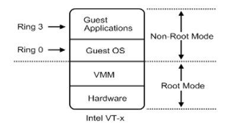

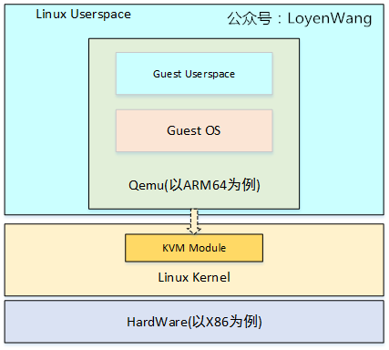

硬件辅助全虚拟化主要使用了**支持虚拟化功能**的**CPU**进行支撑, **CPU**可以明确的**分辨出**来自**GuestOS 的特权指令**, 并**针对 GuestOS 进行特权操作(！！！**), 而**不会影响到 HostOS**.

从更深入的层次来说, **虚拟化 CPU**形成了**新的 CPU 执行状态** —— **Non\-Root Mode& Root Mode**. 从上图中可以看见, **GuestOS(！！！**)运行在**Non\-Root Mode** 的**Ring 0 核心态**中, 这表明**GuestOS**能够**直接执行特却指令**而不再需要 **特权解除** 和 **陷入模拟** 机制. 并且在**硬件层**上面紧接的就是**虚拟化层的 VMM**, 而**不需要 HostOS！！！**. 这是因为在**硬件辅助全虚拟化的 VMM** 会以一种更具协作性的方式来实现虚拟化 —— 将**虚拟化模块**加载到**HostOS 的内核**中, 例如: KVM, KVM 通过在 HostOS 内核中加载 KVM Kernel Module 来将**HostOS 转换成为一个 VMM！！！**. 所以此时**VMM 可以看作是 HostOS, 反之亦然**.

硬件辅助虚拟化就是这样一种方式, 既然 OS 是硬件上最后一层系统软件, 如果**硬件本身加入足够的虚拟化功能**, 让客户机指令独立执行, 而不需要(严格来说是不完全需要)VMM 截获重定向, 仅仅**截获 OS 对敏感指令的执行**或**对敏感资源的访问**, 再通过异常方式报告给 VMM, 这就解决了虚拟化的问题.

Intel 的 VT\-x 技术就是这样. VT\-x 在处理器上**新引入了一个新的执行模式**用于**运行虚拟机**. 当虚拟机执行在这个特殊模式中时, 它仍然面对的是**一套完整的处理器寄存器集合和执行环境**, 只是对任何特权操作都会被处理器截获并报告给 VMM. VMM 本身运行在正常模式下, 在接收到处理器的报告后, 通过对目标指令的解码, 找到对应的虚拟化模块进行模拟, 并把最终的效果反映在特殊模式下的环境中.

硬件辅助虚拟化是一种完备的虚拟化方法, 因为内存和外设的访问本身也是由指令来承载, 对处理器指令级别的截获意味 VMM 可以模拟一个与真实主机完全一样的环境.

#### 2.1.2.1. 发展以及现状

与半虚拟化相反的, **全虚拟化(Full Virtualization**)坚持第一个理想化目标: **客户机的操作系统完全不需要改动**. 敏感指令在操作系统和硬件之间被 VMM 捕捉处理, 客户操作系统无须修改, 所有软件都能在虚拟机中运行. 因此, 全虚拟化需要模拟出完整的、和物理平台一模一样的平台给客户机, 这在达到了第一个目标的同时也增加了虚拟化层(VMM)的复杂度.

性能上, 2005 年硬件虚拟化兴起之前, 软件实现的全虚拟化完败于 VMM 和客户机操作系统协同运作的半虚拟化, 这种情况一直延续到 2006 年. 之后以 Intel VT\-x、VT\-d 为代表的硬件虚拟化技术的兴起, 让由硬件虚拟化辅助的全虚拟化全面超过了半虚拟化. 但是, 以 virtio 为代表的半虚拟化技术也一直在演进发展, 性能上只是略逊于全虚拟化, 加之其较少的平台依赖性, 依然受到广泛的欢迎.

## 2.2. 类虚拟化/半虚拟化

两个虚拟化目标中, 纯软件的虚拟化可以做到第一个目标, 但性能不是很好, 而且软件设计的复杂度大大增加.

那么如果放弃第一个目标呢? 让客户机意识到自己是运行在虚拟化环境里, 并做相应修改以配合 VMM, 这就是半虚拟化(Para\-Virtualization).

- 一方面, 可以提升性能和简化 VMM 软件复杂度;

- 另一方面, 也不需要太依赖硬件虚拟化的支持, 从而使得其软件设计(至少是 VMM 这一侧)可以跨平台且是优雅的.

通过在 **GuestOS 源代码级别修改指令**以**回避虚拟化漏洞的方式**来使 VMM 能够对物理资源实现虚拟化.

x86 的难以虚拟化的指令, **完全虚拟化**通过**Binary Translation**在二进制代码级别上**避免虚拟化漏洞**. **类虚拟化**采用另一种思路, 即**修改操作系统的内核**(即 API 级), 使得操作系统内核完全**避免这些难以虚拟化的指令**. 操作系统通常会用到处理器提供的所有功能, 例如特权级别、地址空间和控制寄存器等.

**类虚拟化**首先解决的问题就是**如何插入 VMM**. 典型做法是修改操作系统的处理器相关代码, 让操作系统主动让出特权级别, 而运行在次一级特权级. 这样, 当操作系统试图执行特权指令时, 保护异常被触发, 从而提供截获点给 VMM 来模拟.

既然内核代码需要被修改, 类虚拟化可以进一步用来**优化 I/O**. 即, **类虚拟化不是去模拟真实设备**, 因为太多寄存器模拟会影响性能. 相反, 类虚拟化可以定义出高度优化的 I/O 协议. 这种 I/O 协议**完全基于事务**, 可以达到近物理机的速度.

"本质上, 准虚拟化弱化了对虚拟机特殊指令的被动截获要求, 将其转化成客户机操作系统的主动通知. 但是, 准虚拟化需要修改客户机操作系统的源代码来实现主动通知. "典型的半虚拟化技术就是**virtio**, 使用 virtio 需要在宿主机/VMM 和客户机里都相应地装上驱动.

**修改内核**后的 **GuestOS** 也**知道**自己就是一台**虚拟机**. 所以能够很好的对**核心态指令**和**敏感指令**进行识别和处理, 但缺点在于 **GuestOS 的镜像文件并不通用**.

# 3. 按 VMM 实现结构分类

根据 VMM 在整个物理系统中(或上一层虚拟机系统中)实现位置及实现方法的不同, 系统虚拟机的模型可以分为 **监控模型**(Hypervisor/standalone Model, 或者叫**独立模型**)、**宿主模型**(Host-based Model)和**混合模型**(Hybrid Model), 如下图所示.

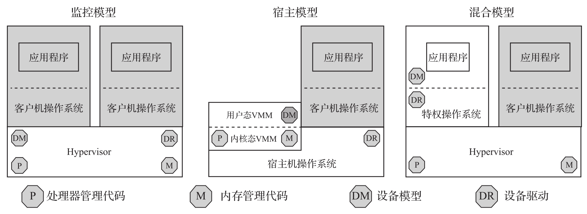

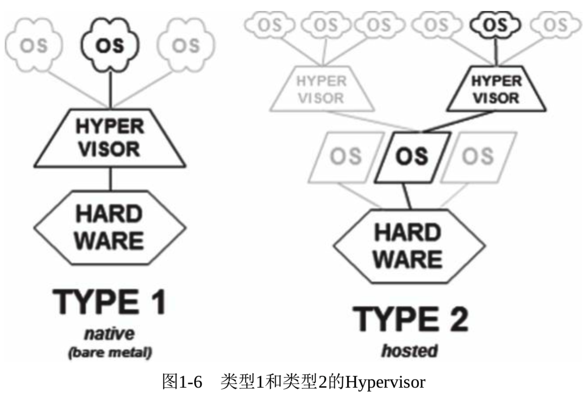

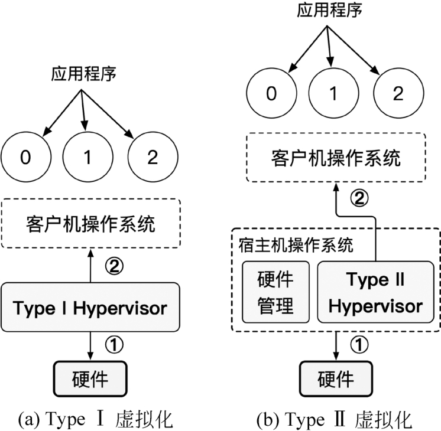

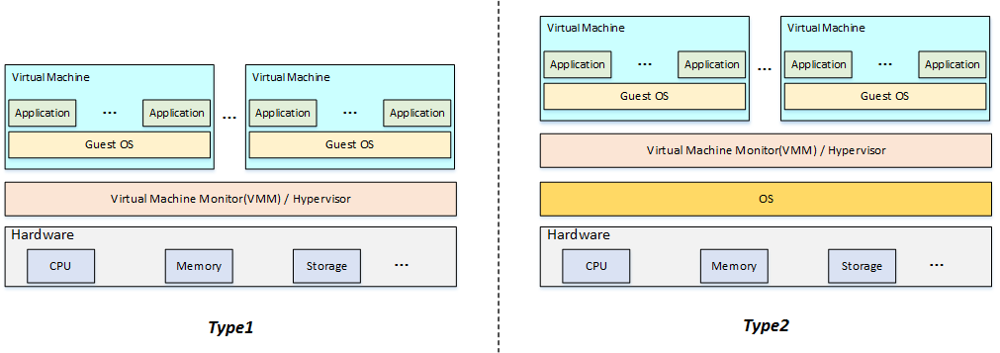

如果按照传统仅仅划分 Type 1 和 Type 2, 标准只有一个, VMM 能否独立运行在硬件上. 那么 Xen 就是 type 1

## 3.1. Hypervisor 模型

没有宿主机 OS, Hypervisor 直接运行在硬件上

在 Hypervisor 模型中, **VMM** 首先可被看作是一个**完备的操作系统！！！**直接运行在**硬件**上, 不过和传统 OS 不同, **VMM 为虚拟化而设计**的, 因此还**具备虚拟化功能**. 也常常被称为**一型虚拟机监控器**(Type-1 Hypervisor)模型, 又被称为**裸机虚拟机监控器**(`Bare-metal Hypervisor`).

典型地如 **Xen** 和 **VMware ESX**.

从架构看,

- 首先, **VMM 直接管理所有物理资源**, 包括处理器、内存和 I/O 设备, 所以 **处理器管理代码**, **内存管理代码**, **设备模型** 和 **设备驱动**也是 **VMM 的一部分**;

- 其次, VMM 需要**向上提供虚拟机**用于**运行客户操作系统**, 因此, **VMM 负责虚拟环境的创建和管理**.

图 3-9 展示了 Hypervisor 的架构:

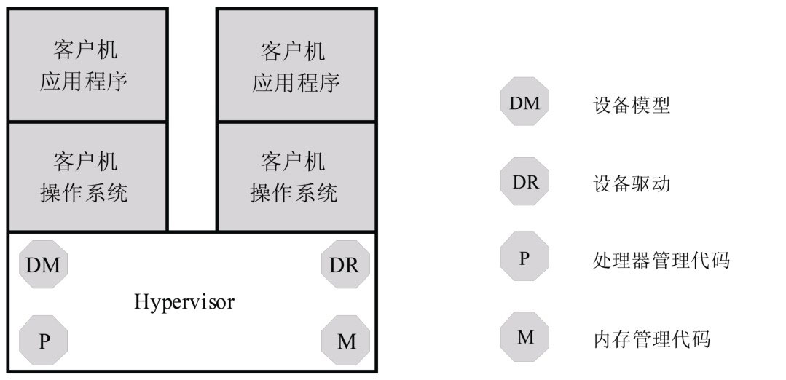

- **处理器管理代码**(Processor, P)负责**物理处理器的管理和虚拟化！！！**,

- **内存管理代码**(Memory, M)负责**物理内存的管理和虚拟化！！！**,

- **设备模型**(Device Model, DM)负责**I/O 设备的虚拟化**,

- **设备驱动**(Device Driver, DR)负责**I/O 设备的驱动**, 即**物理设备的管理**.

### 3.1.1. Hypervisor 模型的优点

#### 3.1.1.1. 高性能

直接运行在硬件之上, 无需中间层操作系统, 减少了软件开销. 虚拟机可以更直接地访问硬件资源, 如 CPU、内存、存储和网络设备, 从而提供接近物理机的性能.

由于 VMM 同时具备**物理资源的管理功能**和**虚拟化功能**, 所以, **物理资源虚拟化效率更高**.

#### 3.1.1.2. 高效的资源管理

可以直接控制硬件资源, 根据虚拟机的需求进行动态分配和调度. 能够实时监控资源使用情况, 将空闲资源分配给需要的虚拟机, 提高资源利用率.

#### 3.1.1.3. 安全性高

由于其架构简单, 直接管理硬件, 减少了潜在的安全风险点. 同时, Type 1 Hypervisor 通常具备强大的安全机制, 如访问控制、加密和安全审计等功能.

**虚拟机的安全只依赖 VMM 的安全**. 宿主模型中同时依赖 **VMM** 和**宿主机 OS** 的安全.

### 3.1.2. Hypervisor 模型的缺点

Hypervisor 模型拥有虚拟化高效率同时也有缺点.

#### 3.1.2.1. 开发和维护难度大

需要深入了解硬件底层知识和操作系统原理, 开发成本高、周期长.

由于 VMM 完全拥有物理资源, 因此, VMM 需要进行**物理资源的管理**, 包括**设备的驱动**. 设备驱动工作量很大, 所以基于 Hypervisor 模型的 VMM 通常根据市场定位, **选择一些 I/O 设备来支持**, 而**不是所有**.

此外, 很多功能必须在 VMM 中**重新实现**, 例如**调度和电源管理等**以及**各种设备驱动**, 无法像宿主模型那样借助宿主机 OS.

#### 3.1.2.2. 硬件依赖性强

不同的硬件平台需要不同的 Hypervisor 版本, 更换硬件时可能需要重新部署和配置.

(硬件以及驱动需要重新初始化)

#### 3.1.2.3. 缺乏通用性

通常是为特定的应用场景和硬件环境设计的, 难以在不同的系统之间进行移植和共享.

(驱动代码/硬件资源管理需要写)

## 3.2. 宿主模型

常常被称为二型虚拟机监控器(Type-2 Hypervisor)模型, 典型的产品有 VMware Workstation、VMware Fusion、KVM、Intel HAXM.

它是 宿主机操作系统 的一部分

* **运行在一个宿主机操作系统之上**, 比如 **VMware Workstation** 就是运行在 **Windows 或者 Linux 操作系统**上的**一个程序**而已;

* 或 **运行在一个系统里**, 如 KVM.

这类 Hypervisor 通常就是**宿主机操作系统的一个应用程序**, 像其他应用程序一样受宿主机操作系统的管理. **客户机**是在**宿主机操作系统**上的**一个抽象**, 通常抽象为**进程**.

- **物理资源**由**宿主机 OS 管理**. **宿主机 OS**并**不是为虚拟化设计**的, 因此本身不具备虚拟化功能, 有些实现中还包括**用户态进程**, 如负责 I/O 虚拟化的用户态设备模型.

- **VMM**通过调用**宿主机 OS**的服务来**获得资源**, 实现处理器、内存和 I/O 设备的虚拟化. VMM 创建虚拟机后, 通常**将虚拟机**作为**宿主机 OS**的**一个进程**参与调度.

图 3\-10 显示宿主模型架构.

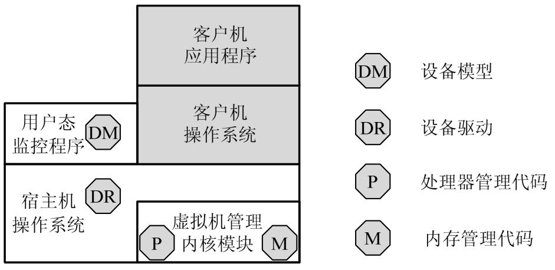

- **宿主机 OS**拥有**所有物理资源**, 包括 I/O 设备, 所以**设备驱动位于宿主机操作系统**中.
- **VMM**(图中**虚拟机管理内核模块**)则包含**处理器虚拟化模块**和**内存虚拟化模块**.

图中**设备模型**实际也是**VMM 一部分**, 具体实现中, 可将**设备模型放在用户态**, 也可放在**内核态**.

宿主模型的VMM通常由内核态VMM和用户态VMM共同合作完成对虚拟平台的模拟, 如VMware Workstation和Linux操作系统上的KVM虚拟机监控器.

### 3.2.1. 宿主模型的优点

宿主模型的**优缺点**和 Hypervisor 模型**恰好相反**.

#### 3.2.1.1. 兼容性好

**宿主模型**最大优点是能充分利用**现有 OS 的设备驱动程序**, **VMM**无须为各类 I/O 设备重新实现驱动程序, 可以专注于**物理资源的虚拟化**.

此外, 宿主模型也可利用**宿主机 OS**的其它功能, 例如调度和电源管理等, 这都**不需要 VMM 重新实现**.

#### 3.2.1.2. 易于部署和使用

运行在现有的操作系统之上, 无需对硬件进行特殊配置, 用户可以在常见的桌面操作系统（如 Windows、Linux）上轻松安装和使用.

#### 3.2.1.3. 成本低

不需要专门的硬件支持, 也无需购买昂贵的服务器级软件许可证, 降低了部署和使用成本.

#### 3.2.1.4. 灵活性高

可以根据需要随时创建、删除和调整虚拟机的配置, 无需重启物理机.

### 3.2.2. 宿主模型的缺点

#### 3.2.2.1. 性能损失

由于运行在底层操作系统之上, 虚拟机与硬件之间增加了一层软件抽象, 会引入一定的性能开销.

* **硬件访问间接性**: Type 2 hypervisor 运行在传统操作系统之上, **虚拟机**对**硬件**的访问需通过**底层操作系统**, 这会带来额外的软件层开销, 导致数据传输和指令执行的延迟增加, 降低整体性能.

* **资源管理非直接**: 底层操作系统已管理系统资源, Type 2 hypervisor 需**与操作系统协调**, 协调过程会消耗一定的时间和计算资源, 难以像 Type 1 hypervisor 那样直接高效地分配和调度资源.

#### 3.2.2.2. 实时性方面

* **操作系统调度干扰**: **底层操作系统**有**自己的调度策略**, 会根据**系统负载**等因素**分配 CPU 时间片**, 这可能使 Type 2 hypervisor 无法及时响应虚拟机内的实时任务请求, 导致实时任务的执行出现延迟.

* **中断处理延迟**: **外部设备中断**需**先由底层操作系统接收和初步处理**, 再传递给 Type 2 hypervisor 及虚拟机, 多环节处理会增加中断响应和处理的时间, 影响实时性.

#### 3.2.2.3. 安全性相对较低

虚拟机的安全同时依赖 **VMM 和宿主机 OS 的安全**.

* **架构层级风险**: 由于位于底层操作系统之上, 若**底层操作系统**存在漏洞**被攻击者利用**, 可能突破操作系统防线进一步攻击 **Type 2 hypervisor** 及虚拟机, 安全风险增加.

* **隔离性相对较弱**: Type 2 hypervisor **借助底层操作系统**的部分功能实现资源管理和隔离, 不如 Type 1 hypervisor **直接管理硬件实现**的隔离性强, **虚拟机之间**或**与底层系统之间**可能存在数据泄露等安全隐患.

## 3.3. 混合模型

**VMM 仍然在最底层**, 拥有**所有物理资源**.

与 Hypervisor 不同的是, VMM 会主动让出**大部分 I/O 设备的控制权**, 将他们交给一个运行在**特权虚拟机**中的**特权操作系统**来控制.

相应地, VMM 虚拟化的职责也被分担. **CPU 和内存的虚拟化**仍然是**VMM**完成, 而 **I/O 虚拟化**由 **VMM 和特权操作系统共同合作**完成.

它的典型代表是微软公司的 Hyper-V 和 Citrix 公司的 Xen 开源 Hypervisor.

下图显示混合模型.

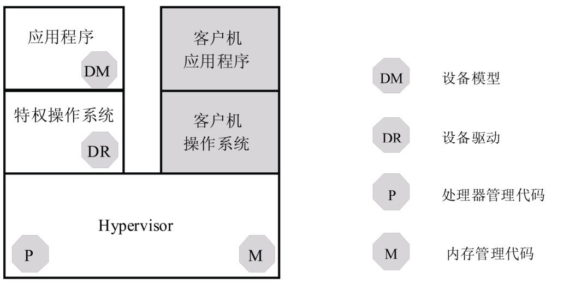

- **I/O 设备**由**特权操作系统**控制, 因此, **设备驱动模块**位于**特权操作系统**中.

- **其它物理资源**的管理和虚拟化由 **VMM** 完成, 因此, **处理器管理代码**和**内存管理代码**在 VMM 中.

**I/O 设备的虚拟化**由 **VMM** 和**特权操作系统**共同完成, 因此, **设备模型模块**位于特权操作系统中, 并且通过相应的通信机制与 VMM 合作.

### 3.3.1. 混合模型的优点

混合模型集中了**上面两种模型的优点**.

VMM 既可利用**现有 OS 的 I/O 设备驱动**. VMM 直接控制处理器、内存等物理资源, 虚拟化效率比较高.

安全性上, 对**特权 OS** 的**权限控制得当**, 虚拟机**安全性只依赖 VMM**.

### 3.3.2. 混合模型的缺点

**特权 OS**运行在**虚拟机上**, 当需要**特权 OS 提供服务**时, VMM 需要**切换**, 产生上下文切换开销. **切换频繁**时, **上下文切换开销**会造成性能的明显下降.

出于**性能考虑**, 很多功能还是必须在 VMM 中实现, 无法借助特权 OS, 如调度程序和电源管理等.
