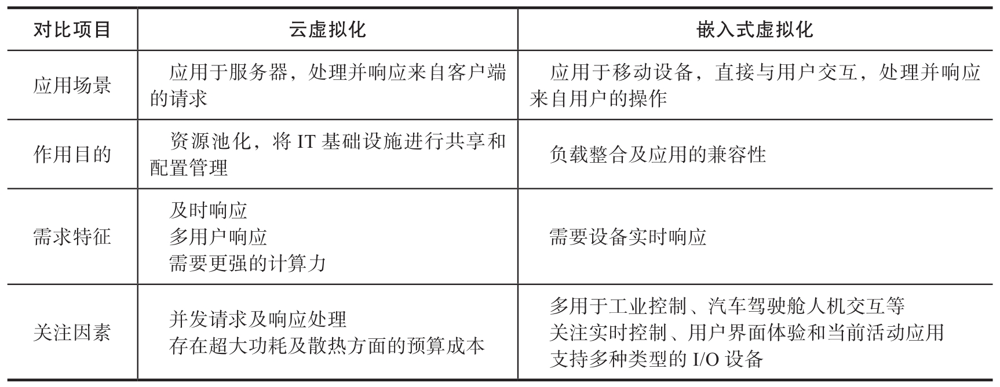
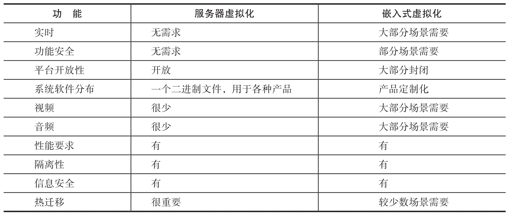

# 1. 云虚拟化

# 2. 云虚拟化和嵌入式虚拟化

云虚拟化和嵌入式虚拟化采用的虚拟化技术是一样的, 但并不是把云平台上的 VMM 直接照搬运行在嵌入式系统上, 它就变成了嵌入式虚拟化 VMM.

云虚拟化是指在数据中心采用服务器虚拟化技术构建云计算平台, 主要用于数据中心物理资源的池化, 从而可以弹性地分配资源给用户. 虚拟服务器主要与客户端交互, 处理并响应来自客户端的请求; 嵌入式虚拟化是指在嵌入式终端设备上通过虚拟化技术构建终端计算平台, 允许多个操作系统或者虚拟机同时运行在终端设备上来共享硬件资源, 虚拟终端直接与用户进行交互, 处理并响应用户的操作请求.

下面就两者在应用场景, 作用目的, 需求特征及关注因素等方面进行简单对比, 如下表.

目前, 嵌入式虚拟化面临的挑战依然是虚拟化技术本身所带来的开销问题. 首先, 从硬件辅助虚拟化的角度来讲, 能够提供硬件加速支持的设备颇为有限, 以多媒体设备为例, 日益增长的设备类型使各类多媒体设备层出不穷, 造成 VT-d 或 SR-IOV 等技术对多媒体设备的支持远远不足, 从这一点来讲, 即便是在服务器端目前也尚未得到有效支持. 其次, 从软件完全虚拟化的角度来讲, 由于 I/O 虚拟化所带来的巨大开销令 I/O 虚拟化软件解决方案难担重任, 对于一般外设的虚拟化, 通常在性能上有 10%～30% 的额外开销, 而对于多媒体设备, 这种额外开销更为突出, 有时竟能达到超过 80% 的额外开销用于 I/O 虚拟化, 与此同时, 电量使用时间和电池寿命也会相应缩短 20% 左右, 以上这些因素都给嵌入式虚拟化带来了不小的挑战.

下表尝试把服务器虚拟化和嵌入式虚拟化所需要的功能进行对比, 可以看到现有的服务器虚拟化技术并不适应嵌入式设备的特殊需求, 嵌入式虚拟化面临特殊的挑战, 需要在现有虚拟化技术的基础上专门进行开发和定制.

# 3. 嵌入式虚拟化

## 3.1. 场景

下面列出几种典型的嵌入式虚拟化场景, 本书后面的章节也会进行具体案例分析.

数字孪生的实现. 借助虚拟化技术来实现智能数控系统, 不仅可以把传统数控系统在设备端侧各个分离的单独控制器整合到一个统一的设备中, 还可以通过数字孪生技术和云计算技术在云中构建此设备的数字实例.

工业场景下的机器视觉和机器控制系统整合. 通过虚拟机 VMM 来支持一个 Windows 的虚拟机运行机器视觉应用, 而另一个实时操作系统 RTOS 可以进行伺服马达的实时控制.

自主行驶机器人. 类似于工业场景下的机器视觉和机器控制系统的整合, 自主行驶的机器人利用 VMM 技术, 在同一个物理平台上同时运行两个实时操作系统, 一个操作系统负责机器人底盘的自主移动, 另一个操作系统用来支持机械臂的运动.

软件定义的数字驾驶舱. 通过虚拟机 VMM 可以在一套 x86 SoC 上运行两个操作系统, 一个 Linux 系统运行驾驶员需要的仪表盘系统, 另一个 Android 系统运行车载娱乐系统, 例如导航软件, 音乐播放等.

## 3.2. 特征

如前文所述, 虚拟化技术如今已经被广泛应用于嵌入式领域. 嵌入式 VMM 是支持嵌入式系统要求的 VMM. 与应用于服务器的 VMM 不同, 嵌入式 VMM 具有以下特征.

体积小. 出于对硬件成本以及技术实现的考量, 嵌入式系统的硬件资源通常是比较受限的. 因此, 嵌入式 VMM 应当尽可能轻量级且高效, 也就是说, 它的代码库应当小而精, 运行时占用的内存 (foot print) 也要尽可能小, 不应占据过多的硬件资源.

功能全面. 嵌入式系统的应用场景非常广泛, 不同的应用场景通常需要不同的设备支持, 这些设备包括 USB 设备, 显卡, UART 串口, 音频及视频设备, 蓝牙设备, 网络设备等. 因此, 嵌入式 VMM 需要支持这些设备在虚拟计算机中的使用, 同时, 当运行于不同虚拟计算机的操作系统需要访问相同设备时, 嵌入式 VMM 还需要支持设备共享.

实时性. 嵌入式系统通常有实时性的需求, 这样的系统被称为实时系统. 实时系统追求的是任务执行的时间确定性, 即在特定的时间范围内, 对某一事件 / 指令进行响应处理. 因此, 为了支持实时系统, 嵌入式 VMM 需要具有良好的实时响应能力, 尽可能降低由虚拟化引起的开销.

功能安全. 功能安全对于嵌入式系统也非常重要, 尤其是当这些系统被应用于汽车领域与工业领域时. 因此, 在设计嵌入式 VMM 时, 功能安全同样应当被考虑在内. 在嵌入式系统中, 会存在一些对安全性要求比较高 (Safety-critical) 的应用, 同时, 也会存在一些对安全性要求不太高 (Non-safety-critical) 的应用, 分配给这两类应用的硬件资源应当被有效隔离. 非安全关键的应用不应当对安全关键的应用产生干扰, 无论是空间上 (Spatial) 的干扰 (例如恶意地修改内存) 还是时间上 (Temporal) 的干扰(例如恶意地刷掉缓存)​. 嵌入式 VMM 的设计应当考虑这些功能安全的需求.

可适应性. 在服务器领域, 常见的操作系统主要是 Windows 与一些基于 Linux 的操作系统. 但是, 在嵌入式领域, VMM 通常需要支持很多不同类型的操作系统. 其中, 有些操作系统主要用于提供用户图形界面以及系统信息的管理与配置, 例如 Windows,Ubuntu,Android; 另外一些操作系统则主要用于实时任务的执行, 例如 VxWorks,Zephyr,Xenomai,PREEMPT_RT Linux; 还有一些操作系统主要用于检测系统运行状态, 在故障发生时将系统置于安全状态, 例如 Zephyr. 因此, 为了支持应用于嵌入式领域的多种多样的操作系统, 嵌入式 VMM 需要具有较强的可适应性, 它应当支持在不同的虚拟计算机内运行不同的操作系统, 从而使嵌入式领域的供应商可以非常方便地移植运行在这些操作系统上的应用程序.

传统的应用于云服务器的 VMM 并不适用于嵌入式领域, 主要有以下原因.

应用于服务器的 VMM 的代码库通常比较庞大, 对系统资源的要求也高(比如对内存和 CPU 的计算能力的要求)​, 同时也会占用较多的硬件资源.

应用于服务器的 VMM 在设计之初没有对功能安全的考量, 它的代码体量也使得增加后续的功能安全考量几乎不可能.

对于嵌入式系统来说, 应用于服务器的 VMM 会引起过多的虚拟化开销. 虚拟机之间的性能隔离, 特别是对于实时系统的实时性影响也是服务器的 VMM 难以克服的.

除此之外, 友好的软件许可证对于嵌入式 VMM 来说也至关重要, 它可以为嵌入式系统的供应商节约成本, 同时为他们保守商业秘密. 因此, 一个具有包容的许可证 (如 BSD/MIT) 的开源的嵌入式 VMM 对于嵌入式领域的供应商来说会是一个很好的选择, 可以大幅度地减少研发成本, 他们可以更多关注于系统集成及其产品的商业化.

# KVM

云计算是虚拟化技术最典型的应用场景, 而云服务器上最为成功的开源虚拟化项目则是 KVM (Kernel-based Virtual Machine). KVM 最初由初创公司 Qumranet 开发, 后来该公司被红帽收购. KVM 从 2006 年 10 月诞生起便受到了 Linux 社区的关注与欢迎, 仅在两个月后就被 Linux 内核主线接受 (代码补丁参见 https://lkml.org/lkml/2006/10/19/146), 并于 2007 年 2 月作为 Linux 内核 2.6.20 的一部分发布. 经历了逾 16 年的发展, 其支持的硬件平台从早期 Intel 和 AMD 的 x86 平台扩展到 Arm,PowerPC,S390,MIPS 等几乎所有硬件平台, 目前支持 RISC-V 平台的代码也正在社区讨论中. 随着这些硬件平台虚拟化功能的完善与发展, 越来越多的硬件虚拟化特性也被添加到 KVM 中, 例如 Intel 的 EPT,APIC-V,Posted Interrupt 等. 与此同时, 新的应用场景的需求也给 KVM 带来了更多软件特性, 例如热迁移, 嵌套虚拟化等. 此外, 在提升虚拟化性能的需求推动下, Linux 内核得以丰富和完善, 与此同时 KVM 也获益匪浅. 例如, 通过半虚拟化手段来提升虚拟设备性能的 virtio, 用于设备直通的 VFIO 等, 这些虽然都是独立于 KVM 的驱动模块, 但是应用场景和虚拟化密切相关, 从一开始设计就考虑到了 KVM 的需求. KVM 的成功使得主流的开源虚拟化管理平台 (例如 oVirt,OpenStack 等) 将其作为默认的 Hypervisor. 2017 年, 最大的云计算厂商 AWS 从 Xen 切换到 KVM 作为其云计算的 IaaS 引擎技术, KVM 逐渐成为主流云服务厂商 IaaS 产品的默认选择, 同时也是函数即服务 (Function as a Service, FaaS) 安全容器的首选. 每年一度的 KVM 论坛也已然成为虚拟化领域最受关注的盛会.

KVM 在服务器市场取得成功的同时, 工业界也有人开始思考将 KVM 用于**实时虚拟化**的可能性. 与通用操作系统不同的是, 实时系统更强调任务的确定性, 即要求任务总能在确定的时间限 (通常是**微秒级**) 之前做出响应. 为了将传统 Linux 改造为实时系统, 内核中做了大量的修改, 比如支持**实时调度器**, **内核抢占**, **优先级继承的互斥**等, 目前绝大多数修改已并入内核主线. 此外, 保证确定性往往意味着需要以**牺牲资源共享**为代价. 要运行实时虚拟化, 不仅需要宿主机操作系统 Linux 和客户机操作系统提供实时性支持, 还意味着需要通过使用场景的定制化来尽可能地减少 VM Exit 的次数. 众所周知, VM Exit 带来的上下文切换及在宿主机上进行模拟的开销是导致虚拟机响应延时的最主要因素, 比如虚拟 CPU(vCPU)和物理 CPU(pCPU)的绑定, 虚拟机内存预先分配, 限制虚拟机仅使用直通设备等. 尽管重构之后的 Linux 可以满足实时性要求, 但 KVM 仍尚未在实时性要求很高的嵌入式平台上得到广泛应用, 这其中还有一个不容忽视的原因是 Linux 内核庞大的代码量. 目前, Linux 内核已有千万行代码, 如此庞大的代码量不仅意味着更大的攻击面, 同时其安全认证开销也是嵌入式平台难以负担的.
