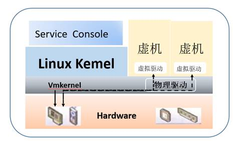
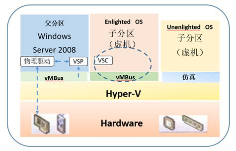
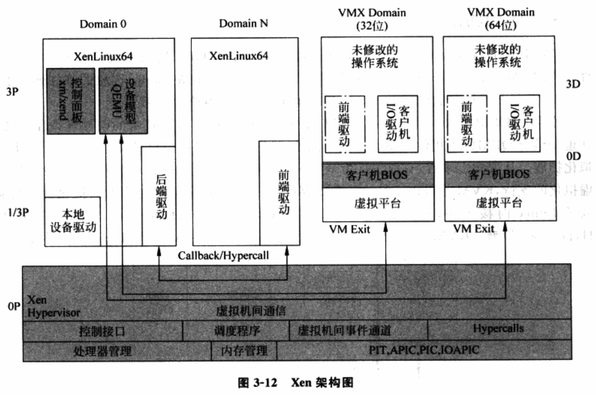
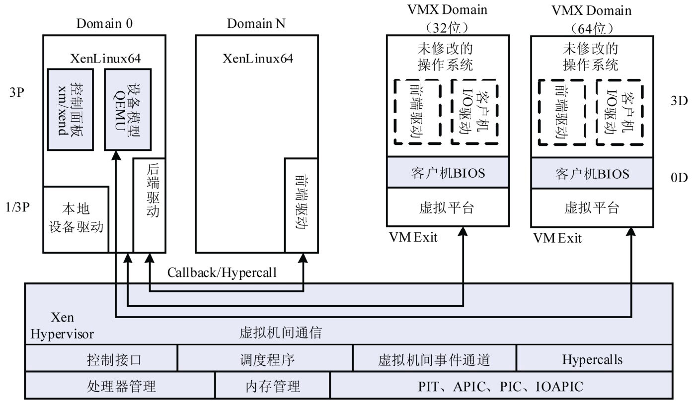
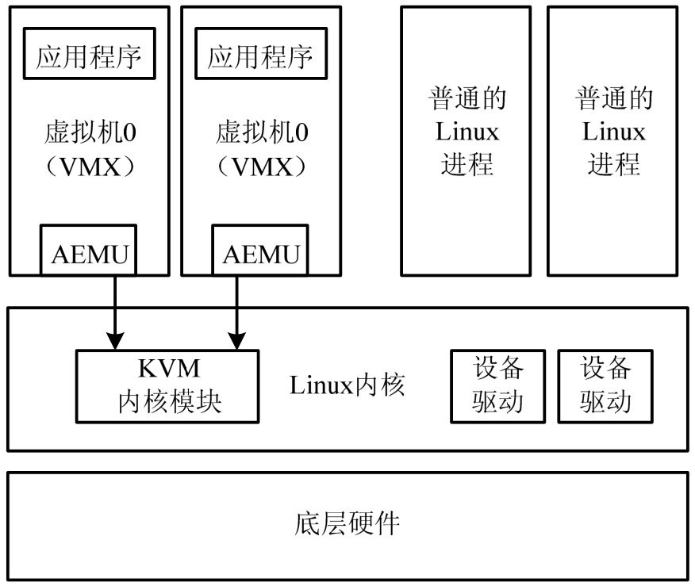

<!-- @import "[TOC]" {cmd="toc" depthFrom=1 depthTo=6 orderedList=false} -->

<!-- code_chunk_output -->

- [1. ESX](#1-esx)
- [2. Hyper-V](#2-hyper-v)
- [3. Xen](#3-xen)
- [4. KVM](#4-kvm)

<!-- /code_chunk_output -->

虚拟化技术的应用从最初的服务器扩展到了桌面等更宽的领域.

# 1. ESX

基于 Hypervisor 架构的 VMware ESX Server 直接运行在物理硬件上, 无须操作系统.

ESX 是 VMware 的企业级虚拟化产品, ESX服务器启动时, **首先**启动 **Linux Kernel**, 通过这个操作系统**加载虚拟化组件**, 最重要的是 ESX 的 **Hypervisor** 组件, 称之为 **VMkernel**, VMkernel 会从 LinuxKernel 完全**接管对硬件的控制权**, 而该 Linux Kernel 作为 VMkernel 的首个虚拟机, 用于承载 ESX 的 **serviceConsole**, 实现本地的一些管理功能.

**VMkernel** 负责为所承载的虚拟机调度所有的**硬件资源**, 但不同类型的硬件会有些区别.

虚拟机对于 CPU 和内存资源是通过 VMkernel 直接访问, 最大程度地减少了开销, CPU 的直接访问得益于 CPU 硬件辅助虚拟化(Intel VT-x 和 AMD AMD-V, 第一代虚拟化技术),内存的直接访问得益于 MMU(内存管理单元)硬件辅助虚拟化.

虚拟机对于 I/O 设备的访问则有多种方式, 以网卡为例, 有两种方式可供选择: 一是利用 I/O MMU 硬件辅助虚拟化的 VMDirectPath I/O, 使得虚拟机可以直接访问硬件设备,从而减少对 CPU 的开销; 二是利用半虚拟化的设备 VMXNETx, 网卡的物理驱动在 VMkernel中, 在虚拟机中装载网卡的虚拟驱动, 通过这二者的配对来访问网卡, 与仿真式网卡相比有着较高的效率. 半虚拟化设备的安装是由虚拟机中 VMware tool 来实现的, 可以在 Windows 虚拟机的右下角找到它. 网卡的这两种方式, 前者有着显著的先进性, 但后者用得更为普遍, 因为 VMDirectPath I/O 与 VMware 虚拟化的一些核心功能不兼容, 如: 热迁移, 快照, 容错, 内存过量使用等.

ESX 的**物理驱动**是内置在 **Hypervisor** 中, 所有设备驱动均是由 VMware 预植入的. 因此, ESX对硬件有严格的兼容性列表, 不在列表中的硬件, ESX 将拒绝在其上面安装.

# 2. Hyper-V

Hyper-V 是微软新一代的服务器虚拟化技术, 首个版本于 2008 年 7 月发布, Hyper-V 有两种发布版本:

* 一是独立版, 如 Hyper-V Server 2008, 以命令行界面实现操作控制, 是一个免费的版本;

* 二是内嵌版, 如 Windows Server 2008, Hyper-V作为一个可选开启的角色.

对于一台没有开启Hyper-V角色的Windows Server 2008来说,这个操作系统将直接操作硬件设备, 一旦在其中开启了Hyper-V角色, 系统会要求重新启动服务器. 在这次重启动过程中,Hyper-V 的 **Hypervisor 接管了硬件设备的控制权**, 先前的 Windows Server 2008 则成为 Hyper-V 的**首个虚拟机**, 称之为父分区, 负责其他虚拟机(称为子分区)以及 I/O 设备的管理. Hyper-V 要求 CPU 必须具备硬件辅助虚拟化, 但对 MMU 硬件辅助虚拟化则是一个增强选项.

其实 Hypervisor 仅实现了 CPU 的调度和内存的分配, 而父分区控制着 I/O 设备, 它通过物理驱动直接访问网卡, 存储等. 子分区要访问 I/O 设备需要通过子分区操作系统内的 VSC(虚拟化服务客户端), 对 VSC 的请求由 **VMBUS**(虚拟机总线)传递到**父分区**操作系统内的 **VSP**(虚拟化服务提供者), 再由VSP重定向到父分区内的**物理驱动**, 每种 I/O 设备均有各自的 VSC 和 VSP 配对, 如存储, 网络, 视频和输入设备等, 整个 I/O 设备访问过程对于子分区的操作系统是透明的. 其实在子分区操作系统内, VSC 和 VMBUS 就是作为 I/O 设备的**虚拟驱动**, 它是子分区操作系统首次启动时由 Hyper-V 提供的集成服务包安装, 这也算是一种半虚拟化的设备, 使得虚拟机与物理 I/O 设备无关. 如果子分区的操作系统没有安装 Hyper-V 集成服务包或者不支持 Hyper-V 集成服务包(对于这种操作系统, 微软称之为 Unenlightened OS, 如未经认证支持的 Linux 版本和旧的 Windows 版本), 则这个子分区只能运行在仿真状态. 其实微软所宣称的启蒙式 (Enlightenment)操作系统, 就是支持**半虚拟化驱动**的操作系统.

Hyper-V 的 Hypervisor 是一个非常精简的软件层, 不包含任何物理驱动, 物理服务器的设备驱动均是驻留在父分区的 Windows Server 2008 中, 驱动程序的安装和加载方式与传统 Windows 系统没有任何区别. 因此, 只要是 Windows 支持的硬件, 也都能被 Hyper-V 所兼容.

# 3. Xen

基于 GPL 授权的开源虚拟机软件.

从技术上, **Xen 基于混合模型**, 如图 3\-12. **特权操作系统(Domain 0**)可以是 (Linux, Solaris 以及 NetBSD).

Xen 最初的虚拟化思路是**类虚拟化**, 通过**修改 Linux 内核**, 实现处理器和内存的虚拟化, 通过引进 **I/O 前段驱动/后端驱动(front/backend)架构**实现设备的类虚拟化. Xen 1.0 和 2.0 实现了类虚拟化, 即图中 Domain 0 和 Domain N. Xen 类虚拟化虚拟机的性能接近物理机.

**特权操作系统(Domain 0**) 可以是 (Linux, Solaris 以及 NetBSD). Xen 最初的虚拟化思路是**类虚拟化**: 通过**修改 Linux 的内核**, 实现**处理器**和**内存**的虚拟化, 通过引入 **I/O 的前端驱动/后端驱动架构**实现**设备的类虚拟化**. Xen 1.0 和 Xen 2.0 成功地实现了操作系统的类虚拟化, 即图中的**Domain 0**和**Domain N**. Xen 类虚拟化虚拟机无须特殊的硬件支持, 所达到的性能即可以接近物理机.

随着发展, **硬件完全虚拟化技术**也被加入 Xen 中, **Xen 3.0** 支持基于 Intel VT 和 AMD\-V 硬件技术的完全虚拟化.

图 3\-12 中的 **VMX Domain** 是支持**完全虚拟化的虚拟机**.

**Hypervisor** 通过硬件提供的功能实现 ()**处理器, 内存和 I/O 的虚拟化**), 其中, **I/O 虚拟化**中的**设备模型**借用了**QEMU**, 利用 QEMU 的**设备模拟代码**完成 I/O 设备的虚拟化. 此外, **类虚拟化**中的**前端驱动/后端驱动的架构**也可以应用在 VMX Domain 中, 用于提高 I/O 设备的性能.

XEN最初是剑桥大学Xensource的一个开源研究项目,2003年9月发布了首个版本XEN 1.0,2007年Xensource被Citrix公司收购,开源XEN转由www.xen.org继续推进,该组织成员包括个人和公司(如 Citrix,Oracle等).该组织在2011年3月发布了版本XEN 4.1.

相对于ESX和Hyper-V来说,XEN支持更广泛的CPU架构,前两者只支持CISC的X86/X86_64 CPU架构,XEN除此之外还支持RISC CPU架构,如IA64,ARM等.

XEN的Hypervisor是服务器经过BIOS启动之后载入的首个程序,然后启动一个具有特定权限的虚拟机,称之为Domain 0(简称Dom 0).Dom 0的操作系统可以是Linux或Unix,Domain 0实现对Hypervisor控制和管理功能.在所承载的虚拟机中,Dom 0是唯一可以直接访问物理硬件(如存储和网卡)的虚拟机,它通过本身加载的物理驱动,为其它虚拟机(Domain U,简称DomU)提供访问存储和网卡的桥梁.

XEN支持两种类型的虚拟机,一类是半虚拟化(PV,Paravirtualization),另一类是全虚拟化(XEN称其为 HVM,Hardware Virtual Machine).半虚拟化需要特定内核的操作系统,如基于Linux paravirt_ops(Linux内核的一套编译选项)框架的Linux内核,而Windows操作系统由于其封闭性则不能被XEN的半虚拟化所支持,XEN的半虚拟化有个特别之处就是不要求CPU具备硬件辅助虚拟化,这非常适用于2007年之前的旧服务器虚拟化改造.全虚拟化支持原生的操作系统, 特别是针对Windows这类操作系统,XEN的全虚拟化要求CPU具备硬件辅助虚拟化,它修改的Qemu仿真所有硬件,包括:BIOS,IDE控制器, VGA显示卡,USB控制器和网卡等.为了提升I/O性能,全虚拟化特别针对磁盘和网卡采用半虚拟化设备来代替仿真设备,这些设备驱动称之为PV on HVM,为了使PV on HVM有最佳性能.CPU应具备MMU硬件辅助虚拟化.

XEN的Hypervisor层非常薄,少于15万行的代码量,不包含任何物理设备驱动,这一点与Hyper-V是非常类似的,物理设备的驱动均是驻留在Dom 0中,可以重用现有的Linux设备驱动程序.因此,XEN对硬件兼容性也是非常广泛的,Linux支持的,它就支持.

# 4. KVM

KVM(`Kernel-based Virtual Machine`)基于 GPL 授权方式的开源虚拟机软件. 2007 年 2 月被集成到了 Linux 2.6.20 内核中, 成为了内核的一部分.

架构如图 3-13.

KVM 采用**基于 Intel VT**技术的硬件虚拟化方法, 也是**结合 QEMU**来提供**设备虚拟化**. 此外, Linux 社区已经发布了 KVM 的类虚拟化扩展.

从架构上, 有说法认为是宿主模型, 因为 Linux 设计之初**没有针对虚拟化的支持**, **KVM 以内核模块形式存在**.

随着越来越多虚拟化功能被加入 Linux 内核, 也被认为是一个**Hypervisor**, 因此 KVM 是 Hypervisor 模型. 而 KVM 项目的发起人和维护人也倾向于认为 KVM 是 Hypervisor 模型.

KVM 的**宿主操作系统**必须是 **Linux**, 支持的**客户机操作系统**包括 (**Linux**, **Windows**, **Solaris** 和 **BSD**), **只能**运行在**支持虚拟化扩展**的 **x86** 和 **x86\_64** 硬件架构上, 这意味着 KVM 不能运行在老式 CPU 上, 新 CPU 如果不支持虚拟化扩展, 也不能运行(如英特尔的 Atom 处理器).

KVM 的特点在于**和 Linux 内核结合的非常好**, 因此 KVM**继承了 Linux 的大部分功能**. 当然, 和 Xen 一样, 作为开源软件, KVM 的移植性也很好.
