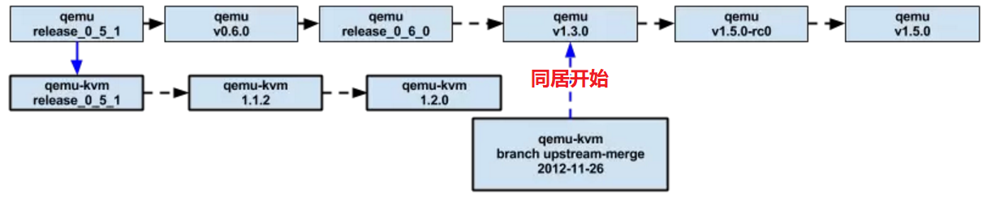

<!-- @import "[TOC]" {cmd="toc" depthFrom=1 depthTo=6 orderedList=false} -->

<!-- code_chunk_output -->

- [1. QEMU](#1-qemu)
- [2. 系统虚拟化](#2-系统虚拟化)
- [KVM](#kvm)
- [3. QEMU-KVM 诞生](#3-qemu-kvm-诞生)
- [4. qemu 版本变化](#4-qemu-版本变化)
- [6. 区分 Qemu、Qemu-KVM、Linux kernel KVM](#6-区分-qemu-qemu-kvm-linux-kernel-kvm)

<!-- /code_chunk_output -->

QEMU 和 KVM 经常被人们放在一起讨论, 其实两者的关系完全可以解耦合.

# 1. QEMU

QEMU 最开始是由法国程序员 Fabrice Bellard 开发的一个**模拟器**. 是一个**纯软件实现的开源「模拟」软件**, 它能够**模拟整套虚拟机**的实现, 包括 CPU、内存、各种 IO 设备、鼠标、键盘、USB 、网卡、声卡等等, 基本上没有它不能模拟的.

QEMU 能够完成**用户程序模拟**和**系统虚拟化模拟**.

* **用户程序模拟**指的是 QEMU 能够将为**一个平台**编译的**二进制文件**运行在**另一个不同的平台**, 如一个 ARM 指令集的二进制程序, 通过 QEMU 的 TCG(`Tiny Code Generator`)引擎的处理之后, ARM指令被转换成TCG中间代码, 然后再转换成目的平台的代码.

* **系统虚拟化模拟**指的是 QEMU 能够模拟一个完整的系统虚拟机, 该虚拟机有自己的虚拟CPU、芯片组、虚拟内存以及各种虚拟外部设备, 能够为虚拟机中运行的操作系统和应用软件呈现出与物理计算机完全一致的硬件视图. QEMU 能够模拟的平台很多, 包括x86、ARM、MIPS、PPC等, 早期的 QEMU 都是通过 TCG 来完成各种硬件平台的模拟, 所有的虚拟机指令需要经过QEMU的转换.

# 2. 系统虚拟化

**系统虚拟机**天生适用于云计算. 云计算提供了一种按需服务的模式, 让用户能够很方便地根据自己的需求使用各种计算、网络、存储资源. 以计算资源中的虚拟机为例, 用户可以指定不同 CPU 模型和内存规格的虚拟机. 云计算平台可以通过系统虚拟化技术很方便地满足用户的需求. 如果用户删除资源, 云计算平台可以直接删除其对应的虚拟机. 早期的 QEMU 都是软件模拟的, 很明显其在性能上是不能满足要求的. 所以早期的云计算平台通常使用 Xen 作为其底层虚拟化平台. 前面提到过, Xen 早期是在 x86 架构上直接完成的虚拟化, 这需要修改虚拟机内部的操作系统, 也使得 Xen 的整个 VMM 非常复杂, 缺陷比较多.

Intel 和 AMD 在 2005 年左右开始在 CPU 层面提供对系统虚拟化的支持, 叫作硬件虚拟化, Intel 在 x86 指令集的基础上增加了一套 VMX 扩展指令 VT-x, 为 CPU 增加了新的运行模式, 完成了 x86 虚拟化漏洞的修补. 通过新的硬件虚拟化指令, 可以非常方便地构造VMM, 并且 x86 虚拟机中的代码能够原生地运行在物理 CPU 上.

# KVM

KVM 全称 Kernel Virtual Machine, 内核虚拟机

KVM 虚拟机最初是由一个以色列的创业公司 Qumranet 开发的, 作为他们的 VDI 产品的虚拟机. 为了简化开发, KVM 的开发人员并没有选择从底层开始新写一个 Hypervisor, 而是选择了基于 Linux kernel, 通过加载新的模块从而使 Linux Kernel 本身变成一个 Hypervisor.

2006 年 8 月, 在先后完成了基本功能、动态迁移以及主要的性能优化之后, Qumranet 正式对外宣布了 KVM 的诞生并推向 Linux 内核社区. 同年 10 月, KVM 模块的源代码被正式接纳进入 Linux Kernel, 成为内核源代码的一部分.

2007 年 2 月发布的 Linux 2.6.20 是第一个带有 KVM 模块的 Linux 内核正式发布版本.

2008 年 9 月 4 日, 同内核社区保持着很深渊源的著名 Linux 发行版提供商—Redhat 公司出人意料地出资 1 亿 700 百万美金, 收购了 Qumranet, 从而成为了 KVM 开源项目的新东家, 投入较多资源在 KVM 虚拟化开发中.

2010 年 11 月, Redhat 公司推出了新的企业版 Linux—RHEL 6, 在这个发行版中集成了最新的 KVM 虚拟机, 而去掉了在 RHEL 5.x 系列中集成的 Xen. KVM 成为 RHEL 默认的虚拟化方案

# 3. QEMU-KVM 诞生

以色列初创公司 Qumranet 基于新的虚拟化指令集实现了 KVM, 并推广到 Linux 内核社区.

KVM 全称是 Kernel-based Virtual Machine, 即基于内核的虚拟机, 是采用硬件虚拟化技术的全虚拟化解决方案.

KVM 最初是由 Qumranet 公司的 Avi Kivity 开发的, 作为他们的 VDI 产品的后台虚拟化解决方案. 为了简化开发, Avi Kivity 并没有选择从底层开始新写一个 Hypervisor(重新造轮子), 而是选择了**基于 Linux kernel**, 通过**加载模块**使 **Linux kernel** 本身变成一个 **Hypervisor**. 2006 年 10 月, 在先后完成了基本功能、动态迁移以及主要的性能优化之后, Qumranet 正式对外宣布了 KVM 的诞生. 同月, KVM 模块的源代码被正式纳入 Linux kernel, 成为内核源代码的一部分. 作为一个功能和成熟度都逊于 Xen 的项目, 在这么快的时间内被内核社区接纳, 主要原因在于:

1) 在虚拟化方兴未艾的当时, 内核社区急于将虚拟化的支持包含在内, 但是 Xen 取代内核由自身管理系统资源的架构引起了内核开发人员的不满和抵触.

2) Xen 诞生于硬件虚拟化技术出现之前, 所以它在设计上采用了半虚拟化的方式, 这让 Xen 采用硬件虚拟化技术有了更多的历史包袱, 不如 KVM 新兵上阵一身轻.

KVM 本身是一个内核模块, 导出了一系列的接口到用户空间, 用户空间可以使用这些接口创建虚拟机. **最开始** KVM 只负责**最核心**的 **CPU 虚拟化**和**内存虚拟化**部分, 保留 IO 虚拟化模块在用户空间 QEMU 实现, QEMU 负责完成大量外设的模拟, **当时**的方案被称为 `QEMU-KVM`. 所以刚开始 **KVM 离不开 Qemu**.

这样的做法主要是考虑到性能的原因, CPU 和 内存虚拟化是非常复杂的虚拟化模块, 而且使用非常频繁, 如果实现在用户空间的话, 用户态和内核态的频繁切换势必会对性能造成很大的影响. 那为什么要单独保留 IO 虚拟化在用户空间呢, 这个也是权衡之下的结果, 首先 IO 设备太多了, 其次 IO 虚拟化相对其他两个模块使用不是很频繁, 开销会小一些, 所以, 为了尽可能保持**内核的纯净性**, 才有了这样的分配. KVM 的具体设计与实现可以参考 Avi Kivity 等人在 2007 年发表的论文"`KVM: The Linux Virtual Machine Monitor`". 由于 KVM 的设计架构精简, 能够跟现有的 Linux 内核无缝吻合, 因此在社区获得了极大的关注与支持. 特别是随着 Red Hat 投入大量的人力去完善 QEMU 和 KVM, QEMU 社区得到了飞速发展. 直到现在, QEMU 社区依然非常活跃, 但是其主要用途已经不是作为一个模拟器了, 而是作为以 QEMU-KVM 为基础的为云计算服务的系统虚拟化软件. 当然, 不仅仅是 KVM 将 QEMU 作为应用层组件, Xen 后来支持的硬件虚拟机也使用 QEMU 作为其用户态组件来完成虚拟机的设备模拟.

2008 年 9 月 4 日, Redhat 公司以 1.07 亿美元收购了 Qumranet 公司, 包括它的 KVM 开源项目和开发人员. 自此, Redhat 开始在其 RHEL 发行版中集成 KVM, 逐步取代 Xen, 并从**RHEL7**开始, 正式**不支持 Xen**.

**Qemu 离不开 KVM**. 上面也说了, Qemu 是一个纯软件的实现, 运行在用户空间, 性能非常低下, 所以, 从 Qemu 的角度, 可以说是 **Qemu 使用了 KVM 的虚拟化功能, 为自身虚拟机提供加速**.

# 4. qemu 版本变化

早期两者还没有区分, KVM 修改的模块叫 qemu-kvm, 到 **Qemu1.3 版本之后, 两者就合二为一了**, 如果我们在用 Qemu 创建虚拟机时, **要加载 KVM 模块, 需要为其指定参数 `--enable-kvm`**

# 6. 区分 Qemu、Qemu-KVM、Linux kernel KVM

Qemu1.3 之后默认包含 KVM 源码. 编译的时候 `./configure --enable-kvm` 即可

Qemu-kvm 是修改了 Qemu 部分源码适配 KVM, 本质 Qemu-kvm 就是 Qemu

> 本质: Qemu-kvm 是针对 KVM 专门做了修改和优化的 Qemu 分支

Linux 2.6.20 之后均包含 KVM 源码, 但不包括 Qemu

> 本质: KVM = Linux 内核 2.6.20 之后版本, 包括 Kernel 和 KVM 驱动

KVM 作为 Linux 内核模块存在, 从 Linux 2.6.20 版本开始被正式加入内核主干开发和正式发布代码中. 只需要下载 2.6.20 之后的任意版本均包含 KVM 源码.

