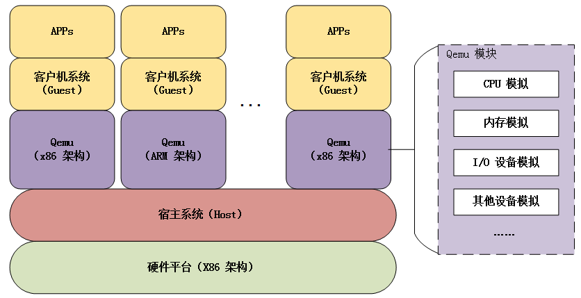
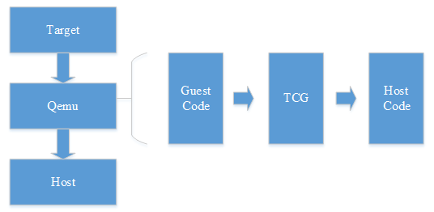
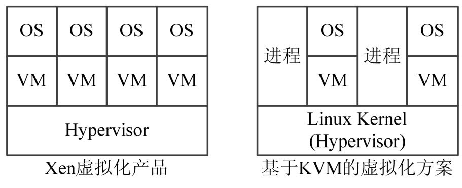
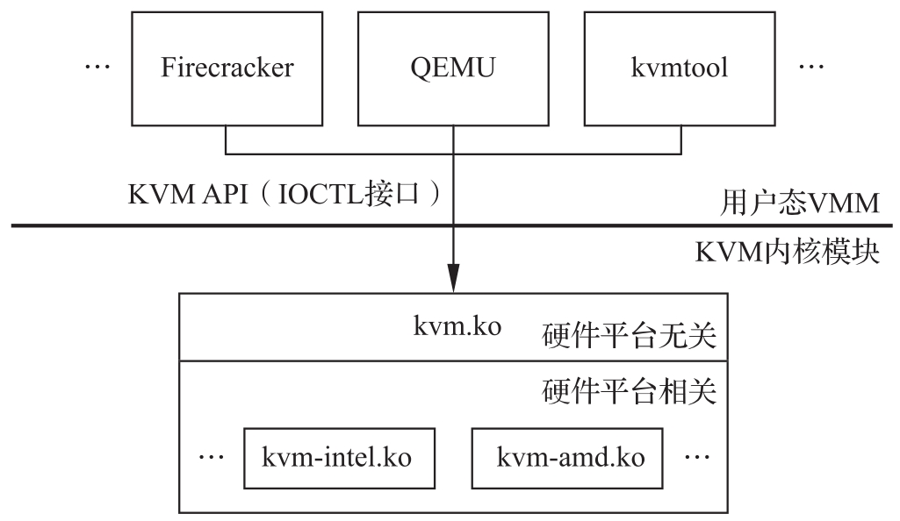
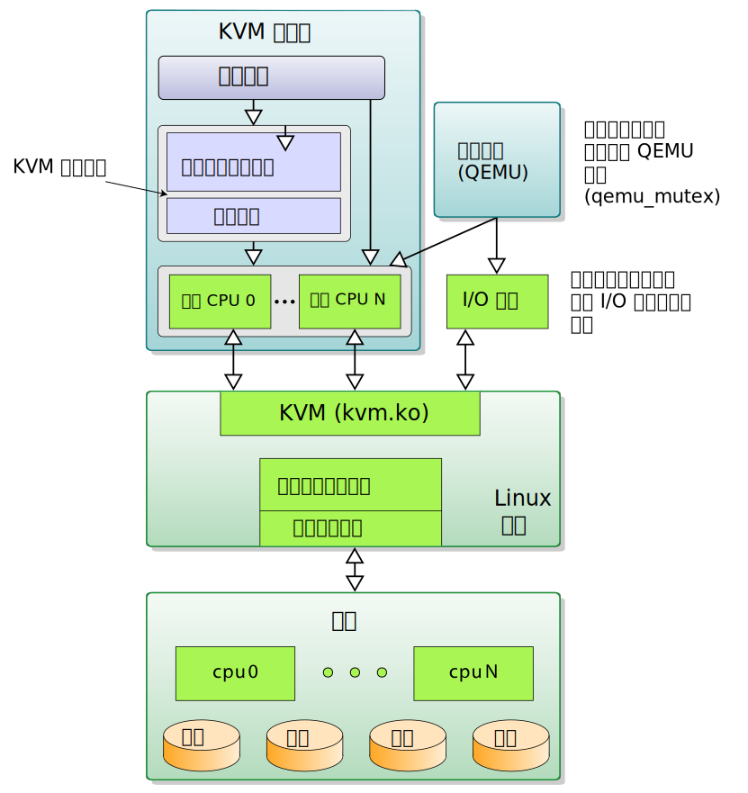
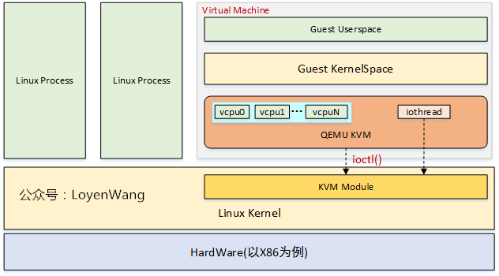
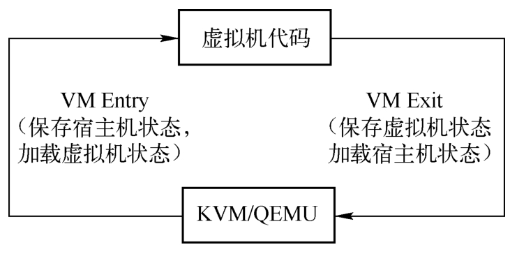
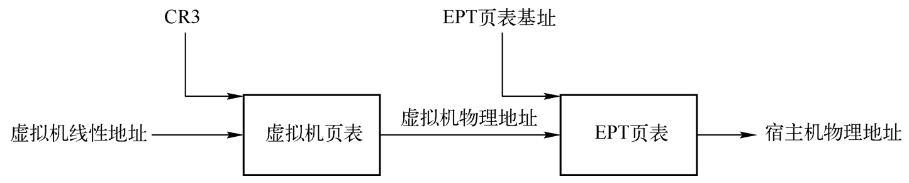
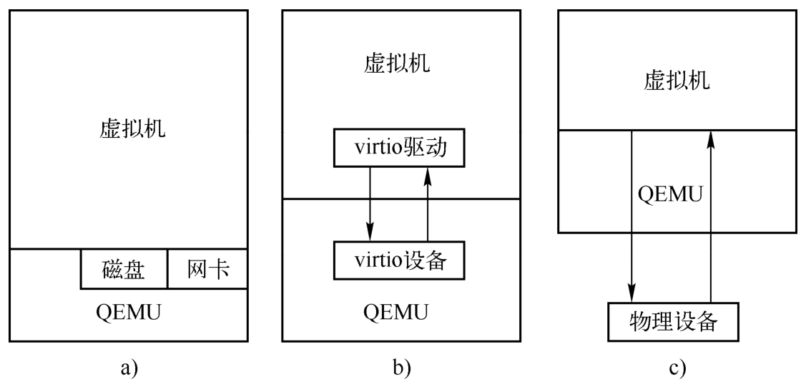
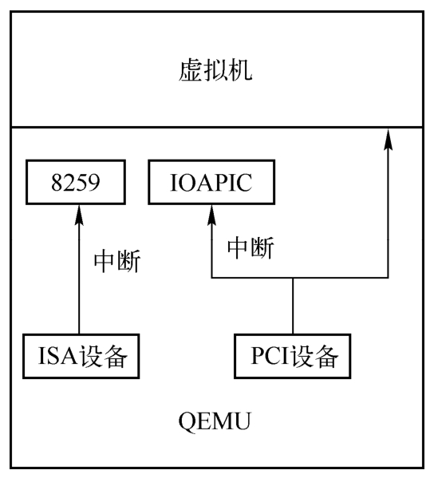

<!-- @import "[TOC]" {cmd="toc" depthFrom=1 depthTo=6 orderedList=false} -->

<!-- code_chunk_output -->

- [1. Qemu 架构](#1-qemu-架构)
- [2. KVM VS. Xen](#2-kvm-vs-xen)
- [3. KVM](#3-kvm)
- [4. QEMU/KVM 架构](#4-qemukvm-架构)
  - [详解](#详解)
- [5. QEMU/KVM 工作原理](#5-qemukvm-工作原理)
  - [5.1. 相关进程/线程](#51-相关进程线程)
  - [5.2. 运行时的三种模式](#52-运行时的三种模式)
  - [5.3. KVM 的抽象对象](#53-kvm-的抽象对象)
- [7. CPU 虚拟化](#7-cpu-虚拟化)
  - [7.1. vcpu](#71-vcpu)
- [8. Mem 虚拟化](#8-mem-虚拟化)
- [9. IO 虚拟化](#9-io-虚拟化)
  - [9.1. IO 的虚拟化](#91-io-的虚拟化)
  - [9.2. VirtIO](#92-virtio)
- [10. 中断虚拟化](#10-中断虚拟化)
- [11. IO 可能优化地方](#11-io-可能优化地方)
  - [virtio-blk-data-plane 高性能块设备 I/O](#virtio-blk-data-plane-高性能块设备-io)
  - [11.1. Virt-IO 的硬盘优化](#111-virt-io-的硬盘优化)
  - [11.2. 普通设备的直接分配(Direct Assign)](#112-普通设备的直接分配direct-assign)
  - [11.3. 普通设备的复用](#113-普通设备的复用)
- [12. 参考](#12-参考)

<!-- /code_chunk_output -->

# 1. Qemu 架构



Qemu 是纯软件实现的虚拟化模拟器, 几乎可以模拟**任何硬件设备**, 我们最熟悉的就是能够模拟一台能够独立运行操作系统的虚拟机, 虚拟机认为自己和硬件打交道, 但其实是和 Qemu 模拟出来的硬件打交道, Qemu 将这些指令转译给真正的硬件.

正因为 Qemu 是纯软件实现的, 所有的指令都要经 Qemu 过一手, 性能非常低, 所以, 在生产环境中, 大多数的做法都是配合 KVM 来完成虚拟化工作, 因为 KVM 是硬件辅助的虚拟化技术, 主要负责 比较繁琐的 CPU 和内存虚拟化, 而 Qemu 则负责 I/O 虚拟化, 两者合作各自发挥自身的优势, 相得益彰.

Qemu 可以模拟多种**非当前 CPU 架构平台**, 虽然性能差, 但是至少模拟的了.

Qemu 软件虚拟化实现的思路是采用**二进制指令翻译技术**, 主要是提取 guest 代码, 然后将其翻译成 TCG 中间代码, 最后再将中间代码翻译成 host 指定架构的代码, 如 x86 体系就翻译成其支持的代码形式, ARM 架构同理.



**从本质上看, 虚拟出的每个虚拟机对应 host 上的一个 Qemu 进程, 而虚拟机的执行线程(如 CPU 线程、I/O 线程等)对应 Qemu 进程的一个线程**.

# 2. KVM VS. Xen

在所有虚拟化方案中, 都是由 **hypervisor 取代原生的 OS** 去控制**具体硬件资源**, 同时将资源分配具体的 VM, VM 中运行的是没有修改过的 OS, 如果让 VM 中的 OS 能正常运行, hypervisor 的任务就是模拟具体的硬件资源, 让 OS 不能识别出是真是假.

KVM 和 Xen 虚拟化方案比较:



在 **Xen** 的体系结构中, **Xen Hypervisor** 运行于**硬件之上**, 并且将系统资源进行了虚拟化操作, 将虚拟化的资源分配给上层的虚拟机(VM), 然后通过虚拟机 VM 来运行相应的客户机操作系统.

KVM 与 Xen、VMware 等提供完整解决方案的商业化虚拟产品不同, 全称是 `Kernel-based Virtual Machine`, 是一个基于 Linux 环境的开源虚拟化解决方案. KVM 的**思想**是在**Linux 内核的基础**上添加**虚拟机管理模块**, 这个样子[**内存分配**](http://www.oenhan.com/kernel-program-exec), [**进程调度**](http://www.oenhan.com/task-group-sched), **IO 管理**等就**无需重写代码**, 如此 hypervisor 就是所谓的 host, VM 中的 OS 就是 guest.

因此, KVM 并**不是一个完整的模拟器**, 而只是一个提供了虚拟化功能的**内核模块**, 具体的**模拟器工作**是借助**QEMU**来完成的.

# 3. KVM

KVM 就是在**硬件辅助虚拟化技术**之上构建起来的虚拟机监控器(VMM). 它以**内核模块**的形式加载之后, 就将 Linux 内核变成了一个 Hypervisor, 但**硬件管理**等还是通过 **Linux kernel** 来完成的, 所以它是一个典型的 **Type 2 Hypervisor**.

客户机操作系统能够不经过修改直接在 KVM 的虚拟机中运行, **每一台虚拟机**能够享有**独立**的**虚拟硬件资源**: **网卡**、**磁盘**、**图形适配器**等.

当然, 并非要所有这些硬件虚拟化都支持才能运行 KVM 虚拟化, KVM 对硬件**最低的依赖**是 **CPU 的硬件虚拟化支持**, 比如: Intel 的 VT 技术和 AMD 的`AMD-V`技术, 而其他的**内存**和`I/O`的**硬件虚拟化**支持, 会让整个 KVM 虚拟化下的**性能**得到更多的提升.

KVM 的宏观架构:



以 KVM 为核心的宿主机主要分为以下三大部分.

* 用户态 VMM (User Mode VMM), 如 QEMU、Firecracker、kvmtool 等. 此类应用程序负责和上层虚拟机管理软件(如 virt-manager)的交互, 包括解析虚拟机管理软件的配置参数、虚拟机的生命周期管理、虚拟机的迁移, 还包括与 KVM API 模块交互进行虚拟设备的模拟等. 值得指出的是, 在 KVM 的宿主机中, 每个虚拟机都是作为一个用户态 VMM 进程呈现的. 目前最典型的用户态 VMM 就是 QEMU, 当用它来创建虚拟机时, 每个虚拟机即为一个 QEMU 进程, 这意味着虚拟机的内存同时也是 QEMU 进程的内存; 而虚拟机中的每个 vCPU 则是一个 QEMU 线程. 用户态 VMM 通过 KVM API(即 KVM IOCTL 接口)与内核 KVM 交互.

* 通用 KVM 内核模块, 即 kvm.ko. 该模块是平台无关的通用虚拟化实现, 负责提供 KVM API 以及与 Linux 其他模块进行交互.

* 平台相关 KVM 内核模块, 如 kvm-intel.ko、kvm-amd.ko 等. 这些模块是具体 CPU 平台的虚拟化实现. 如 kvm-intel.ko 是基于 Intel VMX 的虚拟化实现, 而 kvm-amd.ko 则是基于 AMD 的 SVM.

KVM 的分层设计带来诸多开发和管理上的便捷. 从开发者的角度来看, KVM 作为内核模块, 和其他驱动程序一样, 可以很方便地利用 Linux 操作系统的特性, 例如内存管理、调度器等. 对 KVM 的更新不需要宿主机重启, 只重新加载 KVM 及其相关的模块即可. 将 KVM 分为通用内核模块与平台相关的内核模块, 为新的硬件平台支持虚拟化提供了便捷. KVM 的 IOCTL 接口为用户态 VMM 提供了统一的 API, 开发者遵循该 API 便可设计出更为简洁轻便的用户态 VMM. 从管理者的角度来看, 由于虚拟机仅仅是宿主机上的一个进程, 而 Linux 系统有着丰富的进程管理工具, 管理员完全可以利用这些工具来对虚拟机进行操作. 例如, 用 taskset 命令将处于用户态的 vCPU 与 pCPU 绑定, 配置 pCPU 在多个 VMM 之间共享, 从而获得更高的资源利用率, 再如通过 perf 工具来查看虚拟机的性能.

# 4. QEMU/KVM 架构

QEMU/KVM 虚拟化的核心主要由以下两个模块组成:

1) **KVM 内核模块**, 它属于**标准 Linux 内核**的一部分, 是一个专门提供**虚拟化功能**的模块, 主要负责**CPU 和内存的虚拟化**, 包括: **客户机的创建**、**虚拟内存的分配**、**CPU 执行模式的切换**、**vCPU 寄存器的访问**、**vCPU 的执行**.

2) **QEMU 用户态工具**, 它是一个普通的**Linux 进程**, 为客户机提供设备模拟的功能, 包括**模拟 BIOS**、**PCI/PCIE 总线**、**磁盘**、**网卡**、**显卡**、**声卡**、**键盘**、**鼠标等**. 同时它通过**ioctl 系统调用**与内核态的 KVM 模块进行交互.

整体架构如下:


详细架构如下图所示: (仔细看图)






* Qemu (Quick Emulator): 是虚拟化方案的用户态组成部分, 它有两种模式: 1)Emulator, 模拟器, 模拟各种硬件, 使用的是二进制翻译技术; 2)Virtualiser, 虚拟机, 通过ioctl与KVM内核模块进行交互, 完成虚拟化功能;

* Qemu为每个VM虚拟机创建一个进程, 针对每个vCPU虚拟CPU创建一个线程, Guest的系统和应用运行在vCPU之上;

* Qemu能模拟I/O功能, 而这部分功能KVM可能并不是全部支持, 执行流程如下: 虚拟机VM中的程序执行I/O操作, VM退出进入KVM, KVM进行判断处理并将控制权交给Qemu, 由Qemu来模拟I/O设备来响应程序的I/O请求;

* KVM内核模块, 依赖于底层硬件的虚拟化支持, 主要的功能是初始化CPU硬件, 打开虚拟化模式, 将虚拟化客户机运行在虚拟机模式下, 并对虚拟化客户机的运行提供一定的支持;

KVM内核模块, 实现CPU的虚拟化、内存的虚拟化等, 而外设IO的虚拟化, 通常不由KVM模块负责, 只有对性能要求很高的虚拟设备才需要由KVM内核模块来负责, 因此也就有KVM + Qemu的组合方案了;


在 **QEMU/KVM 虚拟化架构**下,

- **每个客户机**就是**一个 QEMU 进程**, 在一个宿主机上有多少个虚拟机就会有多少个 QEMU 进程. 该**进程**的**用户虚拟空间**就是**Guest 的物理空间**. 普通的命令如 kill、top、taskset 等可以作用于该 Guest;

- 客户机中的**每一个虚拟 CPU** 对应 **QEMU 进程**中的**一个执行线程**;

- 还有单独的**处理 IO 的线程**, 也在**一个线程组**内;

- **一个宿主机**中只有**一个 KVM 内核模块**, 所有客户机都与这个内核模块进行交互.

所以, 宿主机上**各个客户机**是由宿主机内核像**调度普通进程**一样调度的, 即可以通过 Linux 的各种进程调度的手段来实现不同客户机的权限限定、优先级等功能.

客户机所看到的**硬件设备**是 **QEMU 模拟**出来的(不包括 VT\-d 透传的设备), 当客户机对模拟设备进行操作时, 由 **QEMU 截获**并转换为对实际的物理设备(可能设置都不实际物理地存在)的驱动操作来完成.

**KVM** 支持**虚拟化嵌套**, 即在虚拟化出来的主机中, KVM 能够再次进行虚拟机中的虚拟化, 但是此项功能**只针对 KVM**, 不支持 Xen、VMwaer 等其他虚拟化架构方案.

QEMU 与 KVM 的完整架构如下图所示. 该图来自 QEMU 官网, 比较完整地展现了 QEMU 与 KVM 虚拟化的各个方面, 包括 QEMU 的运行机制, KVM 的组成, QEMU 与 KVM 的关系, 虚拟机 CPU、内存、外设等的虚拟化, 下面对其进行简要介绍.


QEMU 与 KVM 架构整体上分为3个部分, 对应图中的3个部分.

## 详解

左边上半部分是所谓的 VMX root 模式的应用层, 下面是 VMX root 模式的内核层. 可以将 VMX root 理解成宿主机模式, 将 VMX non-root 理解成虚拟机模式. 右边上半部分表示的是虚拟机的运行, 虚拟机运行在 VMX non-root 模式下. VMX root 模式与未引入 VT-x 之前是一样的, CPU 在运行包括 QEMU 在内的普通进程和宿主机的操作系统内核时, CPU 处在该模式. CPU 在运行虚拟机中的用户程序和操作系统代码的时候处于 VMX non-root 模式. 需要注意的是, CPU 的运行模式与 CPU 运行时的特权等级是相互正交的, 虚拟机在 VMX root 模式和VMX non-root模式下都有 ring 0到ring 3四个特权级别.

图左边上半部分列出了 QEMU 的主要任务, QEMU 在初始化的时候会创建模拟的芯片组, 创建 CPU 线程来表示虚拟机的 CPU 执行流, 在 QEMU 的虚拟地址空间中分配空间作为虚拟机的物理地址, QEMU 还需要根据用户在命令行指定的设备为虚拟机创建对应的虚拟设备. 在虚拟机运行期间, QEMU 会在主线程中监听多种事件, 这些事件包括虚拟机对设备的 I/O 访问、用户对虚拟机管理界面、虚拟设备对应的宿主机上的一些 I/O 事件(比如虚拟机网络数据的接收)等. QEMU 应用层接收到这些事件之后会调用预先定义好的函数进行处理.

图右边上半部分表示的是虚拟机的运行. 对虚拟机本身来讲, 它也有自己的应用层和内核层, 只不过是 VMX non-root 下的. QEMU 和 KVM 对虚拟机中的操作系统来说是完全透明的, 常用的操作系统可以不经修改就直接运行在虚拟机中. 虚拟机的一个 CPU 对应为 QEMU 进程中的一个线程, 通过 QEMU 和 KVM 的相互协作, 这些线程会被宿主机操作系统正常调度, 直接执行虚拟机中的代码. 虚拟机中的物理内存对应为QEMU进程中的虚拟内存, 虚拟机中的操作系统有自己的页表管理, 完成虚拟机虚拟地址到虚拟机物理地址的转换, 再经过 KVM 的页表完成虚拟机物理地址到宿主机物理地址的转换. 虚拟机中的设备是通过 QEMU 呈现给它的, 操作系统在启动的时候进行设备枚举, 加载对应的驱动. 在运行过程中, 虚拟机操作系统通过设备的 I/O 端口(Port IO、PIO)或者 MMIO(Memory Mapped I/O)进行交互, KVM 会截获这个请求, 大多数时候 KVM 会将请求分发到用户空间的 QEMU 进程中, 由 QEMU 处理这些 I/O 请求.

图下半部分表示的是位于Linux内核中的KVM驱动. KVM驱动以杂项(misc)设备驱动的方式存在于内核中. 一方面, KVM通过 "`/dev/kvm`" 设备导出了一系列的接口, QEMU等用户态程序可以通过这些接口来控制虚拟机的各个方面, 比如CPU个数、内存布局、运行等. 另一方面, KVM需要截获虚拟机产生的虚拟机退出(VM Exit)事件并进行处理.

# 5. QEMU/KVM 工作原理

KVM 的工作原理如图:


上图是一个执行过程图, 首先启动一个**虚拟化管理软件 qemu**, 开始启动一个虚拟机, 通过**ioctl**等**系统调用**向**内核**中**申请指定的资源**, 搭建好虚拟环境, 启动虚拟机内的 OS, 执行 **VMLAUCH** 指令, 即**进入了 guest 代码**执行过程.

如果 Guest OS 发生**外部中断**或者**影子页表缺页**之类的事件, 暂停 Guest OS 的执行, **guest VM\-exit**, 进行一些必要的处理, 然后重新进入客户模式, 执行 guest 代码; 这个时候如果是 io 请求, 则提交给用户态下的 qemu 处理, qemu 处理后再次通过 IOCTL 反馈给 KVM 驱动.

KVM 的大致工作原理:

1. 用户模式的 Qemu 利用接口 libkvm 通过**ioctl 系统调用**进入**内核模式**. KVMDriver 为虚拟机创建虚拟 CPU 和虚拟内存, 然后执行 VMLAUNCH 指令进入**客户模式**, 装载 Guest OS 并运行.

2. Guest OS 运行过程中如果发生中断或者影子缺页等异常, 将暂停 Guest OS 的运行并保存当前上下文退出到**内核模式**来处理这些异常.

3. 内核模式处理这些异常时如果不需要 I/O 则处理完成后重新进入客户模式, 如果需要 I/O 则进入到**用户模式**, 由 Qemu 来处理 I/O, 处理完成后进入内核模式, 再进入**客户模式**.

## 5.1. 相关进程/线程

> /home/haiwei/workspace/codes/qemu/build/qemu-system-x86_64 -name ubuntu -accel kvm -cpu host,host-cache-info=true -m 2G -smp 2 -hda /home/haiwei/workspace/tools/ubuntu22.04.raw -nographic -full-screen

每一个虚拟机(guest)在 Host 上都被模拟为一个 QEMU 进程, 即 emulation 进程, 它有自己的 pid, 也可以被 kill 系统调用直接杀死(在这种情况下, 虚拟机的行为表现为"突然断电"). 在一个 Linux 系统中, 有多少个 VM, 就有多少个进程.

并且有四个线程, 线程数量不是固定的, 但是**至少会有三个**(**vCPU**, **IO**, **Signal**). 其中几个 vCPU 对应几个线程, 有一个**IO 线程**还有一个**信号处理线程**.

```cpp
➜  ~ pstree -p 20308
qemu-system-x86(20308)-+-{qemu-system-x86}(20353)
                       |-{qemu-system-x86}(20408)
                       |-{qemu-system-x86}(20409)
                       |-{qemu-system-x86}(20412)
```

## 5.2. 运行时的三种模式

KVM 模块让**Linux 主机**成为一个**虚拟机监视器**(VMM, Virtual Machine Monitor), 并且在原有的 Linux 两种执行模式基础上, 新增加了**客户模式**, 客户模式拥有自己的内核模式和用户模式.

所以在**虚拟机运行**时, 有三种模式, 分别是:

- **客户模式**: 我们可以简单理解成客户机操作系统运行在的模式, 它本身又分为自己的内核模式和用户模式. 执行非 I/O 的客户代码, 虚拟机运行在这个模式下.

- **用户模式**: 为用户提供虚拟机管理的用户空间工具以及代表用户执行 I/O, Qemu 运行在这个模式之下.

- **内核模式**: 模拟 CPU 以及内存, 实现客户模式的切换, 处理因为 `I/O` 或者其他指令引起的从客户模式退出(`VM_EXIT`). KVM 内核模块运行在这个模式下.

三种模式的层次关系我们可以用图简单描述一下:


在 kvm 的模型中, **每一个 Gust OS**都是作为一个**标准的 linux 进程**, 都可以使用 linux 进程管理命令管理.

## 5.3. KVM 的抽象对象

应用程序(Qemu) 同 KVM 的交互接口为 `/dev/kvm`, 通过 **open** 以及 **ioctl 系统调用**可以获取并操作 KVM 抽象出来的**三个对象**,

- KVM 本身(`fd_kvm`)

- Guest 的虚拟地址空间(`fd_vm`)

- Guest 的虚拟处理器(`fd_vcpu[N]`). 每一个 Guest 可以含有多个 vcpu, 每一个 vcpu 对应着 Host 系统上的一个线程.

Qemu 通过**文件描述符**用**系统调用 IOCTL**来操作这三个对象, 同 KVM 交互. 此时, Qemu 主要**只模拟设备**, 它以前的**CPU**和**MMU 的模拟逻辑**都被 `kvm.ko` 取代了.

1) Qemu 启动 Guest 系统时, 通过 `/dev/kvm` 获取 `fd_kvm`;

2) 通过 `fd_kvm` 的 ioctl 发出 `KVM_CREATE_VM` 指令, 创建了一个 VM 得到 `fd_vm`;

3) 然后通过 `fd_vm` 的 ioctl 发出 `KVM_SET_USER_MEMORY_REGION` 指令, 将 **Guest** 的"**物理空间**" **mmap** 到 **Qemu 进程**的**虚拟空间**;

4) 根据配置信息通过 `fd_vm` 的 ioctl 发出 `KVM_CREATE_VCPU` 指令, 创建 `vcpu[N]` 个线程, 返回`fd_vcpu[N]`.

5) 然后 Qemu 将操作 `fd_vcpu` 在其自己的进程空间 mmap 一块 KVM 的数据结构区域. 该数据结构(下图中的 shared)用于同 `kvm.ko` 交互, 包含 Guest 的 IO 信息, 如端口号, 读写方向, 内存地址等. Qemu 通过这些信息, 调用虚拟设备注册的回调函数来模拟设备的行为, 并将 Guest IO 请求换成系统请求发送给 Host 系统. 由于 Guest 的地址空间已经映射到 Qemu 的进程空间里面, Qemu 的虚拟设备逻辑可以很方便的存取 Guest 地址空间里面的数据.

三个对象之间的关系如下图所示:


```
    +----------+            |         +--------+
    | Qemu     | Host user  |         |        |
    |          |            |         |        |
    |          |            |         | Guest  |
    |  +------+|            |         | user   |
    |  |shared||            |         |        |
    |  +------+|            |         |        |
    |       ^  |            |         |        |
    +-------|--+            |         |        |
        |   |               |         |        |
     fds|   |               |         |        |
  ------|---|---------------|         |--------|
        |   |               |         |        |
        v   v   Host kernel |         | Guest  |
     +---------+            |         | kernel |
     |         |            |         |        |
     |  kvm.ko |----+       |         |        |
     |         |    |fd_kvm |         |        |
     +---------+    |       |         +--------+
                    v       |             ^
                  +----+    |   fd_vm     |
                  |vmcs|----+--------------
      +------+    +----+    |          +------+
      | host |              |          | Guest|
      | mode |              |fd_vcpu   | mode |
      +------+              |          +------+
          ^                 v             ^
          |             +-------+         |
          | vm exit     |  Phy  | vm entry|
          +-------------|  CPU  |---------+
                        +-------+
```

图中 `vm-exit`代表处理器进入 host 模式, 执行 kvm 和 Qemu 的逻辑. `vm-entry`代表处理器进入 Guest 模式, 执行整个 Guest 系统的逻辑. 如图所示, Qemu 通过三个文件描述符同 `kvm.ko` 交互, 然后 `kvm.ko` 通过 vmcs 这个数据结构同处理器交互, 最终达到控制 Guest 系统的效果. 其中 `fd_kvm` 主要用于 Qemu 同 KVM 本身的交互, 比如获取 KVM 的版本号, 创建地址空间、vcpu 等. `fd_vcpu` 主要用于控制处理器的模式切换, 设置进入 Guest mode 前的处理器状态等等(内存寻址模式, 段寄存器、控制寄存器、指令指针等), 同时 Qemu 需要通过 `fd_vcpu` 来 mmap 一块 KVM 的数据结构区域. `fd_vm` 主要用于 Qemu 控制 Guest 的地址空间, 向 Guest 注入虚拟中断等.

# 7. CPU 虚拟化

X86 体系结构**CPU 虚拟化**技术的称为 **Intel VT\-x** 技术, 引入了 VMX, 提供了两种处理器的工作环境.  VMCS 结构实现两种环境之间的切换.  VM Entry 使虚拟机进去 guest 模式, VM Exit 使虚拟机退出 guest 模式.

VMM 调度 guest 执行时, qemu 通过 ioctl [系统调用](http://oenhan.com/kernel-program-exec)进入内核模式, 在 KVM Driver 中获得当前物理 CPU 的引用. 之后将 guest 状态从 VMCS 中读出, 并装入物理 CPU 中. 执行 VMLAUCH 指令使得物理处理器进入非根操作环境, 运行 guest OS 代码.

当 guest OS 执行一些特权指令或者外部事件时, 比如 I/O 访问, 对控制寄存器的操作, MSR 的读写等,  都会导致物理 CPU 发生 VMExit,  停止运行 Guest OS, 将 Guest OS 保存到 VMCS 中, Host 状态装入物理处理器中,  处理器进入根操作环境, KVM 取得控制权, 通过读取 VMCS 中 VM_EXIT_REASON 字段得到引起 VM Exit 的原因.  从而调用 kvm_exit_handler 处理函数.  如果由于 I/O 获得信号到达, 则退出到 userspace 模式的 Qemu 处理. 处理完毕后, 重新进入 guest 模式运行虚拟 CPU.

guest 的所有用户级别(user)的指令集, 都会直接由宿主机线程执行, 此线程会调用 KVM 的 ioctl 方式提供的接口加载 guest 的指令并在特殊的 CPU 模式下运行, 不需要经过 CPU 指令集的软件模拟转换, 大大的减少了虚拟化成本, 这也是 KVM 优于其他虚拟化方式的点之一.

KVM 向外提供了一个虚拟设备/dev/kvm, 通过 ioctl(IO 设备带外管理接口)来对 KVM 进行操作, 包括虚拟机的初始化, 分配内存, 指令加载等等.


QEMU创建虚拟机CPU线程, 在初始化的时候会设置好相应的虚拟CPU寄存器的值, 然后调用KVM的接口, 将虚拟机运行起来, 在物理CPU上执行虚拟机的代码. 当虚拟机运行起来之后, KVM需要截获虚拟机中的敏感指令, 当虚拟机中的代码是敏感指令或者说满足了一定的退出条件时, CPU会从VMX non-root模式退出到KVM, 这叫作VM Exit, 这就像在用户态执行指令陷入内核一样. 虚拟机的退出首先陷入到KVM中进行处理, 如果KVM无法处理, 比如说虚拟机写了设备的寄存器地址, 那么KVM会将这个写操作分派到QEMU中进行处理, 当KVM或者QEMU处理好了退出事件之后, 又可以将CPU置于VMX non-root模式运行虚拟机代码, 这叫作VM Entry. 虚拟机就这样不停地进行VM Exit和VM Entry, CPU会加载对应的宿主机状态或者虚拟机状态, 如图1-6所示. KVM使用一个结构来保存虚拟机VM Exit和VM Entry的状态, 叫作VMCS.

CPU虚拟化原理:



## 7.1. vcpu

如前文所述, KVM 的 vcpu 对应着 host 系统上的一个线程. 从 Qemu 的角度来看, 她运行在一个 loop 中:

```cpp
	for (;;) {
		kvm_run(vcpu);
		switch (shared_data->exit_reason) {
		...
		case KVM_IO:
			handle_io(vcpu);
			break;
		case KVM_MMIO:
			handle_mmio(vcpu);
			break;
		...
		}
	}
```

该线程同 Guest 的 vcpu 紧密相连. 如果我们把线程的执行看作 Guest vcpu 的一部分, 那么从 Host 的角度来看, 该 vcpu 在三种不同的上下文中运行: Host user/Host kernel/Guest, 将运行于一个更大的循环当中. 该 vcpu 的运行逻辑如下图:

```
      Host user   |  Host kernel  | Guest mode   |
                  |               |              |
                  |               |              |
 +->kvm_run(vcpu)-------+         |              |
 |                |     v         |              |
 |                | +->vm entry----------+       |
 |                | |             |      v       |
 |                | |             |   Execute    |
 |                | |             |   Natively   |
 |                | |             |      |       |
 |                | |  vm exit<----------+       |
 |                | |    |        |              |
 |                | |    |        |              |
 |            Yes | |    v        |              |
 |     +----------------I/O ?     |              |
 |     |          | |    | No     |              |
 |     |          | |    |        |              |
 |     |          | |    v        |              |
 |     v      Yes | |  Signal     |              |
 +--Handle IO<---------Pending?   |              |
                  | |    | No     |              |
                  | +----+        |              |
```

实际上, 在 host 上通过 ps 命令看到的关于 vcpu 这个线程的运行时间正是这三种上下文的总和.

# 8. Mem 虚拟化

OS 对于物理内存主要有两点认识: 1.物理地址从 0 开始; 2.[内存地址](http://www.oenhan.com/kernel-program-exec)是连续的.

VMM 接管了所有内存, 但 guest OS 的对内存的使用就存在这两点冲突了, 除此之外, 一个 guest 对内存的操作很有可能影响到另外一个 guest 乃至 host 的运行. VMM 的内存虚拟化就要解决这些问题.

在 OS 代码中, 应用也是占用所有的逻辑地址, 同时不影响其他应用的关键点在于有线性地址这个中间层; 解决方法则是添加了一个中间层: **guest 物理地址空间**; guest 看到是从 0 开始的 guest 物理地址空间(类比从 0 开始的线性地址), 而且是连续的, 虽然有些地址没有映射; 同时 guest 物理地址映射到不同的 host 逻辑地址, 如此保证了 VM 之间的安全性要求.

这样 MEM 虚拟化就是 GVA\->GPA\->HPA 的寻址过程, 传统软件方法有**影子页表**, 硬件虚拟化提供了 EPT 支持.

guest 的内存在 host 上由 emulator 提供, 对 emulator 来说, guest 访问的内存就是他的虚拟地址空间, guest 上需要经过一次虚拟地址到物理地址的转换, 转换到 guest 的物理地址其实也就是 emulator 的虚拟地址, emulator 再次经过一次转换, 转换为 host 的物理地址. 后面会有介绍各种虚拟化的优化手段, 这里只是做一个 overview.


如同物理机运行需要内存一样, 虚拟机的运行同样离不开内存, QEMU在初始化的时候需要调用KVM的接口向KVM告知虚拟机所需要的所有物理内存. QEMU在初始化的时候会通过mmap系统调用分配虚拟内存空间作为虚拟机的物理内存, QEMU在不断更新内存布局的过程中会持续调用KVM接口通知内核KVM模块虚拟机的内存分布. 虚拟机在运行过程中, 首先需要将虚拟机的虚拟地址(Guest Virtual Address, GVA)转换成虚拟机的物理地址(Guest Physical Address, GPA), 然后将虚拟机的物理地址转换成宿主机的虚拟地址(Host Virtual Address, HVA), 最终转换成宿主机的物理地址(Host Physical Address, HPA). 在CPU支持EPT(Extended Page Table, 扩展页表)之前, 虚拟机通过影子页表实现从虚拟机虚拟地址到宿主机物理地址的转换, 是一种软件实现. 当CPU支持EPT之后, CPU会自动完成虚拟机物理地址到宿主机物理地址的转换. 虚拟机在第一次访问内存的时候就会陷入到KVM, KVM会逐渐建立起所谓的EPT页面. 这样虚拟机的虚拟CPU在后面访问虚拟机虚拟内存地址的时候, 首先会被转换为虚拟机物理地址, 接着会查找EPT页表, 然后得到宿主机物理地址, 其内存寻址过程如图1-7所示, 整个过程全部由硬件完成, 效率很高. 由于现在EPT都是标配, 本书将只关注EPT存在的情况.

EPT 原理:



# 9. IO 虚拟化

一个计算机系统离不开大量的外部设备, 网卡、磁盘等通常都是计算机系统必不可少的组成部分. 虚拟化的一个烦琐任务就是为虚拟机提供大量的设备支持, 如同Linux内核中最多的代码是设备驱动, QEMU最多的代码是设备模拟. 设备模拟的本质是要为虚拟机提供一个与物理设备接口完全一致的虚拟接口. 虚拟机中的操作系统与设备进行的数据交互或者由QEMU和(或)KVM完成, 或者由宿主机上对应的后端设备完成. QEMU在初始化过程中会创建好模拟芯片组和必要的模拟设备, 包括南北桥芯片、PCI根总线、ISA根总线等总线系统, 以及各种PCI设备、ISA设备等. QEMU的命令行可以指定可选的设备以及设备配置项. 大部分情况下, 用户对虚拟机的需求都体现在对虚拟设备的需求上, 比如常见的网络、存储资源对应QEMU的网卡模拟和硬盘模拟. 这些需求也导致了QEMU虚拟设备的快速发展. 设备模拟经历了非常大的发展, 最开始的QEMU只有纯软件模拟, 虚拟机内核不用做任何修改, 每一次对设备的寄存器读写都会陷入到KVM, 进而到QEMU, QEMU再对这些请求进行处理并模拟硬件行为, 纯软件模拟设备如下图a所示. 显然, 软件模拟会导致非常多的QEMU/KVM介入, 效率不高. 为了提高虚拟设备的性能, 社区提出了virtio设备方案. virtio设备是一类特殊的设备, 并没有对应的物理设备, 所以需要虚拟机内部操作系统安装特殊的virtio驱动, virtio设备模拟如图1-8b所示. virtio设备将QEMU变成了半虚拟化方案, 因为其本质上修改了虚拟机操作系统内核, 与之相对的完全不用修改虚拟机操作系统的方案叫作完全虚拟化. virtio仍然不能完全满足一些高性能的场景, 于是又有了设备直通方案, 也就是将物理硬件设备直接挂到虚拟机上, 虚拟机直接与物理设备交互, 尽可能在I/O路径上减少QEMU/KVM的参与, 直通设备原理如图1-8c所示. 与设备直通经常一起使用的有设备的硬件虚拟化支持技术SRIOV(Single Root I/O Virtualization, 单根输入/输出虚拟化), SRIOV能够将单个的物理硬件高效地虚拟出多个虚拟硬件. 通过将SRIOV虚拟出来的硬件直通到虚拟机中, 虚拟机能够非常高效地使用这些设备.

a) 纯软件的设备模拟 b) virtio设备模拟 c) 直通设备:



## 9.1. IO 的虚拟化

**传统系统**中, **设备**都**直接或间接**的**挂在 PCI 总线**上. **PCI 设备**通过**PCI 配置空间**以及**设备地址空间**接收操作系统的**驱动请求和命令**, 通过**中断机制通知反馈操作系统**. **配置空间**和**设备地址空间**都将映射到**处理器 Port 空间**或者**操作系统内存空间**中, 所以设备的软件模拟需要 VMM 将相关的**Guest PIO**和**MMIO**请求截获, 通过硬件虚拟化提供的机制将其传送给软件. 模拟软件处理完后再通过 VMM 提供的**虚拟中断机制**反馈 Guest. 如下图所示:

```
        +-----------------------------------+
        | +--------------+                  |
        | | PCI config   |     +----------+ |
        | +--------------+<--->| driver   | |
        | +--------------+<--->|          | |
        | | Device memory|     +----------+ |
        | +--------------+           ^      |
        |       ^                    |      |
        +-------|--------------------|------+
                |                    | vINTR via VMM
PIO/MMIO via VMM|         +----------+
                v         |
         +------------------------+
         | +--------+  +--------+ |
         | |  PCI   |  | Device | |
         | | config |  | memory | |  Virtual Device
         | +--------+  +--------+ |
         +------------------------+
                      |
                      v
                +------------+
                |host driver |
                +------------+
```

**虚拟设备**的**软件逻辑**放在**用户层**也可以放在**内核**中. **完全的虚拟设备模拟**, 可以处理在 Guest 中不加修改的驱动请求. 通常这将消耗大量的处理器 cycle 去模拟设备. 如果可以修改或者重写 Guest 的驱动代码, 那么虚拟设备和驱动之间的 IO 接口可以根据虚拟化的特性重新定义为更高层更加高效的接口, 如下图所示:

```
        +----------------+
        |                |
        | +-----------+  |
        | |para-driver|  |
        | +-----------+  |
        +-------^--------+
                |
                | new I/O interface via VMM
                v
            +---------+
            |Virtual  |
            |device   |
            +---------+
                |
                v
           +------------+
           |host driver |
           +------------+
```

KVM 的 virtio 正是通过这种方式提供了高速 IO 通道.

除了软件模拟, 现有的硬件虚拟化技术还可以将一些支持虚拟化技术的新兴硬件直接分配给 Guest. 除了需要支持虚拟化技术的硬件(可以发起 remmappable 的 MSI 中断请求), 设备的直接分配一般还需要主板上的芯片以及 CPU 支持, 比如英特尔的 VT-d 技术. 支持虚拟化技术的硬件平台主要做两件事, 一个是 DMA Remapping, 将 DMA 请求中的 Guest 的物理地址映射到 Host 的物理地址, 另一个是中断 Remapping, 将能 remappable 的中断请求根据由 VMM 设置, 位于内存的 IRT(Interrupt Remapping Table)发送到指定的 vcpu 上.

PC 平台上, 通常北桥(或者类似结构的 root-complex)连接着 CPU、内存以及外设. 用于 DMA Remapping 和中断 Remapping 的硬件逻辑位于北桥中. 如下所示:

```
      +-------------+
      |cpu0, cpu1...|
      +-------------+
            ^
            |        <-- System Bus
            |                |
            v                v
   +---------------------+
   |  North Bridge       |
   |                     |       +--------+
   |    +--------+       |<----->| Memory |
   |    |  vt-d  |       |       +--------+
   |    +--------+       |
   +---------------------+
         ^            ^
         |            |
         v            v
    +--------+    +--------+
    | PCI-e  |    | South  |<-----> PCI legacy devices...
    | device |    | Bridge |
    +--------+    +--------+
```

目前, 只有支持 MSI 的 PCI/PCI-e 设备才能直接分配给 Guest. 其中 PCI-e 设备可以直接与北桥相连或者桥连, 然后单独分配给一个 Guest. 在一个桥后的所有的桥连 PCI 设备只能作为一个整体分配给一个 Guest. KVM 在硬件虚拟化的平台上支持 PCI-e/PCI 设备的直接分配.

guest 作为一个进程存在, 当然他的内核的所有驱动等都存在, 只是硬件被 QEMU 所模拟(后面介绍 virtio 的时候特殊). guest 的所有硬件操作都会有 QEMU 来接管, QEMU 负责与真实的宿主机硬件打交道.

**IO 设备的软件模拟**, 是通过**用户程序 QEMU**来实现的. QEMU 负责解释**IO 指令流**, 并将其请求换成**系统调用**或者**库函数**传给**Host 操作系统**, 让 Host 上的驱动去完成**真正的 IO 操作**. 它们之间的关系如下图所示:

```
    +--------------+               +--------+
    | Qemu         |               |        |
    |              |               |        |
    | +---+  +----+|               | Guest  |
    | |vHD|  |vNIC||<-----+        |        |
    | +---+  +----+|      |        |        |
    +--------------+      |        +--------+
         ^                |            ^
         | syscall        |IO stream   |
         | via FDs        |            |
    +----|----------------|------------|--------+
    |    |                |            v        |
    |    v                |       +----------+  |
    |  +--------+         +------>|          |  |
    |  |drivers |<--+             |  kvm.ko  |  |
    |  +--------+   |             +----------+  |
    |    ^          |   Host kernel             |
    +----|----------|---------------------------+
         v          v
    +--------+    +---+
    | HDD    |    |NIC|
    +--------+    +---+
```

## 9.2. VirtIO

VirtIO 为 Guest 和 Qemu 提供了高速的 IO 通道. Guest 的磁盘和网络都是通过 VirtIO 来实现数据传输的. 由于 Guest 的地址空间 mmap 到 Qemu 的进程空间中, VirtIO 以共享内存的数据传输方式以及半虚拟化(para-virtualized)接口为 Guest 提供了高效的硬盘以及网络 IO 性能. 其中, KVM 为 VirtIO 设备与 Guest 的 VirtIO 驱动提供消息通知机制, 如下图所示:

```
     +---------------+
     |  Qemu         |
     |    +--------+ |        +-------------------+
     |    | VirtIO | |        | +---------+       |
     |    | Device | |        | | VirtIO  | Guest |
     |    +--------+ |        | | Driver  |       |
     +------|--^-----+        | +---------+       |
            |  |              +---|---^-----------+
      irqfd |  |              PIO |   |
      fd_vm |  |ioeventfd         |   |vInterrupt
   ---------|--|------------------|---|------------
            v  |                  v   |
        +----------+         +--------------+ Host
        | eventfd  |<------->|  KVM.ko      | kernel
        | core     |         |              |
        +----------+         +--------------+
```

如图所示, Guest VirtIO 驱动通过访问 port 空间向 Qemu 的 VirtIO 设备发送 IO 发起消息. 而设备通过读写 irqfd 或者 IOCTL fd_vm 通知 Guest 驱动 IO 完成情况. irqfd 和 ioeventfd 是 KVM 为用户程序基于内核 eventfd 机制提供的通知机制, 以实现异步的 IO 处理(这样发起 IO 请求的 vcpu 将不会阻塞). 之所以使用 PIO 而不是 MMIO, 是因为 KVM 处理 PIO 的速度快于 MMIO.

# 10. 中断虚拟化

中断系统是一个计算系统必不可少的组成部分. 操作系统通过写设备的I/O端口或者MMIO地址来与设备交互, 设备通过发送中断来通知虚操作系统事件, 图1-9显示了模拟设备向虚拟机注入中断的状态. QEMU在初始化主板芯片的时候初始化中断控制器. QEMU支持单CPU的Intel 8259中断控制器以及SMP的I/O APIC(I/O Advanced Programmable Interrupt Controller)和LAPIC(Local Advanced Programmable Interrupt Controller)中断控制器. 传统上, 如果虚拟外设通过QEMU向虚拟机注入中断, 需要先陷入到KVM, 然后由KVM向虚拟机注入中断, 这是一个非常费时的操作, 为了提高虚拟机的效率, KVM自己也实现了中断控制器Intel 8259、I/O APIC以及LAPIC. 用户可以有选择地让QEMU或者KVM模拟全部中断控制器, 也可以让QEMU模拟Intel 8259中断控制器和I/O APIC, 让KVM模拟LAPIC. QEMU/KVM一方面需要完成这项中断设备的模拟, 另一方面需要模拟中断的请求. 中断请求的形式大体上包括传统ISA设备连接Intel 8259中断控制器产生的中断请求, PCI设备的INTx中断请求以及MSI和MSIX中断请求.

虚拟设备的中断注入:



# 11. IO 可能优化地方

## virtio-blk-data-plane 高性能块设备 I/O

QEMU 还提供了叫作 `virtio-blk-data-plane` 的一种**高性能的块设备 I/O 方式**, 它最初在 QEMU 1.4 版本中被引入.

`virtio-blk-data-plane`与传统`virtio-blk`相比, 它为**每个块设备**单独分配**一个线程**用于**I/O 处理**, **data\-plane 线程**不需要与**原 QEMU**执行**线程同步和竞争锁**, 而且它使用**ioeventfd/irqfd 机制**, 同时利用**宿主机 Linux 上的 AIO(异步 I/O**)来处理**客户机的 I/O 请求**, 使得块设备 I/O 效率进一步提高.

## 11.1. Virt-IO 的硬盘优化

从图 1 中可以看到, Guest 的 IO 请求需要经过 Qemu 处理后通过系统调用才会转换成 Host 的 IO 请求发送给 Host 的驱动. 虽然共享内存以及半虚拟化接口的通信协议减轻了 IO 虚拟化的开销, 但是 Qemu 与内核之间的系统模式切换带来的开销是避免不了的.

目前 Linux 内核社区中的 vhost 就是将用户态的 Virt-IO 网络设备放在了内核中, 避免系统模式切换以及简化算法逻辑最终达到 IO 减少延迟以及增大吞吐量的目的. 如下图所示:

```cpp
                             +-------------------+
                             | +---------+       |
                             | | VirtIO  | Guest |
                             | | Driver  |       |
                             | +-----+---+       |
                             +---|---^-----------+
                             PIO |   |
                                 |   | vInterrupt
   ------------------------------|---|--------------
                                 v   |
        +----------+         +--------------+  Host
        | Vhost    |<------->|  KVM.ko      |  kernel
        | net      |         |              |
        +----^-----+         +--------------+
             |
             |
         +---v----+
         | NIC    |
         | Driver |
         +--------+
```

目前 KVM 的磁盘虚拟化还是在用户层通过 Qemu 模拟设备. 我们可以通过 vhost 框架将磁盘的设备模拟放到内核中达到优化的效果.

## 11.2. 普通设备的直接分配(Direct Assign)

如前文所述, 目前只有特殊的 PCI 设备才能直接分配给相应的 Guest, 即 VMM-bypass, 避免额外的软件开销. 我们可以在 KVM 中软实现 DMA 以及中断的 remapping 功能, 然后将现有的普通设备直接分配给 Guest. 如下图所示:

```
               +----------------+
               |  Guest         |
               |  +---------+   |
     +-------->|  | Driver  |   |
     |         |  +---------+   |
     |         +------------^---+
   D |              |       |
   M |      DMA Req.|       | vINTR
   A |              |       |
     |      +-------|-------|----------+
   O |      |       v KVM   |          |
   p |      |   +------------------+   |
   e |      |   | DMA remmapping   |   |
   r |      |   |                  |   |
   a |      |   | INTR remmapping  |   |
   t |      |   +-----------^------+   |
   i |      +-------|-------|----------+
   o |              |       | INTR
   n |              v       |
     |              +---------+
     +------------->| Deivce  |
                    +---------+
```

这将大大减少 Guest 驱动同物理设备之间的路径(省去了 KVM 的涉入), 去掉了虚拟设备的模拟逻辑, 不过 IO 性能的提高是以增加 KVM 的逻辑复杂度的代价换来的. 此时, IO 的性能瓶颈从 Qemu/KVM 转移到物理设备, 但是 IO 的稳定性、安全性将会更加依赖于 KVM 的 remapping 逻辑实现.

## 11.3. 普通设备的复用

在普通设备的直接分配的基础上, 我们甚至可以在多个 Guest 之间复用设备, 好比 m 个进程跑在 n 个处理器上一样(n < m). 比如将一个硬盘分成多个区, 每一个分区作为一个块设备直接分配给 Guest;或者直接将 n 个网卡分配给 m 个 Guest(n < m). 其中磁盘的复用, 只需在 KVM 中添加分区管理的逻辑, 而网卡的复用则要复杂一些: KVM 需要为设备提供多个设备上下文(每一个设备上下文对应着一个 Guest), 同时还需要提供算法逻辑对设备上下文进行切换和调度. 如下图所示:

```
                        |                  KVM   |
                        |  Device context        |
                        |  queue                 |
           +------+     |     +-+                |
           |Guest |---------->| |                |
           -------+     |     +-+                |
                        |      |                 |
           +------+     |     +-+                |
           |Guest |---------->| |   +----------+ |
           +------+     |     +-+   | Device   | |
                        |      |    | Scheduler| |
           +------+     |     +-+   +----------+ |
           |Guest |---------->| |-----+          |
           +------+     |     +-+     |          |
                        |          +--v--------+ |
                        | Current--->+--+  DM  | |     +-----+
                        | Context  | +--+------------->| NIC |
                        |          +-----------+ |     +-----+
                        |                        |
```

其中, Device Modle(DM)实现前文提到的 remapping 逻辑, Device Scheduler 用于选择和切换设备上下文实现物理设备的复用. 在普通设备直接分配的基础上, 通过对现有普通设备的复用, 将会带来廉价、灵活、高效的 IO 性能. 与之相对的是, 目前已经有支持 SR-IOV 的网卡, 从硬件上实现复用功能, 支持多个(静态, 即最大数目是内置的)虚拟的 PCI 网卡设备, 价格昂贵, 且受到一个网口总带宽有限的限制(软件复用技术, 可以复用多个网卡, 进而提高系统总的带宽).

# 12. 参考

http://oenhan.com/kvm-src-1

https://www.linuxidc.com/Linux/2015-01/112328.htm

https://www.cnblogs.com/jiayy/p/3762853.html (none)