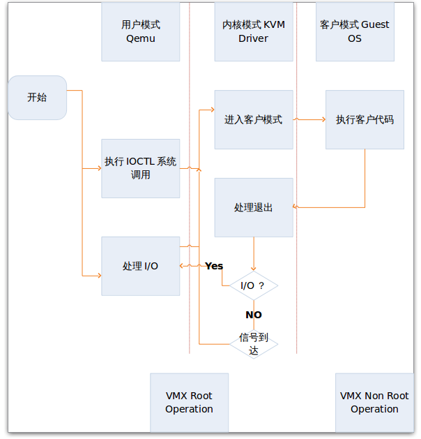
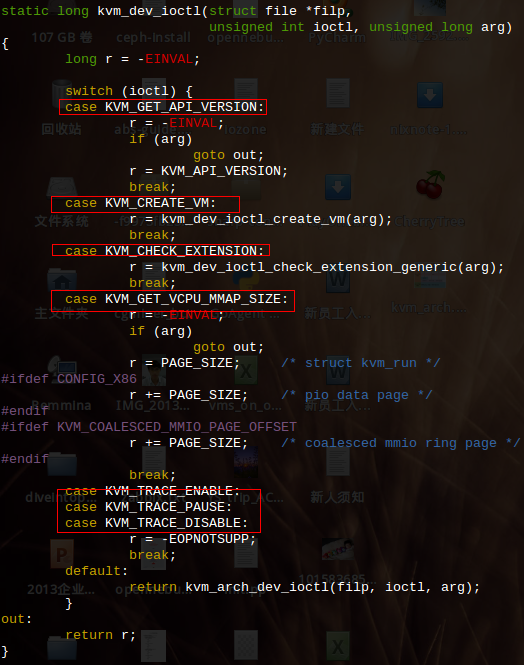

<!-- @import "[TOC]" {cmd="toc" depthFrom=1 depthTo=6 orderedList=false} -->

<!-- code_chunk_output -->

- [1. KVM 内核模块](#1-kvm-内核模块)
- [2. KVM 工作原理](#2-kvm-工作原理)
- [3. KVM 主要功能](#3-kvm-主要功能)
- [4. 三种文件句柄](#4-三种文件句柄)
  - [4.1. /dev/kvm 字符设备](#41-devkvm-字符设备)
  - [4.2. VM 文件句柄](#42-vm-文件句柄)
  - [4.3. vCPU 文件句柄](#43-vcpu-文件句柄)
- [5. 内存虚拟化和设备虚拟化](#5-内存虚拟化和设备虚拟化)

<!-- /code_chunk_output -->

# 1. KVM 内核模块

**KVM 内核模块**是标准 Linux 内核的一部分, 由于 **KVM 的存在**让 **Linux 本身**就变成了**一个 Hypervisor**, 可以**原生地支持虚拟化功能**.

目前, **KVM**支持**多种处理器平台**, 它支持最常见的以 Intel 和 AMD 为代表的 x86 和 x86_64 平台, 也支持 PowerPC、S/390、ARM 等非 x86 架构的平台.

**KVM 模块**是 KVM 虚拟化的**核心模块**, 它在内核中由两部分组成:

- 一个是**处理器架构无关**的部分, 用**lsmod 命令**中可以看到, 叫作**kvm 模块**;

- 另一个是**处理器架构相关**的部分, 在**Intel**平台上就是`kvm_intel`这个**内核模块**.

# 2. KVM 工作原理

**用户模式**的**Qemu**利用接口**libkvm**通过 ioctl 系统调用进入内核模式. **KVM Driver**为**虚拟机**创建**虚拟内存**和**虚拟 CPU**后执行**VMLAUCH 指令**进入**客户模式**. 装载 Guest OS 执行. 如果 Guest OS 发生**外部中断**或者**影子页表**(shadow page)缺页之类的事件, 暂停 Guest OS 的执行, 退出客户模式进行一些必要的处理. 然后重新进入客户模式, 执行客户代码. 如果发生 I/O 事件或者信号队列中有信号到达, 就会进入用户模式处理. KVM 采用全虚拟化技术. 客户机不用修改就可以运行.

# 3. KVM 主要功能

KVM 的**主要功能**是**初始化 CPU 硬件**, **打开虚拟化模式**, 然后**将虚拟客户机运行在虚拟机模式**下, 并对虚拟客户机的运行提供一定的支持.

**KVM 仅支持硬件辅助的虚拟化**, 所以**打开并初始化系统硬件**以支持虚拟机的运行, 是 KVM 模块的职责所在.

kvm 已经是**内核模块**, 被看作是一个**标准的 linux 字符集设备**(`/dev/kvm`).

Qemu 通过 **libkvm 应用程序接口**, 用 **fd** 通过 **ioctl** 向**设备驱动**来发送**创建**, **运行虚拟机**命令.

设备驱动 kvm 就会来解析命令(`kvm_dev_ioctl`函数在**kvm\_main.c**文件中),如下图:

以**KVM**在 Intel 公司的 CPU 上运行为例,

1. 在**被内核加载**的时候, KVM 模块会先**初始化内部的数据结构**;

2. 做好准备之后, KVM 模块**检测**系统**当前的 CPU**, 然后**打开 CPU 控制寄存器 CR4**中的**虚拟化模式开关**, 并通过**执行 VMXON 指令**将**宿主操作系统(包括 KVM 模块本身**)置于 CPU 执行模式的虚拟化模式中的**根模式**;

3. 最后, **KVM 模块**创建特殊设备文件 `/dev/kvm` 并等待来自**用户空间**的命令.

接下来, **虚拟机的创建和运行**将是一个用户空间的**应用程序(QEMU**)和**KVM 模块**相互配合的过程.

# 4. 三种文件句柄

## 4.1. /dev/kvm 字符设备

首先是 **kvm 设备**本身. kvm 内核模块本身是作为一个设备驱动程序安装的, 驱动的设备名称是 "`/dev/kvm`". 可以被当作一个**标准的字符设备**.

**KVM 模块**与**用户空间 QEMU 的通信接口**主要是一系列**针对这个特殊设备文件**的 **ioctl 调用**.

要使用 kvm, 需要先用 **open** 打开 "`/dev/kvm`" 设备, 得到一个**kvm 设备文件描述符 fd**, 然后**利用此 fd**调用**ioctl**就可以**向设备驱动发送命令**了.

kvm 驱动解析此种请求的函数是 `kvm_dev_ioctl`(`kvm_main.c`), 如 `KVM_CREATE_VM`.

## 4.2. VM 文件句柄

当然, **每个虚拟客户机**针对 `/dev/kvm` 文件的最重要的 ioctl 调用就是 "**创建虚拟机**"(`KVM_CREATE_VM`).

在这里, "**创建虚拟机**" 可以理解成 **KVM** 为了**某个特定的虚拟客户机**(用户空间程序创建并初始化)创建对应的**内核数据结构**.

创建了一个 VM 后, 用户程序需要发送一些命令给 VM, 如 `KVM_CREATE_VCPU` 等. 这些命令当然也是要通过 ioctl 来发送, 所以**VM** 也需要对应一个**文件描述符**才行. 用户程序中用 ioctl 发送 `KVM_CREATE_VM` 得到的**返回值**就是**新创建 VM 对应的 fd**, 之后利用此 fd 发送命令给此 VM.

针对该**文件句柄**的 **ioctl 调用**可以**对虚拟机做相应的管理**, 比如创建用户空间虚拟地址和客户机物理地址及真实内存物理地址的映射关系, 再比如创建多个可供运行的虚拟处理器(vCPU).

kvm 驱动解析此种请求的函数是 `kvm_vm_ioctl`.

此外, 与 OS 线程类似, **每个 VM**在 kvm 驱动中会对应一个 VM 控制块结构**struct kvm**, **每个对 VM 的内核操作**都基本要访问这个**结构**, 那么**kvm 驱动**是如何找到**请求这次命令的 VM 的控制块**的呢?

回答这个问题首先要知道, **linux 内核**用一个**struct file 结构**来表示**每个打开的文件**, 其中有一个**void \*private\_data**字段, kvm 驱动将**VM 控制块的地址**保存到**对应 struct file**的**private\_data**中. 用户程序**发送 ioctl**时, 指定**具体的 fd**, 内核根据**fd**可以找到**相应的 struct file**, 传递给**kvm\_vm\_ioctl**, 再通过**private\_data**就可以找到了.

## 4.3. vCPU 文件句柄

同样, KVM 模块会为每一个创建出来的**虚拟处理器**生成对应的**文件句柄**, 对虚拟处理器相应的文件句柄进行相应的 ioctl 调用, 就可以**对虚拟处理器进行管理**.

原理基本跟 VM 情况差不多, kvm 驱动解析此种请求的函数是 `kvm_vcpu_ioctl`.

VCPU 控制块结构为 `struct kvm_vcpu`.

针对**虚拟处理器**的最重要的 ioctl 调用就是"**执行虚拟处理器**". 通过它, 用户空间准备好的虚拟机在 KVM 模块的支持下, 被置于虚拟化模式中的**非根模式**下, 开始执行**二进制指令**. 在非根模式下, 所有敏感的二进制指令都会被处理器捕捉到, 处理器在保存现场之后自动切换到根模式, 由 KVM 决定如何进一步处理(要么由 KVM 模块直接处理, 要么返回用户空间交由用户空间程序处理).

# 5. 内存虚拟化和设备虚拟化

除了处理器的虚拟化, **内存虚拟化**也是由**KVM 模块**实现的, 包括前面提到的使用硬件提供的 EPT 特性, 通过两级转换实现客户机虚拟地址到宿主机物理地址之间的转换.

处理器对设备的访问主要是通过 I/O 指令和 MMIO, 其中
* **I/O 指令**会被处理器**直接截获**
* **MMIO**会通过配置**内存虚拟化**来捕捉.

但是, **外设的模拟**一般**不由 KVM 模块**负责. 一般来说, 只有**对性能要求比较高**的**虚拟设备**才会由**KVM 内核模块**来直接负责, 比如**虚拟中断控制器**和**虚拟时钟**, 这样可以大量减少处理器模式切换的开销. 而**大部分的输入输出设备**交给下一节将要介绍的**用户态程序 QEMU**来负责.
