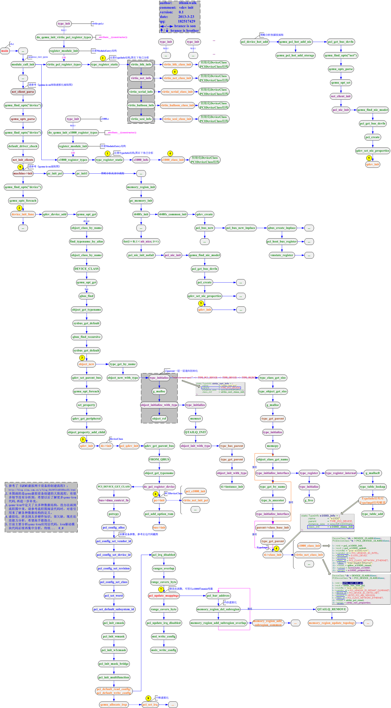
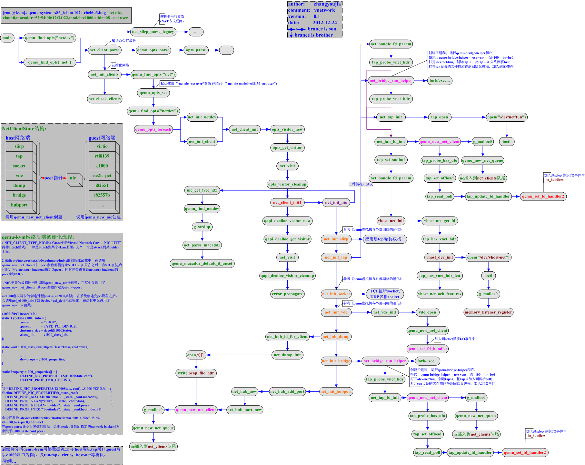
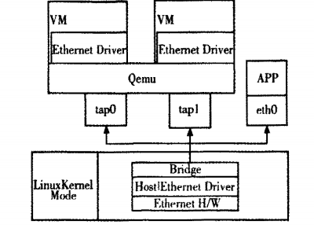
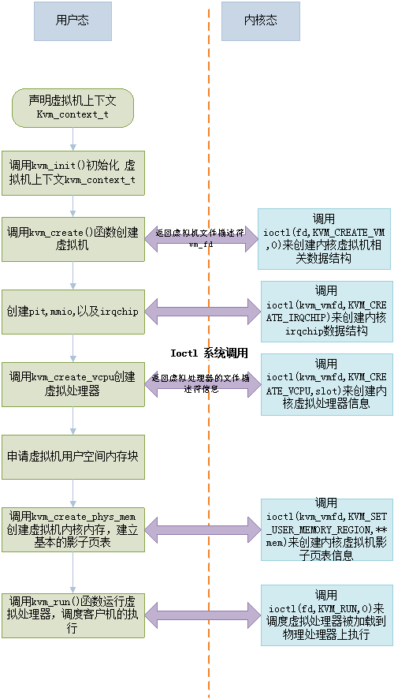

<!-- @import "[TOC]" {cmd="toc" depthFrom=1 depthTo=6 orderedList=false} -->

<!-- code_chunk_output -->

- [4 QEMU 简介](#4-qemu-简介)
  - [4.1 QEMU 的框架](#41-qemu-的框架)
    - [4.1.1 两种操作模式](#411-两种操作模式)
    - [4.1.2 多重事件回应架构](#412-多重事件回应架构)
    - [4.1.3 QEMU 的事件驱动核心](#413-qemu-的事件驱动核心)
    - [4.1.4 卸下特殊的任务到工作线程](#414-卸下特殊的任务到工作线程)
    - [4.1.5 执行 guest 代码](#415-执行-guest-代码)
    - [4.1.6 IOTHREAD 和 NON\-IOTHREAD 线程架构](#416-iothread-和-non-iothread-线程架构)
      - [4.1.6.1 non\-iothread 线程架构](#4161-non-iothread-线程架构)
      - [4.1.6.2 iothread 线程架构](#4162-iothread-线程架构)
  - [4.2 QEMU 的线程](#42-qemu-的线程)
- [5 QEMU 的初始化流程](#5-qemu-的初始化流程)
- [6 QEMU 虚拟网卡设备的创建流程](#6-qemu-虚拟网卡设备的创建流程)
  - [5 QEMU 网卡的流程](#5-qemu-网卡的流程)
- [相关技术-处理器管理和硬件辅助虚拟化技术](#相关技术-处理器管理和硬件辅助虚拟化技术)
  - [1 KVM 中 Guest OS 的调度执行](#1-kvm-中-guest-os-的调度执行)

<!-- /code_chunk_output -->


# 4 QEMU 简介

## 4.1 QEMU 的框架

### 4.1.1 两种操作模式

QEMU 属于**应用层的仿真程序**, 它支持**两种操作模**式: **用户模式仿真**和**系统模式仿真**.

**用户模式仿真** 允许一个 **CPU** 构建的**进程**在另一个 **CPU** 上执行(执行主机 CPU 指令的动态翻译并相应地转换 Linux 系统调用).

**系统模式仿真** 允许对**整个系统进行仿真**, 包括处理器和配套的外围设备.

每个模拟方式都有其安装要求. 对于系统模拟, 安装客户操作系统就像安装一台单独的计算机(下载并使用预先配置的磁盘镜像是一个替代方法). 对于用户空间模拟, 不需要安装整个系统, 但要考虑安装使用软件所需的支持库. 也许还需要配置跨编译器以生成想要测试的二进制文件.

在本文中, 我将主要介绍**QEMU 的系统模式**下的工作方式.

### 4.1.2 多重事件回应架构

QEMU 工作在操作系统的**用户态程序**, 它有一个如一般应用程序的入口点函数——**main 函数**(**vl.c**源码文件). 这个 main 函数也是**QEMU 的系统模式**的入口点函数. 在这个 main 函数中, 其主要的工作就是初始化一系列的参数、硬件设备仿真等以及命令行参数转换, 进而进入一个**main\_loop**的循环中.

在 QEMU 中有很重要的一部分就是**TCG(Tiny Code Generator**), 这就是一个**Guest OS**程序向**Host OS**程序转换的内置翻译器, 主要目的是为了在**Host 的硬件**上面可以**运行 Guest 的代码**. 本文将主要集中在整体流程的介绍以及 QEMU 与 KVM 之间的交互, 因此这部分将不会花过多精力涉及.

下面的部分翻译自 http://blog.vmsplice.net/2011/03/qemu-internals-overall-architecture-and.html . 由 QEMU 的开发者编写, 主要是为了让开发者对 QEMU 有个清晰的认识, 但是由于该文章比较古老, 因此将根据现有的设计再做调整.

**Guest OS 的运行**涉及到**Guest OS 代码的执行**、**timer 的处理**、**IO 处理**以及**对 monitor 命令的响应**.

对于这种需要回应**从多重资源发来的事件**的程序来说, 现行有两种比较流行的架构:

**Parallel architecture(平行架构**)把那些**可以同时执行的工作**分成**多个进程或是线程**. 我叫它线程化的架构(threaded architecture).

**Event\-driven architecture(事件驱动架构**)通过执行一个**主循环**来**发送事件到 handler**以此对事件做反馈处理. 这一方法通常通过使用**select**(2)或者**poll**(2)系列的系统调用**等待多个文件描述符**的方式来实现.

目前, QEMU 使用一种**混合架构**, 把**事件驱动**和**线程**组合在一起. 这种做法之所以有效是因为

- **只在单个线程**上执行的**事件循环**不能有效利用底层**多核心**的硬件.
- 再则, 有时候使用一个**专用线程**来减少特定工作的负担要比把它整合在一个事件驱动的架构中**更简单有效**.

虽然如此, **QEMU 的核心**还是**事件驱动**的, 大多数代码都是在这样一个环境中执行的.

### 4.1.3 QEMU 的事件驱动核心

一个**事件驱动的架构**是以一个**派发事件到处理函数**的**循环**为核心的.

QEMU 的**主事件循环**是**main\_loop\_wait**()(**main\-loop.c**文件), 它主要完成以下工作:

- 等待**文件描述符**变成**可读或可写！！！**. 文件描述符是一个关键角色, 因为 files、sockets、pipes 以及其他各种各样的**资源**都是**文件描述符**(file descriptors). **文件描述符**的**增加**方式: **qemu\_set\_fd\_handler**().

- 处理**到期**的**定时器(timer**). 定时器的管理在**qemu\-timer.c**文件中.

- 执行**bottom\-halves**(BHs), 它和定时器类似会立即过期. BHs 用来放置回调函数的重入和溢出. BHs 的添加方式: qemu\_bh\_schedule().

当**一个文件描述符准备好**了、**一个定时器过期**或者是**一个 BH**被调度到时, **事件循环**就会调用一个**回调函数**来回应这些事件. 回调函数对于它们的环境有两条规则:

- **没有其他核心同时在执行**, 所以不需要考虑同步问题. 对于**核心代码**来说, **回调函数**是**线性**和**原子**执行的. 在**任意给定的时间**里**只有一个线程**控制执行核心代码.

- **不**应该执行**可阻断系统调用**或是**长运行计算**(long\-running computations). 由于事件循环在继续其他事件时会等待当前回调函数返回, 所以如果违反这条规定会导致 guest 暂停并且使管理器无响应.

第二条规定有时候很难遵守, 在**QEMU**中会有**代码会被阻塞**. 事实上, **qemu\_aio\_wait**()里面还有**嵌套循环**, 它会等待那些顶层事件循环正在处理的事件的子集. 庆幸的是, 这些违反规则的部分会在未来重新架构代码时被移除. 新代码几乎没有合理的理由被阻塞, 而**解决方法之一**就是使用**专属的工作线程**来卸下(offload)这些**长执行**或者**会被阻塞的代码**.

### 4.1.4 卸下特殊的任务到工作线程

尽管很多**I/O 操作**可以以一种**非阻塞的形式**执行, 但**有些系统调用**却**没有非阻塞的替代方式**. 再者, 长运行的计算单纯的霸占着 CPU 并且很难被分割到回调函数中. 在这种情况下**专属的工作线程**就可以用来小心的将这些任务移出核心 QEMU.

在**posix\-aio\-compat.c**中有一个工作线程的例子, 一个**异步的文件 I/O**实现. 当**核心 QEMU**放出一个**aio 请求**, 这个请求被放到**一个队列**总. **工作线程**从**队列**中拿出这个**请求**, 并在**核心 QEMU**中执行它. 它们可能会有阻塞的动作, 但因为它们在它们自己的线程中执行所以并**不会阻塞剩余的 QEMU 执行**. 这个实现对于必要的同步以及工作线程和核心 QEMU 的通信有小心的处理.

另一个例子是 ui/vnc\-jobs\-async.c 中将**计算密集型的镜像解压缩和解码**移到**工作线程**中.

因为**核心 QEMU**的主要部分**不是线程安全**的, 所以**工作线程不能调用到核心 QEMU 的代码**. 当然简单的使用类似**qemu\_malloc**()的函数是**线程安全**的, 这些是例外, 而**不在规则之内**. 这也引发了**工作线程如何将事件传回核心 QEMU**的问题.

当**一个工作线程**需要**通知核心 QEMU**时, **一个管道**或者**一个 qemu\_eventfd 文件描述符**将被**添加到事件循环**中. **工作线程**可以向**文件描述符**中写入, 而当**文件描述符变成可读**时, **事件循环**会调用**回调函数**. 另外, 必须使用**信号**来确保事件循环可以在任何环境下执行. 这种方式在 posix\-aio\-compat.c 中被使用, 而且在了解 guest 代码如何被执行之后变的更有意义.

### 4.1.5 执行 guest 代码

目前为止我们已经大概的看了一下 QEMU 中的事件循环和它的主要规则. 其中执行 guest 代码的能力是特别重要的, 少了它, QEMU 可以响应事件但不会非常有用.

这里有**两种方式**用来**执行 guest 代码**:

- Tiny Code Generator(TCG)
- 和 KVM.

TCG 通过**动态二进制转化(dynamic binary translation**)来模拟 guest, 它也以**即时编译(Just\-in\-Time compilation**)被熟知.

而 KVM 则是利用现有的现代 intel 和 AMD CPU 中硬件虚拟化扩展来**直接**安全的在**host CPU**上执行 guest 代码.

在这篇文章中, 真正重要的并不是实际的技术, 不管是**TCG**还是**KVM**都允许我们**跳转到 guest 代码**中并且执行它.

**跳入 guest 代码**中会使我们**失去对程序执行的控制**而**把控制交给 guest**. 而一个**正在执行 guest 代码**的**线程**不能同时处在**事件循环！！！** 中, 因为**guest 控制着 CPU**. 一般情况下, 花在 guest 代码中的时间是有限的. 因为对于被**模拟设备**的寄存器的读写和其他异常导致我们离开 guest 而把控制交还给 QEMU. 在极端的情况下一个 guest 可以花费无限制的时间而不放弃控制权, 而这会引起 QEMU 无响应.

为了解决 guest 代码霸占问题, **QEMU 线程**使用**信号**来**跳出 guest**. 一个**UNIX 信号**从**当前的执行流程**中**抓取控制权**并调用一个**信号处理函数**. 这使得 QEMU 得以采取措施来**离开 guest 代码**并**返回它的主循环**, 因而**事件循环**才有机会处理待解决的事件.

上述的结果是新事件可能第一时间被发觉如果 QEMU 当前正在 guest 代码中. 事实上**QEMU 大多数时间规避处理事件**, 但因而产生的额外的延迟也成为的效能问题. 因此, 到**核心 QEMU 的 I/O 结束**和从**工作线程来的通知**使用**信号**来**确保事件循环**会被**立即处理**.

你可能会疑惑说到底**事件循环**和有**多核心的 SMP guest**之间的架构图会是什么样子的. 而现在, 线程模型和 guest 代码都已经提到了, 现在我们来讨论整体架构.

### 4.1.6 IOTHREAD 和 NON\-IOTHREAD 线程架构

#### 4.1.6.1 non\-iothread 线程架构

**传统的架构**是**单个 QEMU 线程**来执行**guest 代码**和**事件循环**. 这个模型就是所谓的**non\-iothread**或者说!CONFIG\_IOTHREAD, 它是 QEMU**默认使用**./configure && make 的设置.

**QEMU 线程**执行**guest 代码**直到一个**异常或者信号！！！** 出现才回到**控制器**. 然后它在**select**(2)**不被阻塞**的情况执行一次**事件循环的一次迭代**. 然后它又回到 guest 代码中并重复上述过程直到 QEMU 被关闭.

如果 guest 使用, 例如\-**smp 2**, 以启动一个**多 vcpu**启动, 也**不会有多的 QEMU 线程被创建！！！**. 取而代之的是在**单个 QEMU 线程**中**多重执行两个 vcpu 和事件循环**. 因而 non\-iothread 不能很好利用**多核心的 host 硬件**, 而使得对 SMP guest 的模拟性能很差.

需要注意的是, 虽然**只有一个 QEMU 线程**, 但可能会有**0 或多个工作线程**. 这些线程可能是临时的也可能是永久的. 记住这些工作线程**只执行特殊的任务**而**不执行 guest 代码**也**不处理事件**. 我之说以要强调这个是因为当监视 host 时很容易被工作线程迷惑而把他们当做 vcpu 线程来中断. 记住, **non\-iothread 只有一个 QEMU 线程**.

#### 4.1.6.2 iothread 线程架构

一种更新的架构是**每个 vcpu 一个 QEMU 线程**外加**一个专用的事件循环线程**. 这个模型被定义为 iothread 或者 CONFIG\_IOTHREAD, 它可以通过./configure \-\-enable\-io\-thread 在创建时开启.

**每个 vcpu 线程**可以**平行的执行 guest 代码**, 以此提供真正的 SMP 支持. 而**iothread**执行**事件循环**. **核心 QEMU 代码**不能同时执行的规则通过一个**全局互斥**来维护, 并通过**该互斥锁**同步**vcpu**和**iothread**间核心 QEMU 代码. 大多数时候**vcpu 线程**在执行**guest 代码**而不需要获取全局互斥锁. 大多数时间**iothread**被阻塞在**select**(2)因而也不需要获取全局互斥锁.

注意, **TCG 不是线程安全**的, 所以即使在在**iothread 模式**下, 它还是在**一个 QEMU 线程**中**执行多个 vcpu**. 只有 KVM 可以真正利用每个 vcpu 一个线程的优势.

## 4.2 QEMU 的线程

HOST 将**qemu**当做一个**普通的进程**和其他进程统一调度, 可以使用资源对 qemu 进行**资源预留隔离(cpuset**)和**优先级提升(chrt**).

**qemu 进程**包含**多个线程**, 分配给 GUEST 的**每个 vcpu**都对应**一个 vcpu 线程**, 另外**qemu**还有一个**线程**循环执行**select 专门处理 I/O 事件**.

```
[root@gerrylee ~]# qemu-system-x86_64 -enable-kvm -smp 2 -m 2G,slots=4,maxmem=4G -hda /data/images/centos7.4.20g.qcow2 -display vnc=:0 -device piix3-usb-uhci -device usb-tablet -monitor stdio
QEMU 4.0.50 monitor - type 'help' for more information
(qemu) info cpus
* CPU #0: thread_id=10967
  CPU #1: thread_id=10968

[root@gerrylee ~]# pstree -p 9080
bash(9080)───qemu-system-x86(10962)─┬─{qemu-system-x86}(10963)
                                    ├─{qemu-system-x86}(10964)
                                    ├─{qemu-system-x86}(10967)
                                    ├─{qemu-system-x86}(10968)
                                    └─{qemu-system-x86}(10970)

[root@gerrylee ~]# pstree -p 9080
bash(9080)───qemu-system-x86(10962)─┬─{qemu-system-x86}(10963)
                                    ├─{qemu-system-x86}(10967)
                                    ├─{qemu-system-x86}(10968)
                                    └─{qemu-system-x86}(10970)

(qemu) info iothreads
(qemu)
```

QEMU 的主要线程:

- **主线程(main\_loop**), **一个**, 10962
- **vCPU 线程**, **一个或者多个**, 10967, 10968
- **I/O 线程(aio**), **一个或者多个**,
- **worker thread(VNC/SPICE**), **一个！！！**,

qemu 里有个**主线程**处于**无限循环**, 会做如下操作(main\_loop\_wait)

- **IO 线程**里有个**select 函数**, 它阻塞在一个**文件描述符(fd)集合！！！** 上, 等待其就绪. fd 可以通过 qemu\_set\_fd\_handler()添加

- 运行**到期的定时器**, 定时器通过 qemu\_mod\_timer()添加

- 运行**BH(bottom\-halves**), BH 通过 qemu\_bh\_schedule()添加

当**文件描述符就绪**, **定期器到期**或者**BH 被调度**, **相应的 callback**会被调用

qemu 中还有一些**worker threads**. 一些占用 CPU 较多的工作会明显增大主 IO 线程的 IO 处理延迟, 这些工作可以放在专用的线程里, 例如**posix\-aio\-compat.c**中实现了**异步文件 I/O**, 当有 aio 请求产生, 该请求被**置于队列**, **工作线程**可以在 qemu 主线程之外处理这些请求. **VNC**就是这样一个例子, 它用了一个**专门的 worker thread**(ui/vnc\-jobs.c)进行**计算密集型**的**图像压缩和编码**工作.

# 5 QEMU 的初始化流程

待续

# 6 QEMU 虚拟网卡设备的创建流程

**虚拟网卡类型**为**virtio\-net\-pci**

virtio 网卡设备对应的命令行参数为

```
-device virtio-net-pci,netdev=hostnet0,id=net0,mac=00:16:36:01:c4:86,bus=pci.0,addr=0x3
```

注: \-device 是**QEMU 模拟的前端**, 即**客户机里看到的设备**, 这是统一的设备命令参数

1). 在 parse 命令行的时候, qemu 把**所有的\-device 选项**parse 后保存到**qemu\_device\_opts**中

2). 调用 module\_call\_init(MODULE\_INIT\_DEVICE); 往系统中**添加所有支持的设备类型**

**virtio\-net\-pci 的设备类型**信息如下(**virtio\-pci.c**):

```c
static PCIDeviceInfo virtio_info[] = {
    {
        .qdev.name  = "virtio-net-pci",
        .qdev.size  = sizeof(VirtIOPCIProxy),
        .init       = virtio_net_init_pci,
        .exit       = virtio_net_exit_pci,
        .romfile    = "pxe-virtio.bin",
        .qdev.props = (Property[]) {
            DEFINE_PROP_BIT("ioeventfd", VirtIOPCIProxy, flags,
                            VIRTIO_PCI_FLAG_USE_IOEVENTFD_BIT, false),
            DEFINE_PROP_UINT32("vectors", VirtIOPCIProxy, nvectors, 3),
            DEFINE_VIRTIO_NET_FEATURES(VirtIOPCIProxy, host_features),
            DEFINE_NIC_PROPERTIES(VirtIOPCIProxy, nic),
            DEFINE_PROP_UINT32("x-txtimer", VirtIOPCIProxy,
                               net.txtimer, TX_TIMER_INTERVAL),
            DEFINE_PROP_INT32("x-txburst", VirtIOPCIProxy,
                              net.txburst, TX_BURST),
            DEFINE_PROP_STRING("tx", VirtIOPCIProxy, net.tx),
            DEFINE_PROP_END_OF_LIST(),
        },
        .qdev.reset = virtio_pci_reset,
    }
   };
```

3). 调用**qemu\_opts\_foreach**(\&qemu\_device\_opts, **device\_init\_func**, NULL, 1) **创建命令行上指定的设备**

4). **device\_init\_func**调用**qdev\_device\_add**(opts)

5). qdev\_device\_add 函数的流程如下:

a) 调用**qemu\_opt\_get**(opts, "**driver**")获取**driver 选项**, 这里应该是**virtio\-net\-pci**

b) 调用**qdev\_find\_info**(NULL, driver)来获取**注册的 DeviceInfo**, 这里应该是上面**virtio\_info 里面**关于**virtio\-net\-pci 的结构**

c) 调用 qemu\_opt_get(opts, "**bus**")获取**bus 路径**, 以/分隔各组件. 这里是**pci.0**

d) 如果**bus 路径不为空**, 则调用**qbus\_find**(path)来获取**bus 实例**(**BusState 结构**)

qbus\_find 函数的流程如下:

d.1) 先找到路径中的**根 bus**, 如果**路径以/开头**, 则根 bus 为**main\_system\_bus**, 否则, 使用 qbus\_find\_recursive(main\_system\_bus, elem, NULL)来查找. 这里的 elem = "**pci.0**"

d.2) 如果整个路径已经完成, 则返回**当前 bus**

d.2) parse 出下一个组件, 调用 qbus\_find\_dev 查找对应的设备

d.3) parse 出下一个组件, 调用 qbus\_find\_bus 查找属于上层设备的**子 bus**

d.4) 返回步骤 2

由于这里的值是**pci.0**, 因此其实只进行了一次 qbus\_find\_recursive 调用

e) 如果**bus 路径为空**, 则调用 qbus\_find\_recursive(main\_system\_bus, NULL, info\-\>bus\_info)来获取**bus 实例**. 这里的**info**是 driver("virtio\-net\-pci")所对应的**DeviceInfo**, 即最上面的结构**virtio\-pci**的初始化步骤是 virtio\_pci\_register\_devices \-\> pci\_qdev\_register\_many \-\> pci\_qdev\_register, 在该函数中, 会设置 info\-\>bus\_info = \&pci\_bus\_info, 这样就把**PCIDeviceInfo**和 pci 的**BusInfo**联系起来了

qbus\_find\_recursive 是一个递归函数, 其流程如下:

e.1) 如果当前 bus 的名称和指定的名称相同(指定名称不为空的情况下), 并且当前 bus 指向的 bus info 和指定的 bus info 相同(指定 bus info 不为空的情况下), 则返回当前 bus

e.2) 这里是一个两重循环:

对于当前 bus 所有附属的设备(bus\-\>children 为链表头)

对于当前设备所有的附属 bus(dev\-\>child\_bus 为链表头)

调用 qbus\_find\_recursive 函数

f) 调用**qdev\_create\_from\_info**(bus, info)来**创建设备**, 返回的是**DeviceState**结构. 这里其实返回的是一个**VirtIOPCIProxy 实例**, 因为 create 的时候是根据**qdev.size**来分配内存大小的.

g) 如果 qemu\_opts\_id(opts)不为空, 则设置 qdev\-\>id

h) 调用 qemu\_opt\_foreach(opts, set\_property, qdev, 1)来设置设备的各种属性

i) 调用 qdev\_init 来初始化设备.

j) qdev\_init 会调用 dev\-\>info\-\>init 函数. 这里实际调用的函数是 virtio\_net\_init\_pci

在这里也大致描述一下 bus pci.0 是如何生成的

1). 在 main 函数里面很前面的地方会调用 module\_call\_init(**MODULE\_INIT\_MACHINE**);

2). module\_call_init 会调用**所有已注册 QEMUMachine**的**init**函数. 该版本的 qemu 是注册了 pc\_machine\_rhel610, pc\_machine\_rhel600, pc\_machine\_rhel550, pc\_machine\_rhel544, pc\_machine\_rhel540 这几个 (**pc.c**)

3). 这些**Machine**的**init 函数**(pc\_init\_rhel600, ...)都会调用到**pc\_init\_pci 函数**

4). pc\_init\_pci 会调用**pc\_init1**, pc\_init1 在 pci\_enabled 情况下会调用**i440fx\_init** (piix\_pci.c)

5). i440fx\_init 首先会调用**qdev\_create**(NULL, "i440FX\-pcihost")创建一个**host device**

6). 然后调用 pci\_bus\_new 在该设备下面创建一个附属的 pci bus. 在调用该函数时, 传递的 name 为 NULL.

下面再看看这个 bus 的名称怎么会变成 pci.0 的

7). pci\_bus\_new 调用 pci\_bus\_new\_inplace(bus, parent, name, devfn\_min), 其中 bus 指向刚分配的内存, parent 是前面创建的 host device, name 为 NULL, devfn\_min 为 0

8). pci\_bus\_new\_inplace 会调用 qbus\_create\_inplace(\&bus\-\>qbus, \&pci\_bus\_info, parent, name),

注意这里的第二个参数是\&pci\_bus\_info

9). qbus\_create\_inplace 在开始的地方会为该 bus 生成一个名称. 因为传递进来的 name 为 NULL, 并且 parent(那个 host device)的 id 也为 NULL, 因此分支会跳到下面的代码

```c
len = strlen(info->name) + 16;
buf = qemu_malloc(len);
len = snprintf(buf, len, "%s.%d", info->name,
                parent ? parent->num_child_bus : 0);
for (i = 0; i < len; i++)
    buf[i] = qemu_tolower(buf[i]);
bus->name = buf;
```

10). 在该段代码中, info 就是之前 pci\_bus\_new\_inplace 调用时传进来的\&pci\_bus\_info, info\-\>name 是字符串"PCI". 并且, 因为这是在 host device 上创建的第一个 bus, 因此 parent\-\>num\_child\_bus = 0,
最后经过小写处理之后, 该 bus 的名称就成为了"pci.0"

这一段分析所对应的 bus/device layout 如下

main\-system\-bus \-\-\-\-\>  i440FX\-pcihost \-\-\-\-\> pci.0

与这段流程类似的有一张流程图可以更加详尽的介绍一下流程, 但与上文介绍的内容不是一一对应的.



## 5 QEMU 网卡的流程



6 QEMU 中使用 BIOS 的流程分析
http://www.ibm.com/developerworks/cn/linux/1410_qiaoly_qemubios/


# 相关技术-处理器管理和硬件辅助虚拟化技术

Intel 在 2006 年发布了硬件虚拟化技术. 其中支持 X86 体系结构的称为 Intel VT\-x 技术. ADM 称为 SVM 技术.

VT\-x 引入了一种新的处理器操作, 叫做 VMX(Virtual Machine Extension), 提供了两种处理器的工作环境. VMCS 结构实现两种环境之间的切换. VM Entry 使虚拟机进去客户模式, VM Exit 使虚拟机退出客户模式.

## 1 KVM 中 Guest OS 的调度执行

VMM 调度 Guest OS 执行时, Qemu 通过 ioctl 系统调用进入内核模式, 在 KVM Driver 中通过 get\_cpu 获得当前物理 CPU 的引用. 之后将 Guest 状态从 VMCS 中读出. 并装入物理 CPU 中. 执行 VMLAUCH 指令使得物理处理器进入非根操作环境, 运行客户代码.

当 Guest OS 执行一些特权指令或者外部事件时, 比如 I/O 访问, 对控制寄存器的操作, MSR 的读写数据包到达等. 都会导致物理 CPU 发生 VMExit, 停止运行 Guest OS. 将 Guest OS 保存到 VMCS 中, Host 状态装入物理处理器中, 处理器进入根操作环境, KVM 取得控制权, 通过读取 VMCS 中 VM\_EXIT\_REASON 字段得到引起 VM Exit 的原因. 从而调用 kvm\_exit\_handler 处理函数. 如果由于 I/O 获得信号到达, 则退出到用户模式的 Qemu 处理. 处理完毕后, 重新进入客户模式运行虚拟 CPU. 如果是因为外部中断, 则在 Lib KVM 中做一些必要的处理, 重新进入客户模式执行客户代码.

2 KVM 中内存管理

KVM 使用影子页表实现客户物理地址到主机物理地址的转换. 初始为空, 随着虚拟机页访问实效的增加, 影子页表被逐渐建立起来, 并随着客户机页表的更新而更新. 在 KVM 中提供了一个哈希列表和哈希函数, 以客户机页表项中的虚拟页号和该页表项所在页表的级别作为键值, 通过该键值查询, 如不为空, 则表示该对应的影子页表项中的物理页号已经存在并且所指向的影子页表已经生成. 如为空, 则需新生成一张影子页表, KVM 将获取指向该影子页表的主机物理页号填充到相应的影子页表项的内容中, 同时以客户机页表虚拟页号和表所在的级别生成键值, 在代表该键值的哈希桶中填入主机物理页号, 以备查询. 但是一旦 Guest OS 中出现进程切换, 会把整个影子页表全部删除重建, 而刚被删掉的页表可能很快又被客户机使用, 如果只更新相应的影子页表的表项, 旧的影子页表就可以重用. 因此在 KVM 中采用将影子页表中对应主机物理页的客户虚拟页写保护并且维护一张影子页表的逆向映射表, 即从主机物理地址到客户虚拟地址之间的转换表, 这样 VM 对页表或页目录的修改就可以触发一个缺页异常, 从而被 KVM 捕获, 对客户页表或页目录项的修改就可以同样作用于影子页表, 通过这种方式实现影子页表与客户机页表保持同步.

3 KVM 中设备管理

一个机器只有一套 I/O 地址和设备. 设备的管理和访问是操作系统中的突出问题、同样也是虚拟机实现的难题, 另外还要提供虚拟设备供各个 VM 使用. 在 KVM 中通过移植 Qemu 中的设备模型(Device Model)进行设备的管理和访问. 操作系统中, 软件使用可编程 I/O(PIO)和内存映射 I/O(MMIO)与硬件交互. 而且硬件可以发出中断请求, 由操作系统处理. 在有虚拟机的情况下, 虚拟机必须要捕获并且模拟 PIO 和 MMIO 的请求, 模拟虚拟硬件中断.

捕获 PIO: 由硬件直接提供. 当 VM 发出 PIO 指令时, 导致 VM Exit 然后硬件会将 VM Exit 原因及对应的指令写入 VMCS 控制结构中, 这样 KVM 就会模拟 PIO 指令. MMIO 捕获: 对 MMIO 页的访问导致缺页异常, 被 KVM 捕获, 通过 X86 模拟器模拟执行 MMIO 指令. KVM 中的 I/O 虚拟化都是用户空间的 Qemu 实现的. 所有 PIO 和 MMIO 的访问都是被转发到 Qemu 的. Qemu 模拟硬件设备提供给虚拟机使用. KVM 通过异步通知机制以及 I/O 指令的模拟来完成设备访问, 这些通知包括: 虚拟中断请求, 信号驱动机制以及 VM 间的通信.

以虚拟机接收数据包来说明虚拟机和设备的交互.



(1)当数据包到达主机的物理网卡后, 调用物理网卡的驱动程序, 在其中利用 Linux 内核中的软件网桥, 实现数据的转发.

(2)在软件网挢这一层, 会判断数据包是发往那个设备的, 同时调用网桥的发送函数, 向对应的端口发送数据包.

(3)若数据包是发往虚拟机的, 则要通过 tap 设备进行转发, tap 设备由两部分组成, 网络设备和字符设备. 网络设备负责接收和发送数据包, 字符设备负责将数据包往内核空间和用户空间进行转发. Tap 网络部分收到数据包后, 将其设备文件符置位, 同时向正在运行 VM 的进程发出 I/O 可用信号, 引起 VM Exit, 停止 VM 运行, 进入根操作状态. KVM 根据 KVM\_EXIT\_REASON 判断原因, 模拟 I/O 指令的执行, 将中断注入到 VM 的中断向量表中.

(4)返回用户模式的 Qemu 中, 执行设备模型. 返回到 kvm\_main\_loop 中, 执行 kvm\_main\_loop\_wait, 之后进入 main\_loop\_wait 中, 在这个函数里收集对应设备的设备文件描述符的状态, 此时 tap 设备文件描述符的状态同样被集到 fd set.

(5)kvm\_main\_loop 不停地循环, 通过 select 系统调用判断哪个文件描述符的状态发生变化, 相应的调用对应的处理函数. 对予 tap 来说, 就会通过 qemu\_send\_packet 将数据发往 rtl8139\_do\_receiver, 在这个函数中完成相当于硬件 RTL8139 网卡的逻辑操作. KVM 通过模拟 I/O 指令操作虚拟 RTL8139 将数据拷贝到用户地址空间, 放在相应的 I/O 地址. 用户模式处理完毕后返回内核模式, 而后进入客户模式, VM 被再次执行, 继续收发数据包.

三、 源码分析

1 源码文件结构

源码文件主要是分为三部分: kvm 核心代码(平台无关)、kvm 平台相关代码以及头文件

kvm 核心代码目录: virt/kvm, 其中所包含文件:

* ioapic.h
* ioapic.c
* iodev.h
* kvm\_main.c

kvm 平台相关源代码文件. 比如针对 intel 的 HVM 支持的 vmx.c 文件, 以及针对 AMD 的 HVM 支持的 svm.c 文件. 其所在目录为: arch/x86/kvm, 其中所包含的文件为:

* Kconfig
* Makefile
* i8259.c
* irq.c
* irq.h
* kvm\_svm.h
* lapic.c
* lapic.h
* mmu.c
* mmu.h
* paging\_tmpl.h
* segment\_descriptor.h
* svm.c
* svm.h
* vmx.c
* vmx.h
* x86.c
* x86_emulate.c


头文件分为两种, 根据平台分为 include/linux 和 include/asm\-x86 目录.

include/linux 目录包含的是通用 pc 上 linux 的头文件, 其对应文件为:

* kvm.h
* kvm\_host.h
* kvm\_para.h
* kvm\_x86\_emulate.h

include/asm\-x86/

* kvm.h
* kvm\_host.h
* kvm\_para.h
* kvm\_x86\_emulate.h

2 KVM 创建和运行虚拟机的流程

KVM 虚拟机创建和运行虚拟机分为用户态和核心态两个部分, 用户态主要提供应用程序接口, 为虚拟机创建虚拟机上下文环境, 在 libkvm 中提供访问内核字符设备/dev/kvm 的接口; 内核态为添加到内核中的字符设备/dev/kvm, 模块加载进内核后即可进行接口用户空间调用创建虚拟机. 在创建虚拟机过程中, kvm 字符设备主要为客户机创建 kvm 数据机构, 创建该虚拟机的虚拟机文件描述符及其相应的数据结构以及创建虚拟处理器及其相应的数据结构. Kvm 创建虚拟机的流程如下图所示.



首先申明一个 kvm\_context\_t 变量用以描述用户态虚拟机上下文信息, 然后调用 kvm\_init()函数初始化虚拟机上下文信息; 函数 kvm\_create()创建虚拟机实例, 该函数通过 ioctl 系统调用创建虚拟机相关的内核数据结构并且返回虚拟机文件描述符给用户态 kvm\_context\_t 数据结构; 创建完内核虚拟机数据结构后, 再创建内核 pit 以及 mmio 等基本外设模拟设备, 然后调用 kvm\_create\_vcpu()函数来创建虚拟处理器, kvm\_create\_vcpu()函数通过 ioctl()系统调用向由 vm\_fd 文件描述符指向的虚拟文件调用创建虚拟处理器, 并将虚拟处理器的文件描述符返回给用户态程序, 用以以后的调度使用; 创建完虚拟处理器后, 由用户态的 QEMU 程序申请客户机用户空间, 用以加载和运行客户机代码; 为了使得客户虚拟机正确执行, 必须要在内核中为客户机建立正确的内存映射关系, 即影子页表信息. 因此, 申请客户机内存地址空间后, 调用函数 kvm\_create\_phys\_mem()创建客户机内存映射关系, 该函数主要通过 ioctl 系统调用向 vm\_fd 指向的虚拟文件调用设置内核数据结构中客户机内存域相关信息, 主要建立影子页表信息; 当创建好虚拟处理器和影子页表后, 即可读取客户机到指定分配的空间中, 然后调度虚拟处理器运行. 调度虚拟机的函数为 kvm\_run(), 该函数通过 ioctl 系统调用调用由虚拟处理器文件描述符指向的虚拟文件调度处理函数 kvm\_run()调度虚拟处理器的执行, 该系统调用将虚拟处理器 vcpu 信息加载到物理处理器中, 通过 vm\_entry 执行进入客户机执行. 在客户机正常运行期间 kvm\_run()函数不返回, 只有发生以下两种情况时, 函数返回: 1, 发生了 I/O 事件, 如客户机发出读写 I/O 的指令; 2, 产生了客户机和内核 KVM 都无法处理的异常. I/O 事件处理完毕后, 通过重新调用 kvm\_run()函数继续调度客户机的执行.

内存相关: http://www.linux-kvm.org/page/Memory